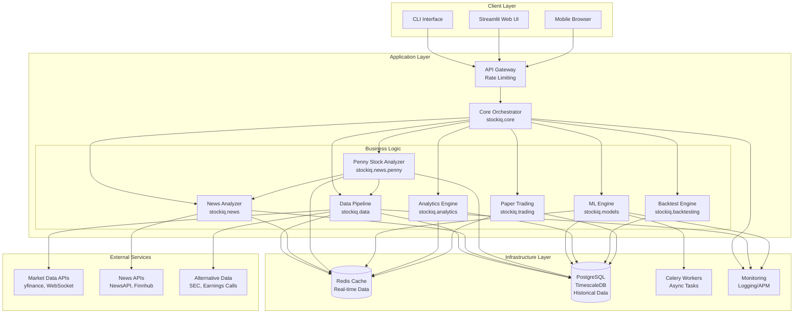
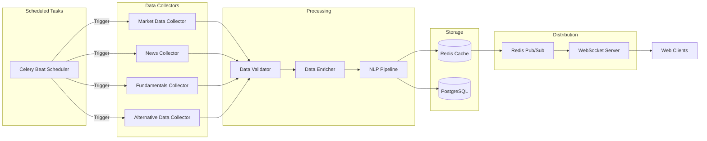
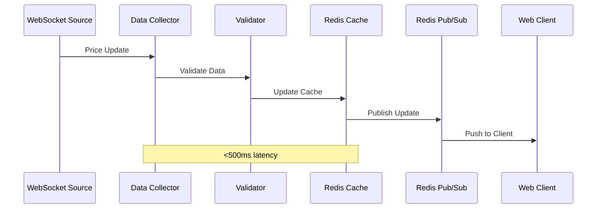

# Design Document

**Feature:** Institutional-Grade Stock Analyzer Upgrade

## Overview

This design document specifies the technical architecture for upgrading the Universal Stock Analyzer from a professional-grade tool to an institutional-quality platform. The upgrade transforms the system into a comprehensive solution rivaling Bloomberg Terminal and FactSet while maintaining the dual-mode (CLI/Web) architecture and open-source accessibility.

### Design Goals

1. **Real-Time Intelligence**: Deliver market insights with sub-second latency through streaming data pipelines
2. **Advanced Analytics**: Provide institutional-grade metrics (options Greeks, VaR, factor models) for sophisticated risk assessment
3. **AI-Powered Predictions**: Leverage deep learning (LSTM, Transformers) and ensemble methods for accurate forecasting
4. **Daily Market Brief**: Automated morning intelligence combining top movers, news analysis, and predictions (Phase 0 priority)
5. **Scalability**: Support 100+ concurrent users with horizontal scaling capability
6. **Maintainability**: Preserve modular stockiq package structure with clear separation of concerns

### Phase 0 Priority: Daily Intelligence System

The highest priority is implementing a comprehensive daily intelligence system that provides users with actionable market insights before market open:

- **Top Movers Tracker**: Real-time identification of top 20 gainers/losers with 5-minute updates
- **News Analyzer**: NLP-powered processing of news from 10+ sources with sentiment scoring
- **Daily Predictions**: Next-day price forecasts integrating news sentiment and technical/fundamental signals
- **Integrated Dashboard**: Single-page view combining movers, news, predictions, and market overview
- **Penny Stock Momentum Dashboard**: Dedicated tracker for penny stocks (<$5) with sudden gains, momentum scoring, and risk metrics
- **Real-Time Alerts**: Instant notifications when news affects watchlist stocks
- **AI Summarization**: Automated news summaries and daily market digests

This Phase 0 system provides immediate value to users and establishes the data pipeline foundation for subsequent phases.

### Current System Architecture

The existing system uses a modular Python architecture:

```
stockiq/
├── core/           # Analysis orchestration, portfolio management
├── data/           # Data collection (market data, news, social media)
├── models/         # ML models (predictor, sentiment)
└── ui/             # Streamlit components and theming
```

**Current Capabilities:**
- Ensemble ML (RandomForest, GradientBoosting, XGBoost)
- 20+ technical indicators
- Fundamental analysis with valuation ratios
- Multi-source sentiment analysis
- SHAP explainability
- Dual-mode operation (CLI + Streamlit web)

**Current Limitations:**
- No real-time data streaming
- Basic ML models (no deep learning)
- No institutional analytics (Greeks, VaR, factor models)
- No alternative data sources
- No backtesting or paper trading
- File-based storage (portfolio.json)
- No caching layer
- Synchronous processing only

### Target Architecture

The upgraded system will maintain the modular structure while adding enterprise-grade infrastructure:

```
stockiq/
├── core/              # Enhanced orchestration with async support
├── data/              # Multi-source data pipeline with WebSocket streaming
│   ├── collectors/    # Modular collectors per data source
│   ├── processors/    # Data validation, normalization, enrichment
│   └── streams/       # Real-time WebSocket handlers
├── models/            # Advanced ML with deep learning
│   ├── ensemble/      # Stacking meta-learners
│   ├── deep/          # LSTM, Transformers
│   ├── rl/            # Reinforcement learning agents
│   └── explainability/# SHAP, LIME, attention visualization
├── analytics/         # NEW: Institutional-grade analytics
│   ├── options/       # Greeks, implied volatility surfaces
│   ├── risk/          # VaR, CVaR, stress testing
│   ├── factors/       # Fama-French, momentum, quality
│   └── portfolio/     # Optimization (mean-variance, Black-Litterman)
├── news/              # NEW: News analysis subsystem
│   ├── collectors/    # Multi-source news aggregation
│   ├── nlp/           # NLP pipeline (NER, sentiment, summarization)
│   ├── impact/        # News impact analysis and correlation
│   ├── alerts/        # News-driven alert generation
│   └── penny/         # Penny stock momentum analysis
│       ├── scanner.py     # Penny stock scanner
│       ├── momentum.py    # Momentum scoring
│       ├── risk.py        # Risk metrics
│       └── patterns.py    # Pump-dump detection
├── backtesting/       # NEW: Strategy simulation engine
├── trading/           # NEW: Paper trading system
├── ui/                # Enhanced Streamlit components
└── infrastructure/    # NEW: Database, cache, tasks, monitoring
```

**New Infrastructure Components:**
- **PostgreSQL + TimescaleDB**: Time-series database for historical data
- **Redis**: In-memory cache for real-time data and computed results
- **Celery + Redis**: Asynchronous task queue for heavy computations
- **WebSocket Clients**: Real-time data streaming from market data providers
- **APM/Logging**: Structured logging and application performance monitoring


## Architecture

### System Architecture Diagram



### Architectural Patterns

#### 1. Layered Architecture

The system follows a strict layered architecture with clear separation of concerns:

- **Presentation Layer** (CLI, Web UI): User interaction and visualization
- **Application Layer** (Core Orchestrator): Business logic coordination
- **Domain Layer** (Data, ML, Analytics, News): Domain-specific logic
- **Infrastructure Layer** (Database, Cache, Queue): Technical services

**Benefits:**
- Clear separation of concerns
- Independent testing of each layer
- Flexibility to swap implementations
- Easier maintenance and debugging

#### 2. Microservices-Ready Monolith

The system is designed as a modular monolith that can be decomposed into microservices:

- Each major subsystem (Data, ML, Analytics, News) is self-contained
- Communication through well-defined interfaces
- Shared infrastructure (DB, Cache) accessed through abstraction layers
- Can be split into separate services as scale demands

**Current Deployment:** Single Python application with modular packages
**Future Path:** Extract high-load components (News Analyzer, ML Engine) into separate services

#### 3. Event-Driven Architecture

Real-time features use event-driven patterns:

- **WebSocket Streams**: Market data updates trigger event handlers
- **Redis Pub/Sub**: Real-time data distribution to multiple consumers
- **Celery Tasks**: Asynchronous event processing for heavy computations
- **Alert System**: Event-driven notifications based on market conditions

#### 4. CQRS (Command Query Responsibility Segregation)

Separate read and write paths for optimal performance:

- **Write Path**: Market data ingestion → Database → Cache invalidation
- **Read Path**: Cache → Database (on cache miss)
- **Benefits**: Optimized read performance, simplified caching strategy

#### 5. Graceful Degradation

System continues operating when optional components fail:

- News unavailable → Use cached sentiment or skip news features
- ML models unavailable → Fall back to technical analysis only
- Redis unavailable → Direct database queries (slower but functional)
- Alternative data unavailable → Continue with traditional data sources

### Technology Stack

#### Core Technologies

| Component | Technology | Version | Purpose |
|-----------|-----------|---------|---------|
| Language | Python | 3.8+ | Primary development language |
| Web Framework | Streamlit | ≥1.45.0 | Interactive web interface |
| Database | PostgreSQL | 14+ | Relational data storage |
| Time-Series Extension | TimescaleDB | 2.0+ | Optimized time-series queries |
| Cache | Redis | 7.0+ | In-memory data cache |
| Task Queue | Celery | 5.0+ | Asynchronous task processing |
| Message Broker | Redis | 7.0+ | Celery backend and pub/sub |

#### Data & Analytics

| Component | Technology | Purpose |
|-----------|-----------|---------|
| Market Data | yfinance, WebSocket APIs | Real-time and historical prices |
| News APIs | NewsAPI, Finnhub, Alpha Vantage | Financial news aggregation |
| Data Processing | pandas, numpy | Data manipulation |
| Database ORM | SQLAlchemy | Database abstraction |
| Connection Pooling | psycopg2, pgbouncer | Database connection management |

#### Machine Learning

| Component | Technology | Purpose |
|-----------|-----------|---------|
| Traditional ML | scikit-learn | RandomForest, GradientBoosting |
| Gradient Boosting | XGBoost, LightGBM | Advanced ensemble models |
| Deep Learning | TensorFlow/PyTorch | LSTM, Transformers |
| NLP | spaCy, transformers | Text processing, NER |
| Sentiment Analysis | VADER, FinBERT | Financial sentiment scoring |
| Explainability | SHAP, LIME | Model interpretation |
| Reinforcement Learning | Stable-Baselines3 | Portfolio optimization agents |

#### Visualization & UI

| Component | Technology | Purpose |
|-----------|-----------|---------|
| Charts | Plotly | Interactive visualizations |
| Tables | pandas, streamlit | Data display |
| Layouts | Streamlit components | Responsive UI |
| Export | ReportLab, openpyxl | PDF and Excel generation |

#### Infrastructure & Operations

| Component | Technology | Purpose |
|-----------|-----------|---------|
| Logging | structlog | Structured JSON logging |
| Monitoring | Prometheus, Grafana | Metrics and dashboards |
| APM | OpenTelemetry | Distributed tracing |
| Testing | pytest, hypothesis | Unit and property-based tests |
| CI/CD | GitHub Actions | Automated testing and deployment |
| Containerization | Docker | Application packaging |
| Orchestration | Docker Compose / Kubernetes | Multi-container deployment |

### Deployment Architecture

#### Development Environment

```
Local Machine
├── Python 3.8+ virtual environment
├── PostgreSQL (Docker container)
├── Redis (Docker container)
├── Celery worker (local process)
└── Streamlit dev server (local process)
```

#### Production Environment (Single Server)

```
Server
├── Nginx (reverse proxy, SSL termination)
├── Streamlit (web application)
├── Celery workers (4-8 processes)
├── PostgreSQL + TimescaleDB
├── Redis
└── Monitoring (Prometheus, Grafana)
```

#### Production Environment (Scaled)

```
Load Balancer
├── Web Server 1 (Streamlit)
├── Web Server 2 (Streamlit)
└── Web Server N (Streamlit)

Worker Pool
├── Celery Worker 1 (ML tasks)
├── Celery Worker 2 (Data collection)
├── Celery Worker 3 (Backtesting)
└── Celery Worker N (General tasks)

Data Layer
├── PostgreSQL Primary (writes)
├── PostgreSQL Replica 1 (reads)
├── PostgreSQL Replica 2 (reads)
└── Redis Cluster (cache + queue)

Monitoring
├── Prometheus (metrics)
├── Grafana (dashboards)
└── ELK Stack (log aggregation)
```

### Scalability Strategy

#### Horizontal Scaling

1. **Web Tier**: Add Streamlit instances behind load balancer
2. **Worker Tier**: Add Celery workers for parallel task processing
3. **Database Tier**: Add read replicas for query distribution
4. **Cache Tier**: Use Redis Cluster for distributed caching

#### Vertical Scaling

1. **Database**: Increase memory for larger cache, faster queries
2. **Workers**: Increase CPU cores for parallel ML training
3. **Cache**: Increase memory for larger working set

#### Data Partitioning

1. **Time-Based Partitioning**: Partition historical data by year/month
2. **Symbol-Based Partitioning**: Partition by ticker symbol ranges
3. **Feature-Based Partitioning**: Separate hot data (recent) from cold data (historical)

#### Performance Optimization

1. **Caching Strategy**:
   - L1: In-memory Python cache (seconds)
   - L2: Redis cache (minutes to hours)
   - L3: Database (persistent)

2. **Query Optimization**:
   - Continuous aggregates for pre-computed indicators
   - Materialized views for complex queries
   - Indexes on frequently queried columns

3. **Async Processing**:
   - Non-blocking I/O for API calls
   - Background tasks for heavy computations
   - Batch processing for bulk operations


## Components and Interfaces

### 1. Data Pipeline (stockiq.data)

The data pipeline is responsible for collecting, validating, and storing market data from multiple sources.

#### 1.1 Data Collectors

**Purpose**: Fetch data from external sources with rate limiting and error handling

**Modules**:
- `collectors/market.py`: Real-time and historical price data
- `collectors/news.py`: Financial news from multiple APIs
- `collectors/fundamentals.py`: Company financials and metrics
- `collectors/alternative.py`: SEC filings, earnings transcripts, alternative data
- `collectors/options.py`: Options chains and Greeks

**Key Classes**:

```python
class MarketDataCollector:
    """Collects real-time and historical market data"""
    
    def get_realtime_price(self, ticker: str) -> Price:
        """Get current price with sub-second latency"""
        
    def get_historical_data(self, ticker: str, start: date, end: date) -> DataFrame:
        """Get historical OHLCV data"""
        
    def stream_realtime_data(self, tickers: List[str]) -> AsyncIterator[Price]:
        """Stream real-time prices via WebSocket"""

class NewsCollector:
    """Aggregates news from multiple sources"""
    
    def collect_latest_news(self, limit: int = 100) -> List[NewsArticle]:
        """Collect latest news from all sources"""
        
    def collect_ticker_news(self, ticker: str, hours: int = 24) -> List[NewsArticle]:
        """Collect news mentioning specific ticker"""
        
    def stream_breaking_news(self) -> AsyncIterator[NewsArticle]:
        """Stream breaking news in real-time"""
```

**Interfaces**:

```python
@dataclass
class Price:
    ticker: str
    timestamp: datetime
    price: Decimal
    volume: int
    bid: Optional[Decimal]
    ask: Optional[Decimal]
    
@dataclass
class NewsArticle:
    id: str
    title: str
    content: str
    source: str
    published_at: datetime
    url: str
    tickers: List[str]
    category: NewsCategory
```

#### 1.2 Data Processors

**Purpose**: Validate, normalize, and enrich raw data

**Modules**:
- `processors/validator.py`: Data quality checks
- `processors/normalizer.py`: Data standardization
- `processors/enricher.py`: Add computed fields

**Key Classes**:

```python
class DataValidator:
    """Validates data quality and consistency"""
    
    def validate_price_data(self, data: DataFrame) -> ValidationResult:
        """Check for anomalies, missing values, outliers"""
        
    def validate_news_data(self, article: NewsArticle) -> ValidationResult:
        """Check for required fields, valid timestamps"""

class DataEnricher:
    """Adds computed fields and metadata"""
    
    def enrich_price_data(self, data: DataFrame) -> DataFrame:
        """Add returns, volatility, technical indicators"""
        
    def enrich_news_data(self, article: NewsArticle) -> EnrichedNewsArticle:
        """Add sentiment, entities, tickers, category"""
```

#### 1.3 Data Streams

**Purpose**: Handle real-time data streaming with WebSocket connections

**Modules**:
- `streams/websocket.py`: WebSocket client management
- `streams/handlers.py`: Event handlers for incoming data
- `streams/distributor.py`: Distribute data to subscribers

**Key Classes**:

```python
class WebSocketStream:
    """Manages WebSocket connections for real-time data"""
    
    async def connect(self, url: str, auth: Dict) -> None:
        """Establish WebSocket connection"""
        
    async def subscribe(self, channels: List[str]) -> None:
        """Subscribe to data channels"""
        
    async def handle_message(self, message: Dict) -> None:
        """Process incoming WebSocket message"""

class DataDistributor:
    """Distributes real-time data to subscribers via Redis pub/sub"""
    
    def publish(self, channel: str, data: Any) -> None:
        """Publish data to Redis channel"""
        
    def subscribe(self, channel: str, callback: Callable) -> None:
        """Subscribe to Redis channel with callback"""
```

### 2. News Analyzer (stockiq.news)

The news analyzer processes financial news using NLP to extract insights and sentiment.

#### 2.1 News NLP Pipeline

**Purpose**: Extract structured information from unstructured news text

**Modules**:
- `nlp/sentiment.py`: Sentiment analysis with VADER and FinBERT
- `nlp/entities.py`: Named entity recognition (companies, people, locations)
- `nlp/tickers.py`: Extract stock ticker mentions
- `nlp/summarization.py`: Generate article summaries
- `nlp/categorization.py`: Classify news by topic

**Key Classes**:

```python
class SentimentAnalyzer:
    """Analyzes news sentiment using multiple models"""
    
    def analyze_sentiment(self, text: str) -> SentimentScore:
        """Calculate sentiment score (-1 to +1)"""
        
    def analyze_with_vader(self, text: str) -> float:
        """VADER sentiment (rule-based)"""
        
    def analyze_with_finbert(self, text: str) -> float:
        """FinBERT sentiment (transformer-based)"""

class EntityExtractor:
    """Extracts named entities from news text"""
    
    def extract_entities(self, text: str) -> Entities:
        """Extract companies, people, locations"""
        
    def extract_tickers(self, text: str) -> List[str]:
        """Extract stock ticker mentions"""

class NewsSummarizer:
    """Generates article summaries"""
    
    def summarize_extractive(self, text: str, sentences: int = 3) -> str:
        """Extract key sentences"""
        
    def summarize_abstractive(self, text: str, max_length: int = 150) -> str:
        """Generate new summary text"""
```

**Interfaces**:

```python
@dataclass
class SentimentScore:
    overall: float  # -1 to +1
    vader_score: float
    finbert_score: float
    confidence: float
    
@dataclass
class Entities:
    companies: List[str]
    people: List[str]
    locations: List[str]
    tickers: List[str]
    
@dataclass
class EnrichedNewsArticle(NewsArticle):
    sentiment: SentimentScore
    entities: Entities
    summary: str
    category: NewsCategory
    relevance_score: float
```

#### 2.2 News Impact Analysis

**Purpose**: Correlate news with price movements to measure impact

**Modules**:
- `impact/correlation.py`: News-price correlation analysis
- `impact/decay.py`: Impact decay curves over time
- `impact/beta.py`: News sensitivity (news beta) calculation

**Key Classes**:

```python
class NewsImpactAnalyzer:
    """Analyzes correlation between news and price movements"""
    
    def calculate_impact(self, article: EnrichedNewsArticle, 
                        ticker: str, 
                        timeframes: List[str]) -> ImpactAnalysis:
        """Calculate price impact at multiple timeframes"""
        
    def calculate_news_beta(self, ticker: str, period_days: int = 90) -> float:
        """Calculate stock's sensitivity to news"""
        
    def generate_impact_curve(self, category: NewsCategory) -> ImpactCurve:
        """Generate average impact decay curve by category"""
```

**Interfaces**:

```python
@dataclass
class ImpactAnalysis:
    ticker: str
    article_id: str
    timeframes: Dict[str, PriceImpact]  # '1h', '4h', '1d', '1w'
    
@dataclass
class PriceImpact:
    timeframe: str
    price_change_pct: float
    volume_change_pct: float
    statistical_significance: float
```

#### 2.3 News Alerts

**Purpose**: Generate alerts when significant news affects watchlist stocks

**Modules**:
- `alerts/detector.py`: Detect alert-worthy news events
- `alerts/prioritizer.py`: Prioritize alerts by impact
- `alerts/notifier.py`: Deliver alerts via multiple channels

**Key Classes**:

```python
class NewsAlertDetector:
    """Detects news events that should trigger alerts"""
    
    def should_alert(self, article: EnrichedNewsArticle, 
                    watchlist: List[str]) -> bool:
        """Determine if article warrants an alert"""
        
    def detect_breaking_news(self, article: EnrichedNewsArticle) -> bool:
        """Detect breaking news (published <30 min ago)"""
        
    def detect_sentiment_change(self, ticker: str, 
                               threshold: float = 0.5) -> bool:
        """Detect significant sentiment changes"""

class AlertNotifier:
    """Delivers alerts via multiple channels"""
    
    def send_alert(self, alert: NewsAlert, channels: List[str]) -> None:
        """Send alert via in-app, email, webhook"""
```

### 2.4 Penny Stock Analyzer

**Purpose**: Identify and analyze penny stocks with sudden gains and momentum

**Modules**:
- `penny/scanner.py`: Scan for penny stocks with sudden gains
- `penny/momentum.py`: Calculate momentum scores
- `penny/risk.py`: Penny stock-specific risk metrics
- `penny/patterns.py`: Detect pump-and-dump patterns

**Key Classes**:

```python
class PennyStockScanner:
    """Scans for penny stocks with sudden gains"""
    
    def scan_intraday_gainers(self, min_gain_pct: float = 20.0) -> List[PennyStock]:
        """Identify penny stocks with intraday gains exceeding threshold"""
        
    def scan_multi_day_gainers(self, days: int = 5, min_gain_pct: float = 50.0) -> List[PennyStock]:
        """Identify penny stocks with multi-day momentum"""
        
    def filter_by_volume(self, stocks: List[PennyStock], 
                        min_avg_volume: int = 50000) -> List[PennyStock]:
        """Filter penny stocks by minimum average volume"""

class MomentumCalculator:
    """Calculates momentum scores for penny stocks"""
    
    def calculate_momentum_score(self, stock: PennyStock) -> MomentumScore:
        """
        Calculate composite momentum score based on:
        - Price change magnitude
        - Volume surge ratio
        - Trend consistency
        - Catalyst presence
        """
        
    def rank_by_momentum(self, stocks: List[PennyStock]) -> List[PennyStock]:
        """Rank penny stocks by momentum score (descending)"""

class PennyStockRiskAnalyzer:
    """Analyzes penny stock-specific risks"""
    
    def calculate_liquidity_risk(self, stock: PennyStock) -> float:
        """Calculate liquidity risk based on volume and spread"""
        
    def calculate_volatility_risk(self, stock: PennyStock) -> float:
        """Calculate volatility risk using ATR and historical volatility"""
        
    def calculate_spread_percentage(self, stock: PennyStock) -> float:
        """Calculate bid-ask spread as percentage of price"""
        
    def assess_overall_risk(self, stock: PennyStock) -> RiskAssessment:
        """Comprehensive risk assessment for penny stock"""

class PumpDumpDetector:
    """Detects suspicious pump-and-dump patterns"""
    
    def detect_suspicious_patterns(self, stock: PennyStock) -> SuspicionScore:
        """
        Detect pump-and-dump indicators:
        - Abnormal volume spikes without news
        - Coordinated social media campaigns
        - Rapid price increase followed by decline
        - Low float with high promotion
        """
        
    def check_insider_activity(self, ticker: str) -> InsiderActivity:
        """Check for suspicious insider trading patterns"""
```

**Interfaces**:

```python
@dataclass
class PennyStock:
    ticker: str
    price: Decimal
    price_change_pct: float
    volume: int
    avg_volume: int
    volume_ratio: float
    market_cap: int
    sector: str
    momentum_score: Optional[float]
    risk_metrics: Optional[RiskMetrics]
    catalyst: Optional[str]
    
@dataclass
class MomentumScore:
    overall_score: float  # 0-100
    price_component: float
    volume_component: float
    trend_component: float
    catalyst_component: float
    
@dataclass
class RiskMetrics:
    liquidity_risk: float  # 0-1
    volatility_risk: float  # 0-1
    spread_percentage: float
    overall_risk: str  # 'low', 'medium', 'high', 'extreme'
    
@dataclass
class SuspicionScore:
    score: float  # 0-1, higher = more suspicious
    indicators: List[str]
    recommendation: str  # 'safe', 'caution', 'avoid'
    
@dataclass
class InsiderActivity:
    ticker: str
    recent_buys: int
    recent_sells: int
    net_activity: str  # 'buying', 'selling', 'neutral'
    suspicious: bool
```

### 3. ML Engine (stockiq.models)

The ML engine provides predictions using ensemble methods and deep learning.

#### 3.1 Traditional ML Models

**Purpose**: Ensemble models for baseline predictions

**Modules**:
- `ensemble/random_forest.py`: RandomForest classifier/regressor
- `ensemble/gradient_boosting.py`: GradientBoosting models
- `ensemble/xgboost.py`: XGBoost models
- `ensemble/stacking.py`: Meta-learner for model stacking

**Key Classes**:

```python
class EnsemblePredictor:
    """Combines multiple models using stacking"""
    
    def train(self, X: DataFrame, y: Series) -> None:
        """Train all base models and meta-learner"""
        
    def predict(self, X: DataFrame) -> Prediction:
        """Generate ensemble prediction with confidence"""
        
    def get_feature_importance(self) -> Dict[str, float]:
        """Get SHAP feature importance"""
```

#### 3.2 Deep Learning Models

**Purpose**: Advanced neural networks for time-series prediction

**Modules**:
- `deep/lstm.py`: LSTM networks for sequential data
- `deep/transformer.py`: Transformer models for multi-variate analysis
- `deep/autoencoder.py`: Anomaly detection

**Key Classes**:

```python
class LSTMPredictor:
    """LSTM neural network for time-series prediction"""
    
    def train(self, sequences: np.ndarray, targets: np.ndarray) -> None:
        """Train LSTM model"""
        
    def predict(self, sequence: np.ndarray) -> Prediction:
        """Generate prediction with uncertainty quantification"""

class TransformerPredictor:
    """Transformer model for multi-variate market analysis"""
    
    def train(self, data: DataFrame, targets: Series) -> None:
        """Train transformer model"""
        
    def predict(self, data: DataFrame) -> Prediction:
        """Generate prediction with attention weights"""
```

#### 3.3 Reinforcement Learning

**Purpose**: Portfolio optimization using RL agents

**Modules**:
- `rl/environment.py`: Trading environment for RL
- `rl/agents.py`: RL agents (PPO, A2C, SAC)
- `rl/rewards.py`: Reward function design

**Key Classes**:

```python
class TradingEnvironment(gym.Env):
    """OpenAI Gym environment for trading"""
    
    def step(self, action: int) -> Tuple[np.ndarray, float, bool, dict]:
        """Execute action and return next state, reward, done, info"""
        
    def reset(self) -> np.ndarray:
        """Reset environment to initial state"""

class RLPortfolioOptimizer:
    """RL agent for portfolio optimization"""
    
    def train(self, env: TradingEnvironment, timesteps: int) -> None:
        """Train RL agent"""
        
    def optimize_portfolio(self, state: np.ndarray) -> Dict[str, float]:
        """Generate optimal portfolio weights"""
```

**Interfaces**:

```python
@dataclass
class Prediction:
    ticker: str
    timestamp: datetime
    prediction_type: str  # 'price', 'direction', 'return'
    value: float
    confidence: float
    lower_bound: float
    upper_bound: float
    factors: Dict[str, float]  # Feature contributions
    model: str
```

### 4. Analytics Engine (stockiq.analytics)

The analytics engine provides institutional-grade financial metrics.

#### 4.1 Options Analytics

**Purpose**: Calculate options Greeks and implied volatility

**Modules**:
- `options/greeks.py`: Delta, Gamma, Theta, Vega, Rho
- `options/volatility.py`: Implied volatility surfaces
- `options/strategies.py`: Options strategy analysis

**Key Classes**:

```python
class OptionsAnalyzer:
    """Calculates options Greeks and metrics"""
    
    def calculate_greeks(self, option: OptionContract) -> Greeks:
        """Calculate all Greeks for an option"""
        
    def calculate_implied_volatility(self, option: OptionContract, 
                                    market_price: float) -> float:
        """Calculate implied volatility from market price"""
        
    def generate_volatility_surface(self, ticker: str) -> VolatilitySurface:
        """Generate IV surface across strikes and expirations"""
```

**Interfaces**:

```python
@dataclass
class Greeks:
    delta: float
    gamma: float
    theta: float
    vega: float
    rho: float
    
@dataclass
class VolatilitySurface:
    ticker: str
    strikes: List[float]
    expirations: List[date]
    implied_vols: np.ndarray  # 2D array
```

#### 4.2 Risk Analytics

**Purpose**: Calculate risk metrics (VaR, CVaR, risk ratios)

**Modules**:
- `risk/var.py`: Value at Risk calculations
- `risk/cvar.py`: Conditional Value at Risk
- `risk/ratios.py`: Sharpe, Sortino, Calmar ratios
- `risk/stress.py`: Stress testing and scenario analysis

**Key Classes**:

```python
class RiskAnalyzer:
    """Calculates risk metrics"""
    
    def calculate_var(self, returns: Series, confidence: float = 0.95) -> float:
        """Calculate Value at Risk"""
        
    def calculate_cvar(self, returns: Series, confidence: float = 0.95) -> float:
        """Calculate Conditional Value at Risk"""
        
    def calculate_sharpe_ratio(self, returns: Series, 
                              risk_free_rate: float = 0.02) -> float:
        """Calculate Sharpe ratio"""
```

#### 4.3 Factor Analysis

**Purpose**: Multi-factor model analysis (Fama-French, custom factors)

**Modules**:
- `factors/fama_french.py`: Fama-French 5-factor model
- `factors/momentum.py`: Momentum factor calculation
- `factors/quality.py`: Quality factor calculation
- `factors/value.py`: Value factor calculation

**Key Classes**:

```python
class FactorAnalyzer:
    """Performs factor analysis"""
    
    def calculate_factor_exposures(self, returns: Series) -> FactorExposures:
        """Calculate exposures to Fama-French factors"""
        
    def calculate_factor_returns(self, portfolio: Portfolio) -> FactorReturns:
        """Decompose returns by factor"""
```

#### 4.4 Portfolio Optimization

**Purpose**: Optimize portfolio weights using modern portfolio theory

**Modules**:
- `portfolio/mean_variance.py`: Mean-variance optimization
- `portfolio/black_litterman.py`: Black-Litterman model
- `portfolio/risk_parity.py`: Risk parity allocation

**Key Classes**:

```python
class PortfolioOptimizer:
    """Optimizes portfolio allocations"""
    
    def optimize_mean_variance(self, returns: DataFrame, 
                              constraints: Dict) -> Portfolio:
        """Mean-variance optimization"""
        
    def optimize_black_litterman(self, returns: DataFrame, 
                                views: Dict,
                                confidence: Dict) -> Portfolio:
        """Black-Litterman optimization with user views"""
```

### 5. Backtesting Engine (stockiq.backtesting)

The backtesting engine simulates trading strategies on historical data.

**Modules**:
- `engine.py`: Core backtesting engine
- `execution.py`: Order execution simulation
- `slippage.py`: Slippage models
- `metrics.py`: Performance metrics calculation

**Key Classes**:

```python
class BacktestEngine:
    """Simulates trading strategies on historical data"""
    
    def run_backtest(self, strategy: Strategy, 
                    start: date, 
                    end: date) -> BacktestResult:
        """Execute backtest and return results"""
        
    def execute_order(self, order: Order, market_data: DataFrame) -> Execution:
        """Simulate order execution with slippage"""
        
    def calculate_metrics(self, trades: List[Trade]) -> PerformanceMetrics:
        """Calculate strategy performance metrics"""
```

**Interfaces**:

```python
@dataclass
class BacktestResult:
    strategy_name: str
    start_date: date
    end_date: date
    total_return: float
    sharpe_ratio: float
    max_drawdown: float
    win_rate: float
    trades: List[Trade]
    equity_curve: Series
```

### 6. Paper Trading System (stockiq.trading)

The paper trading system allows users to practice trading with virtual money.

**Modules**:
- `account.py`: Virtual account management
- `orders.py`: Order management
- `execution.py`: Simulated order execution
- `portfolio.py`: Portfolio tracking

**Key Classes**:

```python
class PaperTradingAccount:
    """Manages virtual trading account"""
    
    def place_order(self, order: Order) -> OrderConfirmation:
        """Place simulated order"""
        
    def get_portfolio(self) -> Portfolio:
        """Get current portfolio holdings"""
        
    def get_performance(self) -> PerformanceMetrics:
        """Calculate portfolio performance"""
```

### 7. Infrastructure (stockiq.infrastructure)

The infrastructure layer provides database, caching, and task queue services.

#### 7.1 Database Layer

**Modules**:
- `database/connection.py`: Connection pooling
- `database/models.py`: SQLAlchemy ORM models
- `database/repositories.py`: Data access layer
- `database/migrations.py`: Schema migrations

**Key Classes**:

```python
class DatabaseManager:
    """Manages database connections and operations"""
    
    def get_connection(self) -> Connection:
        """Get database connection from pool"""
        
    def execute_query(self, query: str, params: Dict) -> Result:
        """Execute parameterized query"""

class PriceRepository:
    """Data access for price data"""
    
    def save_prices(self, prices: List[Price]) -> None:
        """Bulk insert prices"""
        
    def get_historical_prices(self, ticker: str, 
                             start: date, 
                             end: date) -> DataFrame:
        """Retrieve historical prices"""
```

#### 7.2 Cache Layer

**Modules**:
- `cache/redis_client.py`: Redis client wrapper
- `cache/strategies.py`: Caching strategies
- `cache/invalidation.py`: Cache invalidation logic

**Key Classes**:

```python
class CacheManager:
    """Manages Redis caching"""
    
    def get(self, key: str) -> Optional[Any]:
        """Get value from cache"""
        
    def set(self, key: str, value: Any, ttl: int) -> None:
        """Set value in cache with TTL"""
        
    def invalidate(self, pattern: str) -> None:
        """Invalidate cache keys matching pattern"""
```

#### 7.3 Task Queue

**Modules**:
- `tasks/celery_app.py`: Celery application configuration
- `tasks/workers.py`: Task definitions
- `tasks/scheduler.py`: Periodic task scheduling

**Key Classes**:

```python
@celery_app.task
def train_ml_model(ticker: str, model_type: str) -> str:
    """Async task to train ML model"""
    
@celery_app.task
def run_backtest(strategy_id: str, start: date, end: date) -> str:
    """Async task to run backtest"""
    
@celery_app.task
def collect_market_data(tickers: List[str]) -> None:
    """Async task to collect market data"""
```

### 8. User Interface (stockiq.ui)

The UI layer provides Streamlit components for the web interface.

**Modules**:
- `components/dashboard.py`: Dashboard layouts
- `components/charts.py`: Chart components
- `components/tables.py`: Data table components
- `components/forms.py`: Input forms
- `theme.py`: Styling and theming

**Key Functions**:

```python
def render_daily_dashboard() -> None:
    """Render Daily Market Brief dashboard"""
    
def render_top_movers(gainers: DataFrame, losers: DataFrame) -> None:
    """Render top movers tables"""
    
def render_news_feed(articles: List[EnrichedNewsArticle]) -> None:
    """Render real-time news feed"""
    
def render_predictions(predictions: List[Prediction]) -> None:
    """Render daily predictions"""
    
def render_penny_stock_dashboard(penny_stocks: List[PennyStock]) -> None:
    """Render penny stock momentum dashboard"""
    
def render_penny_stock_table(stocks: List[PennyStock], 
                             show_risk: bool = True,
                             show_momentum: bool = True) -> None:
    """Render penny stock table with momentum and risk metrics"""
    
def render_penny_stock_chart(ticker: str, timeframe: str = '1d') -> None:
    """Render penny stock price chart with volume"""
    
def render_momentum_gauge(momentum_score: float) -> None:
    """Render momentum score gauge visualization"""
    
def render_risk_indicators(risk_metrics: RiskMetrics) -> None:
    """Render risk level indicators for penny stock"""
```


## Data Models

### Database Schema

The system uses PostgreSQL with TimescaleDB for time-series data. Below are the core tables:

#### 1. Stocks Table

```sql
CREATE TABLE stocks (
    ticker VARCHAR(10) PRIMARY KEY,
    name VARCHAR(255) NOT NULL,
    sector VARCHAR(100),
    industry VARCHAR(100),
    market_cap BIGINT,
    exchange VARCHAR(50),
    currency VARCHAR(3) DEFAULT 'USD',
    created_at TIMESTAMP DEFAULT NOW(),
    updated_at TIMESTAMP DEFAULT NOW()
);

CREATE INDEX idx_stocks_sector ON stocks(sector);
CREATE INDEX idx_stocks_industry ON stocks(industry);
CREATE INDEX idx_stocks_market_cap ON stocks(market_cap);
```

#### 2. Prices Table (Hypertable)

```sql
CREATE TABLE prices (
    ticker VARCHAR(10) NOT NULL,
    timestamp TIMESTAMPTZ NOT NULL,
    open DECIMAL(12, 4),
    high DECIMAL(12, 4),
    low DECIMAL(12, 4),
    close DECIMAL(12, 4) NOT NULL,
    volume BIGINT,
    adjusted_close DECIMAL(12, 4),
    PRIMARY KEY (ticker, timestamp),
    FOREIGN KEY (ticker) REFERENCES stocks(ticker)
);

-- Convert to hypertable for time-series optimization
SELECT create_hypertable('prices', 'timestamp');

-- Create continuous aggregate for daily OHLCV
CREATE MATERIALIZED VIEW prices_daily
WITH (timescaledb.continuous) AS
SELECT ticker,
       time_bucket('1 day', timestamp) AS day,
       first(open, timestamp) AS open,
       max(high) AS high,
       min(low) AS low,
       last(close, timestamp) AS close,
       sum(volume) AS volume
FROM prices
GROUP BY ticker, day;
```

#### 3. Technical Indicators Table

```sql
CREATE TABLE technical_indicators (
    ticker VARCHAR(10) NOT NULL,
    timestamp TIMESTAMPTZ NOT NULL,
    indicator_name VARCHAR(50) NOT NULL,
    value DECIMAL(12, 4),
    PRIMARY KEY (ticker, timestamp, indicator_name),
    FOREIGN KEY (ticker) REFERENCES stocks(ticker)
);

SELECT create_hypertable('technical_indicators', 'timestamp');

CREATE INDEX idx_tech_indicators_name ON technical_indicators(indicator_name);
```

#### 4. News Articles Table

```sql
CREATE TABLE news_articles (
    id VARCHAR(100) PRIMARY KEY,
    title TEXT NOT NULL,
    content TEXT,
    source VARCHAR(100) NOT NULL,
    published_at TIMESTAMPTZ NOT NULL,
    url TEXT,
    category VARCHAR(50),
    created_at TIMESTAMP DEFAULT NOW()
);

CREATE INDEX idx_news_published ON news_articles(published_at DESC);
CREATE INDEX idx_news_source ON news_articles(source);
CREATE INDEX idx_news_category ON news_articles(category);
```

#### 5. News Sentiment Table

```sql
CREATE TABLE news_sentiment (
    article_id VARCHAR(100) NOT NULL,
    ticker VARCHAR(10) NOT NULL,
    sentiment_score DECIMAL(5, 4) NOT NULL,  -- -1 to +1
    vader_score DECIMAL(5, 4),
    finbert_score DECIMAL(5, 4),
    confidence DECIMAL(5, 4),
    PRIMARY KEY (article_id, ticker),
    FOREIGN KEY (article_id) REFERENCES news_articles(id),
    FOREIGN KEY (ticker) REFERENCES stocks(ticker)
);

CREATE INDEX idx_sentiment_ticker ON news_sentiment(ticker);
CREATE INDEX idx_sentiment_score ON news_sentiment(sentiment_score);
```

#### 6. Predictions Table

```sql
CREATE TABLE predictions (
    id SERIAL PRIMARY KEY,
    ticker VARCHAR(10) NOT NULL,
    prediction_date DATE NOT NULL,
    target_date DATE NOT NULL,
    prediction_type VARCHAR(20) NOT NULL,  -- 'price', 'direction', 'return'
    predicted_value DECIMAL(12, 4),
    confidence DECIMAL(5, 4),
    lower_bound DECIMAL(12, 4),
    upper_bound DECIMAL(12, 4),
    model_name VARCHAR(50),
    features JSONB,
    created_at TIMESTAMP DEFAULT NOW(),
    FOREIGN KEY (ticker) REFERENCES stocks(ticker)
);

CREATE INDEX idx_predictions_ticker ON predictions(ticker);
CREATE INDEX idx_predictions_date ON predictions(prediction_date);
CREATE INDEX idx_predictions_target ON predictions(target_date);
```

#### 7. Prediction Performance Table

```sql
CREATE TABLE prediction_performance (
    prediction_id INTEGER NOT NULL,
    actual_value DECIMAL(12, 4),
    error DECIMAL(12, 4),
    absolute_error DECIMAL(12, 4),
    squared_error DECIMAL(12, 4),
    correct_direction BOOLEAN,
    evaluated_at TIMESTAMP DEFAULT NOW(),
    PRIMARY KEY (prediction_id),
    FOREIGN KEY (prediction_id) REFERENCES predictions(id)
);

CREATE INDEX idx_perf_evaluated ON prediction_performance(evaluated_at);
```

#### 8. Watchlists Table

```sql
CREATE TABLE watchlists (
    id SERIAL PRIMARY KEY,
    user_id INTEGER NOT NULL,
    name VARCHAR(100) NOT NULL,
    created_at TIMESTAMP DEFAULT NOW(),
    updated_at TIMESTAMP DEFAULT NOW(),
    FOREIGN KEY (user_id) REFERENCES users(id)
);

CREATE TABLE watchlist_items (
    watchlist_id INTEGER NOT NULL,
    ticker VARCHAR(10) NOT NULL,
    notes TEXT,
    tags VARCHAR(255)[],
    added_at TIMESTAMP DEFAULT NOW(),
    PRIMARY KEY (watchlist_id, ticker),
    FOREIGN KEY (watchlist_id) REFERENCES watchlists(id),
    FOREIGN KEY (ticker) REFERENCES stocks(ticker)
);
```

#### 9. Alerts Table

```sql
CREATE TABLE alerts (
    id SERIAL PRIMARY KEY,
    user_id INTEGER NOT NULL,
    ticker VARCHAR(10) NOT NULL,
    alert_type VARCHAR(50) NOT NULL,  -- 'price', 'news', 'technical', 'volume'
    condition JSONB NOT NULL,
    enabled BOOLEAN DEFAULT TRUE,
    created_at TIMESTAMP DEFAULT NOW(),
    FOREIGN KEY (user_id) REFERENCES users(id),
    FOREIGN KEY (ticker) REFERENCES stocks(ticker)
);

CREATE TABLE alert_triggers (
    id SERIAL PRIMARY KEY,
    alert_id INTEGER NOT NULL,
    triggered_at TIMESTAMP DEFAULT NOW(),
    trigger_value JSONB,
    notified BOOLEAN DEFAULT FALSE,
    FOREIGN KEY (alert_id) REFERENCES alerts(id)
);
```

#### 10. Users Table

```sql
CREATE TABLE users (
    id SERIAL PRIMARY KEY,
    email VARCHAR(255) UNIQUE NOT NULL,
    password_hash VARCHAR(255) NOT NULL,
    role VARCHAR(20) DEFAULT 'basic',  -- 'admin', 'premium', 'basic'
    api_key VARCHAR(64) UNIQUE,
    created_at TIMESTAMP DEFAULT NOW(),
    last_login TIMESTAMP
);

CREATE INDEX idx_users_email ON users(email);
CREATE INDEX idx_users_api_key ON users(api_key);
```

#### 11. Paper Trading Accounts Table

```sql
CREATE TABLE paper_accounts (
    id SERIAL PRIMARY KEY,
    user_id INTEGER NOT NULL,
    name VARCHAR(100) NOT NULL,
    initial_balance DECIMAL(15, 2) NOT NULL,
    current_balance DECIMAL(15, 2) NOT NULL,
    created_at TIMESTAMP DEFAULT NOW(),
    FOREIGN KEY (user_id) REFERENCES users(id)
);

CREATE TABLE paper_trades (
    id SERIAL PRIMARY KEY,
    account_id INTEGER NOT NULL,
    ticker VARCHAR(10) NOT NULL,
    order_type VARCHAR(20) NOT NULL,  -- 'market', 'limit', 'stop'
    side VARCHAR(10) NOT NULL,  -- 'buy', 'sell'
    quantity INTEGER NOT NULL,
    price DECIMAL(12, 4),
    executed_price DECIMAL(12, 4),
    status VARCHAR(20) NOT NULL,  -- 'pending', 'filled', 'cancelled'
    created_at TIMESTAMP DEFAULT NOW(),
    executed_at TIMESTAMP,
    FOREIGN KEY (account_id) REFERENCES paper_accounts(id),
    FOREIGN KEY (ticker) REFERENCES stocks(ticker)
);
```

#### 12. Penny Stock Momentum Table

```sql
CREATE TABLE penny_stock_momentum (
    id SERIAL PRIMARY KEY,
    ticker VARCHAR(10) NOT NULL,
    timestamp TIMESTAMPTZ NOT NULL,
    price DECIMAL(12, 4) NOT NULL,
    price_change_pct DECIMAL(8, 4) NOT NULL,
    volume BIGINT NOT NULL,
    avg_volume BIGINT NOT NULL,
    volume_ratio DECIMAL(8, 4) NOT NULL,
    momentum_score DECIMAL(5, 2),
    intraday_gain_pct DECIMAL(8, 4),
    five_day_gain_pct DECIMAL(8, 4),
    catalyst VARCHAR(255),
    suspicion_score DECIMAL(5, 4),
    risk_level VARCHAR(20),  -- 'low', 'medium', 'high', 'extreme'
    FOREIGN KEY (ticker) REFERENCES stocks(ticker)
);

SELECT create_hypertable('penny_stock_momentum', 'timestamp');

CREATE INDEX idx_penny_momentum_score ON penny_stock_momentum(momentum_score DESC);
CREATE INDEX idx_penny_intraday_gain ON penny_stock_momentum(intraday_gain_pct DESC);
CREATE INDEX idx_penny_five_day_gain ON penny_stock_momentum(five_day_gain_pct DESC);
CREATE INDEX idx_penny_timestamp ON penny_stock_momentum(timestamp DESC);

CREATE TABLE penny_stock_risk_metrics (
    ticker VARCHAR(10) NOT NULL,
    timestamp TIMESTAMPTZ NOT NULL,
    liquidity_risk DECIMAL(5, 4),
    volatility_risk DECIMAL(5, 4),
    spread_percentage DECIMAL(8, 4),
    overall_risk VARCHAR(20),
    PRIMARY KEY (ticker, timestamp),
    FOREIGN KEY (ticker) REFERENCES stocks(ticker)
);

SELECT create_hypertable('penny_stock_risk_metrics', 'timestamp');

CREATE TABLE penny_stock_alerts (
    id SERIAL PRIMARY KEY,
    user_id INTEGER NOT NULL,
    ticker VARCHAR(10) NOT NULL,
    alert_type VARCHAR(50) NOT NULL,  -- 'momentum', 'volume_surge', 'extreme_gain'
    threshold DECIMAL(8, 4),
    triggered_at TIMESTAMP DEFAULT NOW(),
    momentum_score DECIMAL(5, 2),
    gain_pct DECIMAL(8, 4),
    notified BOOLEAN DEFAULT FALSE,
    FOREIGN KEY (user_id) REFERENCES users(id),
    FOREIGN KEY (ticker) REFERENCES stocks(ticker)
);

CREATE INDEX idx_penny_alerts_user ON penny_stock_alerts(user_id);
CREATE INDEX idx_penny_alerts_ticker ON penny_stock_alerts(ticker);
CREATE INDEX idx_penny_alerts_triggered ON penny_stock_alerts(triggered_at DESC);
```

### Redis Cache Schema

Redis is used for caching frequently accessed data with appropriate TTLs:

#### Cache Key Patterns

```
# Real-time prices (TTL: 30 seconds)
price:{ticker}:current -> JSON {price, volume, timestamp}

# Technical indicators (TTL: 5 minutes)
indicators:{ticker}:{indicator_name} -> JSON {value, timestamp}

# News sentiment (TTL: 15 minutes)
sentiment:{ticker}:latest -> JSON {score, articles_count, timestamp}

# Daily predictions (TTL: 24 hours)
prediction:{ticker}:{date} -> JSON {prediction, confidence, bounds}

# Top movers (TTL: 5 minutes)
movers:gainers -> JSON [list of tickers with data]
movers:losers -> JSON [list of tickers with data]

# Penny stock momentum (TTL: 2 minutes)
penny:top_momentum -> JSON [list of top 20 penny stocks with momentum data]
penny:intraday_gainers -> JSON [list of penny stocks with >20% intraday gain]
penny:five_day_gainers -> JSON [list of penny stocks with >50% 5-day gain]
penny:{ticker}:risk_metrics -> JSON {liquidity_risk, volatility_risk, spread_pct, overall_risk}

# Market indices (TTL: 1 minute)
index:{symbol} -> JSON {value, change, change_pct}

# User sessions (TTL: 24 hours)
session:{session_id} -> JSON {user_id, created_at, expires_at}

# API rate limits (TTL: varies by provider)
ratelimit:{provider}:{endpoint} -> Integer (request count)
```

#### Redis Pub/Sub Channels

```
# Real-time price updates
channel:prices -> {ticker, price, volume, timestamp}

# Breaking news
channel:news:breaking -> {article_id, title, tickers, sentiment}

# Alert notifications
channel:alerts:{user_id} -> {alert_id, type, ticker, message}

# System events
channel:system:events -> {event_type, data, timestamp}
```

### Python Data Models

Using Pydantic for data validation and serialization:

```python
from pydantic import BaseModel, Field, validator
from datetime import datetime, date
from decimal import Decimal
from typing import Optional, List, Dict
from enum import Enum

class NewsCategory(str, Enum):
    EARNINGS = "earnings"
    MA = "m&a"
    REGULATORY = "regulatory"
    ECONOMIC = "economic"
    SECTOR = "sector-specific"
    GENERAL = "general"

class PredictionType(str, Enum):
    PRICE = "price"
    DIRECTION = "direction"
    RETURN = "return"

class OrderType(str, Enum):
    MARKET = "market"
    LIMIT = "limit"
    STOP = "stop"
    STOP_LIMIT = "stop-limit"

class Stock(BaseModel):
    ticker: str = Field(..., max_length=10)
    name: str
    sector: Optional[str]
    industry: Optional[str]
    market_cap: Optional[int]
    exchange: Optional[str]
    currency: str = "USD"

class Price(BaseModel):
    ticker: str
    timestamp: datetime
    open: Optional[Decimal]
    high: Optional[Decimal]
    low: Optional[Decimal]
    close: Decimal
    volume: Optional[int]
    adjusted_close: Optional[Decimal]

class NewsArticle(BaseModel):
    id: str
    title: str
    content: Optional[str]
    source: str
    published_at: datetime
    url: Optional[str]
    category: Optional[NewsCategory]

class SentimentScore(BaseModel):
    overall: float = Field(..., ge=-1, le=1)
    vader_score: Optional[float]
    finbert_score: Optional[float]
    confidence: float = Field(..., ge=0, le=1)

class EnrichedNewsArticle(NewsArticle):
    sentiment: SentimentScore
    tickers: List[str]
    entities: Dict[str, List[str]]
    summary: Optional[str]
    relevance_score: float = Field(..., ge=0, le=1)

class Prediction(BaseModel):
    ticker: str
    prediction_date: date
    target_date: date
    prediction_type: PredictionType
    predicted_value: Decimal
    confidence: float = Field(..., ge=0, le=1)
    lower_bound: Decimal
    upper_bound: Decimal
    model_name: str
    features: Optional[Dict[str, float]]

class Greeks(BaseModel):
    delta: float
    gamma: float
    theta: float
    vega: float
    rho: float

class RiskMetrics(BaseModel):
    var_95: float
    var_99: float
    cvar_95: float
    cvar_99: float
    sharpe_ratio: float
    sortino_ratio: float
    max_drawdown: float

class Portfolio(BaseModel):
    holdings: Dict[str, float]  # ticker -> weight
    total_value: Decimal
    cash: Decimal
    returns: Optional[float]
    risk_metrics: Optional[RiskMetrics]
```


## Integration Points

### External Data Sources

#### 1. Market Data APIs

**Primary Source: yfinance**
- **Purpose**: Historical and real-time stock prices
- **Endpoints**: 
  - `Ticker.history()`: Historical OHLCV data
  - `Ticker.info`: Company information and fundamentals
  - `download()`: Bulk historical data download
- **Rate Limits**: No official limits, but throttle to 2000 requests/hour
- **Data Quality**: Good for US markets, variable for international
- **Cost**: Free

**WebSocket Streaming: Polygon.io / Alpaca**
- **Purpose**: Real-time price streaming
- **Protocol**: WebSocket
- **Endpoints**:
  - `wss://socket.polygon.io/stocks`: Real-time trades and quotes
  - `wss://stream.data.alpaca.markets/v2/iex`: IEX real-time data
- **Rate Limits**: Varies by subscription tier
- **Latency**: Sub-second
- **Cost**: Paid tiers required for real-time data

**Alternative: Alpha Vantage**
- **Purpose**: Real-time and historical data, technical indicators
- **Endpoints**:
  - `TIME_SERIES_INTRADAY`: Intraday prices
  - `GLOBAL_QUOTE`: Real-time quote
  - Technical indicator endpoints (RSI, MACD, etc.)
- **Rate Limits**: 5 requests/minute (free), 75 requests/minute (premium)
- **Cost**: Free tier available, premium $49.99/month

#### 2. News APIs

**NewsAPI.org**
- **Purpose**: General financial news aggregation
- **Endpoints**:
  - `/v2/everything`: Search news articles
  - `/v2/top-headlines`: Breaking news
- **Rate Limits**: 100 requests/day (free), 1000 requests/day (developer)
- **Coverage**: 80,000+ sources worldwide
- **Cost**: Free tier available, $449/month for business

**Finnhub.io**
- **Purpose**: Financial news and market data
- **Endpoints**:
  - `/news`: Company news
  - `/market-news`: Market-wide news
  - `/press-releases`: Company press releases
- **Rate Limits**: 60 requests/minute (free), 300 requests/minute (premium)
- **Cost**: Free tier available, $59.99/month for premium

**Benzinga News API**
- **Purpose**: Professional-grade financial news
- **Endpoints**:
  - `/news`: Real-time news feed
  - `/ratings`: Analyst ratings
- **Rate Limits**: Varies by subscription
- **Cost**: Custom pricing, typically $500+/month

**Alpha Vantage News Sentiment**
- **Purpose**: News with pre-computed sentiment scores
- **Endpoints**:
  - `NEWS_SENTIMENT`: News articles with sentiment
- **Rate Limits**: 5 requests/minute (free)
- **Cost**: Free tier available

#### 3. Alternative Data Sources

**SEC EDGAR API**
- **Purpose**: SEC filings (10-K, 10-Q, 8-K)
- **Endpoints**:
  - `https://www.sec.gov/cgi-bin/browse-edgar`: Filing search
  - `https://data.sec.gov/submissions/`: Company submissions
- **Rate Limits**: 10 requests/second
- **Cost**: Free
- **Integration**: Parse HTML/XML filings, extract financial tables

**Earnings Call Transcripts**
- **Source**: Seeking Alpha, AlphaStreet
- **Purpose**: Earnings call transcripts for NLP analysis
- **Access**: Web scraping (respect robots.txt) or paid APIs
- **Cost**: Varies, typically $100-500/month for API access

**Insider Trading Data**
- **Source**: SEC Form 4 filings via EDGAR
- **Purpose**: Track insider buying/selling
- **Access**: Parse SEC filings
- **Cost**: Free

**Social Media Sentiment**
- **Sources**: Twitter API, Reddit API, StockTwits
- **Purpose**: Social sentiment analysis
- **Rate Limits**: 
  - Twitter: 500,000 tweets/month (free tier)
  - Reddit: 60 requests/minute
  - StockTwits: 200 requests/hour (free)
- **Cost**: Free tiers available

#### 4. Fundamental Data

**Financial Modeling Prep**
- **Purpose**: Company financials, ratios, metrics
- **Endpoints**:
  - `/income-statement`: Income statements
  - `/balance-sheet-statement`: Balance sheets
  - `/cash-flow-statement`: Cash flow statements
  - `/ratios`: Financial ratios
- **Rate Limits**: 250 requests/day (free), 750 requests/day (starter)
- **Cost**: Free tier available, $29/month for starter

**yfinance (Built-in)**
- **Purpose**: Basic fundamentals
- **Access**: `Ticker.info`, `Ticker.financials`
- **Cost**: Free
- **Limitations**: Limited historical fundamental data

#### 5. Penny Stock Data Sources

**yfinance Screener**
- **Purpose**: Identify penny stocks (<$5) with price and volume filters
- **Access**: `yfinance.Screener()` or bulk download with filters
- **Filters**: Price < $5, minimum volume > 50,000
- **Cost**: Free
- **Limitations**: May miss some OTC stocks

**Finnhub Stock Screener**
- **Purpose**: Screen for penny stocks with custom criteria
- **Endpoints**:
  - `/stock/symbol`: List all available stocks
  - `/quote`: Real-time quotes for filtering
- **Rate Limits**: 60 requests/minute (free), 300 requests/minute (premium)
- **Cost**: Free tier available
- **Coverage**: Includes OTC markets

**Alpha Vantage**
- **Purpose**: Penny stock price data and technical indicators
- **Endpoints**:
  - `TIME_SERIES_INTRADAY`: Intraday data for momentum tracking
  - `GLOBAL_QUOTE`: Real-time quotes
- **Rate Limits**: 5 requests/minute (free)
- **Cost**: Free tier available
- **Note**: Good for tracking identified penny stocks

**Social Media APIs (for buzz tracking)**
- **Twitter API**: Track mentions and hashtags for penny stocks
- **Reddit API**: Monitor r/pennystocks, r/RobinHoodPennyStocks
- **StockTwits**: Penny stock sentiment and buzz
- **Rate Limits**: 
  - Twitter: 500,000 tweets/month (free tier)
  - Reddit: 60 requests/minute
  - StockTwits: 200 requests/hour (free)
- **Cost**: Free tiers available
- **Purpose**: Detect social media-driven momentum and potential pump-and-dump schemes

**SEC EDGAR (for insider trading)**
- **Purpose**: Form 4 filings for insider trading activity
- **Endpoints**: `https://www.sec.gov/cgi-bin/browse-edgar`
- **Rate Limits**: 10 requests/second
- **Cost**: Free
- **Use Case**: Detect suspicious insider activity in penny stocks

**OTC Markets Data**
- **Source**: OTC Markets Group (otcmarkets.com)
- **Purpose**: OTC penny stock data and disclosures
- **Access**: Web scraping (respect robots.txt) or paid API
- **Cost**: Free for basic data, paid for API access
- **Coverage**: Pink sheets, OTCQB, OTCQX

### Integration Architecture

#### Data Collection Pipeline



#### Real-Time Data Flow



#### API Rate Limiting Strategy

```python
class RateLimiter:
    """Manages API rate limits across multiple providers"""
    
    def __init__(self):
        self.limits = {
            'newsapi': {'requests': 100, 'window': 86400},  # 100/day
            'finnhub': {'requests': 60, 'window': 60},      # 60/minute
            'alphavantage': {'requests': 5, 'window': 60},  # 5/minute
        }
        self.redis = redis.Redis()
    
    def check_limit(self, provider: str) -> bool:
        """Check if request is within rate limit"""
        key = f"ratelimit:{provider}"
        count = self.redis.get(key)
        
        if count is None:
            return True
        
        limit = self.limits[provider]['requests']
        return int(count) < int(limit * 0.8)  # Stay at 80% of limit
    
    def increment(self, provider: str) -> None:
        """Increment request count"""
        key = f"ratelimit:{provider}"
        window = self.limits[provider]['window']
        
        pipe = self.redis.pipeline()
        pipe.incr(key)
        pipe.expire(key, window)
        pipe.execute()
    
    async def wait_if_needed(self, provider: str) -> None:
        """Wait if rate limit is reached"""
        while not self.check_limit(provider):
            await asyncio.sleep(1)
```

#### Error Handling and Retry Logic

```python
from tenacity import retry, stop_after_attempt, wait_exponential

class DataCollector:
    """Base class for data collectors with retry logic"""
    
    @retry(
        stop=stop_after_attempt(3),
        wait=wait_exponential(multiplier=1, min=2, max=10),
        reraise=True
    )
    async def fetch_data(self, url: str, params: Dict) -> Dict:
        """Fetch data with exponential backoff retry"""
        try:
            async with aiohttp.ClientSession() as session:
                async with session.get(url, params=params, timeout=10) as response:
                    response.raise_for_status()
                    return await response.json()
        except aiohttp.ClientError as e:
            logger.error(f"API request failed: {url}", exc_info=e)
            raise
    
    async def fetch_with_fallback(self, primary_source: str, 
                                  fallback_source: str) -> Dict:
        """Try primary source, fall back to secondary on failure"""
        try:
            return await self.fetch_data(primary_source, {})
        except Exception as e:
            logger.warning(f"Primary source failed, trying fallback: {e}")
            return await self.fetch_data(fallback_source, {})
```

#### Circuit Breaker Pattern

```python
from circuitbreaker import circuit

class ExternalAPIClient:
    """Client with circuit breaker for external APIs"""
    
    @circuit(failure_threshold=5, recovery_timeout=60)
    async def call_api(self, endpoint: str) -> Dict:
        """Call external API with circuit breaker"""
        # Circuit opens after 5 failures
        # Stays open for 60 seconds before retry
        return await self.fetch_data(endpoint, {})
```

### Internal APIs

#### REST API Endpoints

The system exposes REST APIs for programmatic access:

**Authentication**
```
POST /api/v1/auth/login
POST /api/v1/auth/logout
POST /api/v1/auth/refresh
```

**Market Data**
```
GET /api/v1/stocks/{ticker}/price
GET /api/v1/stocks/{ticker}/history?start={date}&end={date}
GET /api/v1/stocks/{ticker}/indicators
GET /api/v1/movers/gainers
GET /api/v1/movers/losers
```

**News**
```
GET /api/v1/news/latest?limit={n}
GET /api/v1/news/{ticker}?hours={h}
GET /api/v1/news/{article_id}
GET /api/v1/news/sentiment/{ticker}
```

**Predictions**
```
GET /api/v1/predictions/{ticker}?date={date}
GET /api/v1/predictions/daily
POST /api/v1/predictions/generate
GET /api/v1/predictions/performance
```

**Analytics**
```
GET /api/v1/analytics/greeks/{ticker}
GET /api/v1/analytics/risk/{ticker}
GET /api/v1/analytics/factors/{ticker}
POST /api/v1/analytics/optimize-portfolio
```

**Backtesting**
```
POST /api/v1/backtest/run
GET /api/v1/backtest/{backtest_id}/status
GET /api/v1/backtest/{backtest_id}/results
```

**Paper Trading**
```
GET /api/v1/paper/accounts
POST /api/v1/paper/orders
GET /api/v1/paper/portfolio
GET /api/v1/paper/performance
```

#### WebSocket API

Real-time data streaming via WebSocket:

**Connection**
```
ws://localhost:8501/ws
```

**Subscribe to Channels**
```json
{
  "action": "subscribe",
  "channels": ["prices", "news", "alerts"]
}
```

**Price Updates**
```json
{
  "channel": "prices",
  "data": {
    "ticker": "AAPL",
    "price": 175.43,
    "volume": 1234567,
    "timestamp": "2024-01-15T14:30:00Z"
  }
}
```

**News Updates**
```json
{
  "channel": "news",
  "data": {
    "article_id": "abc123",
    "title": "Apple announces new product",
    "tickers": ["AAPL"],
    "sentiment": 0.75,
    "published_at": "2024-01-15T14:25:00Z"
  }
}
```

### Third-Party Integrations

#### Email Notifications

**Provider**: SendGrid or AWS SES
- **Purpose**: Send alert emails and daily reports
- **Integration**: SMTP or REST API
- **Rate Limits**: 100 emails/day (free), unlimited (paid)
- **Cost**: Free tier available, $19.95/month for 50k emails

#### Webhook Notifications

**Purpose**: Send alerts to external systems (Slack, Discord, custom webhooks)
- **Protocol**: HTTP POST with JSON payload
- **Retry Logic**: 3 attempts with exponential backoff
- **Timeout**: 5 seconds per request

**Example Payload**:
```json
{
  "alert_type": "news",
  "ticker": "AAPL",
  "title": "Breaking: Apple announces earnings",
  "sentiment": 0.85,
  "predicted_impact": "positive",
  "timestamp": "2024-01-15T14:30:00Z",
  "url": "https://example.com/news/abc123"
}
```

#### Cloud Storage (Optional)

**Provider**: AWS S3 or Google Cloud Storage
- **Purpose**: Store large datasets, backups, exported reports
- **Integration**: boto3 (AWS) or google-cloud-storage
- **Cost**: $0.023/GB/month (S3 Standard)


## Error Handling

### Error Handling Strategy

The system implements a comprehensive error handling strategy with graceful degradation:

#### 1. Error Categories

**Transient Errors** (Retry with exponential backoff)
- Network timeouts
- API rate limit errors (429)
- Temporary service unavailability (503)
- Database connection failures

**Permanent Errors** (Fail fast, log, alert)
- Authentication failures (401, 403)
- Invalid input data (400)
- Resource not found (404)
- Internal server errors (500)

**Data Quality Errors** (Log, flag, continue with degraded data)
- Missing data points in time series
- Anomalous price movements
- Stale data (not updated within expected timeframe)
- Inconsistent data across sources

#### 2. Retry Logic

```python
from tenacity import retry, stop_after_attempt, wait_exponential, retry_if_exception_type

class RetryableError(Exception):
    """Base class for errors that should be retried"""
    pass

class RateLimitError(RetryableError):
    """API rate limit exceeded"""
    pass

class NetworkError(RetryableError):
    """Network connectivity issue"""
    pass

@retry(
    retry=retry_if_exception_type(RetryableError),
    stop=stop_after_attempt(3),
    wait=wait_exponential(multiplier=1, min=2, max=10),
    reraise=True
)
async def fetch_with_retry(url: str) -> Dict:
    """Fetch data with automatic retry on transient errors"""
    try:
        async with aiohttp.ClientSession() as session:
            async with session.get(url, timeout=10) as response:
                if response.status == 429:
                    raise RateLimitError("Rate limit exceeded")
                elif response.status >= 500:
                    raise NetworkError(f"Server error: {response.status}")
                response.raise_for_status()
                return await response.json()
    except asyncio.TimeoutError:
        raise NetworkError("Request timeout")
    except aiohttp.ClientError as e:
        raise NetworkError(f"Network error: {e}")
```

#### 3. Circuit Breaker

```python
from circuitbreaker import circuit, CircuitBreakerError

class ExternalServiceClient:
    """Client with circuit breaker for external services"""
    
    @circuit(failure_threshold=5, recovery_timeout=60, expected_exception=RetryableError)
    async def call_external_api(self, endpoint: str) -> Dict:
        """
        Call external API with circuit breaker protection
        - Opens after 5 consecutive failures
        - Stays open for 60 seconds
        - Half-open state allows one test request
        """
        return await self.fetch_with_retry(endpoint)
    
    async def call_with_fallback(self, primary: str, fallback: str) -> Dict:
        """Try primary service, fall back to secondary on circuit open"""
        try:
            return await self.call_external_api(primary)
        except CircuitBreakerError:
            logger.warning(f"Circuit open for {primary}, using fallback")
            return await self.call_external_api(fallback)
```

#### 4. Graceful Degradation

```python
class StockAnalyzer:
    """Main analyzer with graceful degradation"""
    
    async def analyze_stock(self, ticker: str) -> Analysis:
        """Analyze stock with graceful degradation on component failures"""
        analysis = Analysis(ticker=ticker)
        
        # Core data (required)
        try:
            analysis.price_data = await self.get_price_data(ticker)
        except Exception as e:
            logger.error(f"Failed to get price data for {ticker}", exc_info=e)
            raise  # Cannot proceed without price data
        
        # Technical indicators (optional)
        try:
            analysis.technical_indicators = await self.calculate_indicators(ticker)
        except Exception as e:
            logger.warning(f"Failed to calculate indicators for {ticker}", exc_info=e)
            analysis.technical_indicators = None
        
        # News sentiment (optional)
        try:
            analysis.news_sentiment = await self.get_news_sentiment(ticker)
        except Exception as e:
            logger.warning(f"Failed to get news sentiment for {ticker}", exc_info=e)
            analysis.news_sentiment = None
        
        # ML predictions (optional)
        try:
            analysis.predictions = await self.get_predictions(ticker)
        except Exception as e:
            logger.warning(f"Failed to get predictions for {ticker}", exc_info=e)
            analysis.predictions = None
        
        return analysis
```

#### 5. Data Validation

```python
from pydantic import BaseModel, validator, ValidationError

class PriceData(BaseModel):
    """Price data with validation"""
    ticker: str
    timestamp: datetime
    open: Decimal
    high: Decimal
    low: Decimal
    close: Decimal
    volume: int
    
    @validator('high')
    def high_must_be_highest(cls, v, values):
        """Validate high >= open, close, low"""
        if 'open' in values and v < values['open']:
            raise ValueError('high must be >= open')
        if 'low' in values and v < values['low']:
            raise ValueError('high must be >= low')
        return v
    
    @validator('low')
    def low_must_be_lowest(cls, v, values):
        """Validate low <= open, close, high"""
        if 'open' in values and v > values['open']:
            raise ValueError('low must be <= open')
        return v
    
    @validator('volume')
    def volume_must_be_positive(cls, v):
        """Validate volume > 0"""
        if v <= 0:
            raise ValueError('volume must be positive')
        return v

class DataValidator:
    """Validates data quality"""
    
    def validate_price_data(self, data: DataFrame) -> ValidationResult:
        """Validate price data for anomalies"""
        issues = []
        
        # Check for missing values
        if data.isnull().any().any():
            issues.append("Missing values detected")
        
        # Check for anomalous price movements (>20% intraday)
        data['intraday_change'] = (data['high'] - data['low']) / data['open']
        anomalies = data[data['intraday_change'] > 0.20]
        if not anomalies.empty:
            issues.append(f"Anomalous price movements detected: {len(anomalies)} days")
        
        # Check for zero volume
        zero_volume = data[data['volume'] == 0]
        if not zero_volume.empty:
            issues.append(f"Zero volume detected: {len(zero_volume)} days")
        
        # Check for stale data
        latest_timestamp = data['timestamp'].max()
        if datetime.now(timezone.utc) - latest_timestamp > timedelta(hours=24):
            issues.append(f"Stale data: latest timestamp is {latest_timestamp}")
        
        return ValidationResult(
            valid=len(issues) == 0,
            issues=issues,
            data=data
        )
```

#### 6. Error Logging

```python
import structlog

logger = structlog.get_logger()

class ErrorHandler:
    """Centralized error handling and logging"""
    
    def log_error(self, error: Exception, context: Dict) -> None:
        """Log error with structured context"""
        logger.error(
            "Error occurred",
            error_type=type(error).__name__,
            error_message=str(error),
            stack_trace=traceback.format_exc(),
            **context
        )
    
    def log_data_quality_issue(self, issue: str, ticker: str, data: Dict) -> None:
        """Log data quality issue"""
        logger.warning(
            "Data quality issue",
            issue=issue,
            ticker=ticker,
            data=data,
            timestamp=datetime.now(timezone.utc).isoformat()
        )
    
    def send_alert(self, severity: str, message: str, context: Dict) -> None:
        """Send alert to administrators"""
        if severity in ['critical', 'error']:
            # Send email/webhook alert
            self.alert_service.send_alert(
                severity=severity,
                message=message,
                context=context
            )
```

#### 7. User-Facing Error Messages

```python
class ErrorResponse(BaseModel):
    """Standardized error response"""
    error_code: str
    message: str
    details: Optional[Dict]
    timestamp: datetime
    request_id: str

def handle_api_error(error: Exception, request_id: str) -> ErrorResponse:
    """Convert internal errors to user-friendly responses"""
    
    error_mappings = {
        ValidationError: ("INVALID_INPUT", "Invalid input data provided"),
        RateLimitError: ("RATE_LIMIT", "Rate limit exceeded, please try again later"),
        NetworkError: ("SERVICE_UNAVAILABLE", "External service temporarily unavailable"),
        DatabaseError: ("DATABASE_ERROR", "Database operation failed"),
    }
    
    error_code, message = error_mappings.get(
        type(error),
        ("INTERNAL_ERROR", "An unexpected error occurred")
    )
    
    return ErrorResponse(
        error_code=error_code,
        message=message,
        details={"error_type": type(error).__name__} if isinstance(error, Exception) else None,
        timestamp=datetime.now(timezone.utc),
        request_id=request_id
    )
```

### Error Recovery Strategies

#### Database Connection Failures

```python
class DatabaseConnectionManager:
    """Manages database connections with automatic recovery"""
    
    def __init__(self):
        self.pool = None
        self.reconnect_attempts = 0
        self.max_reconnect_attempts = 5
    
    async def get_connection(self) -> Connection:
        """Get database connection with automatic reconnection"""
        if self.pool is None or self.pool.closed:
            await self.reconnect()
        
        try:
            return await self.pool.acquire()
        except Exception as e:
            logger.error("Failed to acquire connection", exc_info=e)
            await self.reconnect()
            return await self.pool.acquire()
    
    async def reconnect(self) -> None:
        """Reconnect to database with exponential backoff"""
        while self.reconnect_attempts < self.max_reconnect_attempts:
            try:
                self.pool = await asyncpg.create_pool(
                    dsn=self.connection_string,
                    min_size=5,
                    max_size=20
                )
                self.reconnect_attempts = 0
                logger.info("Database connection reestablished")
                return
            except Exception as e:
                self.reconnect_attempts += 1
                wait_time = 2 ** self.reconnect_attempts
                logger.warning(
                    f"Database reconnection failed, retrying in {wait_time}s",
                    exc_info=e
                )
                await asyncio.sleep(wait_time)
        
        raise DatabaseError("Failed to reconnect to database after maximum attempts")
```

#### Cache Failures

```python
class CacheManager:
    """Cache manager with fallback to database"""
    
    async def get_with_fallback(self, key: str, fetch_func: Callable) -> Any:
        """Get from cache, fall back to database on failure"""
        try:
            # Try cache first
            value = await self.redis.get(key)
            if value is not None:
                return json.loads(value)
        except Exception as e:
            logger.warning(f"Cache read failed for key {key}", exc_info=e)
        
        # Fall back to database
        value = await fetch_func()
        
        # Try to update cache (best effort)
        try:
            await self.redis.setex(key, self.ttl, json.dumps(value))
        except Exception as e:
            logger.warning(f"Cache write failed for key {key}", exc_info=e)
        
        return value
```


## Correctness Properties

*A property is a characteristic or behavior that should hold true across all valid executions of a system—essentially, a formal statement about what the system should do. Properties serve as the bridge between human-readable specifications and machine-verifiable correctness guarantees.*

**Property Reflection:**

After analyzing all acceptance criteria, I identified the following testable properties. Many requirements involve infrastructure setup, performance metrics, or external service integration which are better suited for integration tests rather than property-based tests. The properties below focus on core business logic that exhibits universal behavior across varied inputs.

**Redundancy Analysis:**
- Properties 1 and 2 (top gainers/losers) are similar but test different sorting directions - both are valuable
- Properties 20 and 21 (VaR and CVaR) are related but test different risk metrics - both needed
- Properties 13 and 15 both validate prediction output ranges but test different aspects (confidence vs bounds) - both valuable

### Data Processing and Filtering Properties

### Property 1: Top Gainers Ranking Correctness

*For any* set of stock price data with percentage changes, when identifying the top 20 gainers, the system SHALL return exactly 20 stocks (or fewer if less than 20 available) sorted in descending order by percentage change, where each stock's percentage change is greater than or equal to the next stock's percentage change.

**Validates: Requirements 1.1**

### Property 2: Top Losers Ranking Correctness

*For any* set of stock price data with percentage changes, when identifying the top 20 losers, the system SHALL return exactly 20 stocks (or fewer if less than 20 available) sorted in ascending order by percentage change, where each stock's percentage change is less than or equal to the next stock's percentage change.

**Validates: Requirements 1.2**

### Property 3: Percentage Change Calculation

*For any* stock with valid open and close prices, the calculated percentage change SHALL equal ((close - open) / open) * 100, and the absolute price change SHALL equal (close - open).

**Validates: Requirements 1.3**

### Property 4: Market Cap Filtering

*For any* set of stocks processed for top movers, all returned stocks SHALL have a market capitalization greater than or equal to $100 million.

**Validates: Requirements 1.5**

### Property 5: Volume Filtering

*For any* set of stocks processed for top movers, all returned stocks SHALL have an average daily volume greater than or equal to 100,000 shares.

**Validates: Requirements 1.6**

### Property 6: Sector Performance Aggregation

*For any* set of stocks grouped by sector with individual returns, the calculated sector performance SHALL equal the weighted average return of all stocks in that sector, and sectors SHALL be ranked in descending order by performance.

**Validates: Requirements 1.9**

### Property 7: Unusual Volume Detection

*For any* stock with current volume and average volume, the stock SHALL be flagged as having unusual volume if and only if current_volume > 3 * average_volume.

**Validates: Requirements 1.10**

### News Analysis Properties

### Property 8: News Category Assignment

*For any* news article processed by the system, the article SHALL be assigned to exactly one category from the set {earnings, M&A, regulatory, economic, sector-specific, general}.

**Validates: Requirements 2.2**

### Property 9: Sentiment Score Range

*For any* news article analyzed for sentiment, the calculated sentiment score SHALL be in the range [-1.0, 1.0], where -1.0 represents maximum negative sentiment and 1.0 represents maximum positive sentiment.

**Validates: Requirements 2.4**

### Property 10: Breaking News Detection

*For any* news article with a publication timestamp, the article SHALL be flagged as breaking news if and only if the publication timestamp is within 30 minutes of the current time.

**Validates: Requirements 2.5**

### Property 11: News Relevance Ranking

*For any* set of news articles with relevance scores, when ranked by relevance, each article SHALL have a relevance score greater than or equal to the next article's relevance score.

**Validates: Requirements 2.6**

### Property 12: News Sentiment Correlation Calculation

*For any* paired dataset of news sentiment scores and price movements, the calculated correlation coefficient SHALL be in the range [-1.0, 1.0] and SHALL be mathematically equivalent to Pearson's correlation coefficient.

**Validates: Requirements 2.11**

### ML Prediction Properties

### Property 13: Prediction Confidence Range

*For any* ML-generated prediction, the confidence score SHALL be in the range [0, 100], where 0 represents no confidence and 100 represents maximum confidence.

**Validates: Requirements 3.3**

### Property 14: Prediction Category Assignment

*For any* prediction with a predicted value, the system SHALL assign exactly one category from {Strong Buy, Buy, Hold, Sell, Strong Sell} based on the predicted value and confidence.

**Validates: Requirements 3.4**

### Property 15: Prediction Bounds Consistency

*For any* prediction with uncertainty quantification, the relationship lower_bound ≤ predicted_value ≤ upper_bound SHALL hold true.

**Validates: Requirements 3.5**

### Property 16: Low Confidence Flagging

*For any* prediction with a confidence score, the prediction SHALL be flagged as low-confidence if and only if the confidence score is less than 60%.

**Validates: Requirements 3.12**

### Property 17: Prediction Accuracy Calculation

*For any* set of predictions with corresponding actual values, the calculated accuracy SHALL equal the percentage of predictions where the predicted direction (up/down) matches the actual direction.

**Validates: Requirements 3.8**

### Property 18: Market Outlook Aggregation

*For any* set of daily predictions, the market outlook (bullish/neutral/bearish) SHALL be determined by the majority sentiment of predictions, where bullish requires >60% positive predictions, bearish requires >60% negative predictions, and neutral is all other cases.

**Validates: Requirements 3.11**

### Analytics Properties

### Property 19: Options Greeks Calculation - Delta Range

*For any* call option contract, the calculated Delta SHALL be in the range [0, 1], and for any put option contract, the calculated Delta SHALL be in the range [-1, 0].

**Validates: Requirements 13.1**

### Property 20: Value at Risk Calculation

*For any* return series and confidence level c, the calculated VaR SHALL represent the maximum loss not exceeded with probability c, and VaR(99%) SHALL be greater than or equal to VaR(95%) for the same return series.

**Validates: Requirements 13.3**

### Property 21: Conditional Value at Risk Calculation

*For any* return series and confidence level c, the calculated CVaR SHALL be greater than or equal to VaR at the same confidence level, representing the expected loss in the worst (1-c)% of cases.

**Validates: Requirements 13.4**

### Property 22: Sharpe Ratio Calculation

*For any* return series with mean return μ, standard deviation σ, and risk-free rate rf, the calculated Sharpe ratio SHALL equal (μ - rf) / σ.

**Validates: Requirements 13.5**

### Property 23: Correlation Matrix Symmetry

*For any* set of N securities with calculated pairwise correlations, the resulting correlation matrix SHALL be symmetric (correlation(A,B) = correlation(B,A)) and all diagonal elements SHALL equal 1.0.

**Validates: Requirements 13.8**

### Property 24: Portfolio Weights Constraint

*For any* optimized portfolio, the sum of all portfolio weights SHALL equal 1.0 (or 100%), and if long-only constraints are specified, all weights SHALL be non-negative.

**Validates: Requirements 13.10, 13.11**

### Rate Limiting Properties

### Property 25: Rate Limit Enforcement

*For any* sequence of API requests to a provider with rate limit L requests per window W, the system SHALL ensure that the number of requests in any sliding window of duration W does not exceed 0.8 * L.

**Validates: Requirements 11.7, 13.2**

### Data Validation Properties

### Property 26: OHLC Price Consistency

*For any* price bar with open (O), high (H), low (L), and close (C) prices, the relationships H ≥ max(O, C) and L ≤ min(O, C) SHALL hold true.

**Validates: Requirements 26.1**

### Property 27: Timestamp Ordering

*For any* time series of price data, timestamps SHALL be in strictly ascending order, with no duplicate timestamps for the same ticker.

**Validates: Requirements 26.3**

### Property 28: Volume Non-Negativity

*For any* price data with volume, the volume SHALL be greater than or equal to zero.

**Validates: Requirements 26.1**

### Backtesting Properties

### Property 29: Backtest Equity Curve Monotonicity

*For any* backtest simulation with no withdrawals, the equity curve SHALL be non-decreasing when trades are profitable and non-increasing when trades are unprofitable, and the final equity SHALL equal initial_capital + sum(all_trade_pnl).

**Validates: Requirements 15.5, 15.6**

### Property 30: Order Execution Price Bounds

*For any* simulated market order in backtesting, the execution price SHALL be within the bid-ask spread at the time of execution, accounting for configured slippage.

**Validates: Requirements 15.3**

### Property 31: Commission Deduction

*For any* executed trade in backtesting or paper trading, the account balance SHALL be reduced by the commission amount specified in the broker fee structure.

**Validates: Requirements 15.2**

### Property 32: Maximum Drawdown Calculation

*For any* equity curve, the maximum drawdown SHALL equal the largest peak-to-trough decline, calculated as max((peak - trough) / peak) for all peak-trough pairs where trough occurs after peak.

**Validates: Requirements 15.5**

### Screener Properties

### Property 33: Screener Filter Conjunction

*For any* stock screener with multiple filter criteria combined with AND logic, a stock SHALL appear in results if and only if it satisfies all specified criteria.

**Validates: Requirements 16.8**

### Property 34: Screener Filter Disjunction

*For any* stock screener with multiple filter criteria combined with OR logic, a stock SHALL appear in results if it satisfies at least one of the specified criteria.

**Validates: Requirements 16.8**

### Alert Properties

### Property 35: Price Threshold Alert Triggering

*For any* price alert with threshold T and condition C (above/below), the alert SHALL trigger if and only if the current price satisfies condition C relative to threshold T.

**Validates: Requirements 16.1**

### Property 36: Sentiment Change Alert Triggering

*For any* sentiment alert with threshold Δ, the alert SHALL trigger if and only if |current_sentiment - previous_sentiment| > Δ.

**Validates: Requirements 16.4, 5.2**

### Property 37: Unusual Volume Alert Triggering

*For any* volume alert, the alert SHALL trigger if and only if current_volume > 3 * average_volume.

**Validates: Requirements 16.5**

### Watchlist Properties

### Property 38: Watchlist Performance Aggregation

*For any* watchlist with N stocks and individual returns r₁, r₂, ..., rₙ, the aggregate watchlist performance SHALL equal the arithmetic mean (r₁ + r₂ + ... + rₙ) / N if equal-weighted, or the weighted sum Σ(wᵢ * rᵢ) if custom weights are specified.

**Validates: Requirements 18.8**

### Property 39: Watchlist Import Validation

*For any* CSV file imported as a watchlist, all ticker symbols SHALL be validated against the stocks table, and invalid tickers SHALL be reported to the user without being added to the watchlist.

**Validates: Requirements 18.10**

### Peer Comparison Properties

### Property 40: Percentile Ranking Calculation

*For any* metric M measured across a peer group of N companies, a company's percentile rank SHALL be calculated as (number of peers with M_peer < M_company) / N * 100, resulting in a value in the range [0, 100].

**Validates: Requirements 19.3**

### Property 41: Sector Correlation Calculation

*For any* stock and its sector index with paired return series, the calculated correlation SHALL be in the range [-1.0, 1.0] and SHALL equal Pearson's correlation coefficient.

**Validates: Requirements 19.9**

### Penny Stock Analysis Properties

### Property 42: Penny Stock Price Threshold

*For any* stock classified as a penny stock, the current price SHALL be less than or equal to $5.00 per share.

**Validates: Requirements 11.1**

### Property 43: Sudden Gain Detection - Intraday

*For any* penny stock with intraday price data, the stock SHALL be flagged as having a sudden intraday gain if and only if the percentage change from open to current price is greater than or equal to 20%.

**Validates: Requirements 11.2**

### Property 44: Sudden Gain Detection - Multi-Day

*For any* penny stock with historical price data, the stock SHALL be flagged as having a sudden multi-day gain if and only if the percentage change over the past 5 trading days is greater than or equal to 50%.

**Validates: Requirements 11.3**

### Property 45: Momentum Score Range

*For any* penny stock with calculated momentum score, the score SHALL be in the range [0, 100], where 0 represents no momentum and 100 represents maximum momentum.

**Validates: Requirements 11.4**

### Property 46: Momentum Score Components

*For any* penny stock momentum score calculation, the score SHALL be a weighted combination of price change magnitude (40%), volume surge ratio (30%), trend consistency (20%), and catalyst presence (10%), and the sum of component weights SHALL equal 100%.

**Validates: Requirements 11.4**

### Property 47: Volume Surge Ratio Calculation

*For any* penny stock with current volume V and average volume A, the volume surge ratio SHALL equal V / A, and SHALL be greater than or equal to 1.0.

**Validates: Requirements 11.5**

### Property 48: Liquidity Risk Metric Range

*For any* penny stock with calculated liquidity risk, the risk score SHALL be in the range [0, 1], where 0 represents no liquidity risk and 1 represents extreme liquidity risk.

**Validates: Requirements 11.6**

### Property 49: Bid-Ask Spread Percentage Calculation

*For any* penny stock with bid price B and ask price A, the spread percentage SHALL equal ((A - B) / ((A + B) / 2)) * 100, and SHALL be non-negative.

**Validates: Requirements 11.7**

### Property 50: Risk Assessment Classification

*For any* penny stock with overall risk metrics, the stock SHALL be assigned exactly one risk classification from {low, medium, high, extreme} based on the composite risk score.

**Validates: Requirements 11.8**

### Property 51: Pump-and-Dump Suspicion Score Range

*For any* penny stock analyzed for pump-and-dump patterns, the suspicion score SHALL be in the range [0, 1], where 0 represents no suspicion and 1 represents maximum suspicion.

**Validates: Requirements 11.9**

### Property 52: High-Priority Alert Threshold

*For any* penny stock alert, the alert SHALL be classified as high-priority if and only if the intraday gain exceeds 100%.

**Validates: Requirements 11.11**

### Property 53: Penny Stock Dashboard Update Frequency

*For any* penny stock dashboard data refresh, the time elapsed since the previous refresh SHALL be less than or equal to 120 seconds (2 minutes).

**Validates: Requirements 11.12**

### Property 54: Momentum Ranking Consistency

*For any* set of penny stocks ranked by momentum score, each stock SHALL have a momentum score greater than or equal to the next stock's momentum score (descending order).

**Validates: Requirements 11.13**


## Testing Strategy

### Overview

The testing strategy employs a multi-layered approach combining unit tests, integration tests, property-based tests, and performance tests to ensure comprehensive coverage and system reliability.

### Testing Pyramid

```
                    /\
                   /  \
                  / E2E \
                 /  Tests \
                /----------\
               /Integration \
              /    Tests     \
             /-----------------\
            /  Property-Based   \
           /       Tests          \
          /----------------------- \
         /      Unit Tests          \
        /___________________________\
```

### 1. Unit Testing

**Framework**: pytest
**Target Coverage**: 80%+ for core modules
**Focus**: Individual functions and classes in isolation

#### Unit Test Categories

**Data Processing**
- Test individual data collectors (market, news, fundamentals)
- Test data validators and enrichers
- Test data transformations and calculations
- Mock external API calls

**ML Models**
- Test feature engineering functions
- Test model training pipelines (with small datasets)
- Test prediction generation
- Test model serialization/deserialization

**Analytics**
- Test individual metric calculations (Greeks, VaR, ratios)
- Test portfolio optimization algorithms
- Test factor analysis calculations

**Business Logic**
- Test alert triggering logic
- Test screener filter logic
- Test watchlist operations
- Test user authentication and authorization

#### Example Unit Tests

```python
import pytest
from decimal import Decimal
from stockiq.data.processors import calculate_percentage_change

class TestPercentageChange:
    """Unit tests for percentage change calculation"""
    
    def test_positive_change(self):
        """Test percentage change for price increase"""
        open_price = Decimal("100.00")
        close_price = Decimal("110.00")
        result = calculate_percentage_change(open_price, close_price)
        assert result == Decimal("10.00")
    
    def test_negative_change(self):
        """Test percentage change for price decrease"""
        open_price = Decimal("100.00")
        close_price = Decimal("90.00")
        result = calculate_percentage_change(open_price, close_price)
        assert result == Decimal("-10.00")
    
    def test_no_change(self):
        """Test percentage change when price unchanged"""
        open_price = Decimal("100.00")
        close_price = Decimal("100.00")
        result = calculate_percentage_change(open_price, close_price)
        assert result == Decimal("0.00")
    
    def test_zero_open_price(self):
        """Test handling of zero open price"""
        with pytest.raises(ValueError, match="open price cannot be zero"):
            calculate_percentage_change(Decimal("0.00"), Decimal("100.00"))
```

### 2. Integration Testing

**Framework**: pytest with pytest-asyncio
**Focus**: Component interactions and external service integration

#### Integration Test Categories

**Data Pipeline Integration**
- Test end-to-end data collection from external APIs
- Test data flow from collectors → validators → enrichers → database
- Test WebSocket streaming connections
- Test cache integration (Redis)
- Test database operations (PostgreSQL)

**ML Pipeline Integration**
- Test model training with real data
- Test prediction generation pipeline
- Test model retraining workflows
- Test feature store integration

**News Analysis Integration**
- Test news collection from multiple sources
- Test NLP pipeline (sentiment, NER, summarization)
- Test news-price correlation analysis

**Alert System Integration**
- Test alert triggering based on real-time data
- Test alert delivery via multiple channels (email, webhook)
- Test alert grouping and deduplication

#### Example Integration Tests

```python
import pytest
import asyncio
from stockiq.data.collectors import MarketDataCollector
from stockiq.infrastructure.database import DatabaseManager

@pytest.mark.integration
@pytest.mark.asyncio
async def test_market_data_collection_and_storage():
    """Test end-to-end market data collection and storage"""
    # Arrange
    collector = MarketDataCollector()
    db = DatabaseManager()
    ticker = "AAPL"
    
    # Act
    prices = await collector.get_historical_data(ticker, days=5)
    await db.save_prices(prices)
    
    # Assert
    stored_prices = await db.get_historical_prices(ticker, days=5)
    assert len(stored_prices) == len(prices)
    assert stored_prices[0].ticker == ticker
    assert stored_prices[0].close > 0

@pytest.mark.integration
@pytest.mark.asyncio
async def test_news_sentiment_pipeline():
    """Test news collection, sentiment analysis, and storage"""
    # Arrange
    from stockiq.news.collectors import NewsCollector
    from stockiq.news.nlp import SentimentAnalyzer
    
    collector = NewsCollector()
    analyzer = SentimentAnalyzer()
    
    # Act
    articles = await collector.collect_latest_news(limit=10)
    for article in articles:
        sentiment = analyzer.analyze_sentiment(article.content)
        article.sentiment = sentiment
    
    # Assert
    assert len(articles) > 0
    for article in articles:
        assert -1.0 <= article.sentiment.overall <= 1.0
        assert 0.0 <= article.sentiment.confidence <= 1.0
```

### 3. Property-Based Testing

**Framework**: Hypothesis
**Iterations**: Minimum 100 per property
**Focus**: Universal properties that should hold across all valid inputs

#### Property Test Configuration

```python
from hypothesis import given, settings, strategies as st
from hypothesis import HealthCheck

# Custom settings for financial data
financial_settings = settings(
    max_examples=100,
    deadline=None,  # No deadline for complex calculations
    suppress_health_check=[HealthCheck.too_slow]
)
```

#### Example Property-Based Tests

```python
from hypothesis import given, strategies as st
from decimal import Decimal
from stockiq.data.processors import filter_by_market_cap

@given(
    stocks=st.lists(
        st.fixed_dictionaries({
            'ticker': st.text(min_size=1, max_size=5, alphabet=st.characters(whitelist_categories=('Lu',))),
            'market_cap': st.integers(min_value=0, max_value=10_000_000_000_000),
            'price_change': st.decimals(min_value=Decimal("-100"), max_value=Decimal("100"))
        }),
        min_size=0,
        max_size=1000
    )
)
@financial_settings
def test_market_cap_filtering_property(stocks):
    """
    Property: All filtered stocks have market cap >= $100M
    Feature: institutional-upgrade, Property 4: Market Cap Filtering
    """
    # Act
    filtered = filter_by_market_cap(stocks, min_market_cap=100_000_000)
    
    # Assert
    for stock in filtered:
        assert stock['market_cap'] >= 100_000_000

@given(
    open_price=st.decimals(min_value=Decimal("0.01"), max_value=Decimal("10000")),
    close_price=st.decimals(min_value=Decimal("0.01"), max_value=Decimal("10000"))
)
@financial_settings
def test_percentage_change_calculation_property(open_price, close_price):
    """
    Property: Percentage change = ((close - open) / open) * 100
    Feature: institutional-upgrade, Property 3: Percentage Change Calculation
    """
    from stockiq.data.processors import calculate_percentage_change
    
    # Act
    result = calculate_percentage_change(open_price, close_price)
    
    # Assert
    expected = ((close_price - open_price) / open_price) * 100
    assert abs(result - expected) < Decimal("0.01")  # Allow small floating point error

@given(
    predictions=st.lists(
        st.fixed_dictionaries({
            'ticker': st.text(min_size=1, max_size=5),
            'predicted_value': st.decimals(min_value=Decimal("-100"), max_value=Decimal("100")),
            'confidence': st.floats(min_value=0, max_value=100),
            'lower_bound': st.decimals(min_value=Decimal("-100"), max_value=Decimal("100")),
            'upper_bound': st.decimals(min_value=Decimal("-100"), max_value=Decimal("100"))
        }),
        min_size=1,
        max_size=100
    )
)
@financial_settings
def test_prediction_bounds_consistency_property(predictions):
    """
    Property: lower_bound <= predicted_value <= upper_bound
    Feature: institutional-upgrade, Property 15: Prediction Bounds Consistency
    """
    from stockiq.models.predictor import validate_predictions
    
    # Arrange: Ensure bounds are ordered correctly in test data
    for pred in predictions:
        if pred['lower_bound'] > pred['upper_bound']:
            pred['lower_bound'], pred['upper_bound'] = pred['upper_bound'], pred['lower_bound']
        # Ensure predicted value is within bounds
        pred['predicted_value'] = max(pred['lower_bound'], min(pred['predicted_value'], pred['upper_bound']))
    
    # Act & Assert
    for pred in predictions:
        assert pred['lower_bound'] <= pred['predicted_value'] <= pred['upper_bound']

@given(
    returns=st.lists(
        st.floats(min_value=-0.5, max_value=0.5, allow_nan=False, allow_infinity=False),
        min_size=10,
        max_size=1000
    ),
    confidence=st.sampled_from([0.95, 0.99])
)
@financial_settings
def test_var_cvar_relationship_property(returns, confidence):
    """
    Property: CVaR >= VaR at same confidence level
    Feature: institutional-upgrade, Property 21: Conditional Value at Risk Calculation
    """
    from stockiq.analytics.risk import calculate_var, calculate_cvar
    
    # Act
    var = calculate_var(returns, confidence)
    cvar = calculate_cvar(returns, confidence)
    
    # Assert
    assert cvar >= var, f"CVaR ({cvar}) should be >= VaR ({var})"

@given(
    n_securities=st.integers(min_value=2, max_value=20),
    n_periods=st.integers(min_value=10, max_value=100)
)
@financial_settings
def test_correlation_matrix_symmetry_property(n_securities, n_periods):
    """
    Property: Correlation matrix is symmetric with diagonal = 1.0
    Feature: institutional-upgrade, Property 23: Correlation Matrix Symmetry
    """
    import numpy as np
    from stockiq.analytics.correlation import calculate_correlation_matrix
    
    # Arrange: Generate random return data
    returns = np.random.randn(n_periods, n_securities) * 0.02
    
    # Act
    corr_matrix = calculate_correlation_matrix(returns)
    
    # Assert
    # Check symmetry
    assert np.allclose(corr_matrix, corr_matrix.T), "Correlation matrix should be symmetric"
    
    # Check diagonal elements are 1.0
    diagonal = np.diag(corr_matrix)
    assert np.allclose(diagonal, 1.0), "Diagonal elements should be 1.0"
    
    # Check all values in [-1, 1]
    assert np.all(corr_matrix >= -1.0) and np.all(corr_matrix <= 1.0), "Correlations should be in [-1, 1]"
```

### 4. Performance Testing

**Framework**: pytest-benchmark, locust
**Focus**: Latency, throughput, and scalability

#### Performance Test Categories

**Latency Tests**
- Database query response times (<200ms for 5-year queries)
- API endpoint response times (<500ms)
- Cache hit/miss performance
- ML model inference time

**Throughput Tests**
- Data ingestion rate (records/second)
- Concurrent user handling (100+ users)
- WebSocket message throughput

**Load Tests**
- Sustained load over time
- Spike testing (sudden traffic increases)
- Stress testing (beyond capacity)

#### Example Performance Tests

```python
import pytest
from stockiq.infrastructure.database import DatabaseManager

@pytest.mark.benchmark
def test_database_query_performance(benchmark):
    """Test database query performance for 5-year historical data"""
    db = DatabaseManager()
    ticker = "AAPL"
    
    def query():
        return db.get_historical_prices(ticker, years=5)
    
    result = benchmark(query)
    
    # Assert query completes within 200ms
    assert benchmark.stats['mean'] < 0.2, "Query should complete in <200ms"

@pytest.mark.benchmark
def test_ml_prediction_performance(benchmark):
    """Test ML model inference time"""
    from stockiq.models.predictor import EnsemblePredictor
    import pandas as pd
    
    predictor = EnsemblePredictor()
    predictor.load_model("production_model")
    
    # Sample input data
    X = pd.DataFrame({
        'rsi': [45.2],
        'macd': [0.5],
        'volume_ratio': [1.2],
        # ... other features
    })
    
    def predict():
        return predictor.predict(X)
    
    result = benchmark(predict)
    
    # Assert prediction completes within 100ms
    assert benchmark.stats['mean'] < 0.1, "Prediction should complete in <100ms"
```

#### Load Testing with Locust

```python
from locust import HttpUser, task, between

class StockAnalyzerUser(HttpUser):
    """Simulated user for load testing"""
    wait_time = between(1, 3)
    
    @task(3)
    def get_top_movers(self):
        """Get top movers (most common operation)"""
        self.client.get("/api/v1/movers/gainers")
        self.client.get("/api/v1/movers/losers")
    
    @task(2)
    def get_stock_analysis(self):
        """Get stock analysis"""
        tickers = ["AAPL", "GOOGL", "MSFT", "TSLA", "AMZN"]
        ticker = random.choice(tickers)
        self.client.get(f"/api/v1/stocks/{ticker}/analysis")
    
    @task(1)
    def get_predictions(self):
        """Get daily predictions"""
        self.client.get("/api/v1/predictions/daily")
    
    def on_start(self):
        """Login before starting tasks"""
        self.client.post("/api/v1/auth/login", json={
            "email": "test@example.com",
            "password": "testpass123"
        })
```

### 5. End-to-End Testing

**Framework**: Selenium, Playwright
**Focus**: Complete user workflows through the web interface

#### E2E Test Scenarios

1. **Daily Market Brief Workflow**
   - User opens application
   - Dashboard loads with top movers, news, predictions
   - User clicks on a top mover
   - Detailed analysis page loads
   - User adds stock to watchlist

2. **Alert Configuration Workflow**
   - User navigates to alerts page
   - User creates price alert for a stock
   - User configures alert sensitivity
   - Alert is saved and activated
   - User receives test notification

3. **Backtesting Workflow**
   - User navigates to backtesting page
   - User configures strategy parameters
   - User runs backtest
   - Results are displayed with charts
   - User exports results to PDF

### 6. Test Data Management

#### Test Data Strategies

**Fixtures**
```python
@pytest.fixture
def sample_price_data():
    """Sample price data for testing"""
    return pd.DataFrame({
        'timestamp': pd.date_range('2024-01-01', periods=100, freq='D'),
        'open': np.random.uniform(100, 200, 100),
        'high': np.random.uniform(100, 200, 100),
        'low': np.random.uniform(100, 200, 100),
        'close': np.random.uniform(100, 200, 100),
        'volume': np.random.randint(1000000, 10000000, 100)
    })

@pytest.fixture
def sample_news_articles():
    """Sample news articles for testing"""
    return [
        NewsArticle(
            id="1",
            title="Apple announces new product",
            content="Apple Inc. announced...",
            source="Reuters",
            published_at=datetime.now(timezone.utc),
            category=NewsCategory.EARNINGS
        ),
        # ... more articles
    ]
```

**Factories**
```python
import factory
from factory import fuzzy

class StockFactory(factory.Factory):
    class Meta:
        model = Stock
    
    ticker = factory.Sequence(lambda n: f"TST{n:03d}")
    name = factory.Faker('company')
    sector = fuzzy.FuzzyChoice(['Technology', 'Healthcare', 'Finance'])
    market_cap = fuzzy.FuzzyInteger(100_000_000, 1_000_000_000_000)

class PriceFactory(factory.Factory):
    class Meta:
        model = Price
    
    ticker = "AAPL"
    timestamp = factory.Faker('date_time_this_year')
    open = fuzzy.FuzzyDecimal(100, 200)
    high = fuzzy.FuzzyDecimal(100, 200)
    low = fuzzy.FuzzyDecimal(100, 200)
    close = fuzzy.FuzzyDecimal(100, 200)
    volume = fuzzy.FuzzyInteger(1_000_000, 10_000_000)
```

### 7. Continuous Integration

#### CI/CD Pipeline

```yaml
# .github/workflows/ci.yml
name: CI Pipeline

on: [push, pull_request]

jobs:
  test:
    runs-on: ubuntu-latest
    
    services:
      postgres:
        image: timescale/timescaledb:latest-pg14
        env:
          POSTGRES_PASSWORD: postgres
        options: >-
          --health-cmd pg_isready
          --health-interval 10s
          --health-timeout 5s
          --health-retries 5
      
      redis:
        image: redis:7-alpine
        options: >-
          --health-cmd "redis-cli ping"
          --health-interval 10s
          --health-timeout 5s
          --health-retries 5
    
    steps:
      - uses: actions/checkout@v3
      
      - name: Set up Python
        uses: actions/setup-python@v4
        with:
          python-version: '3.11'
      
      - name: Install dependencies
        run: |
          pip install -r requirements.txt
          pip install -r requirements-dev.txt
      
      - name: Run linting
        run: |
          flake8 stockiq/
          black --check stockiq/
          mypy stockiq/
      
      - name: Run unit tests
        run: pytest tests/unit/ -v --cov=stockiq --cov-report=xml
      
      - name: Run integration tests
        run: pytest tests/integration/ -v -m integration
      
      - name: Run property-based tests
        run: pytest tests/properties/ -v -m property
      
      - name: Upload coverage
        uses: codecov/codecov-action@v3
        with:
          file: ./coverage.xml
      
      - name: Run performance benchmarks
        run: pytest tests/performance/ -v -m benchmark --benchmark-only
```

### 8. Test Metrics and Reporting

#### Coverage Goals

- **Overall Code Coverage**: 80%+
- **Core Business Logic**: 90%+
- **Data Processing**: 85%+
- **ML Models**: 75%+
- **UI Components**: 70%+

#### Test Execution Metrics

- **Unit Tests**: <5 minutes total execution time
- **Integration Tests**: <15 minutes total execution time
- **Property-Based Tests**: <30 minutes total execution time
- **E2E Tests**: <45 minutes total execution time

#### Quality Gates

Tests must pass before merging:
- All unit tests pass
- All integration tests pass
- Code coverage >= 80%
- No critical security vulnerabilities
- Performance benchmarks within acceptable ranges

