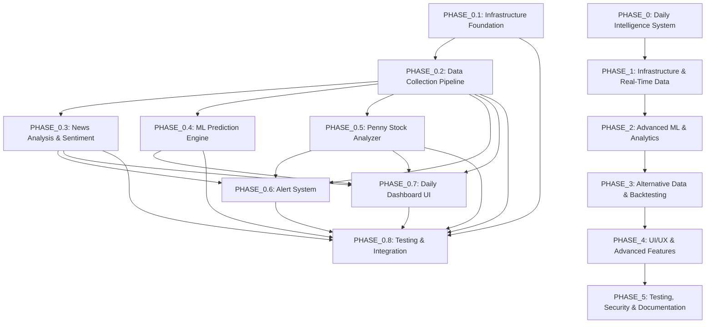

# Implementation Plan

**Feature:** Institutional-Grade Stock Analyzer Upgrade

## Overview

This task breakdown implements the institutional-grade stock analyzer upgrade in phases, with Phase 0 (Daily Intelligence System) as the immediate priority. The implementation follows a requirements-first workflow with comprehensive property-based testing.

**Implementation Strategy:**
- **Phase 0 (Weeks 1-4)**: Daily Intelligence System (Requirements 1-11)
- **Phase 1 (Weeks 5-8)**: Infrastructure & Real-Time Data (Requirements 12, 21-25)
- **Phase 2 (Weeks 9-12)**: Advanced ML & Analytics (Requirements 13-14)
- **Phase 3 (Weeks 13-16)**: Alternative Data & Backtesting (Requirements 15-16)
- **Phase 4 (Weeks 17-20)**: UI/UX & Advanced Features (Requirements 17-20, 27)
- **Phase 5 (Weeks 21-24)**: Testing, Security & Documentation (Requirements 28-41)

**Total Estimated Duration:** 24 weeks (6 months)

## Task Dependency Graph

## Tasks

### PHASE_0: Daily Intelligence System (Priority)
**Duration:** 4 weeks
**Requirements:** 1-11
**Goal:** Deliver immediate value with daily market intelligence before market open

#### PHASE_0.1: Infrastructure Foundation
**Duration:** 1 week
**Dependencies:** None

##### PHASE_0.1.1: Database Setup
**Estimated Duration:** 2 days
**Requirements:** 21.1-21.4
**Property Tests:** None (infrastructure setup)

- [x] Install and configure PostgreSQL 14+ with TimescaleDB extension
  - Install PostgreSQL 14+ on development and production environments
  - Install TimescaleDB 2.0+ extension
  - Configure connection pooling with pgbouncer
  - Set up database user accounts with appropriate permissions
  - Configure backup and recovery procedures

- [x] Create database schema for daily intelligence features
  - Create `stocks` table with ticker, name, sector, market_cap, avg_volume
  - Create `price_data` hypertable with ticker, timestamp, open, high, low, close, volume
  - Create `news_articles` table with id, title, content, source, published_at, url, category
  - Create `news_sentiment` table with article_id, ticker, sentiment_score, vader_score, finbert_score
  - Create `daily_predictions` table with ticker, date, predicted_price, confidence, factors
  - Create `top_movers` table with ticker, date, pct_change, volume_ratio, sector
  - Create indexes on frequently queried columns (ticker, timestamp, date)
  - Create TimescaleDB continuous aggregates for daily/hourly rollups

##### PHASE_0.1.2: Redis Cache Setup
**Estimated Duration:** 1 day
**Requirements:** 22.1-22.4
**Property Tests:** None (infrastructure setup)

- [x] Install and configure Redis 7.0+ for caching and pub/sub
  - Install Redis 7.0+ on development and production environments
  - Configure Redis persistence (RDB + AOF)
  - Set up Redis connection pooling
  - Configure memory limits and eviction policies (LRU)
  - Set up Redis Sentinel for high availability (production only)

- [x] Define cache key patterns for daily intelligence data
  - Define cache keys: `price:{ticker}:latest`, `price:{ticker}:history:{timeframe}`
  - Define cache keys: `news:latest:{limit}`, `news:ticker:{ticker}:{hours}`
  - Define cache keys: `prediction:{ticker}:{date}`, `predictions:daily:{date}`
  - Define cache keys: `movers:gainers:{date}`, `movers:losers:{date}`
  - Define cache keys: `sentiment:{ticker}:latest`, `sentiment:market:latest`
  - Define cache keys: `penny:movers:{date}`, `penny:momentum:{ticker}`
  - Set appropriate TTLs for each cache key pattern (5min-24hr)

##### PHASE_0.1.3: Celery Task Queue Setup
**Estimated Duration:** 2 days
**Requirements:** 23.1-23.4
**Property Tests:** None (infrastructure setup)

- [x] Install and configure Celery 5.0+ with Redis backend
  - Install Celery 5.0+ and configure Redis as message broker
  - Create Celery application instance in `stockiq/infrastructure/tasks.py`
  - Configure Celery worker pools (4-8 workers)
  - Set up Celery Beat scheduler for periodic tasks
  - Configure task routing to different queues (data, ml, alerts)
  - Set up task result backend in Redis
  - Configure task retry policies and error handling

- [x] Create task definitions for data collection and processing
  - Create task: `collect_market_data(tickers: List[str])`
  - Create task: `collect_news_articles(sources: List[str], hours: int)`
  - Create task: `process_news_sentiment(article_ids: List[str])`
  - Create task: `calculate_top_movers(date: str)`
  - Create task: `generate_daily_predictions(tickers: List[str])`
  - Create task: `scan_penny_stocks()`
  - Create task: `send_daily_report(user_id: int)`
  - Schedule tasks with Celery Beat (e.g., news collection every 30min)

#### PHASE_0.2: Data Collection Pipeline
**Duration:** 1 week
**Dependencies:** PHASE_0.1

##### PHASE_0.2.1: Market Data Collector
**Estimated Duration:** 2 days
**Requirements:** 1.1-1.12, 12.1-12.2
**Property Tests:** Properties 3, 26, 27, 28

- [x] Implement MarketDataCollector class in `stockiq/data/collectors/market.py`
  - Implement `get_realtime_price(ticker: str) -> Price` using yfinance
  - Implement `get_historical_data(ticker: str, start: date, end: date) -> DataFrame`
  - Implement `get_intraday_data(ticker: str, interval: str) -> DataFrame`
  - Implement `get_bulk_quotes(tickers: List[str]) -> Dict[str, Price]`
  - Add rate limiting to respect yfinance limits (2000 req/hour)
  - Add retry logic with exponential backoff (3 attempts)
  - Add data validation for OHLC consistency (Property 26)
  - Add timestamp ordering validation (Property 27)
  - Add volume non-negativity validation (Property 28)
  - Cache recent price data in Redis (5-minute TTL)

- [x] Implement top movers calculation in `stockiq/data/processors/movers.py`
  - Implement `calculate_percentage_change(open_price, close_price) -> Decimal` (Property 3)
  - Implement `identify_top_gainers(stocks: DataFrame, limit: int = 20) -> List[Stock]` (Property 1)
  - Implement `identify_top_losers(stocks: DataFrame, limit: int = 20) -> List[Stock]` (Property 2)
  - Implement `filter_by_market_cap(stocks: DataFrame, min_cap: int) -> DataFrame` (Property 4)
  - Implement `filter_by_volume(stocks: DataFrame, min_volume: int) -> DataFrame` (Property 5)
  - Implement `detect_unusual_volume(stock: Stock) -> bool` (Property 7)
  - Implement `calculate_sector_performance(stocks: DataFrame) -> Dict[str, float]` (Property 6)
  - Store top movers in database and cache (24-hour TTL)

##### PHASE_0.2.2: News Data Collector
**Estimated Duration:** 3 days
**Requirements:** 2.1-2.12, 9.1-9.12
**Property Tests:** Properties 8, 9, 10, 11

- [x] Implement NewsCollector class in `stockiq/data/collectors/news.py`
  - Implement `collect_latest_news(limit: int = 100) -> List[NewsArticle]`
  - Integrate NewsAPI.org with API key configuration
  - Integrate Finnhub.io news endpoint
  - Integrate Alpha Vantage news sentiment endpoint
  - Implement `collect_ticker_news(ticker: str, hours: int = 24) -> List[NewsArticle]`
  - Implement `detect_breaking_news(article: NewsArticle) -> bool` (Property 10)
  - Add rate limiting for each news source (stay at 80% of limits)
  - Add duplicate detection using content hashing
  - Cache news articles in Redis (1-hour TTL)
  - Store news articles in database with timestamps

- [x] Implement news categorization in `stockiq/news/nlp/categorization.py`
  - Implement `categorize_article(article: NewsArticle) -> NewsCategory` (Property 8)
  - Use keyword-based classification for categories: earnings, M&A, regulatory, economic, sector-specific, general
  - Implement `extract_tickers(text: str) -> List[str]` using regex and NER
  - Implement `calculate_relevance_score(article: NewsArticle, user_interests: List[str]) -> float`
  - Implement `rank_by_relevance(articles: List[NewsArticle]) -> List[NewsArticle]` (Property 11)
  - Cache categorization results in Redis

#### PHASE_0.3: News Analysis & Sentiment
**Duration:** 1 week
**Dependencies:** PHASE_0.2

##### PHASE_0.3.1: Sentiment Analysis Pipeline
**Estimated Duration:** 3 days
**Requirements:** 2.4, 2.10, 2.11
**Property Tests:** Properties 9, 12

- [x] Implement SentimentAnalyzer class in `stockiq/news/nlp/sentiment.py`
  - Install and configure VADER sentiment analyzer
  - Install and configure FinBERT model (ProsusAI/finbert)
  - Implement `analyze_with_vader(text: str) -> float`
  - Implement `analyze_with_finbert(text: str) -> float`
  - Implement `analyze_sentiment(text: str) -> SentimentScore` combining both models (Property 9)
  - Ensure sentiment scores are in range [-1.0, 1.0]
  - Implement confidence calculation based on model agreement
  - Cache sentiment results in Redis (24-hour TTL)
  - Store sentiment scores in database linked to articles

- [x] Implement news-price correlation analysis in `stockiq/news/impact/correlation.py`
  - Implement `calculate_sentiment_correlation(ticker: str, period_days: int) -> float` (Property 12)
  - Ensure correlation coefficient is in range [-1.0, 1.0]
  - Implement `calculate_impact(article: EnrichedNewsArticle, ticker: str, timeframes: List[str]) -> ImpactAnalysis`
  - Calculate price impact at 1h, 4h, 1d, 1w timeframes
  - Implement `calculate_news_beta(ticker: str, period_days: int = 90) -> float`
  - Store correlation results in database for historical tracking

##### PHASE_0.3.2: NLP Entity Extraction
**Estimated Duration:** 2 days
**Requirements:** 2.3, 2.7
**Property Tests:** None (NLP quality is subjective)

- [x] Implement EntityExtractor class in `stockiq/news/nlp/entities.py`
  - Install and configure spaCy with en_core_web_sm model
  - Implement `extract_entities(text: str) -> Entities`
  - Extract companies using NER (ORG entities)
  - Extract people using NER (PERSON entities)
  - Extract locations using NER (GPE, LOC entities)
  - Implement `extract_tickers(text: str) -> List[str]` using regex patterns
  - Validate extracted tickers against stocks database
  - Cache entity extraction results in Redis

- [x] Implement NewsSummarizer class in `stockiq/news/nlp/summarization.py`
  - Implement `summarize_extractive(text: str, sentences: int = 3) -> str`
  - Use TextRank algorithm for extractive summarization
  - Implement `extract_key_facts(text: str) -> Dict[str, Any]`
  - Extract numerical data (prices, percentages, dates)
  - Implement `generate_daily_summary(articles: List[NewsArticle]) -> str`
  - Cache summaries in Redis (24-hour TTL)

#### PHASE_0.4: ML Prediction Engine
**Duration:** 1 week
**Dependencies:** PHASE_0.2, PHASE_0.3

##### PHASE_0.4.1: Feature Engineering
**Estimated Duration:** 2 days
**Requirements:** 3.6, 13.1-13.3
**Property Tests:** None (feature engineering)

- [x] Implement feature engineering in `stockiq/models/features.py`
  - Implement `calculate_technical_features(price_data: DataFrame) -> DataFrame`
  - Calculate RSI, MACD, Bollinger Bands, ATR, OBV
  - Calculate moving averages (SMA 20, 50, 200)
  - Calculate momentum indicators
  - Implement `calculate_fundamental_features(ticker: str) -> Dict[str, float]`
  - Extract P/E ratio, P/B ratio, debt-to-equity, ROE
  - Implement `calculate_sentiment_features(ticker: str, hours: int = 24) -> Dict[str, float]`
  - Calculate average sentiment, sentiment trend, news volume
  - Implement `create_feature_matrix(ticker: str, lookback_days: int = 90) -> DataFrame`
  - Combine technical, fundamental, and sentiment features
  - Handle missing values with forward fill and interpolation

- [x] Implement data preprocessing in `stockiq/models/preprocessing.py`
  - Implement `normalize_features(X: DataFrame) -> DataFrame` using StandardScaler
  - Implement `create_sequences(data: DataFrame, sequence_length: int = 60) -> np.ndarray`
  - Implement `split_train_test(X: DataFrame, y: Series, test_size: float = 0.2) -> Tuple`
  - Implement time-series cross-validation splitter (5 folds)
  - Ensure no data leakage (no future data in training)

##### PHASE_0.4.2: Ensemble Prediction Models
**Estimated Duration:** 3 days
**Requirements:** 3.1-3.12, 13.3-13.4
**Property Tests:** Properties 13, 14, 15, 16, 17, 18

- [x] Implement EnsemblePredictor class in `stockiq/models/ensemble/predictor.py`
  - Implement RandomForest model training and prediction
  - Implement GradientBoosting model training and prediction
  - Implement XGBoost model training and prediction
  - Implement stacking meta-learner combining base models
  - Implement `train(X: DataFrame, y: Series) -> None`
  - Implement `predict(X: DataFrame) -> Prediction` (Properties 13, 14, 15)
  - Ensure confidence scores are in range [0, 100] (Property 13)
  - Ensure prediction bounds satisfy lower_bound ≤ predicted_value ≤ upper_bound (Property 15)
  - Implement `predict_category(prediction: Prediction) -> str` (Property 14)
  - Assign categories: Strong Buy, Buy, Hold, Sell, Strong Sell
  - Flag low-confidence predictions (<60%) (Property 16)
  - Implement `get_feature_importance() -> Dict[str, float]` using SHAP
  - Cache trained models in Redis (24-hour TTL)

- [x] Implement prediction tracking in `stockiq/core/prediction_log.py`
  - Implement `log_prediction(prediction: Prediction) -> None`
  - Store predictions in database with timestamps
  - Implement `calculate_accuracy(ticker: str, period_days: int) -> float` (Property 17)
  - Calculate directional accuracy (predicted direction vs. actual)
  - Implement `calculate_market_outlook(predictions: List[Prediction]) -> str` (Property 18)
  - Determine bullish (>60% positive), bearish (>60% negative), or neutral
  - Implement `get_performance_metrics(ticker: str) -> Dict[str, float]`
  - Calculate win rate, average gain, average loss, Sharpe ratio
  - Trigger model retraining alert when accuracy drops below 55%

#### PHASE_0.5: Penny Stock Analyzer
**Duration:** 1 week
**Dependencies:** PHASE_0.2

##### PHASE_0.5.1: Penny Stock Scanner
**Estimated Duration:** 2 days
**Requirements:** 11.1-11.7, 11.12-11.13
**Property Tests:** Properties 42, 43, 44, 47, 54

- [x] Implement PennyStockScanner class in `stockiq/news/penny/scanner.py`
  - Implement `scan_intraday_gainers(min_gain_pct: float = 20.0) -> List[PennyStock]` (Property 43)
  - Filter stocks with price ≤ $5.00 (Property 42)
  - Identify stocks with intraday gain ≥ 20%
  - Implement `scan_multi_day_gainers(days: int = 5, min_gain_pct: float = 50.0) -> List[PennyStock]` (Property 44)
  - Identify stocks with 5-day gain ≥ 50%
  - Implement `filter_by_volume(stocks: List[PennyStock], min_avg_volume: int = 50000) -> List[PennyStock]`
  - Filter stocks with average volume ≥ 50,000 shares
  - Implement `calculate_volume_ratio(stock: PennyStock) -> float` (Property 47)
  - Calculate volume_ratio = current_volume / average_volume (≥ 1.0)
  - Implement `get_penny_stock_universe() -> List[str]`
  - Query database for all stocks with price < $5
  - Update penny stock list every 2 minutes during market hours
  - Cache penny stock data in Redis (2-minute TTL)

- [x] Create database schema for penny stocks
  - Create `penny_stock_momentum` table with ticker, date, momentum_score, price_change_pct, volume_ratio
  - Create `penny_stock_risk_metrics` table with ticker, date, liquidity_risk, volatility_risk, spread_pct
  - Create `penny_stock_alerts` table with ticker, alert_type, threshold, triggered_at
  - Create indexes on ticker and date columns

##### PHASE_0.5.2: Momentum & Risk Analysis
**Estimated Duration:** 3 days
**Requirements:** 11.4-11.11, 11.14-11.20
**Property Tests:** Properties 45, 46, 48, 49, 50, 51, 52, 53

- [x] Implement MomentumCalculator class in `stockiq/news/penny/momentum.py`
  - Implement `calculate_momentum_score(stock: PennyStock) -> MomentumScore` (Properties 45, 46)
  - Ensure momentum score is in range [0, 100] (Property 45)
  - Calculate price component (40% weight): based on percentage gain magnitude
  - Calculate volume component (30% weight): based on volume surge ratio
  - Calculate trend component (20% weight): based on consecutive up days
  - Calculate catalyst component (10% weight): based on news presence
  - Ensure component weights sum to 100% (Property 46)
  - Implement `rank_by_momentum(stocks: List[PennyStock]) -> List[PennyStock]` (Property 54)
  - Sort stocks by momentum score in descending order
  - Implement `identify_catalyst(ticker: str) -> Optional[str]`
  - Check for recent news, earnings, or regulatory events
  - Cache momentum scores in Redis (2-minute TTL)

- [x] Implement PennyStockRiskAnalyzer class in `stockiq/news/penny/risk.py`
  - Implement `calculate_liquidity_risk(stock: PennyStock) -> float` (Property 48)
  - Ensure liquidity risk is in range [0, 1]
  - Calculate based on average volume and market cap
  - Implement `calculate_volatility_risk(stock: PennyStock) -> float`
  - Calculate using ATR and historical volatility
  - Implement `calculate_spread_percentage(stock: PennyStock) -> float` (Property 49)
  - Calculate spread_pct = ((ask - bid) / ((ask + bid) / 2)) * 100 (≥ 0)
  - Implement `assess_overall_risk(stock: PennyStock) -> RiskAssessment` (Property 50)
  - Classify as 'low', 'medium', 'high', or 'extreme' based on composite risk
  - Store risk metrics in database

- [x] Implement PumpDumpDetector class in `stockiq/news/penny/risk.py`
  - Implement `detect_suspicious_patterns(stock: PennyStock) -> SuspicionScore` (Property 51)
  - Ensure suspicion score is in range [0, 1]
  - Detect abnormal volume spikes without news catalyst
  - Detect rapid price increase followed by decline pattern
  - Check for coordinated social media campaigns (Twitter, Reddit)
  - Implement `check_insider_activity(ticker: str) -> InsiderActivity`
  - Query SEC Form 4 filings for recent insider trades
  - Flag suspicious insider selling during price spikes
  - Implement `generate_recommendation(suspicion_score: float) -> str`
  - Return 'safe', 'caution', or 'avoid' based on suspicion score

#### PHASE_0.6: Alert System
**Duration:** 1 week
**Dependencies:** PHASE_0.2, PHASE_0.3, PHASE_0.5

##### PHASE_0.6.1: News Alert Detection
**Estimated Duration:** 2 days
**Requirements:** 5.1-5.12
**Property Tests:** Property 36

- [x] Implement NewsAlertDetector class in `stockiq/news/alerts/detector.py`
  - Implement `should_alert(article: EnrichedNewsArticle, watchlist: List[str]) -> bool`
  - Check if article mentions any watchlist stocks
  - Check if sentiment change exceeds threshold (Property 36)
  - Implement `detect_breaking_news(article: EnrichedNewsArticle) -> bool`
  - Check if published within last 30 minutes
  - Implement `detect_sentiment_change(ticker: str, threshold: float = 0.5) -> bool` (Property 36)
  - Trigger alert if |current_sentiment - previous_sentiment| > threshold
  - Implement `detect_earnings_announcement(article: NewsArticle) -> bool`
  - Check for earnings-related keywords
  - Implement `detect_ma_news(article: NewsArticle) -> bool`
  - Check for M&A-related keywords
  - Implement `detect_regulatory_action(article: NewsArticle) -> bool`
  - Check for regulatory keywords (FDA, SEC, etc.)

- [x] Implement alert prioritization in `stockiq/news/alerts/prioritizer.py`
  - Implement `calculate_priority(alert: NewsAlert) -> int`
  - Prioritize by: breaking news > earnings > M&A > regulatory > general
  - Consider sentiment magnitude and predicted price impact
  - Implement `group_related_alerts(alerts: List[NewsAlert]) -> List[AlertGroup]`
  - Group alerts for same ticker within 1-hour window
  - Prevent notification spam

##### PHASE_0.6.2: Penny Stock Alerts
**Estimated Duration:** 1 day
**Requirements:** 11.11, 11.20
**Property Tests:** Property 52

- [x] Implement penny stock alert system in `stockiq/news/alerts/penny_alerts.py`
  - Implement `detect_momentum_threshold(stock: PennyStock, threshold: float) -> bool`
  - Trigger alert when momentum score crosses threshold
  - Implement `detect_high_priority_gain(stock: PennyStock) -> bool` (Property 52)
  - Trigger high-priority alert when intraday gain > 100%
  - Implement `detect_pump_dump_warning(stock: PennyStock, suspicion_score: float) -> bool`
  - Trigger warning when suspicion score > 0.7
  - Implement `detect_insider_activity_alert(ticker: str) -> bool`
  - Trigger alert on significant insider buying/selling

##### PHASE_0.6.3: Alert Delivery
**Estimated Duration:** 2 days
**Requirements:** 5.9, 17.6
**Property Tests:** None (delivery mechanism)

- [x] Implement AlertNotifier class in `stockiq/news/alerts/notifier.py`
  - Implement `send_alert(alert: NewsAlert, channels: List[str]) -> None`
  - Support in-app notifications (store in database)
  - Support email notifications (SMTP configuration)
  - Support webhook notifications (HTTP POST)
  - Implement `send_in_app_notification(alert: NewsAlert, user_id: int) -> None`
  - Store notification in `user_notifications` table
  - Implement `send_email_notification(alert: NewsAlert, email: str) -> None`
  - Format email with HTML template
  - Implement `send_webhook_notification(alert: NewsAlert, webhook_url: str) -> None`
  - POST JSON payload to webhook URL
  - Implement retry logic for failed deliveries (3 attempts)
  - Implement `configure_alert_sensitivity(user_id: int, sensitivity: str) -> None`

#### PHASE_0.7: Daily Dashboard UI
**Duration:** 1 week
**Dependencies:** PHASE_0.2, PHASE_0.3, PHASE_0.4, PHASE_0.5

##### PHASE_0.7.1: Dashboard Layout
**Estimated Duration:** 2 days
**Requirements:** 4.1-4.12
**Property Tests:** None (UI implementation)

- [x] Create Daily Market Brief dashboard in `stockiq/ui/dashboards/daily_brief.py`
  - Implement `render_daily_dashboard() -> None` as default landing page
  - Create 3-column layout: left (top movers), center (news), right (predictions)
  - Implement `render_top_movers_section() -> None`
  - Display top 10 gainers and top 10 losers side-by-side
  - Implement `render_news_section() -> None`
  - Display 5 most important news stories with sentiment indicators
  - Implement `render_predictions_section() -> None`
  - Display daily predictions for watchlist stocks with confidence scores
  - Ensure dashboard loads within 2 seconds

- [x] Implement market overview widgets in `stockiq/ui/components/market_overview.py`
  - Implement `render_market_indices() -> None`
  - Display S&P 500, NASDAQ, DOW, Russell 2000 performance
  - Implement `render_sector_heatmap() -> None`
  - Display sector performance as color-coded heat map using Plotly
  - Implement `render_market_sentiment_gauge() -> None`
  - Display overall market sentiment (-100 to +100)
  - Implement `render_economic_calendar() -> None`
  - Display today's economic events

##### PHASE_0.7.2: Penny Stock Dashboard
**Estimated Duration:** 2 days
**Requirements:** 11.5, 11.8, 11.12-11.13, 11.15-11.19
**Property Tests:** Property 53

- [x] Create Penny Stock Dashboard in `stockiq/ui/dashboards/penny_stocks.py`
  - Implement `render_penny_dashboard() -> None`
  - Display top 20 penny stocks ranked by momentum score
  - Implement `render_penny_stock_table() -> None`
  - Show ticker, price, % change, volume ratio, momentum score, risk classification
  - Implement `render_penny_stock_charts() -> None`
  - Display 1-day, 5-day, 30-day price charts with catalyst event highlights
  - Implement `render_penny_stock_metrics() -> None`
  - Display liquidity risk, volatility risk, spread percentage, insider activity
  - Implement `render_sector_distribution() -> None`
  - Display pie chart of penny stock sectors
  - Ensure dashboard updates every 2 minutes (Property 53)

##### PHASE_0.7.3: News Feed UI
**Estimated Duration:** 1 day
**Requirements:** 9.1-9.12
**Property Tests:** None (UI implementation)

- [x] Create Real-Time News Feed in `stockiq/ui/components/news_feed.py`
  - Implement `render_news_feed() -> None` with 30-second auto-refresh
  - Implement `render_news_filters() -> None` (ticker, sector, category, sentiment, source)
  - Implement `render_news_item(article: EnrichedNewsArticle) -> None`
  - Show headline, source, timestamp, sentiment badge, predicted price impact
  - Highlight breaking news with red badge and animation
  - Implement `render_news_search() -> None` (90-day historical search)
  - Implement `render_reading_list() -> None`

##### PHASE_0.7.4: Daily Report Generation
**Estimated Duration:** 2 days
**Requirements:** 8.1-8.12
**Property Tests:** None (report generation)

- [x] Implement DailyReportGenerator in `stockiq/reports/daily_report.py`
  - Implement `generate_daily_report(user_id: int) -> Report` by 8:00 AM ET
  - Implement `generate_top_predictions_section() -> str` (top 10 gainers/losers)
  - Implement `generate_market_outlook_section() -> str` (bullish/neutral/bearish)
  - Implement `generate_key_news_section() -> str` (5 key stories with summaries)
  - Implement `generate_sector_rotation_section() -> str`
  - Implement `generate_economic_calendar_section() -> str`
  - Implement `generate_accuracy_summary_section() -> str` (previous day accuracy)
  - Implement `generate_risk_warnings_section() -> str`
  - Implement `deliver_report(report: Report, user_id: int, channels: List[str]) -> None`
  - Support email, in-app notification, and PDF download

#### PHASE_0.8: Testing & Integration
**Duration:** 1 week
**Dependencies:** PHASE_0.1-PHASE_0.7

##### PHASE_0.8.1: Property-Based Tests
**Estimated Duration:** 3 days
**Requirements:** 31.1-31.12
**Property Tests:** Properties 1-18, 42-54

- [x] Write property-based tests for data processing in `tests/properties/test_data_processing.py`
  - Test Property 1: Top gainers ranking correctness
  - Test Property 2: Top losers ranking correctness
  - Test Property 3: Percentage change calculation
  - Test Property 4: Market cap filtering
  - Test Property 5: Volume filtering
  - Test Property 6: Sector performance aggregation
  - Test Property 7: Unusual volume detection
  - Use Hypothesis library for property-based testing

- [x] Write property-based tests for news analysis in `tests/properties/test_news_analysis.py`
  - Test Property 8: News category assignment
  - Test Property 9: Sentiment score range
  - Test Property 10: Breaking news detection
  - Test Property 11: News relevance ranking
  - Test Property 12: News sentiment correlation calculation
  - Verify sentiment scores are always in [-1.0, 1.0]
  - Verify correlation coefficients are in [-1.0, 1.0]

- [x] Write property-based tests for ML predictions in `tests/properties/test_predictions.py`
  - Test Property 13: Prediction confidence range [0, 100]
  - Test Property 14: Prediction category assignment
  - Test Property 15: Prediction bounds consistency
  - Test Property 16: Low confidence flagging
  - Test Property 17: Prediction accuracy calculation
  - Test Property 18: Market outlook determination

- [x] Write property-based tests for penny stocks in `tests/properties/test_penny_stocks.py`
  - Test Property 42: Penny stock price threshold (≤ $5)
  - Test Property 43: Intraday gain threshold (≥ 20%)
  - Test Property 44: Multi-day gain threshold (≥ 50%)
  - Test Property 45: Momentum score range [0, 100]
  - Test Property 46: Momentum component weights sum to 100%
  - Test Property 47: Volume ratio calculation (≥ 1.0)
  - Test Property 48: Liquidity risk range [0, 1]
  - Test Property 49: Spread percentage non-negativity
  - Test Property 50: Risk classification completeness
  - Test Property 51: Suspicion score range [0, 1]
  - Test Property 52: High-priority alert threshold (> 100% intraday)
  - Test Property 53: Dashboard refresh interval (≤ 2 min)
  - Test Property 54: Momentum ranking consistency

##### PHASE_0.8.2: Integration Tests
**Estimated Duration:** 2 days
**Requirements:** All Phase 0 requirements

- [x] Write end-to-end integration tests in `tests/integration/test_daily_pipeline.py`
  - Test complete data collection → sentiment → prediction pipeline
  - Test news alert triggering end-to-end
  - Test daily report generation with mock data
  - Test penny stock scanning and alerting pipeline
  - Verify Redis caching works correctly end-to-end
  - Verify Celery task scheduling and execution

---

### PHASE_1: Infrastructure & Real-Time Data
**Duration:** 4 weeks
**Dependencies:** PHASE_0

- [x] Implement WebSocket streaming for real-time price data in `stockiq/data/streams/websocket.py`
  - Implement `WebSocketStream` class with connect, subscribe, handle_message
  - Support automatic reconnection on failure
  - Deliver price updates within 500ms (Requirement 12.1)

- [x] Implement DataDistributor for Redis pub/sub in `stockiq/data/streams/distributor.py`
  - Implement `publish(channel, data)` and `subscribe(channel, callback)`
  - Support 100+ concurrent subscriber connections (Requirement 12.3)

- [x] Implement connection pooling and rate limiting
  - pgbouncer configuration for PostgreSQL connection pooling
  - Rate limiter respecting 80% of API rate limits (Requirement 12.7)
  - Automatic reconnection with exponential backoff

- [x] Implement TimescaleDB continuous aggregates
  - Create continuous aggregates for 1m, 5m, 1h, 1d OHLCV rollups
  - Achieve sub-200ms query performance for 5-year time spans (Requirement 12.5)

---

### PHASE_2: Advanced ML & Analytics
**Duration:** 4 weeks
**Dependencies:** PHASE_1

- [x] Implement LSTMPredictor in `stockiq/models/deep/lstm.py`
  - LSTM network for time-series price prediction (Requirement 13.1)
  - Uncertainty quantification with 95% confidence intervals (Requirement 13.4)
  - Time-series cross-validation with 5 folds (Requirement 13.7)

- [x] Implement TransformerPredictor in `stockiq/models/deep/transformer.py`
  - Transformer model for multi-variate market analysis (Requirement 13.2)
  - Attention weight visualization for explainability

- [x] Implement anomaly detection in `stockiq/models/deep/autoencoder.py`
  - Isolation Forest and autoencoder for market anomalies (Requirement 13.6)

- [x] Implement OptionsAnalyzer in `stockiq/analytics/options/greeks.py`
  - Calculate Delta, Gamma, Theta, Vega, Rho (Requirement 14.1)
  - Generate implied volatility surfaces (Requirement 14.2)

- [x] Implement RiskAnalyzer in `stockiq/analytics/risk/`
  - VaR at 95% and 99% confidence levels (Requirement 14.3)
  - CVaR for tail risk assessment (Requirement 14.4)
  - Sharpe, Sortino, Calmar ratios (Requirement 14.5)
  - Rolling windows of 252 trading days (Requirement 14.12)

- [x] Implement FactorAnalyzer in `stockiq/analytics/factors/`
  - Fama-French 5-factor model (Requirement 14.6)
  - Momentum, quality, value factor exposures (Requirement 14.7)
  - Cointegration testing (Requirement 14.9)

- [x] Implement portfolio optimization in `stockiq/analytics/portfolio/`
  - Mean-variance optimization (Requirement 14.10)
  - Black-Litterman optimization (Requirement 14.11)

- [x] Implement RLPortfolioOptimizer in `stockiq/models/rl/`
  - TradingEnvironment (OpenAI Gym) (Requirement 13.5)
  - PPO/A2C/SAC agents for portfolio optimization

---

### PHASE_3: Alternative Data & Backtesting
**Duration:** 4 weeks
**Dependencies:** PHASE_2

- [x] Implement SEC filing parser in `stockiq/data/collectors/alternative.py`
  - Parse 10-K, 10-Q, 8-K filings (Requirement 15.1-15.2)
  - Extract earnings call transcripts (Requirement 15.3-15.4)
  - Track insider trading transactions (Requirement 15.5-15.6)

- [x] Implement BacktestEngine in `stockiq/backtesting/`
  - Configurable slippage and commission models (Requirements 16.1-16.2)
  - Multiple order types: market, limit, stop-loss, stop-limit (Requirement 16.4)
  - Equity curves, drawdown charts, performance metrics (Requirements 16.5-16.6)
  - Walk-forward optimization with out-of-sample testing (Requirement 16.11)
  - Prevent look-ahead bias (Requirement 16.12)

- [x] Implement paper trading in `stockiq/trading/`
  - Virtual cash accounts with real-time price execution (Requirements 16.7-16.8)
  - Daily P&L tracking and benchmark comparison (Requirements 16.9-16.10)

---

### PHASE_4: UI/UX & Advanced Features
**Duration:** 4 weeks
**Dependencies:** PHASE_3

- [x] Implement advanced charting in `stockiq/ui/charts/`
  - Candlestick charts with 6 timeframe options (Requirement 18.1)
  - Drawing tools: trendlines, Fibonacci retracements (Requirement 18.2)
  - 10+ technical indicator overlays (Requirement 18.3)
  - Chart comparison mode, zoom/pan, export (Requirements 18.4-18.12)

- [x] Implement custom screeners in `stockiq/ui/screeners/`
  - 20+ filter criteria with AND/OR/NOT operators (Requirements 17.7-17.8)
  - Sub-5-second execution across 5,000+ stocks (Requirement 17.9)
  - Saved screeners with scheduled execution (Requirements 17.10-17.11)

- [x] Implement customizable dashboards in `stockiq/ui/dashboards/`
  - Multiple custom layouts with drag-and-drop (Requirements 19.1-19.2)
  - 15+ widget types (Requirement 19.3)

---

### PHASE_5: Testing, Security & Documentation
**Duration:** 4 weeks
**Dependencies:** PHASE_4

- [x] Write comprehensive property-based tests for Phases 1-4
  - Properties 19-41 covering analytics, backtesting, alternative data
  - Performance benchmarks (sub-500ms latency, 90%+ cache hit rate)

- [x] Implement security hardening
  - Input validation and parameterized queries throughout
  - API key rotation and secrets management
  - Rate limiting per user on all endpoints

- [x] Write user and developer documentation
  - API reference for all public interfaces
  - Deployment guide (Docker, Kubernetes)
  - User guide for web interface and CLI
