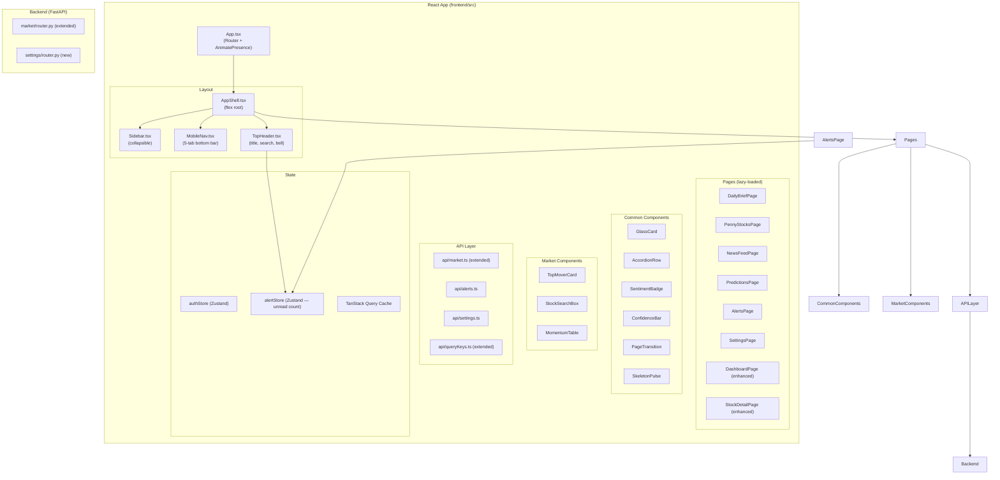
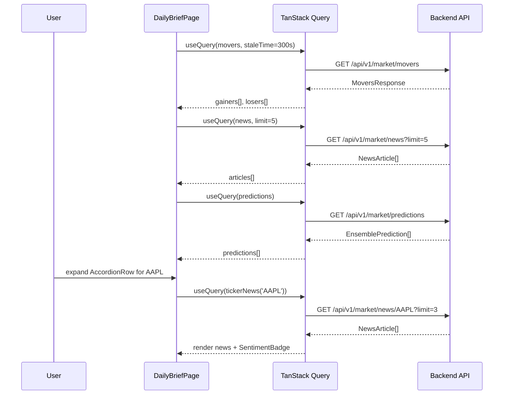
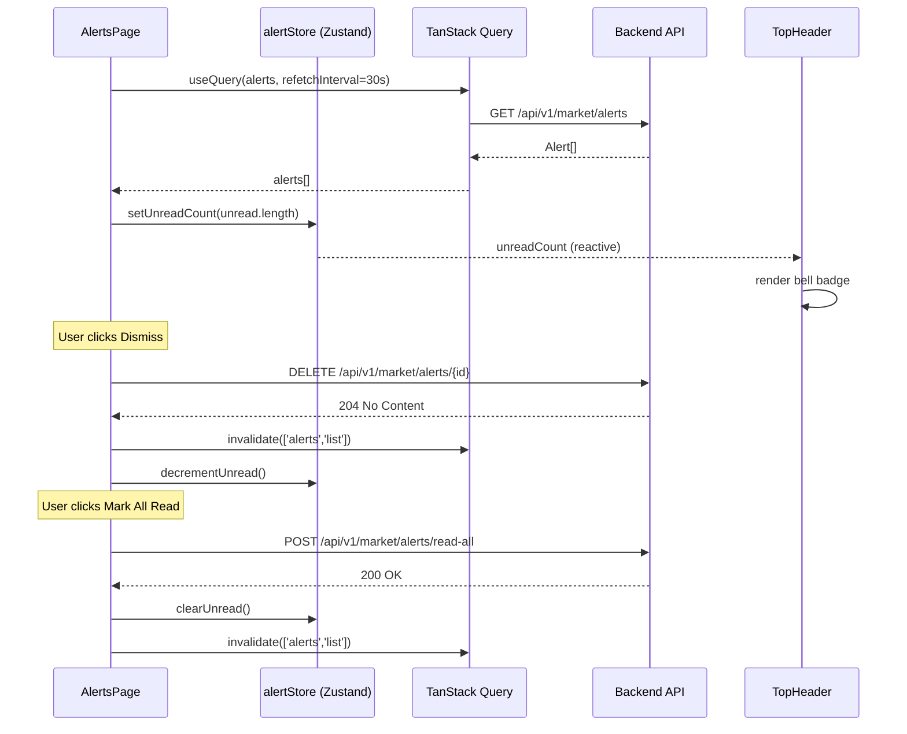

# Design Document — React UI Upgrade

## Overview

This document describes the technical design for migrating all Streamlit UI pages into the existing React 18 + TypeScript + Vite frontend and enriching the application with premium UI components. The result is a complete single-page application covering Daily Market Brief, Penny Stocks, News Feed, Predictions, Alerts, Watchlist, Settings, and all existing pages (Dashboard, Portfolio, Trading, Stock Detail).

The design extends the current architecture without introducing new dependencies. All UI primitives, pages, API clients, and backend routes are built on the libraries already present: React 18, TypeScript, Tailwind CSS v3, Framer Motion, TanStack Query v5, Recharts, Lucide React, Zustand, React Router v6, and Sonner.

### Design Decisions

- **No new npm dependencies.** Every new component is composed from existing Tailwind utilities, Framer Motion primitives, and Lucide icons already in `package.json`.
- **Glassmorphism card as the canonical premium surface.** `GlassCard` becomes the single shared surface for all new pages, avoiding divergent card styles.
- **TanStack Query for all remote state.** Polling intervals, stale times, and invalidation are co-located in each page's query hooks — no global polling state in Zustand.
- **Zustand extended only for the unread-alert badge.** The alert count is needed in the AppShell header (notification bell) without prop-drilling through AppShell → Sidebar. A single `alertStore` slice keeps this clean.
- **Code-splitting with React.lazy + Suspense.** All six new pages are lazy-loaded to keep the initial bundle small.
- **Backend: one new router file per concern.** New endpoints are added to the existing `backend/market/router.py` via helper service methods to keep the router surface consistent.


---

## Architecture

### High-Level Component Architecture



### File Structure for New Files

```
frontend/src/
├── api/
│   ├── market.ts              (extended — movers, news, predictions, penny-stocks, snapshot)
│   ├── alerts.ts              (new)
│   ├── settings.ts            (new)
│   └── queryKeys.ts           (extended)
├── components/
│   ├── common/
│   │   ├── GlassCard.tsx      (new)
│   │   ├── AccordionRow.tsx   (new)
│   │   ├── SentimentBadge.tsx (new)
│   │   ├── ConfidenceBar.tsx  (new)
│   │   └── SkeletonPulse.tsx  (new)
│   ├── layout/
│   │   ├── AppShell.tsx       (extended — TopHeader)
│   │   ├── Sidebar.tsx        (extended — 11 nav items)
│   │   ├── MobileNav.tsx      (extended — 5 tabs)
│   │   └── TopHeader.tsx      (new)
│   └── market/
│       ├── TopMoverCard.tsx   (new)
│       ├── StockSearchBox.tsx (new)
│       └── MomentumTable.tsx  (new)
├── pages/
│   ├── DailyBriefPage.tsx     (new)
│   ├── PennyStocksPage.tsx    (new)
│   ├── NewsFeedPage.tsx       (new)
│   ├── PredictionsPage.tsx    (new)
│   ├── AlertsPage.tsx         (new)
│   ├── SettingsPage.tsx       (new)
│   ├── DashboardPage.tsx      (enhanced)
│   └── StockDetailPage.tsx    (enhanced)
├── store/
│   ├── authStore.ts           (unchanged)
│   └── alertStore.ts          (new)
└── App.tsx                    (extended — lazy routes, redirect)

backend/
├── market/
│   ├── router.py              (extended — 8 new endpoints)
│   ├── schemas.py             (extended — new Pydantic models)
│   └── service.py             (extended — new service methods)
└── settings/
    ├── router.py              (new)
    ├── schemas.py             (new)
    └── service.py             (new)
```


---

## Components and Interfaces

### Shared UI Primitives

#### GlassCard

```typescript
// frontend/src/components/common/GlassCard.tsx
interface GlassCardProps {
  children: React.ReactNode
  className?: string
  /** Disable hover-scale animation. Default: false */
  noHover?: boolean
  onClick?: () => void
}
```

Implementation notes:
- Base classes: `bg-[#111827]/80 backdrop-blur-md border border-[#1f2d40] rounded-xl`
- Gradient border overlay via `before:` pseudo-element with `from-[#6366f1]/20 via-transparent to-[#06b6d4]/20`
- Framer Motion `whileHover={{ scale: 1.02 }}` with `transition={{ duration: 0.18 }}`
- `noHover` prop disables the scale animation for use inside scrollable lists

#### AccordionRow

```typescript
interface AccordionRowProps {
  header: React.ReactNode
  children: React.ReactNode
  /** Default: false */
  defaultOpen?: boolean
  className?: string
}
```

Implementation notes:
- Uses `useState(defaultOpen ?? false)` for toggle state
- Header bar: full-width `button` with `ChevronDown` icon that rotates 180° when open
- Children panel animated with Framer Motion `AnimatePresence` + `motion.div` with `initial={{ height: 0, opacity: 0 }}` and `animate={{ height: 'auto', opacity: 1 }}` — max 300ms
- `overflow-hidden` on the animated div prevents layout shifts

#### SentimentBadge

```typescript
interface SentimentBadgeProps {
  score: number  // SentimentScore in [-1, 1]
  className?: string
}

type SentimentLevel = 'positive' | 'neutral' | 'negative'
```

Colour mapping:
| Condition | Level | Classes |
|---|---|---|
| `score > 0.15` | positive | `bg-green-500/15 text-green-400 border-green-500/30` |
| `-0.15 <= score <= 0.15` | neutral | `bg-yellow-500/15 text-yellow-400 border-yellow-500/30` |
| `score < -0.15` | negative | `bg-red-500/15 text-red-400 border-red-500/30` |

#### ConfidenceBar

```typescript
interface ConfidenceBarProps {
  /** Integer 0–100 */
  value: number
  /** Valid CSS color string, e.g. '#6366f1' */
  color: string
  className?: string
  showLabel?: boolean
}
```

Implementation notes:
- Outer track: `h-2 w-full rounded-full bg-[#1a2235] overflow-hidden`
- Inner bar: `motion.div` with `initial={{ width: '0%' }}` → `animate={{ width: \`${value}%\` }}` transition 500ms ease-out
- Wrapper `div` has `role="progressbar" aria-valuenow={value} aria-valuemin={0} aria-valuemax={100}`

#### SkeletonPulse

```typescript
interface SkeletonPulseProps {
  className?: string
}
```

Renders a single `div` with `animate-pulse bg-[#1a2235] rounded` and `role="status" aria-label="Loading"`.

#### PageTransition (existing, no change)

Already exported from `components/common/PageTransition.tsx` with the specified variant values.


### Navigation Components

#### TopHeader (new)

```typescript
// frontend/src/components/layout/TopHeader.tsx
interface TopHeaderProps {
  title: string
}
```

Reads `unreadCount` from `alertStore`. Renders:
- Page title (derived from `useLocation` + route-title map)
- Global stock search input (1–10 uppercase alphanumeric, navigates to `/stock/{ticker}`)
- Bell icon (`Bell` from Lucide) with conditional badge overlay

Badge rendering logic:
```typescript
const badgeText = unreadCount === 0 ? null
  : unreadCount > 99 ? '99+'
  : String(unreadCount)
```

#### Sidebar (extended)

New `navItems` array (11 items):
```typescript
const navItems = [
  { path: '/dashboard',    icon: LayoutDashboard, label: 'Dashboard' },
  { path: '/portfolio',    icon: BarChart2,        label: 'Portfolio' },
  { path: '/watchlist',    icon: Bookmark,         label: 'Watchlist' },
  { path: '/trading',      icon: TrendingUp,       label: 'Trading' },
  { path: '/stock/search', icon: Search,           label: 'Stock Search' },
  { path: '/market',       icon: Newspaper,        label: 'Daily Market Brief' },
  { path: '/penny-stocks', icon: Zap,              label: 'Penny Stocks' },
  { path: '/news',         icon: Rss,              label: 'News Feed' },
  { path: '/predictions',  icon: Brain,            label: 'Predictions' },
  { path: '/alerts',       icon: BellRing,         label: 'Alerts' },
  { path: '/settings',     icon: Settings2,        label: 'Settings' },
]
```

Collapsed width: `w-12` (48px). Text labels truncated at 20 chars with `truncate` class. Each nav item min-height: `min-h-[48px]`.

#### MobileNav (extended)

Five tabs maximum:
```typescript
const tabs = [
  { path: '/dashboard',    icon: LayoutDashboard, label: 'Home' },
  { path: '/market',       icon: Newspaper,       label: 'Market' },
  { path: '/penny-stocks', icon: Zap,             label: 'Penny' },
  { path: '/news',         icon: Rss,             label: 'News' },
  { path: '/alerts',       icon: BellRing,        label: 'Alerts' },
]
```

### Market Components

#### TopMoverCard

```typescript
interface TopMoverCardProps {
  ticker: string
  name: string
  price_change_pct: number
  current_price: number
  volume: number
  avg_volume: number
  has_unusual_volume: boolean
  sector: string
  /** Expanded slot rendered inside AccordionRow */
  children?: React.ReactNode
}
```

Colour: `price_change_pct >= 0` → `text-green-400`, else `text-red-400`. Flame emoji shown when `has_unusual_volume === true`.

#### StockSearchBox

```typescript
interface StockSearchBoxProps {
  onResult?: (data: StockSearchResult) => void
  className?: string
}

interface StockSearchResult {
  quote: Quote
  prediction: Prediction
  news: NewsArticle[]
}
```

Controlled input. Validates 1–10 uppercase alphanumeric on submit. Displays inline trend arrow, price, volume, news snippets (up to 2), and prediction signal.

#### MomentumTable

```typescript
interface MomentumTableProps {
  rows: PennyStock[]
  isLoading: boolean
}

type SortField = 'rank' | 'ticker' | 'price' | 'price_change_pct'
  | 'volume_ratio' | 'momentum_score' | 'risk_level'
type SortDir = 'asc' | 'desc'
```

Internal state: `{ field: SortField; dir: SortDir }` initialised as `{ field: 'momentum_score', dir: 'desc' }`. Column header click toggles `dir` when same field, resets to `'desc'` when changing field. The sort function is a pure exported utility (`sortPennyStocks`) to enable property-based testing.


---

## Data Models

### Frontend TypeScript Types

```typescript
// api/market.ts — extended types

export interface TopMover {
  ticker: string
  name: string
  price_change_pct: number
  current_price: number
  volume: number
  avg_volume: number
  sector: string
  has_unusual_volume: boolean
}

export interface MoversResponse {
  gainers: TopMover[]
  losers: TopMover[]
}

export interface NewsArticle {
  id: string
  title: string
  source: string
  published_at: string        // ISO 8601
  sentiment_score: number     // [-1, 1]
  category: string
  is_breaking: boolean
  summary: string
  tickers: string[]
  url: string
}

export interface EnsemblePrediction {
  ticker: string
  category: 'Strong Buy' | 'Buy' | 'Hold' | 'Sell' | 'Strong Sell'
  confidence: number          // [0, 1]
  expected_return: number     // decimal, e.g. 0.035 = +3.5%
  lower_bound: number
  upper_bound: number
  is_low_confidence: boolean
}

export interface PennyStock {
  ticker: string
  price: number
  price_change_pct: number
  volume: number
  avg_volume: number
  volume_ratio: number
  momentum_score: number      // [0, 100]
  risk_level: 'low' | 'medium' | 'high' | 'extreme'
  sector: string
  catalyst: string
  suspicion_score: number     // [0, 1]
  recommendation: string
  insider_net: number
  insider_buys: number
  insider_sells: number
}

export interface MarketSnapshot {
  sp500_change_pct: number
  nasdaq_change_pct: number
  vix: number
}

// api/alerts.ts

export interface Alert {
  id: string
  ticker: string
  alert_type: string
  message: string
  severity: 'info' | 'warning' | 'critical'
  timestamp: string           // ISO 8601
  is_read: boolean
}

// api/settings.ts

export interface AppSettings {
  app_env: string
  api_version: string
  log_level: string
  feature_flags: {
    real_time_streaming: boolean
    deep_learning: boolean
    alternative_data: boolean
  }
}

export type FeatureFlagPatch = Partial<AppSettings['feature_flags']>
```

### Zustand Alert Store

```typescript
// store/alertStore.ts
interface AlertState {
  unreadCount: number
  setUnreadCount: (count: number) => void
  decrementUnread: () => void
  clearUnread: () => void
}
```

`AlertsPage` writes to this store after each poll. `TopHeader` reads from it to render the bell badge.

### TanStack Query Key Map (extended)

```typescript
export const queryKeys = {
  // ...existing keys...
  market: {
    // existing
    quote:      (ticker: string) => ['market', 'quote', ticker]      as const,
    chart:      (ticker: string, period?: string) =>
                  ['market', 'chart', ticker, period]                 as const,
    prediction: (ticker: string) => ['market', 'prediction', ticker] as const,
    // new
    movers:     ()               => ['market', 'movers']             as const,
    news:       (params?: object) => ['market', 'news', params]      as const,
    tickerNews: (ticker: string) => ['market', 'news', ticker]       as const,
    predictions:(tickers?: string[]) =>
                  ['market', 'predictions', tickers]                  as const,
    pennyStocks:()               => ['market', 'penny-stocks']       as const,
    snapshot:   ()               => ['market', 'snapshot']           as const,
  },
  alerts: {
    list: ()           => ['alerts', 'list']         as const,
  },
  settings: {
    config: ()         => ['settings', 'config']     as const,
  },
}
```


### Backend Pydantic Schemas (new)

```python
# backend/market/schemas.py — additions

class TopMover(BaseModel):
    ticker: str
    name: str
    price_change_pct: float
    current_price: float
    volume: int
    avg_volume: int
    sector: str
    has_unusual_volume: bool

class MoversResponse(BaseModel):
    gainers: List[TopMover]
    losers: List[TopMover]

class NewsItem(BaseModel):
    id: str
    title: str
    source: str
    published_at: str
    sentiment_score: float
    category: str
    is_breaking: bool
    summary: str
    tickers: List[str]
    url: str

class EnsemblePrediction(BaseModel):
    ticker: str
    category: str   # 'Strong Buy'|'Buy'|'Hold'|'Sell'|'Strong Sell'
    confidence: float
    expected_return: float
    lower_bound: float
    upper_bound: float
    is_low_confidence: bool

class PennyStockItem(BaseModel):
    ticker: str
    price: float
    price_change_pct: float
    volume: int
    avg_volume: int
    volume_ratio: float
    momentum_score: float
    risk_level: str
    sector: str
    catalyst: str
    suspicion_score: float
    recommendation: str
    insider_net: float
    insider_buys: int
    insider_sells: int

class MarketSnapshot(BaseModel):
    sp500_change_pct: float
    nasdaq_change_pct: float
    vix: float

class AlertItem(BaseModel):
    id: str
    ticker: str
    alert_type: str
    message: str
    severity: str   # 'info'|'warning'|'critical'
    timestamp: str
    is_read: bool

# backend/settings/schemas.py
class FeatureFlags(BaseModel):
    real_time_streaming: bool
    deep_learning: bool
    alternative_data: bool

class AppSettingsResponse(BaseModel):
    app_env: str
    api_version: str
    log_level: str
    feature_flags: FeatureFlags

class FeatureFlagsPatch(BaseModel):
    real_time_streaming: Optional[bool] = None
    deep_learning: Optional[bool] = None
    alternative_data: Optional[bool] = None
```

---

## Data Flow Diagrams

### DailyBriefPage Data Flow



### AlertsPage Data Flow




---

## API Layer Design

### New Frontend API Functions

#### `api/market.ts` additions

```typescript
// GET /api/v1/market/movers
export async function getMovers(): Promise<MoversResponse>

// GET /api/v1/market/news?limit=&offset=&ticker=&sentiment=&category=
export async function getNews(params?: {
  limit?: number
  offset?: number
  ticker?: string
  sentiment?: 'positive' | 'neutral' | 'negative'
  category?: string
}): Promise<NewsArticle[]>

// GET /api/v1/market/news/{ticker}?limit=
export async function getTickerNews(ticker: string, limit = 3): Promise<NewsArticle[]>

// GET /api/v1/market/predictions?tickers=
export async function getPredictions(tickers?: string[]): Promise<EnsemblePrediction[]>

// GET /api/v1/market/penny-stocks
export async function getPennyStocks(): Promise<PennyStock[]>

// GET /api/v1/market/snapshot
export async function getSnapshot(): Promise<MarketSnapshot>
```

#### `api/alerts.ts` (new file)

```typescript
// GET /api/v1/market/alerts
export async function getAlerts(): Promise<Alert[]>

// DELETE /api/v1/market/alerts/{id}
export async function dismissAlert(id: string): Promise<void>

// POST /api/v1/market/alerts/read-all
export async function markAllAlertsRead(): Promise<void>
```

#### `api/settings.ts` (new file)

```typescript
// GET /api/v1/settings
export async function getSettings(): Promise<AppSettings>

// PATCH /api/v1/settings
export async function patchSettings(patch: FeatureFlagsPatch): Promise<AppSettings>
```

### New Backend Endpoints

All endpoints require JWT Bearer token. Added to `backend/market/router.py`:

| Method | Path | Response | Notes |
|--------|------|----------|-------|
| GET | `/market/movers` | `MoversResponse` | Top 10 gainers + losers |
| GET | `/market/news` | `List[NewsItem]` | `limit` 1–20, default 5; `offset` for pagination |
| GET | `/market/news/{ticker}` | `List[NewsItem]` | 404 if ticker unknown |
| GET | `/market/predictions` | `List[EnsemblePrediction]` | Optional `tickers` CSV param, max 50 |
| GET | `/market/penny-stocks` | `List[PennyStockItem]` | Sub-$5 momentum stocks |
| GET | `/market/snapshot` | `MarketSnapshot` | S&P 500, NASDAQ, VIX |
| GET | `/market/alerts` | `List[AlertItem]` | All active alerts |
| DELETE | `/market/alerts/{id}` | `204` / `404` | Delete single alert |
| POST | `/market/alerts/read-all` | `200` | Mark all read |

Added to new `backend/settings/router.py` (prefix `/settings`):

| Method | Path | Response | Notes |
|--------|------|----------|-------|
| GET | `/settings` | `AppSettingsResponse` | Reads env + in-memory flags |
| PATCH | `/settings` | `AppSettingsResponse` | Partial flags update |

Error responses follow existing patterns:
- `401` — missing/invalid JWT (all endpoints)
- `404` — resource not found (`/news/{ticker}`, `/alerts/{id}`)
- `422` — validation error (out-of-range `limit`)
- `503` — upstream market data unavailable


---

## State Management Approach

### TanStack Query Configuration

Each new page uses `useQuery` with the following stale/refetch strategy:

| Query key | `staleTime` | `refetchInterval` | Rationale |
|-----------|-------------|-------------------|-----------|
| `movers` | 300 s | — | Market movers don't change rapidly |
| `news` | 60 s | — | News refreshes on navigation |
| `tickerNews` | 60 s | — | Per-ticker news fetched lazily |
| `predictions` | 120 s | — | ML predictions are expensive |
| `pennyStocks` | 60 s | 120 s | Momentum scores change quickly |
| `snapshot` | 60 s | — | Index values refresh on demand |
| `alerts` | 0 | 30 s | Real-time alerting requires frequent poll |
| `settings` | 300 s | — | Config changes are rare |

Optimistic updates are **not** used for alert dismissal or settings toggles — both wait for server confirmation before updating the UI, showing a loading state on the action button instead.

### Zustand Extensions

`alertStore` is a single-slice store created with `create<AlertState>()`. It is written exclusively by `AlertsPage` after each successful `/alerts` fetch and after successful `read-all`/dismiss operations. `TopHeader` is the sole reader.

No changes are made to `authStore`.

---

## Animation and Transition Design

### Framer Motion Variants

#### Page transition (existing, unchanged)
```typescript
const pageVariants = {
  initial: { opacity: 0, y: 8 },
  animate: { opacity: 1, y: 0 },
  exit:    { opacity: 0, y: -8 },
}
const pageTransition = { duration: 0.2, ease: 'easeInOut' }
```

#### GlassCard hover
```typescript
// Applied directly on motion.div via whileHover prop
whileHover={{ scale: 1.02 }}
transition={{ duration: 0.18, ease: 'easeOut' }}
```

#### AccordionRow expand/collapse
```typescript
const accordionVariants = {
  open:   { height: 'auto', opacity: 1 },
  closed: { height: 0,      opacity: 0 },
}
const accordionTransition = { duration: 0.25, ease: 'easeInOut' }
```

#### Alert card entry (AnimatePresence list)
```typescript
const alertCardVariants = {
  initial: { opacity: 0, y: -16, scale: 0.97 },
  animate: { opacity: 1, y: 0,   scale: 1    },
  exit:    { opacity: 0, x: 40,  scale: 0.97 },
}
const alertCardTransition = { duration: 0.2, ease: 'easeOut' }
```

#### ConfidenceBar fill
```typescript
// motion.div for the inner bar
initial: { width: '0%' }
animate: { width: `${value}%` }
transition: { duration: 0.45, ease: 'easeOut', delay: 0.1 }
```

#### Watchlist item entry
```typescript
const listItemVariants = {
  initial: { opacity: 0, x: -12 },
  animate: { opacity: 1, x: 0   },
  exit:    { opacity: 0, x: 12  },
}
const listItemTransition = { duration: 0.18 }
```

All `AnimatePresence` wrappers use `mode="sync"` for list items and `mode="wait"` for page transitions.


---

## Correctness Properties

*A property is a characteristic or behavior that should hold true across all valid executions of a system — essentially, a formal statement about what the system should do. Properties serve as the bridge between human-readable specifications and machine-verifiable correctness guarantees.*

### Property 1: SentimentBadge renders exactly one coloured badge for any valid score

*For any* valid sentiment score in the range [-1, 1], rendering `SentimentBadge` shall produce exactly one badge element whose colour class is non-empty, mapping the score to exactly one of green (positive), yellow (neutral), or red (negative).

**Validates: Requirements 14.1, 14.10**

### Property 2: ConfidenceBar width and aria-valuenow are bounded and consistent

*For any* confidence value in [0, 100], rendering `ConfidenceBar` shall produce a bar whose rendered width percentage equals `value`% (clamped to [0%, 100%]) and whose `aria-valuenow` attribute equals that same integer value.

**Validates: Requirements 14.2, 14.8, 14.9**

### Property 3: MomentumTable descending sort is a total order invariant

*For any* non-empty array of penny stock rows, calling `sortPennyStocks(rows, 'momentum_score', 'desc')` shall return a permutation of the input where for every adjacent pair of elements `(a, b)`, `a.momentum_score >= b.momentum_score`.

**Validates: Requirements 14.3**

### Property 4: selectTopPennyStocks length is min(rows.length, limit)

*For any* array of penny stock rows of arbitrary length and any non-negative integer limit, `selectTopPennyStocks(rows, limit)` shall return an array whose length equals `Math.min(rows.length, limit)`.

**Validates: Requirements 14.4**

### Property 5: Breaking news filter produces a subset where all items are breaking

*For any* array of news articles with arbitrary `is_breaking` values, `filterBreakingNews(articles)` shall return an array that is a subset of the input in which every element has `is_breaking === true`.

**Validates: Requirements 14.5**

### Property 6: AccordionRow even-toggle idempotence

*For any* positive integer `n`, firing `2n` click events on the `AccordionRow` header shall leave the children panel in the same visibility state as the initial (collapsed) state — i.e., the content panel is not visible after an even number of toggles.

**Validates: Requirements 14.6**

### Property 7: Quote JSON round-trip preserves numeric precision

*For any* valid `Quote` object with arbitrary finite numeric fields, `JSON.parse(JSON.stringify(quote))` shall produce an object where every numeric field differs from the original by no more than 0.001.

**Validates: Requirements 14.7**

---

## Error Handling

### Frontend Error States

Each data-fetching page follows a consistent three-state pattern:

1. **Loading** — render `SkeletonPulse` blocks sized to match the expected content
2. **Error** — render an inline error message with a retry button (calls `refetch()`)
3. **Success** — render the data

Specific deviations from this pattern:

| Page / Component | Behaviour on Error |
|---|---|
| `DashboardPage` market snapshot | Render `--` placeholders instead of error page (Req 10.4) |
| `WatchlistPage` per-ticker quote | Render `--` for that row's price fields; other rows unaffected (Req 9.1) |
| `PennyStocksPage` poll failure | Retain last-good data; show non-blocking stale-data banner (Req 5.12) |
| `StockDetailPage` market cap / P/E absent | Render `—` stat cards rather than omitting them (Req 11.5) |
| `AlertsPage` dismiss failure | Retain card in list; show Sonner error toast |
| `SettingsPage` patch failure | Revert toggle to prior state; show Sonner error toast |
| `StockSearchBox` 404 | Inline message "Symbol not found" (Req 3.14) |
| `StockSearchBox` non-404 error | Inline message "Unable to load data — please try again" (Req 3.15) |

### Backend Error Handling

All new service methods follow the existing pattern in `MarketService`:
- Wrap upstream data-source calls in `try/except`
- Raise `HTTPException(503)` when the market data source is unavailable
- Raise `HTTPException(404)` for unrecognised tickers
- Let FastAPI's built-in validation produce `422` for invalid query params
- Log errors at `WARNING` level using the existing `logging` setup


---

## Testing Strategy

### Overview

The testing approach uses two complementary layers:

- **Property-based tests** (Vitest + fast-check): validate universal properties of pure functions and rendering logic across hundreds of generated inputs. Minimum 100 iterations per property test.
- **Unit / example-based tests** (Vitest + @testing-library/react): validate specific scenarios, integration points, and error conditions with concrete examples.

Integration tests against the live backend are out of scope for this document and covered by the existing CI pipeline.

### Property-Based Tests

Install fast-check as a dev dependency:
```bash
npm install --save-dev fast-check @vitest/coverage-v8 @testing-library/react @testing-library/user-event
```

Each property test is tagged with a comment referencing the design property:
```
// Feature: react-ui-upgrade, Property N: <property text>
```

Minimum 100 runs per test (fast-check default is 100; set explicitly with `{ numRuns: 100 }`).

#### Property 1 — SentimentBadge colour class

```typescript
// Feature: react-ui-upgrade, Property 1: SentimentBadge renders exactly one coloured badge for any valid score
it('renders exactly one coloured badge for any score in [-1, 1]', () => {
  fc.assert(fc.property(
    fc.float({ min: -1, max: 1, noNaN: true }),
    (score) => {
      const { container } = render(<SentimentBadge score={score} />)
      const badges = container.querySelectorAll('[data-testid="sentiment-badge"]')
      expect(badges).toHaveLength(1)
      expect(badges[0].className).not.toBe('')
    }
  ), { numRuns: 100 })
})
```

#### Property 2 — ConfidenceBar bounds

```typescript
// Feature: react-ui-upgrade, Property 2: ConfidenceBar width and aria-valuenow are bounded and consistent
it('renders bar with consistent aria-valuenow and bounded width for any value 0–100', () => {
  fc.assert(fc.property(
    fc.integer({ min: 0, max: 100 }),
    (value) => {
      const { getByRole } = render(<ConfidenceBar value={value} color="#6366f1" />)
      const bar = getByRole('progressbar')
      expect(Number(bar.getAttribute('aria-valuenow'))).toBe(value)
      expect(Number(bar.getAttribute('aria-valuemin'))).toBe(0)
      expect(Number(bar.getAttribute('aria-valuemax'))).toBe(100)
      const inner = bar.querySelector('[data-testid="confidence-fill"]') as HTMLElement
      const width = parseFloat(inner.style.width)
      expect(width).toBeGreaterThanOrEqual(0)
      expect(width).toBeLessThanOrEqual(100)
    }
  ), { numRuns: 100 })
})
```

#### Property 3 — MomentumTable sort invariant

```typescript
// Feature: react-ui-upgrade, Property 3: MomentumTable descending sort is a total order invariant
it('descending sort produces non-increasing momentum_score sequence', () => {
  const pennyStockArb = fc.record({
    ticker: fc.string({ minLength: 1, maxLength: 5 }),
    momentum_score: fc.float({ min: 0, max: 100, noNaN: true }),
    // other required fields with sensible defaults
    price: fc.float({ min: 0.01, max: 4.99, noNaN: true }),
    price_change_pct: fc.float({ min: -1, max: 1, noNaN: true }),
  })
  fc.assert(fc.property(
    fc.array(pennyStockArb, { minLength: 1, maxLength: 50 }),
    (rows) => {
      const sorted = sortPennyStocks(rows, 'momentum_score', 'desc')
      for (let i = 0; i < sorted.length - 1; i++) {
        expect(sorted[i].momentum_score).toBeGreaterThanOrEqual(sorted[i + 1].momentum_score)
      }
    }
  ), { numRuns: 100 })
})
```

#### Property 4 — selectTopPennyStocks length metamorphic

```typescript
// Feature: react-ui-upgrade, Property 4: selectTopPennyStocks length is min(rows.length, limit)
it('result length equals min(rows.length, limit) for all inputs', () => {
  fc.assert(fc.property(
    fc.array(fc.record({ ticker: fc.string() })),
    fc.nat(),
    (rows, limit) => {
      const result = selectTopPennyStocks(rows, limit)
      expect(result.length).toBe(Math.min(rows.length, limit))
    }
  ), { numRuns: 100 })
})
```

#### Property 5 — filterBreakingNews subset invariant

```typescript
// Feature: react-ui-upgrade, Property 5: Breaking news filter produces a subset where all items are breaking
it('all returned articles have is_breaking === true and are from original array', () => {
  const articleArb = fc.record({
    id: fc.uuid(),
    title: fc.string(),
    is_breaking: fc.boolean(),
    source: fc.string(),
    published_at: fc.string(),
    sentiment_score: fc.float({ min: -1, max: 1 }),
  })
  fc.assert(fc.property(
    fc.array(articleArb),
    (articles) => {
      const result = filterBreakingNews(articles)
      expect(result.every(a => a.is_breaking === true)).toBe(true)
      const originalIds = new Set(articles.map(a => a.id))
      expect(result.every(a => originalIds.has(a.id))).toBe(true)
    }
  ), { numRuns: 100 })
})
```

#### Property 6 — AccordionRow even-toggle idempotence

```typescript
// Feature: react-ui-upgrade, Property 6: AccordionRow even-toggle idempotence
it('content panel is hidden after any even number of toggle clicks', async () => {
  fc.assert(await fc.asyncProperty(
    fc.integer({ min: 1, max: 10 }),
    async (n) => {
      const { getByRole, queryByTestId } = render(
        <AccordionRow header="Test Header">
          <div data-testid="content">Content</div>
        </AccordionRow>
      )
      const button = getByRole('button')
      for (let i = 0; i < 2 * n; i++) {
        await userEvent.click(button)
      }
      expect(queryByTestId('content')).not.toBeVisible()
    }
  ), { numRuns: 100 })
})
```

#### Property 7 — Quote JSON round-trip

```typescript
// Feature: react-ui-upgrade, Property 7: Quote JSON round-trip preserves numeric precision
it('JSON round-trip preserves numeric fields within 0.001', () => {
  const quoteArb = fc.record({
    ticker: fc.string({ minLength: 1, maxLength: 5 }),
    price:      fc.float({ noNaN: true, noDefaultInfinity: true }),
    change:     fc.float({ noNaN: true, noDefaultInfinity: true }),
    change_pct: fc.float({ noNaN: true, noDefaultInfinity: true }),
    volume:     fc.nat(),
    day_high:   fc.float({ noNaN: true, noDefaultInfinity: true }),
    day_low:    fc.float({ noNaN: true, noDefaultInfinity: true }),
    company_name: fc.string(),
  })
  fc.assert(fc.property(quoteArb, (quote) => {
    const parsed = JSON.parse(JSON.stringify(quote)) as typeof quote
    const numFields = ['price', 'change', 'change_pct', 'day_high', 'day_low'] as const
    for (const field of numFields) {
      expect(Math.abs(parsed[field] - quote[field])).toBeLessThanOrEqual(0.001)
    }
  }), { numRuns: 100 })
})
```

### Example-Based Unit Tests

| Component / Function | Test scenarios |
|---|---|
| `SentimentBadge` | score = 0 → yellow; score = 0.15 → yellow; score = 0.16 → green; score = -0.15 → yellow; score = -0.16 → red |
| `ConfidenceBar` | value = 0 → aria-valuenow="0", width 0%; value = 100 → aria-valuenow="100", width 100% |
| `TopHeader` | unreadCount = 0 → no badge; count = 5 → "5"; count = 100 → "99+" |
| `StockSearchBox` | 404 response → "Symbol not found"; network error → "Unable to load data" |
| `AlertsPage` | dismiss success → card removed with animation; dismiss failure → card retained + toast |
| `SettingsPage` | toggle change → PATCH fires, toggle disabled during flight; PATCH fails → toggle reverts |
| `MomentumTable` | initial sort descending by momentum_score; click header toggles asc/desc |
| `NewsFeedPage` | filter change resets offset to 0; empty results → empty-state message |
| `DailyBriefPage` | movers error → inline error + retry button; breaking article → red BREAKING pill |

### Route / Integration Tests

- All new routes are lazy-loaded: verify initial bundle does not include page code using `vite-bundle-visualizer`
- Unauthenticated access to `/market`, `/penny-stocks`, etc. redirects to `/login`
- `/` redirects to `/market` when authenticated

