# Implementation Plan: React UI Upgrade

## Overview

Migrate all Streamlit UI pages into the existing React 18 + TypeScript + Vite frontend and enrich the
application with premium UI components. The implementation follows a strict dependency order: shared
primitives first, then state/API infrastructure, then backend endpoints, then layout upgrades, then
new pages, then page enhancements, then routing, and finally tests.

All code is TypeScript + React 18 with Tailwind CSS v3, Framer Motion, TanStack Query v5, Zustand,
React Router v6, Recharts, Lucide React, and Sonner — no new npm runtime dependencies.

---

## Tasks

- [x] 1. Shared UI Primitives

  - [x] 1.1 Create `GlassCard` component
    - Create `frontend/src/components/common/GlassCard.tsx`
    - Apply base classes: `bg-[#111827]/80 backdrop-blur-md border border-[#1f2d40] rounded-xl`
    - Add gradient border overlay via `before:` pseudo-element (`from-[#6366f1]/20 via-transparent to-[#06b6d4]/20`)
    - Wrap root element in `motion.div` with `whileHover={{ scale: 1.02 }}` and `transition={{ duration: 0.18 }}`
    - Accept `noHover` prop to disable scale animation and `onClick` + `className` props
    - _Requirements: 1.1, 1.2_

  - [x] 1.2 Create `AccordionRow` component
    - Create `frontend/src/components/common/AccordionRow.tsx`
    - Manage open/closed state with `useState(defaultOpen ?? false)`
    - Render full-width `<button>` header with `ChevronDown` Lucide icon that rotates 180° when open
    - Wrap children panel in `AnimatePresence` + `motion.div` with `initial={{ height: 0, opacity: 0 }}`, `animate={{ height: 'auto', opacity: 1 }}`, max 300 ms transition
    - Add `overflow-hidden` on the animated div; add `data-testid="accordion-content"` for testing
    - _Requirements: 1.3, 1.4_

  - [x] 1.3 Create `SentimentBadge` component
    - Create `frontend/src/components/common/SentimentBadge.tsx`
    - Map `score > 0.15` → green (`bg-green-500/15 text-green-400 border-green-500/30`)
    - Map `-0.15 <= score <= 0.15` → yellow (`bg-yellow-500/15 text-yellow-400 border-yellow-500/30`)
    - Map `score < -0.15` → red (`bg-red-500/15 text-red-400 border-red-500/30`)
    - Render a `<span>` with `data-testid="sentiment-badge"` and the resolved classes
    - _Requirements: 1.5, 14.1, 14.10_

  - [x] 1.4 Create `ConfidenceBar` component
    - Create `frontend/src/components/common/ConfidenceBar.tsx`
    - Render outer track `h-2 w-full rounded-full bg-[#1a2235] overflow-hidden` with `role="progressbar"` ARIA attributes
    - Render inner `motion.div` with `data-testid="confidence-fill"`, `initial={{ width: '0%' }}`, `animate={{ width: \`${value}%\` }}`, transition 500 ms ease-out
    - Accept `value` (0–100), `color` (CSS string), `showLabel`, and `className` props
    - _Requirements: 1.6, 1.7, 14.2, 14.8, 14.9_

  - [x] 1.5 Create `SkeletonPulse` component
    - Create `frontend/src/components/common/SkeletonPulse.tsx`
    - Render a single `<div>` with `animate-pulse bg-[#1a2235] rounded`, `role="status"`, `aria-label="Loading"`
    - Accept `className` for size customisation
    - Export from `frontend/src/components/common/index.ts` alongside existing exports
    - _Requirements: 1.9_


- [x] 2. Zustand `alertStore` and TanStack Query key extensions

  - [x] 2.1 Create `alertStore` Zustand slice
    - Create `frontend/src/store/alertStore.ts`
    - Define `AlertState` interface: `unreadCount`, `setUnreadCount(count)`, `decrementUnread()`, `clearUnread()`
    - Implement store with `create<AlertState>()`; initial `unreadCount: 0`
    - _Requirements: 2.8, 2.9, 8.7_

  - [x] 2.2 Extend `queryKeys.ts` with new keys
    - Open `frontend/src/api/queryKeys.ts`
    - Add `market.movers`, `market.news`, `market.tickerNews`, `market.predictions`, `market.pennyStocks`, `market.snapshot` keys
    - Add top-level `alerts.list` and `settings.config` key groups
    - _Requirements: 13.5_


- [x] 3. Frontend API client extensions

  - [x] 3.1 Extend `api/market.ts` with new fetch functions and TypeScript types
    - Add TypeScript interfaces: `TopMover`, `MoversResponse`, `NewsArticle`, `EnsemblePrediction`, `PennyStock`, `MarketSnapshot`
    - Implement `getMovers()` → `GET /api/v1/market/movers`
    - Implement `getNews(params?)` → `GET /api/v1/market/news` with `limit`, `offset`, `ticker`, `sentiment`, `category` query params
    - Implement `getTickerNews(ticker, limit?)` → `GET /api/v1/market/news/{ticker}`
    - Implement `getPredictions(tickers?)` → `GET /api/v1/market/predictions`
    - Implement `getPennyStocks()` → `GET /api/v1/market/penny-stocks`
    - Implement `getSnapshot()` → `GET /api/v1/market/snapshot`
    - _Requirements: 4.1, 4.2, 4.3, 4.4, 5.11, 10.5_

  - [x] 3.2 Create `api/alerts.ts`
    - Create `frontend/src/api/alerts.ts`
    - Add `Alert` interface: `id`, `ticker`, `alert_type`, `message`, `severity`, `timestamp`, `is_read`
    - Implement `getAlerts()` → `GET /api/v1/market/alerts`
    - Implement `dismissAlert(id)` → `DELETE /api/v1/market/alerts/{id}`
    - Implement `markAllAlertsRead()` → `POST /api/v1/market/alerts/read-all`
    - _Requirements: 8.2, 8.5, 8.7, 8.8, 8.9, 8.10_

  - [x] 3.3 Create `api/settings.ts`
    - Create `frontend/src/api/settings.ts`
    - Add `AppSettings` and `FeatureFlagPatch` interfaces matching the design schemas
    - Implement `getSettings()` → `GET /api/v1/settings`
    - Implement `patchSettings(patch)` → `PATCH /api/v1/settings`
    - _Requirements: 12.2, 12.3, 12.4, 12.5, 12.6, 12.7_


- [x] 4. Backend API endpoints

  - [x] 4.1 Extend `backend/market/schemas.py` with new Pydantic models
    - Add `TopMover`, `MoversResponse`, `NewsItem`, `EnsemblePrediction`, `PennyStockItem`, `MarketSnapshot`, `AlertItem` Pydantic models
    - All fields match the TypeScript interfaces in the design document exactly
    - _Requirements: 4.1, 4.2, 4.3, 4.4, 5.11, 8.8, 10.5_

  - [x] 4.2 Extend `backend/market/service.py` with new service methods
    - Add `get_movers()` → returns top 10 gainers and losers; sets `has_unusual_volume` when `volume > 1.5 * avg_volume`
    - Add `get_news(limit, offset, ticker, sentiment, category)` with 404 for unknown ticker
    - Add `get_ticker_news(ticker, limit)` with 404 for unknown ticker
    - Add `get_predictions(tickers)` → max 50 tickers; sets `is_low_confidence` appropriately
    - Add `get_penny_stocks()` → sub-$5 stocks sorted by momentum_score descending
    - Add `get_snapshot()` → S&P 500, NASDAQ, VIX values
    - Add `get_alerts()`, `dismiss_alert(id)`, `mark_all_alerts_read()` methods
    - Wrap all upstream calls in `try/except`; raise `HTTPException(503)` on data-source failure and `HTTPException(404)` for unknown resources
    - _Requirements: 4.5, 4.6, 4.7, 4.8, 5.11, 8.8, 8.9, 8.10_

  - [x] 4.3 Extend `backend/market/router.py` with new route handlers
    - Add `GET /market/movers` → calls `get_movers()`, returns `MoversResponse`
    - Add `GET /market/news` with `limit: int = 5, offset: int = 0, ticker: str | None, sentiment: str | None, category: str | None` query params; validate `1 <= limit <= 20`
    - Add `GET /market/news/{ticker}` with `limit: int = 3`; validate `1 <= limit <= 20`
    - Add `GET /market/predictions` with optional `tickers: str | None` (comma-separated, max 50)
    - Add `GET /market/penny-stocks`
    - Add `GET /market/snapshot`
    - Add `GET /market/alerts`, `DELETE /market/alerts/{id}`, `POST /market/alerts/read-all`
    - All routes require JWT Bearer auth via existing `get_current_user` dependency
    - _Requirements: 4.1–4.8, 5.10, 5.11, 8.8–8.10, 10.5_

  - [x] 4.4 Create `backend/settings/` package with schemas, service, and router
    - Create `backend/settings/__init__.py`, `schemas.py`, `service.py`, `router.py`
    - `schemas.py`: `FeatureFlags`, `AppSettingsResponse`, `FeatureFlagsPatch` Pydantic models
    - `service.py`: `get_settings()` reads env vars + in-memory feature flags; `patch_settings(patch)` merges and returns updated settings
    - `router.py`: `GET /settings` and `PATCH /settings`; require JWT auth
    - Register the settings router in `backend/main.py` with prefix `/api/v1/settings`
    - _Requirements: 12.6, 12.7_


- [x] 5. Checkpoint — Backend + API layer
  - Verify all new backend endpoints return correct shapes using `pytest` or `curl`
  - Verify frontend API client functions compile without TypeScript errors (`tsc --noEmit`)
  - Ensure all tests pass, ask the user if questions arise.

- [x] 6. Layout upgrades

  - [x] 6.1 Create `TopHeader` component
    - Create `frontend/src/components/layout/TopHeader.tsx`
    - Accept `title: string` prop; derive page title from current route using `useLocation` + a route-title map
    - Render global stock search input (1–10 uppercase alphanumeric, submit navigates to `/stock/{ticker}`)
    - Read `unreadCount` from `alertStore`; compute badge text: null if 0, "99+" if > 99, else string count
    - Render `Bell` Lucide icon with the conditional badge overlay
    - _Requirements: 2.7, 2.8, 2.9, 2.10_

  - [x] 6.2 Extend `Sidebar` with 11 navigation items
    - Open `frontend/src/components/layout/Sidebar.tsx`
    - Replace existing `navItems` array with the 11-item array from the design (Dashboard, Portfolio, Watchlist, Trading, Stock Search, Daily Market Brief, Penny Stocks, News Feed, Predictions, Alerts, Settings)
    - Verify collapsed width is `w-12` (48 px), text labels truncated at 20 chars with `truncate`, each item `min-h-[48px]`
    - _Requirements: 2.1, 2.2, 2.3, 2.4, 2.6_

  - [x] 6.3 Extend `MobileNav` with 5-tab bottom bar
    - Open `frontend/src/components/layout/MobileNav.tsx`
    - Replace tab array with the 5 tabs from the design: Dashboard, Market, Penny Stocks, News, Alerts
    - _Requirements: 2.5_

  - [x] 6.4 Integrate `TopHeader` into `AppShell`
    - Open `frontend/src/components/layout/AppShell.tsx`
    - Import and render `TopHeader` inside the AppShell layout above the page content slot
    - Pass the current route-derived title; ensure layout is flex column on mobile and the header is fixed/sticky
    - _Requirements: 2.7_


- [x] 7. Market sub-components

  - [x] 7.1 Create `TopMoverCard` component
    - Create `frontend/src/components/market/TopMoverCard.tsx`
    - Accept all `TopMoverCardProps` from the design; colour `price_change_pct` green (≥ 0) or red (< 0)
    - Show flame emoji 🔥 when `has_unusual_volume === true`
    - Wrap in `AccordionRow` whose expanded slot renders `children` inside a `GlassCard`
    - _Requirements: 3.5, 3.6, 3.7_

  - [x] 7.2 Create `StockSearchBox` component
    - Create `frontend/src/components/market/StockSearchBox.tsx`
    - Controlled input; validate 1–10 uppercase alphanumeric on submit
    - On success: display trend arrow, price, volume, up to 2 news snippets with `SentimentBadge`, and prediction signal
    - On 404: inline "Symbol not found" message; on other error: "Unable to load data — please try again"
    - _Requirements: 3.13, 3.14, 3.15_

  - [x] 7.3 Create `MomentumTable` component with pure sort utility
    - Create `frontend/src/components/market/MomentumTable.tsx`
    - Extract `sortPennyStocks(rows, field, dir)` as a named export from `frontend/src/utils/pennyStockUtils.ts`
    - Extract `selectTopPennyStocks(rows, limit)` as a named export from the same utils file
    - Extract `filterBreakingNews(articles)` as a named export from `frontend/src/utils/newsUtils.ts`
    - Implement `MomentumTable` with internal sort state `{ field: 'momentum_score', dir: 'desc' }`; clicking a column header toggles dir or resets to desc on new field
    - Columns: rank, ticker, price, price_change_pct, volume_ratio, momentum_score, risk_level badge
    - Accept `isLoading` prop; show `SkeletonPulse` rows when true
    - _Requirements: 5.2, 5.3, 5.4, 14.3, 14.4_


- [x] 8. New pages — DailyBriefPage and PennyStocksPage

  - [x] 8.1 Create `DailyBriefPage`
    - Create `frontend/src/pages/DailyBriefPage.tsx`
    - Wrap in `PageTransition`; three-column layout on ≥ 1024 px (left: Top Movers, centre: Market News, right: Predictions)
    - Left column: `useQuery(queryKeys.market.movers(), getMovers, { staleTime: 300_000 })`; 10 gainers + 10 losers rendered as `TopMoverCard` → `AccordionRow` with lazy ticker-news + prediction inside
    - Centre column: `useQuery(queryKeys.market.news({ limit: 5 }), ..., { staleTime: 60_000 })`, show `SentimentBadge`, source, relative timestamp, ≤ 300-char summary, red "BREAKING" pill when `is_breaking`
    - Right column: `useQuery(queryKeys.market.predictions(), ..., { staleTime: 120_000 })`, up to 8 rows with ticker, signal badge, `ConfidenceBar`, expected return
    - Render `StockSearchBox` above the columns
    - Show `SkeletonPulse` during loading; show inline error + retry button when movers fetch fails
    - _Requirements: 3.1–3.18_

  - [x] 8.2 Create `PennyStocksPage`
    - Create `frontend/src/pages/PennyStocksPage.tsx`
    - `useQuery(queryKeys.market.pennyStocks(), getPennyStocks, { staleTime: 60_000, refetchInterval: 120_000 })`
    - Render `MomentumTable` (up to 20 rows) and tab selector (1D / 5D / 30D) for price-history Recharts chart defaulting to highest-ranked ticker
    - Render sector distribution donut chart (Recharts `PieChart`) showing penny stock count per sector
    - Render risk metric cards for top 5 stocks; show "Pump & Dump Risk" badge when `suspicion_score > 0.65`
    - On poll failure: retain last-good data, show non-blocking stale-data banner
    - _Requirements: 5.1–5.12_


- [x] 9. New pages — NewsFeedPage and PredictionsPage

  - [x] 9.1 Create `NewsFeedPage`
    - Create `frontend/src/pages/NewsFeedPage.tsx`
    - Paginated list: 20 articles per page via `GET /api/v1/market/news?limit=20&offset={offset}`
    - Each card: title, `SentimentBadge`, source, relative timestamp, category tag, ticker chips (click navigates to `/stock/{ticker}`), collapsible summary
    - Filter toolbar: ticker input (1–5 uppercase alpha), sentiment filter (All/Positive/Neutral/Negative), category filter (All/Earnings/Economic/M&A/Regulatory); any change resets offset to 0
    - "Breaking News" pinned section at top: up to 5 articles where `is_breaking === true`, ordered by timestamp descending
    - Infinite scroll / "Load more": append next page when user scrolls within 200 px of bottom
    - Empty state: "No news matching your filters." message
    - Error state: error message + retry button
    - _Requirements: 6.1–6.10_

  - [x] 9.2 Create `PredictionsPage`
    - Create `frontend/src/pages/PredictionsPage.tsx`
    - On mount fetch `GET /api/v1/market/predictions?tickers={watchlist}`; show empty-state if watchlist is empty
    - Each prediction: `GlassCard` with ticker badge, signal-category badge, `ConfidenceBar`, expected return, lower/upper bound range
    - Yellow "Low Confidence" chip when `is_low_confidence === true`
    - Category filter: all / bullish / bearish / neutral
    - `SkeletonPulse` for up to 8 cards while loading
    - Banner "Showing sample predictions — connect ML model for live forecasts." when no trained model
    - "Retrain Model" button visible only to users with `admin` role; calls `POST /api/v1/market/predictions/train`
    - Error state: error message + retry
    - _Requirements: 7.1–7.9_


- [x] 10. New pages — AlertsPage and SettingsPage

  - [x] 10.1 Create `AlertsPage`
    - Create `frontend/src/pages/AlertsPage.tsx`
    - `useQuery(queryKeys.alerts.list(), getAlerts, { staleTime: 0, refetchInterval: 30_000 })`
    - After each successful fetch: call `alertStore.setUnreadCount(alerts.filter(a => !a.is_read).length)`
    - Render each alert as `GlassCard`; critical alerts get red left border + pulsing dot indicator
    - "Dismiss" button: optimistically hide card with `AnimatePresence` exit animation; if `DELETE` fails, restore card + Sonner error toast; on success call `alertStore.decrementUnread()`
    - New alert entry animation: `AnimatePresence` list with `alertCardVariants` from the design
    - "Mark all read" button: calls `markAllAlertsRead()`; on success `alertStore.clearUnread()` + invalidate query; on failure show Sonner error toast and retain count
    - Empty state: illustration + "No active alerts." message
    - _Requirements: 8.1–8.11_

  - [x] 10.2 Create `SettingsPage`
    - Create `frontend/src/pages/SettingsPage.tsx`
    - `useQuery(queryKeys.settings.config(), getSettings, { staleTime: 300_000 })`
    - Display app_env, api_version, log_level as read-only info cards
    - Render toggle switches for `real_time_streaming`, `deep_learning`, `alternative_data` feature flags
    - On toggle change: disable toggle, call `patchSettings(patch)`; on success re-enable + Sonner success toast; on failure revert toggle + Sonner error toast
    - `SkeletonPulse` while initial settings load
    - _Requirements: 12.1–12.7_

- [x] 11. Checkpoint — New pages
  - All six new pages render without runtime errors when accessed in the browser
  - Ensure all tests pass, ask the user if questions arise.


- [x] 12. Page enhancements — DashboardPage, WatchlistPage, StockDetailPage

  - [x] 12.1 Enhance `DashboardPage`
    - Open `frontend/src/pages/DashboardPage.tsx`
    - Add quick-link cards for Daily Market Brief, Penny Stocks, News Feed, and Alerts alongside existing links
    - Add "Market Snapshot" section: three metric cards (S&P 500 %, NASDAQ %, VIX) via `useQuery(queryKeys.market.snapshot(), getSnapshot)`
    - Add top-3 gainers and top-3 losers compact rows via `useQuery(queryKeys.market.movers(), getMovers)`
    - On API error: render "--" placeholders in snapshot cards and mover rows (no error page)
    - _Requirements: 10.1–10.4_

  - [x] 12.2 Enhance `WatchlistPage`
    - Open `frontend/src/pages/WatchlistPage.tsx`
    - Fetch per-ticker quote via existing `GET /api/v1/market/quote/{ticker}`; on failure render "--" for that row's price, change %, volume
    - Add inline `ConfidenceBar` per watchlist item showing AI prediction confidence
    - Add "Add ticker" input (up to 10 uppercase alphanumeric); on submit call `POST /api/v1/watchlist`; animate new row in with `listItemVariants` from the design
    - Show inline error "Invalid ticker symbol." when the ticker is not found
    - Add remove icon per row with 2-second confirmation tooltip before calling `DELETE /api/v1/watchlist/{ticker}`
    - Empty state card with prompt to add a ticker
    - _Requirements: 9.1–9.7_

  - [x] 12.3 Enhance `StockDetailPage`
    - Open `frontend/src/pages/StockDetailPage.tsx`
    - Add "Related News" section below AI Prediction card: up to 3 articles from `GET /api/v1/market/news/{ticker}`, each with `SentimentBadge` and title; title click opens URL in new tab
    - Add "Technical Signals" section: RSI-14, MACD signal (bullish/bearish/neutral), SMA-50 vs SMA-200 cross status sourced from existing prediction endpoint
    - Add market cap, P/E ratio, 52-week high, 52-week low to Quick Stats row; render "—" when fields are absent
    - _Requirements: 11.1–11.5_


- [x] 13. Route registration and code-splitting

  - [x] 13.1 Register all new lazy routes and update redirects in `App.tsx`
    - Open `frontend/src/App.tsx`
    - Add `React.lazy` imports for `DailyBriefPage`, `PennyStocksPage`, `NewsFeedPage`, `PredictionsPage`, `AlertsPage`, `SettingsPage`
    - Wrap each in `<Suspense fallback={<FullPageSpinner />}>` and `<ProtectedRoute>`
    - Register routes: `/market`, `/penny-stocks`, `/news`, `/predictions`, `/alerts`, `/settings`
    - Add redirect: `/` → `/market` when authenticated, `/login` when not
    - Add catch-all `*` route rendering a 404 page component with a "Go to Dashboard" link
    - _Requirements: 13.1–13.4_


- [x] 14. Checkpoint — Integration
  - Navigate to each new route; verify lazy-loaded bundles do not appear in the initial JS bundle
  - Verify unauthenticated access to `/market`, `/penny-stocks`, `/news`, `/predictions`, `/alerts`, `/settings` redirects to `/login`
  - Ensure all tests pass, ask the user if questions arise.

- [x] 15. Property-based tests (fast-check)

  - [x] 15.1 Install fast-check and configure test environment
    - Run `npm install --save-dev fast-check @vitest/coverage-v8 @testing-library/react @testing-library/user-event` in `frontend/`
    - Verify Vitest config in `vite.config.ts` / `vitest.config.ts` includes `environment: 'jsdom'` and `setupFiles`
    - Create `frontend/src/test/setup.ts` extending jest-dom matchers if not already present
    - _Requirements: 14.1–14.7_

  - [x] 15.2 Write property test for `SentimentBadge` (Property 1)
    - Create `frontend/src/components/common/__tests__/SentimentBadge.property.test.tsx`
    - Use `fc.float({ min: -1, max: 1, noNaN: true })` to generate scores
    - Assert exactly one `[data-testid="sentiment-badge"]` element with a non-empty `className`
    - Tag: `// Feature: react-ui-upgrade, Property 1: SentimentBadge renders exactly one coloured badge for any valid score`
    - **Property 1: SentimentBadge colour class**
    - **Validates: Requirements 14.1, 14.10**

  - [x] 15.3 Write property test for `ConfidenceBar` (Property 2)
    - Create `frontend/src/components/common/__tests__/ConfidenceBar.property.test.tsx`
    - Use `fc.integer({ min: 0, max: 100 })` to generate values
    - Assert `aria-valuenow === value`, `aria-valuemin === 0`, `aria-valuemax === 100`; `parseFloat(inner.style.width)` in [0, 100]
    - **Property 2: ConfidenceBar width and aria-valuenow are bounded and consistent**
    - **Validates: Requirements 14.2, 14.8, 14.9**

  - [x] 15.4 Write property test for `sortPennyStocks` descending invariant (Property 3)
    - Create `frontend/src/utils/__tests__/pennyStockUtils.property.test.ts`
    - Generate arrays of penny stock records with `fc.array(pennyStockArb, { minLength: 1, maxLength: 50 })`
    - Assert every adjacent pair satisfies `sorted[i].momentum_score >= sorted[i+1].momentum_score`
    - **Property 3: MomentumTable descending sort is a total order invariant**
    - **Validates: Requirements 14.3**

  - [x] 15.5 Write property test for `selectTopPennyStocks` length metamorphic (Property 4)
    - In `frontend/src/utils/__tests__/pennyStockUtils.property.test.ts`
    - Generate arbitrary arrays and non-negative limits with `fc.nat()`
    - Assert `result.length === Math.min(rows.length, limit)`
    - **Property 4: selectTopPennyStocks length is min(rows.length, limit)**
    - **Validates: Requirements 14.4**

  - [x] 15.6 Write property test for `filterBreakingNews` subset invariant (Property 5)
    - Create `frontend/src/utils/__tests__/newsUtils.property.test.ts`
    - Generate arrays of article records with arbitrary `is_breaking` booleans
    - Assert all returned items have `is_breaking === true` and all ids exist in the original array
    - **Property 5: Breaking news filter produces a subset where all items are breaking**
    - **Validates: Requirements 14.5**

  - [x] 15.7 Write property test for `AccordionRow` even-toggle idempotence (Property 6)
    - Create `frontend/src/components/common/__tests__/AccordionRow.property.test.tsx`
    - Generate `fc.integer({ min: 1, max: 10 })` for n; fire 2n click events
    - Assert content panel is not visible after 2n toggles
    - **Property 6: AccordionRow even-toggle idempotence**
    - **Validates: Requirements 14.6**

  - [x] 15.8 Write property test for Quote JSON round-trip (Property 7)
    - Create `frontend/src/api/__tests__/quote.property.test.ts`
    - Generate `Quote` objects with `fc.record(...)` using finite floats
    - Assert `Math.abs(parsed[field] - quote[field]) <= 0.001` for each numeric field
    - **Property 7: Quote JSON round-trip preserves numeric precision**
    - **Validates: Requirements 14.7**


- [x] 16. Example-based unit tests

  - [x] 16.1 Write unit tests for `SentimentBadge` boundary examples
    - Test score = 0 → yellow badge; score = 0.15 → yellow; score = 0.16 → green; score = -0.15 → yellow; score = -0.16 → red
    - _Requirements: 1.5, 14.10_

  - [x] 16.2 Write unit tests for `ConfidenceBar` edge values
    - Test value = 0 → `aria-valuenow="0"` and `width: "0%"`; value = 100 → `aria-valuenow="100"` and `width: "100%"`
    - _Requirements: 1.6, 14.8, 14.9_

  - [x] 16.3 Write unit tests for `TopHeader` badge logic
    - Test unreadCount = 0 → no badge rendered; count = 5 → "5"; count = 100 → "99+"
    - _Requirements: 2.8, 2.9, 2.10_

  - [x] 16.4 Write unit tests for `StockSearchBox` error states
    - Test 404 response → "Symbol not found" inline message; network error → "Unable to load data — please try again"
    - _Requirements: 3.14, 3.15_

  - [x] 16.5 Write unit tests for `AlertsPage` dismiss interactions
    - Test dismiss success → card removed with `AnimatePresence` exit animation; dismiss failure → card retained + Sonner toast
    - _Requirements: 8.5_

  - [x] 16.6 Write unit tests for `SettingsPage` toggle interactions
    - Test toggle change → `PATCH` fires and toggle disabled during in-flight request; `PATCH` failure → toggle reverts + error toast
    - _Requirements: 12.4, 12.5_

  - [x] 16.7 Write unit tests for `MomentumTable` sort interactions
    - Test initial render is descending by momentum_score; clicking same column header toggles asc/desc; clicking different column resets to desc
    - _Requirements: 5.3, 5.4_

  - [x] 16.8 Write unit tests for `NewsFeedPage` filter and pagination behaviour
    - Test filter change resets offset to 0; empty results → "No news matching your filters." empty-state message
    - _Requirements: 6.6, 6.9_

  - [x] 16.9 Write unit tests for `DailyBriefPage` movers error and breaking news
    - Test movers fetch failure → inline error message + retry button visible; `is_breaking === true` article → red "BREAKING" pill rendered
    - _Requirements: 3.11, 3.18_

- [x] 17. Final checkpoint — Ensure all tests pass
  - Run `npx vitest --run` in `frontend/`; all tests must pass
  - Run `python -m pytest backend/` to verify all backend tests still pass
  - Ensure all tests pass, ask the user if questions arise.


---

## Notes

- Tasks marked with `*` are optional and can be skipped for a faster MVP delivery.
- Each task references specific requirements for full traceability.
- Implementation order is strict: primitives (Task 1) must ship before any page uses them.
- The three pure utility functions (`sortPennyStocks`, `selectTopPennyStocks`, `filterBreakingNews`) are extracted in Task 7.3 specifically to make property tests straightforward — keep them as named exports with no side effects.
- `alertStore` is the only new Zustand slice; do not add polling state to it — use TanStack Query `refetchInterval` instead.
- All six new pages are lazy-loaded via `React.lazy`; the `Suspense` fallback should be a `SkeletonPulse`-based full-page spinner, not a blank screen.
- No new npm runtime dependencies — use only libraries already present in `package.json`.
- Backend service methods should return realistic stub/mock data until real market data integration is wired; the API contract (schema) is the integration point.


## Task Dependency Graph

```mermaid
graph LR
  subgraph Wave0["Wave 0 — Foundation"]
    T1_1["1.1 GlassCard"]
    T1_2["1.2 AccordionRow"]
    T1_3["1.3 SentimentBadge"]
    T1_4["1.4 ConfidenceBar"]
    T1_5["1.5 SkeletonPulse"]
    T2_1["2.1 alertStore"]
    T2_2["2.2 queryKeys"]
  end

  subgraph Wave1["Wave 1 — API Clients + Backend Schemas"]
    T3_1["3.1 api/market.ts extensions"]
    T3_2["3.2 api/alerts.ts"]
    T3_3["3.3 api/settings.ts"]
    T4_1["4.1 backend schemas"]
  end

  subgraph Wave2["Wave 2 — Backend Service + Routers"]
    T4_2["4.2 backend service methods"]
    T4_3["4.3 backend market router"]
    T4_4["4.4 backend settings package"]
  end

  subgraph Wave3["Wave 3 — Layout + Market Sub-Components"]
    T6_1["6.1 TopHeader"]
    T6_2["6.2 Sidebar (11 items)"]
    T6_3["6.3 MobileNav (5 tabs)"]
    T6_4["6.4 AppShell integration"]
    T7_1["7.1 TopMoverCard"]
    T7_2["7.2 StockSearchBox"]
    T7_3["7.3 MomentumTable + utils"]
  end

  subgraph Wave4["Wave 4 — New Pages"]
    T8_1["8.1 DailyBriefPage"]
    T8_2["8.2 PennyStocksPage"]
    T9_1["9.1 NewsFeedPage"]
    T9_2["9.2 PredictionsPage"]
    T10_1["10.1 AlertsPage"]
    T10_2["10.2 SettingsPage"]
  end

  subgraph Wave5["Wave 5 — Page Enhancements"]
    T12_1["12.1 DashboardPage"]
    T12_2["12.2 WatchlistPage"]
    T12_3["12.3 StockDetailPage"]
  end

  subgraph Wave6["Wave 6 — Routing + PBT Setup"]
    T13_1["13.1 App.tsx lazy routes"]
    T15_1["15.1 fast-check setup"]
  end

  subgraph Wave7["Wave 7 — Property-Based Tests"]
    T15_2["15.2 PBT SentimentBadge"]
    T15_3["15.3 PBT ConfidenceBar"]
    T15_4["15.4 PBT sortPennyStocks"]
    T15_5["15.5 PBT selectTopPennyStocks"]
    T15_6["15.6 PBT filterBreakingNews"]
    T15_7["15.7 PBT AccordionRow"]
    T15_8["15.8 PBT Quote round-trip"]
  end

  subgraph Wave8["Wave 8 — Unit Tests"]
    T16_1["16.1 Unit SentimentBadge"]
    T16_2["16.2 Unit ConfidenceBar"]
    T16_3["16.3 Unit TopHeader"]
    T16_4["16.4 Unit StockSearchBox"]
    T16_5["16.5 Unit AlertsPage"]
    T16_6["16.6 Unit SettingsPage"]
    T16_7["16.7 Unit MomentumTable"]
    T16_8["16.8 Unit NewsFeedPage"]
    T16_9["16.9 Unit DailyBriefPage"]
  end

  Wave0 --> Wave1
  Wave1 --> Wave2
  Wave2 --> Wave3
  Wave3 --> Wave4
  Wave4 --> Wave5
  Wave5 --> Wave6
  Wave6 --> Wave7
  Wave7 --> Wave8
```



```json
{
  "waves": [
    { "id": 0, "tasks": ["1.1", "1.2", "1.3", "1.4", "1.5", "2.1", "2.2"] },
    { "id": 1, "tasks": ["3.1", "3.2", "3.3", "4.1"] },
    { "id": 2, "tasks": ["4.2", "4.3", "4.4"] },
    { "id": 3, "tasks": ["6.1", "6.2", "6.3", "6.4", "7.1", "7.2", "7.3"] },
    { "id": 4, "tasks": ["8.1", "8.2", "9.1", "9.2", "10.1", "10.2"] },
    { "id": 5, "tasks": ["12.1", "12.2", "12.3"] },
    { "id": 6, "tasks": ["13.1", "15.1"] },
    { "id": 7, "tasks": ["15.2", "15.3", "15.4", "15.5", "15.6", "15.7", "15.8"] },
    { "id": 8, "tasks": ["16.1", "16.2", "16.3", "16.4", "16.5", "16.6", "16.7", "16.8", "16.9"] }
  ]
}
```
