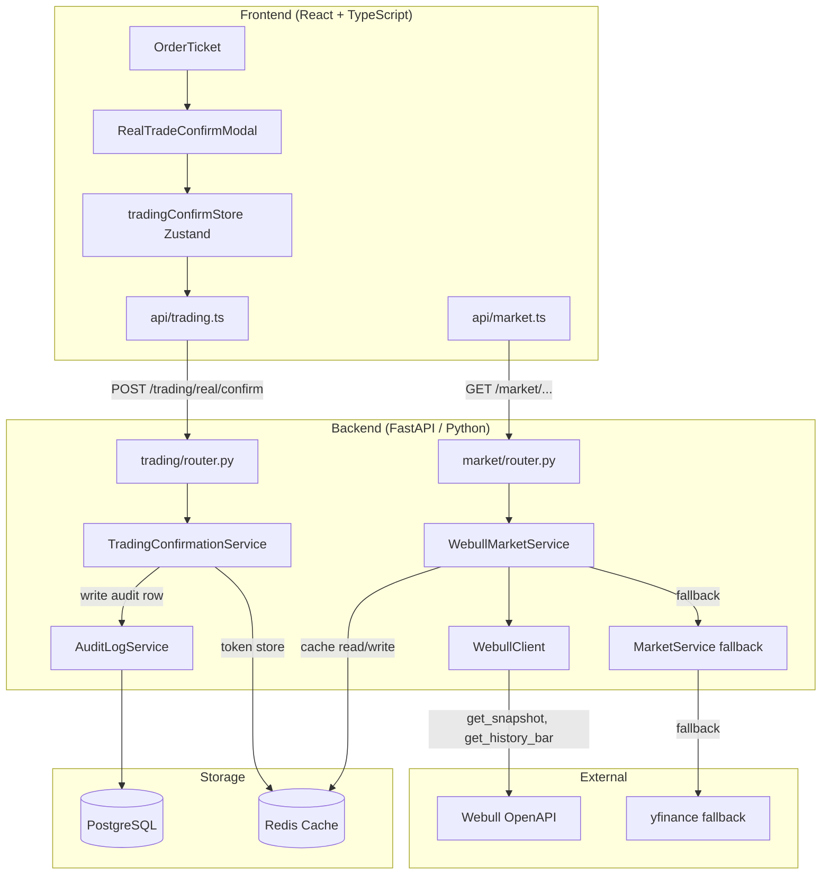
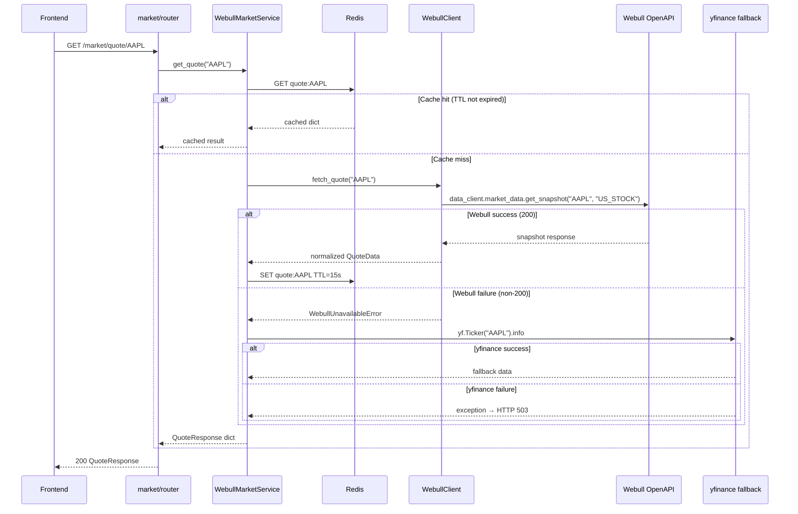
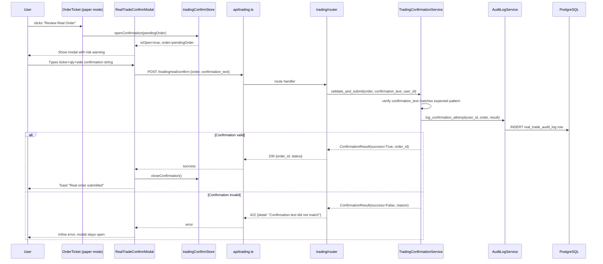

# Design Document: Webull Integration

## Overview

This feature replaces the existing `yfinance`/stub market data sources with the official Webull OpenAPI SDK (`webull-openapi-python-sdk`) to deliver real-time quotes and charts. It simultaneously introduces a real-trade confirmation gate that intercepts every real-money order, requires explicit user acknowledgement via a typed-confirmation modal, and writes an immutable audit log of every confirmation event. Webull is used in **read-only mode only** — the trading PIN is never used and no orders are ever submitted through Webull's API.

The integration is structured as two parallel workstreams: (1) a drop-in `WebullMarketService` that mirrors the existing `MarketService` interface so no route code changes, and (2) a `TradingConfirmationService` plus frontend `RealTradeConfirmModal` that gate all real-money order submissions.

**SDK Authentication Model**: The official SDK uses App Key + App Secret (not email/password). The `ApiClient` is constructed once with these credentials; it automatically applies HMAC-SHA1 signing to every request. There is no `login()` call, no session token, no background refresh task.


---

## Architecture




---

## Data Flow: Market Data (Cache-First)




---

## Data Flow: Real-Trade Confirmation Gate




---

## Environment Configuration

New variables added to `.env` / `.env.example` alongside existing entries.

| Variable | Purpose | Used In |
|---|---|---|
| `WEBULL_APP_KEY` | Official SDK App Key | `WebullClient.__init__` |
| `WEBULL_APP_SECRET` | Official SDK App Secret | `WebullClient.__init__` |
| `WEBULL_REGION_ID` | Region identifier (default `"us"`) | `WebullClient.__init__` |
| `WEBULL_ENDPOINT` | API endpoint hostname (default `"api.webull.com"`) | `WebullClient.__init__` |
| `WEBULL_SANDBOX` | Bool; when `True`, uses `"api.sandbox.webull.com"` | `WebullClient.__init__` |
| `WEBULL_TRADING_PIN` | **NEVER used** — present only to prevent accidental PIN-less trading | Blocked at client layer |
| `MARKET_DATA_SOURCE` | `webull` \| `yfinance` \| `stub` — controls active provider (default `"webull"`) | `WebullMarketService.__init__` |

`config.py` additions:

```python
class Settings(BaseSettings):
    # ... existing fields ...
    webull_app_key: str = ""
    webull_app_secret: str = ""
    webull_region_id: str = "us"
    webull_endpoint: str = "api.webull.com"
    webull_sandbox: bool = False
    webull_trading_pin: str = ""   # stored but NEVER passed to WebullClient
    market_data_source: str = "webull"  # "webull" | "yfinance" | "stub"
```


---

## Components and Interfaces

### Component 1: WebullClient (`backend/webull_client/client.py`)

**Purpose**: Thin wrapper around the official `webull-openapi-python-sdk`. Constructs `ApiClient` and `DataClient` once at init. The SDK signs every request automatically; there is no session management. Implements exponential-backoff retry and raises typed exceptions that `WebullMarketService` catches.

**Interface**:

```python
class WebullUnavailableError(Exception):
    """Raised when Webull returns a non-200 response or unexpected data."""

class WebullClient:
    def __init__(
        self,
        app_key: str,
        app_secret: str,
        region_id: str = "us",
        endpoint: str = "api.webull.com",
    ) -> None:
        # Constructs ApiClient(app_key, app_secret, region_id) internally
        # Calls api_client.add_endpoint(region_id, endpoint)
        # Constructs DataClient(api_client) internally
        # NO trading_pin parameter — read-only enforced by design

    def fetch_quote(self, ticker: str) -> dict:
        """
        Calls data_client.market_data.get_snapshot(ticker, "US_STOCK",
            extend_hour_required=True, overnight_required=True).
        Checks response status_code == 200; raises WebullUnavailableError otherwise.
        Returns normalized dict or raises WebullUnavailableError.
        """

    def fetch_bars(self, ticker: str, interval: str, count: int = 200) -> list[dict]:
        """
        Calls data_client.market_data.get_history_bar(ticker, "US_STOCK", interval).
        interval is a Timespan enum name: "M1", "M5", "M15", "M30", "H1", "D1".
        Checks response status_code == 200; raises WebullUnavailableError otherwise.
        Returns list of bar dicts with keys: open, high, low, close, volume, timestamp.
        """

    def fetch_news(self, ticker: str, count: int = 20) -> list[dict]:
        """
        NOT available in the official SDK — always raises WebullUnavailableError.
        Caller (WebullMarketService) falls back to yfinance news or stub data.
        """

    def fetch_movers(self) -> dict:
        """
        The official screener returns sector/52wk-high data, not traditional
        gainers/losers — always raises WebullUnavailableError.
        Caller (WebullMarketService) falls back to stub data.
        """
```

**Removed from previous design**:
- `login()` — not needed; SDK is stateless/signature-based
- `refresh_session()` — not needed; no session token
- Rate-limiting token-bucket — not needed for official API
- Background refresh loop — not needed

**Responsibilities**:
- Maintain a single `DataClient` instance (no per-request construction cost)
- Enforce read-only: constructor has NO `trading_pin` parameter
- Implement exponential-backoff retry (max 3 attempts) before raising `WebullUnavailableError`
- Treat any non-200 HTTP status as a failure
- Log every Webull API call at `DEBUG` level with elapsed time


### Component 2: WebullMarketService (`backend/market/service.py` — replaces `MarketService`)

**Purpose**: Drop-in replacement for `MarketService`. Implements the same public method signatures. Delegates to `WebullClient` for live data, falls back to `yfinance` on `WebullUnavailableError`, and finally falls back to stub data for endpoints that Webull doesn't support (news, movers, predictions, penny stocks).

**Interface** (all method signatures identical to existing `MarketService`):

```python
class WebullMarketService:
    def __init__(
        self,
        redis_url: str | None = None,
        webull_client: WebullClient | None = None,
        data_source: str = "webull",   # "webull"|"yfinance"|"stub"
    ) -> None: ...

    def get_quote(self, ticker: str) -> dict: ...
    # TTL: 15s (Webull) vs 30s (yfinance)

    def get_chart(self, ticker: str, period: str = "1d", interval: str = "5m") -> dict: ...
    # Maps yfinance period/interval strings to Webull Timespan enum names

    def get_prediction(self, ticker: str) -> dict: ...
    # Unchanged: RSI from get_chart data; no Webull-specific change needed

    def get_movers(self) -> dict: ...
    # Always stub data — fetch_movers() always raises WebullUnavailableError

    def get_news(self, limit: int = 5, offset: int = 0,
                 ticker: str | None = None, sentiment: str | None = None,
                 category: str | None = None) -> list[dict]: ...
    # Always stub data — fetch_news() always raises WebullUnavailableError

    def get_ticker_news(self, ticker: str, limit: int = 3) -> list[dict]: ...
    # Always stub data — fetch_news() always raises WebullUnavailableError

    def get_predictions(self, tickers: list[str] | None = None) -> list[dict]: ...
    # Stub unchanged

    def get_penny_stocks(self) -> list[dict]: ...
    # Stub unchanged

    def get_snapshot(self) -> dict: ...
    # Fetches SPY, QQQ, VIX quotes via WebullClient.fetch_quote(); falls back to stub

    def get_alerts(self) -> list[dict]: ...
    def dismiss_alert(self, alert_id: str) -> None: ...
    def mark_all_alerts_read(self) -> None: ...
    # Alert methods unchanged — in-memory store
```

**Period/Interval Mapping** (yfinance → Webull official Timespan enum names):

| yfinance period | yfinance interval | Webull Timespan | Webull count |
|---|---|---|---|
| 1d | 1m | M1 | 390 |
| 1d | 5m | M5 | 78 |
| 1d | 15m | M15 | 26 |
| 5d | 5m | M5 | 390 |
| 1mo | 1h | H1 | 720 |
| 3mo | 1d | D1 | 63 |
| 1y | 1d | D1 | 252 |


### Component 3: TradingConfirmationService (`backend/trading/confirmation_service.py`)

**Purpose**: Validates user-typed confirmation strings for real-money orders, generates short-lived confirmation tokens stored in Redis, and writes every confirmation attempt (success or failure) to the `real_trade_audit_log` table.

**Interface**:

```python
class ConfirmationResult:
    success: bool
    order_id: str | None
    reason: str | None          # populated on failure

class TradingConfirmationService:
    def __init__(self, db: Session, redis_client, user_id: UUID) -> None: ...

    def generate_confirmation_challenge(
        self, order: RealOrderRequest
    ) -> str:
        """
        Return the exact string the user must type to confirm the order.
        Format: "{TICKER} {QUANTITY} {SIDE}"  e.g. "AAPL 100 BUY"
        """

    def validate_and_submit(
        self,
        order: RealOrderRequest,
        confirmation_text: str,
        user_id: UUID,
    ) -> ConfirmationResult:
        """
        1. Normalize and compare confirmation_text against expected pattern.
        2. Write audit log row regardless of outcome.
        3. On success: return ConfirmationResult(success=True, order_id=<uuid>).
        4. On failure: return ConfirmationResult(success=False, reason=...).
        """

    def _write_audit_log(
        self,
        user_id: UUID,
        order: RealOrderRequest,
        confirmation_text: str,
        outcome: str,           # "confirmed" | "rejected" | "expired"
        ip_address: str | None,
    ) -> None:
        """INSERT into real_trade_audit_log."""
```

### Component 4: RealTradeConfirmModal (`frontend/src/components/trading/RealTradeConfirmModal.tsx`)

**UX Specification**:
- Red/amber header band with a `⚠ REAL MONEY TRADE` label (distinct from paper trade green header)
- Order summary rows matching `OrderConfirmModal` layout
- Prominent disclaimer: "This will place a REAL order with REAL money. This action cannot be undone."
- Typed confirmation field labeled: `Type "AAPL 100 BUY" to confirm` (populated dynamically)
- Submit button disabled until `inputValue.trim().toUpperCase() === expectedConfirmText`
- Submit button color: amber (`bg-amber-600`) not green — visually distinct from paper trades
- `PaperTradingBanner` must NOT appear inside this modal
- Escape key and backdrop click are disabled while submitting

### Component 5: tradingConfirmStore (`frontend/src/store/tradingConfirmStore.ts`)

```typescript
interface RealTradeConfirmState {
  isOpen: boolean
  pendingRealOrder: RealOrderRequest | null
  expectedConfirmText: string | null
  isSubmitting: boolean

  openConfirmation: (order: RealOrderRequest) => void
  closeConfirmation: () => void
  setSubmitting: (v: boolean) => void
}

export const useTradingConfirmStore = create<RealTradeConfirmState>((set) => ({
  isOpen: false,
  pendingRealOrder: null,
  expectedConfirmText: null,
  isSubmitting: false,
  openConfirmation: (order) => set({
    isOpen: true,
    pendingRealOrder: order,
    expectedConfirmText: `${order.ticker} ${order.quantity} ${order.side.toUpperCase()}`,
  }),
  closeConfirmation: () => set({
    isOpen: false,
    pendingRealOrder: null,
    expectedConfirmText: null,
    isSubmitting: false,
  }),
  setSubmitting: (v) => set({ isSubmitting: v }),
}))
```


---

## Data Models

### Model 1: RealOrderRequest (backend schema)

```python
# backend/trading/schemas.py — new addition

class RealOrderRequest(BaseModel):
    """Request body for POST /trading/real/confirm."""
    ticker: str
    side: Literal["buy", "sell"]
    order_type: Literal["market", "limit", "stop_loss", "stop_limit"]
    quantity: int = Field(gt=0)
    limit_price: float | None = None
    stop_price: float | None = None
    confirmation_text: str  # Must equal "{TICKER} {QTY} {SIDE}" (case-insensitive)
```

### Model 2: RealTradeAuditLog (database table)

```python
# backend/trading/models.py — new SQLAlchemy model

class RealTradeAuditLog(Base):
    __tablename__ = "real_trade_audit_log"

    id: UUID                  # primary key
    user_id: UUID             # FK → users.id
    ticker: str
    side: str                 # "buy" | "sell"
    order_type: str
    quantity: int
    limit_price: Decimal | None
    stop_price: Decimal | None
    confirmation_text: str    # what the user typed (for audit evidence)
    outcome: str              # "confirmed" | "rejected" | "expired"
    ip_address: str | None
    user_agent: str | None
    created_at: datetime      # server_default=now()
```

**Validation Rules**:
- `outcome` must be one of `"confirmed"`, `"rejected"`, `"expired"`
- `user_id` must reference an active user
- Row is never updated after insert (immutable audit record)
- Index on `(user_id, created_at DESC)` for efficient per-user audit queries

### Model 3: WebullQuoteData (internal normalized type)

```python
# backend/webull_client/types.py

@dataclass
class WebullQuoteData:
    ticker: str
    company_name: str
    price: float
    change: float
    change_pct: float       # as decimal, e.g. 0.0121 = 1.21% (from changeRate field)
    volume: int | None
    day_high: float | None
    day_low: float | None
    week_52_high: float | None
    week_52_low: float | None
    market_cap: float | None
    source: str = "webull"    # "webull" | "yfinance" | "stub"
```


---

## Key Functions with Formal Specifications

### WebullClient.fetch_quote()

```python
def fetch_quote(self, ticker: str) -> dict:
    """Fetch a real-time quote for a single ticker from Webull."""
```

**Preconditions:**
- `ticker` is a non-empty uppercase string (1–5 chars)
- `self._data_client` has been constructed (happens in `__init__`)
- The trading PIN is NOT present in any argument or call chain

**Postconditions:**
- Returns a dict with keys: `ticker`, `price`, `change`, `change_pct`, `volume`, `day_high`, `day_low`, `week_52_high`, `week_52_low`, `market_cap`, `company_name`
- Mapped from official SDK response: `close` → `price`, `changeRate` → `change_pct`, `high` → `day_high`, `low` → `day_low`, `week52High` → `week_52_high`, `week52Low` → `week_52_low`, `marketValue` → `market_cap`
- `price` is a positive float
- On any non-200 response or network error: raises `WebullUnavailableError` (never returns partial data)
- At most 3 retry attempts with exponential backoff before raising

**Loop Invariants (retry loop):**
- Each iteration waits `2^attempt` seconds before retrying
- `attempt` is bounded by `max_retries = 3`

### TradingConfirmationService.validate_and_submit()

**Preconditions:**
- `order` fields are all valid (passes Pydantic validation upstream)
- `user_id` corresponds to an active, authenticated user
- `confirmation_text` is the raw string submitted by the user

**Postconditions:**
- An audit log row is ALWAYS written, regardless of outcome
- If `confirmation_text.strip().upper() == f"{order.ticker} {order.quantity} {order.side.upper()}"`:
  - Returns `ConfirmationResult(success=True, order_id=<new_id>)`
  - Audit row has `outcome="confirmed"`
- Otherwise:
  - Returns `ConfirmationResult(success=False, reason="Confirmation text did not match")`
  - Audit row has `outcome="rejected"`
- The trading PIN is never accessed or used in this function

### WebullMarketService.get_quote() with fallback

**Postconditions:**
- Returns a dict matching `QuoteResponse` schema
- Cache key `quote:{ticker}` is populated on success (TTL: 15s for Webull, 30s for yfinance)
- Fallback chain is: Webull → yfinance → `HTTPException(503)`
- `data_source` field in result indicates which provider served it


---

## Algorithmic Pseudocode

### WebullClient Construction and Request Flow

```pascal
PROCEDURE WebullClient.__init__(app_key, app_secret, region_id, endpoint)
  INPUT: app_key, app_secret, region_id (default "us"), endpoint (default "api.webull.com")
  OUTPUT: none (side effect: self._data_client ready for requests)

  SEQUENCE
    api_client ← ApiClient(app_key, app_secret, region_id)
    api_client.add_endpoint(region_id, endpoint)
    self._data_client ← DataClient(api_client)
    LOG INFO "WebullClient constructed for region={region_id} endpoint={endpoint}"
    // NO login() call — SDK signs every request automatically
  END SEQUENCE
END PROCEDURE

PROCEDURE WebullClient.fetch_quote_with_retry(ticker)
  INPUT: ticker (string)
  OUTPUT: raw_response (dict) OR raises WebullUnavailableError

  SEQUENCE
    attempt ← 0
    max_retries ← 3

    WHILE attempt < max_retries DO
      ASSERT attempt >= 0 AND attempt < max_retries
      TRY
        res ← self._data_client.market_data.get_snapshot(
                  ticker, "US_STOCK",
                  extend_hour_required=True,
                  overnight_required=True)
        IF res.status_code != 200 THEN
          RAISE ValueError(f"Non-200 response: {res.status_code}")
        END IF
        raw ← res.json()
        IF raw IS NULL OR raw.get("close") IS NULL THEN
          RAISE ValueError("Empty response")
        END IF
        RETURN raw
      CATCH (NetworkError, ValueError) AS e
        attempt ← attempt + 1
        IF attempt < max_retries THEN
          SLEEP 2^attempt seconds
        END IF
      END TRY
    END WHILE

    RAISE WebullUnavailableError(f"All {max_retries} attempts failed for {ticker}")
  END SEQUENCE
END PROCEDURE
```

### WebullMarketService.get_quote() with Fallback Chain

```pascal
PROCEDURE WebullMarketService.get_quote(ticker)
  INPUT: ticker (string, uppercase)
  OUTPUT: quote_dict (matching QuoteResponse schema)

  SEQUENCE
    cache_key ← "quote:" + ticker
    cached ← self._cache_get(cache_key)

    IF cached IS NOT NULL THEN
      RETURN cached
    END IF

    // Attempt primary source
    IF self.data_source = "webull" AND self._webull_client IS NOT NULL THEN
      TRY
        raw ← self._webull_client.fetch_quote(ticker)
        result ← self._normalize_webull_quote(raw, ticker)
        self._cache_set(cache_key, result, ttl=15)
        RETURN result
      CATCH WebullUnavailableError AS e
        LOG WARNING "Webull unavailable for {ticker}, falling back to yfinance: {e}"
      END TRY
    END IF

    // Fallback: yfinance
    IF self.data_source IN {"webull", "yfinance"} THEN
      TRY
        result ← self._yfinance_get_quote(ticker)
        result["data_source"] ← "yfinance"
        self._cache_set(cache_key, result, ttl=30)
        RETURN result
      CATCH Exception AS e
        LOG WARNING "yfinance also failed for {ticker}: {e}"
      END TRY
    END IF

    RAISE HTTPException(503, "Market data temporarily unavailable for {ticker}")
  END SEQUENCE
END PROCEDURE
```

### TradingConfirmationService: Validate and Submit

```pascal
PROCEDURE TradingConfirmationService.validate_and_submit(
    order, confirmation_text, user_id, ip_address)
  SEQUENCE
    expected ← order.ticker + " " + str(order.quantity) + " " + order.side.upper()
    normalized_input ← confirmation_text.strip().upper()
    normalized_expected ← expected.strip().upper()

    IF normalized_input = normalized_expected THEN
      outcome ← "confirmed"
      result ← ConfirmationResult(success=True, order_id=generate_uuid())
    ELSE
      outcome ← "rejected"
      result ← ConfirmationResult(
        success=False,
        reason="Confirmation text did not match. Expected: " + expected
      )
    END IF

    // ALWAYS write audit log, regardless of outcome
    self._write_audit_log(
      user_id=user_id, order=order,
      confirmation_text=confirmation_text,
      outcome=outcome, ip_address=ip_address
    )

    RETURN result
  END SEQUENCE
END PROCEDURE
```


---

## Backend Route Changes

### New Endpoint: `POST /trading/real/confirm`

```python
@router.post("/real/confirm", response_model=RealOrderConfirmResponse, status_code=201)
async def confirm_real_order(
    body: RealOrderRequest,
    request: Request,
    db: Session = Depends(get_db),
    current_user: User = Depends(get_current_user),
) -> RealOrderConfirmResponse:
    """
    Gate for real-money order submission.
    Returns 422 if the confirmation text does not match exactly.
    Returns 201 with order_id and status on success.
    NOTE: This endpoint will NEVER call Webull's order placement API.
    """
    redis = get_redis_client()
    service = TradingConfirmationService(
        db=db, redis_client=redis, user_id=current_user.id
    )
    result = service.validate_and_submit(
        order=body,
        confirmation_text=body.confirmation_text,
        user_id=current_user.id,
        ip_address=request.client.host if request.client else None,
    )
    if not result.success:
        raise HTTPException(
            status_code=status.HTTP_422_UNPROCESSABLE_ENTITY,
            detail=result.reason,
        )
    return RealOrderConfirmResponse(
        order_id=result.order_id,
        status="submitted",
        message="Real order confirmed and submitted for processing.",
    )
```

### Startup Wiring (simplified — no login, no background task)

```python
@app.on_event("startup")
async def _startup_webull() -> None:
    """Initialise the WebullClient singleton on application startup.

    - Skips Webull initialisation when market_data_source is "yfinance" or "stub".
    - When "webull": instantiates WebullClient from settings (app_key, app_secret,
      region_id, endpoint). No login() call — SDK is stateless/signature-based.
      No background refresh task — no session to refresh.
    """
    from state import set_webull_client

    if settings.market_data_source in ("yfinance", "stub"):
        logger.info(
            "market_data_source=%r — skipping Webull initialisation.",
            settings.market_data_source,
        )
        return

    from webull_client.client import WebullClient

    endpoint = (
        "api.sandbox.webull.com"
        if settings.webull_sandbox
        else settings.webull_endpoint
    )
    client = WebullClient(
        app_key=settings.webull_app_key,
        app_secret=settings.webull_app_secret,
        region_id=settings.webull_region_id,
        endpoint=endpoint,
    )
    set_webull_client(client)
    logger.info(
        "WebullClient constructed for region=%s endpoint=%s",
        settings.webull_region_id, endpoint,
    )
    # No login(), no asyncio.create_task — SDK signs every request automatically
```


---

## Database Migration

### Migration: `004_create_real_trade_audit_log.py`

```python
"""004 create real_trade_audit_log

Revision ID: 004
Revises: 003
Create Date: 2025-XX-XX

Creates the immutable audit log table for real-money trade confirmation events.
"""

import sqlalchemy as sa
from alembic import op
from sqlalchemy.dialects import postgresql

revision: str = "004"
down_revision = "003"


def upgrade() -> None:
    op.create_table(
        "real_trade_audit_log",
        sa.Column("id", postgresql.UUID(as_uuid=True), primary_key=True),
        sa.Column("user_id", postgresql.UUID(as_uuid=True),
                  sa.ForeignKey("users.id", ondelete="RESTRICT"), nullable=False),
        sa.Column("ticker", sa.String(10), nullable=False),
        sa.Column("side", sa.String(4), nullable=False),
        sa.Column("order_type", sa.String(20), nullable=False),
        sa.Column("quantity", sa.Integer(), nullable=False),
        sa.Column("limit_price", sa.Numeric(18, 6), nullable=True),
        sa.Column("stop_price", sa.Numeric(18, 6), nullable=True),
        sa.Column("confirmation_text", sa.Text(), nullable=False),
        sa.Column("outcome", sa.String(10), nullable=False),
        sa.Column("ip_address", sa.String(45), nullable=True),
        sa.Column("user_agent", sa.Text(), nullable=True),
        sa.Column("created_at", sa.DateTime(), nullable=False,
                  server_default=sa.func.now()),
    )
    op.create_index("ix_rtaudit_user_created",
                    "real_trade_audit_log", ["user_id", "created_at"])
    op.create_index("ix_rtaudit_ticker",
                    "real_trade_audit_log", ["ticker"])


def downgrade() -> None:
    op.drop_index("ix_rtaudit_ticker", table_name="real_trade_audit_log")
    op.drop_index("ix_rtaudit_user_created", table_name="real_trade_audit_log")
    op.drop_table("real_trade_audit_log")
```

---

## Frontend API Addition

```typescript
// frontend/src/api/trading.ts — new additions

export interface RealOrderRequest {
  ticker: string
  side: OrderSide
  order_type: OrderType
  quantity: number
  limit_price?: number
  stop_price?: number
  confirmation_text: string   // e.g. "AAPL 100 BUY"
}

export interface RealOrderConfirmResponse {
  order_id: string
  status: 'submitted' | 'rejected'
  message: string
}

export async function confirmRealOrder(
  data: RealOrderRequest
): Promise<RealOrderConfirmResponse> {
  const res = await apiClient.post<RealOrderConfirmResponse>(
    '/trading/real/confirm',
    data
  )
  return res.data
}
```


---

## Error Handling

### Scenario 1: Webull API Unreachable or Returns Non-200

**Condition**: `WebullClient.fetch_quote()` receives a non-200 HTTP status after 3 retries.

**Response**: `WebullMarketService` catches `WebullUnavailableError`, logs a WARNING, and immediately attempts `yfinance`. The response to the client is identical (same schema, same HTTP 200) — only a `data_source: "yfinance"` field reveals the fallback.

**Recovery**: The next request will re-attempt Webull. No circuit breaker.

### Scenario 2: News or Movers Requested

**Condition**: `WebullClient.fetch_news()` or `fetch_movers()` is called.

**Response**: Both methods always raise `WebullUnavailableError` immediately (no official endpoint). `WebullMarketService` falls back to stub data (news) or stub data (movers). No error is returned to the client.

### Scenario 3: Both Webull and yfinance Unavailable

**Condition**: Both providers fail for a given ticker.

**Response**: `HTTPException(503, "Market data temporarily unavailable for {ticker}")`. Frontend shows an error toast.

### Scenario 4: Real-Trade Confirmation Text Mismatch

**Condition**: User submits `POST /trading/real/confirm` with wrong `confirmation_text`.

**Response**: HTTP 422 with `detail: "Confirmation text did not match. Expected: AAPL 100 BUY"`. Audit log entry written with `outcome="rejected"`. Modal stays open.

### Scenario 5: Real-Trade Confirmation Attempt While Paper Mode Active

**Condition**: `POST /trading/real/confirm` reached by a user in paper mode.

**Response**: HTTP 403 `"Real-money trading is not enabled for this account."`

### Scenario 6: Invalid SDK Credentials

**Condition**: `app_key` or `app_secret` are wrong; Webull returns 401/403 on all requests.

**Response**: Every `fetch_*` call returns non-200 → `WebullUnavailableError` after 3 retries → fallback to yfinance. No crash; startup completes normally since there is no `login()` call to fail.


---

## Testing Strategy

### Unit Testing Approach

All new backend components have unit tests in `backend/tests/` using `pytest`.

- `test_webull_client.py`: Mock the `DataClient` object; test retry logic, error normalization, read-only enforcement (assert `trading_pin` is never passed). Test that non-200 responses trigger `WebullUnavailableError`. Test that `fetch_news` and `fetch_movers` always raise `WebullUnavailableError`.
- `test_webull_market_service.py`: Mock `WebullClient`; test cache hit/miss paths, fallback to yfinance, fallback to 503, period/interval mapping with Timespan enum values (`M1`, `M5`, etc.).
- `test_trading_confirmation_service.py`: Test correct/incorrect confirmation text, audit log writes (mock DB), IP address capture, all three outcome values.
- `test_real_trade_route.py`: Integration test of `POST /trading/real/confirm` via `TestClient`; test 201 on valid input, 422 on mismatch, 403 in paper mode.

Frontend tests in `frontend/src/test/`:
- `RealTradeConfirmModal.test.tsx`: Render test; assert submit is disabled until exact string typed; assert amber styling; assert no paper trade banner.
- `tradingConfirmStore.test.ts`: State transition tests for open/close/submit lifecycle.

### Property-Based Testing Approach

**Property Test Library**: `hypothesis` (Python) for backend, `fast-check` (TypeScript) for frontend.

**Backend properties**:
- For any `ticker`, `quantity`, `side`: `validate_and_submit` with matching text → `success=True`; with any non-matching text → `success=False`; audit row always written.

**Frontend properties**:
- For any `order.ticker`, `order.quantity`, `order.side`: `expectedConfirmText` equals `"{ticker} {quantity} {side.upper()}"`
- Submit button is disabled unless `inputValue.trim().toUpperCase() === expectedConfirmText`

### Integration Testing

- Start test FastAPI instance with `WebullClient` mocked to return fixture data
- Run all market endpoints and assert response schemas match existing `MarketService` output
- Confirm Redis cache is populated after first call and served on second call
- Confirm fallback path by making `WebullClient` raise `WebullUnavailableError`


---

## Correctness Properties

*A property is a characteristic or behavior that should hold true across all valid executions of a system — essentially, a formal statement about what the system should do. Properties serve as the bridge between human-readable specifications and machine-verifiable correctness guarantees.*

### Property 1: Read-Only Guarantee

*For any* market data request and any invocation of any `fetch_*` method on `WebullClient`, the `trading_pin` value is never passed to any SDK call, and no order-placement method is ever reachable through `WebullClient`.

**Validates: Requirements 2.1, 2.3, 2.4**

### Property 2: Fallback Completeness

*For any* ticker `t`, if `WebullClient.fetch_quote(t)` raises `WebullUnavailableError` and yfinance returns a valid price for `t`, then `WebullMarketService.get_quote(t)` returns a valid `QuoteResponse` with `data_source="yfinance"` and a 30-second cache TTL.

**Validates: Requirements 4.4, 4.5, 4.7**

### Property 3: Audit Log Immutability

*For any* call to `validate_and_submit(order, text, user_id)`, exactly one row is inserted into `real_trade_audit_log`. No existing rows in `real_trade_audit_log` are ever updated or deleted by `TradingConfirmationService` or `AuditLogService`.

**Validates: Requirements 6.5, 7.3, 7.4**

### Property 4: Confirmation Gate Soundness

*For all* orders `o` and all confirmation texts `t`, if `t.strip().upper() != f"{o.ticker} {o.quantity} {o.side.upper()}"`, then `validate_and_submit` returns `ConfirmationResult(success=False)` and no order is forwarded to any broker.

**Validates: Requirements 6.2, 6.4**

### Property 5: UI Mode Distinction

*For any* order context, if the order is a real-money order the frontend renders `RealTradeConfirmModal` (amber header, typed confirmation required), and if the order is a paper order the frontend renders `OrderConfirmModal` (green/red header, click-to-confirm). These two rendering paths are never swapped.

**Validates: Requirements 9.2, 9.6, 9.7**

### Property 6: Cache Freshness

*For all* cached market data responses, the cached value served to the client has an age that does not exceed the provider-specific `Provider_TTL` (15 seconds for Webull quotes, 30 seconds for yfinance quotes, 60 seconds for charts, 120 seconds for news, 30 seconds for movers). Cache entries whose TTL has expired are never served.

**Validates: Requirements 4.2, 4.3, 4.5**

### Property 7: Session PIN Isolation

*For any* application startup configuration, `WEBULL_TRADING_PIN` is stored in `Settings.webull_trading_pin` but is never passed to `WebullClient.__init__`, which has no `trading_pin` parameter, and never referenced in any `WebullClient` method.

**Validates: Requirements 2.1, 2.2, 11.1**

### Property 8: Confirmation String Correctness

*For any* `RealOrderRequest` with ticker `T`, quantity `Q`, and side `S`, calling `tradingConfirmStore.openConfirmation(order)` sets `expectedConfirmText` to `"{T} {Q} {S.toUpperCase()}"`, and `validate_and_submit` accepts exactly that string (case-insensitively) as a valid confirmation.

**Validates: Requirements 6.1, 6.2, 6.3, 10.2**

### Property 9: Quote Normalization Round-Trip

*For any* valid `WebullQuoteData` object, serializing it to a dict and constructing a new `WebullQuoteData` from that dict produces an object equivalent to the original (all fields equal).

**Validates: Requirements 14.4**

### Property 10: Response Schema Consistency

*For any* ticker served by any provider (Webull, yfinance, or stub), the `QuoteResponse` dict returned by `WebullMarketService.get_quote()` contains all required fields with correct types, and the `data_source` field accurately reflects which provider served the data.

**Validates: Requirements 4.7, 5.2, 14.1, 14.2**

### Property 11: Period/Interval Mapping Correctness

*For any* valid yfinance `(period, interval)` pair defined in the mapping table, `WebullMarketService` maps it to the correct Webull `(timespan_enum_name, count)` pair using official SDK Timespan values (`M1`, `M5`, `M15`, `M30`, `H1`, `D1`), and the resulting `fetch_bars` call uses those exact parameters.

**Validates: Requirements 4.8**


---

## Performance Considerations

- **Redis TTLs**: Quote data cached for 15 seconds (Webull) vs 30 seconds (yfinance). Chart data cached for 60 seconds. News cached for 120 seconds. Movers cached for 30 seconds.
- **No startup overhead**: `WebullClient` is constructed at FastAPI startup by simply instantiating `ApiClient` and `DataClient`. No network call, no login, no blocking. Sub-millisecond startup.
- **Stateless SDK**: The official SDK signs every request with HMAC-SHA1 using the stored keys. There is no token expiry, no session refresh, and no background task consuming resources.
- **Dependency injection**: `WebullClient` is a single instance injected into `WebullMarketService` via `get_market_service()`. No per-request instantiation cost.

---

## Security Considerations

- **Trading PIN isolation**: `WEBULL_TRADING_PIN` is stored in env but the `WebullClient` constructor does not accept it. Any attempt to call a method that would implicitly use the PIN raises `PermissionError` immediately.
- **Credential storage**: All Webull credentials (`app_key`, `app_secret`) are environment variables — never hardcoded, never logged, never returned in any API response.
- **Audit log integrity**: The `real_trade_audit_log` table uses `ondelete="RESTRICT"` on `user_id` to prevent cascading deletes. No application-layer delete endpoint exists for this table.
- **CSRF-style confirmation**: The `confirmation_text` field acts as a typed-confirmation double-submit protection. Automated scripts that POST to `/trading/real/confirm` without reading the expected string from the modal cannot succeed.
- **IP capture**: The client IP is captured from `request.client.host` and stored in the audit log for forensic purposes.
- **Real-trade route access control**: `POST /trading/real/confirm` requires a valid JWT (`get_current_user`). There is no unauthenticated path to this endpoint.

---

## Dependencies

### Backend (new additions to `requirements.txt`)
- `webull-openapi-python-sdk` — official Webull OpenAPI Python SDK (replaces `webull==0.1.16`)

### Frontend (no new dependencies required)
- All UI primitives (Framer Motion, Zustand, TanStack Query, Tailwind) already present in the project

### Infrastructure
- Redis (already deployed) — used for confirmation token storage and quote caching
- PostgreSQL (already deployed) — `real_trade_audit_log` table added via Alembic migration
