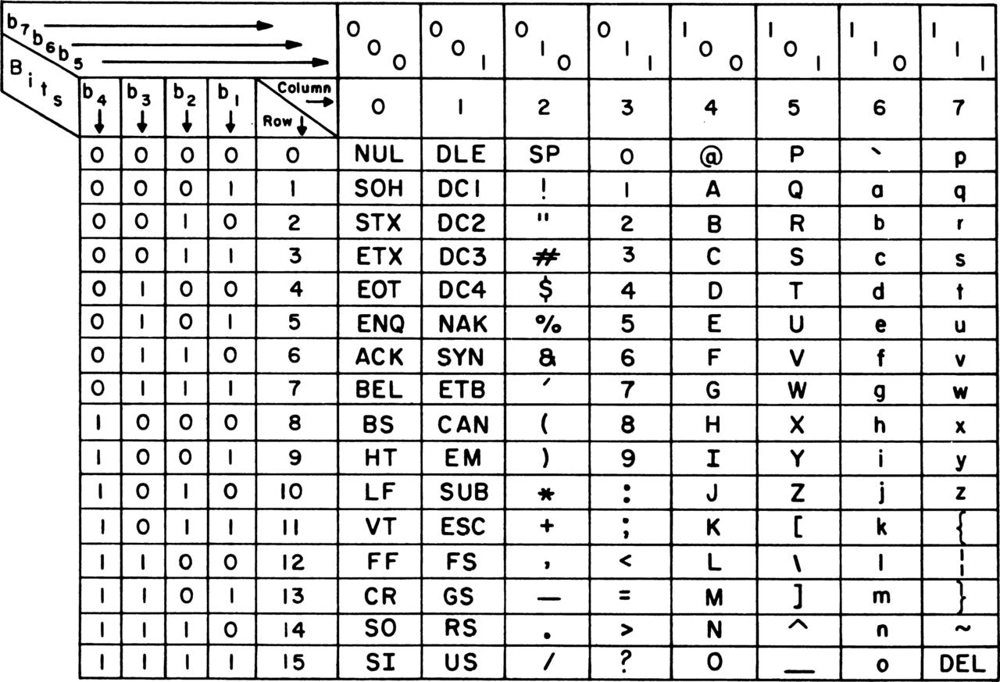

Character Encoding :
 Character encoding is a system that pairs characters (letters, numbers, symbols) with specific numeric values that computers can understand and process. Think of it as a translation system between human-readable text and computer-readable numbers

ASCII (American Standard Code for Information) :



### Printable Characters :

| [Binary](https://en.wikipedia.org/wiki/Binary_numeral_system "Binary numeral system") | [Oct](https://en.wikipedia.org/wiki/Octal "Octal") | [Dec](https://en.wikipedia.org/wiki/Decimal "Decimal") | [Hex](https://en.wikipedia.org/wiki/Hexadecimal "Hexadecimal") | Glyph                                                                          |
| ------------------------------------------------------------------------------- | -------------------------------------------- | ------------------------------------------------ | -------------------------------------------------------- | ------------------------------------------------------------------------------ |
| 010 0000                                                                        | 040                                          | 32                                               | 20                                                       | [space](https://en.wikipedia.org/wiki/Space_(punctuation)) "Space (punctuation)") |
| 010 0001                                                                        | 041                                          | 33                                               | 21                                                       | [!](https://en.wikipedia.org/wiki/Exclamation_mark "Exclamation mark")               |
| 010 0010                                                                        | 042                                          | 34                                               | 22                                                       | [&#34;](https://en.wikipedia.org/wiki/Quotation_mark "Quotation mark")               |
| 010 0011                                                                        | 043                                          | 35                                               | 23                                                       | [#](https://en.wikipedia.org/wiki/Number_sign "Number sign")                         |
| 010 0100                                                                        | 044                                          | 36                                               | 24                                                       | [$](https://en.wikipedia.org/wiki/Dollar_sign "Dollar sign")                         |
| 010 0101                                                                        | 045                                          | 37                                               | 25                                                       | [%](https://en.wikipedia.org/wiki/Percent_sign "Percent sign")                       |
| 010 0110                                                                        | 046                                          | 38                                               | 26                                                       | [&amp;](https://en.wikipedia.org/wiki/Ampersand "Ampersand")                         |
| 010 0111                                                                        | 047                                          | 39                                               | 27                                                       | [&#39;](https://en.wikipedia.org/wiki/Apostrophe "Apostrophe")                       |
| 010 1000                                                                        | 050                                          | 40                                               | 28                                                       | [(](https://en.wikipedia.org/wiki/Left_parenthesis "Left parenthesis")               |
| 010 1001                                                                        | 051                                          | 41                                               | 29                                                       | [)](https://en.wikipedia.org/wiki/Right_parenthesis "Right parenthesis")             |
| 010 1010                                                                        | 052                                          | 42                                               | 2A                                                       | [*](https://en.wikipedia.org/wiki/Asterisk "Asterisk")                               |
| 010 1011                                                                        | 053                                          | 43                                               | 2B                                                       | [+](https://en.wikipedia.org/wiki/Plus_sign "Plus sign")                             |
| 010 1100                                                                        | 054                                          | 44                                               | 2C                                                       | [,](https://en.wikipedia.org/wiki/Comma "Comma")                                     |
| 010 1101                                                                        | 055                                          | 45                                               | 2D                                                       | [-](https://en.wikipedia.org/wiki/Hyphen-minus "Hyphen-minus")                       |
| 010 1110                                                                        | 056                                          | 46                                               | 2E                                                       | [.](https://en.wikipedia.org/wiki/Full_stop "Full stop")                             |
| 010 1111                                                                        | 057                                          | 47                                               | 2F                                                       | [/](https://en.wikipedia.org/wiki/Slash_(punctuation)) "Slash (punctuation)")     |
| 011 0000                                                                        | 060                                          | 48                                               | 30                                                       | [0](https://en.wikipedia.org/wiki/0_(number)) "0 (number)")                       |
| 011 0001                                                                        | 061                                          | 49                                               | 31                                                       | [1](https://en.wikipedia.org/wiki/1_(number)) "1 (number)")                       |
| 011 0010                                                                        | 062                                          | 50                                               | 32                                                       | [2](https://en.wikipedia.org/wiki/2_(number)) "2 (number)")                       |
| 011 0011                                                                        | 063                                          | 51                                               | 33                                                       | [3](https://en.wikipedia.org/wiki/3_(number)) "3 (number)")                       |
| 011 0100                                                                        | 064                                          | 52                                               | 34                                                       | [4](https://en.wikipedia.org/wiki/4_(number)) "4 (number)")                       |
| 011 0101                                                                        | 065                                          | 53                                               | 35                                                       | [5](https://en.wikipedia.org/wiki/5_(number)) "5 (number)")                       |
| 011 0110                                                                        | 066                                          | 54                                               | 36                                                       | [6](https://en.wikipedia.org/wiki/6_(number)) "6 (number)")                       |
| 011 0111                                                                        | 067                                          | 55                                               | 37                                                       | [7](https://en.wikipedia.org/wiki/7_(number)) "7 (number)")                       |
| 011 1000                                                                        | 070                                          | 56                                               | 38                                                       | [8](https://en.wikipedia.org/wiki/8_(number)) "8 (number)")                       |
| 011 1001                                                                        | 071                                          | 57                                               | 39                                                       | [9](https://en.wikipedia.org/wiki/9_(number)) "9 (number)")                       |
| 011 1010                                                                        | 072                                          | 58                                               | 3A                                                       | [:](https://en.wikipedia.org/wiki/Colon_(punctuation)) "Colon (punctuation)")     |
| 011 1011                                                                        | 073                                          | 59                                               | 3B                                                       | [;](https://en.wikipedia.org/wiki/Semicolon "Semicolon")                             |
| 011 1100                                                                        | 074                                          | 60                                               | 3C                                                       | [&lt;](https://en.wikipedia.org/wiki/Less-than_sign "Less-than sign")                |
| 011 1101                                                                        | 075                                          | 61                                               | 3D                                                       | [=](https://en.wikipedia.org/wiki/Equals_sign "Equals sign")                         |
| 011 1110                                                                        | 076                                          | 62                                               | 3E                                                       | [&gt;](https://en.wikipedia.org/wiki/Greater-than_sign "Greater-than sign")          |
| 011 1111                                                                        | 077                                          | 63                                               | 3F                                                       | [?](https://en.wikipedia.org/wiki/Question_mark "Question mark")                     |
| 100 0000                                                                        | 100                                          | 64                                               | 40                                                       | [@](https://en.wikipedia.org/wiki/At_sign "At sign")                                 |
| 100 0001                                                                        | 101                                          | 65                                               | 41                                                       | [A](https://en.wikipedia.org/wiki/A "A")                                             |
| 100 0010                                                                        | 102                                          | 66                                               | 42                                                       | [B](https://en.wikipedia.org/wiki/B "B")                                             |
| 100 0011                                                                        | 103                                          | 67                                               | 43                                                       | [C](https://en.wikipedia.org/wiki/C "C")                                             |
| 100 0100                                                                        | 104                                          | 68                                               | 44                                                       | [D](https://en.wikipedia.org/wiki/D "D")                                             |
| 100 0101                                                                        | 105                                          | 69                                               | 45                                                       | [E](https://en.wikipedia.org/wiki/E "E")                                             |
| 100 0110                                                                        | 106                                          | 70                                               | 46                                                       | [F](https://en.wikipedia.org/wiki/F "F")                                             |
| 100 0111                                                                        | 107                                          | 71                                               | 47                                                       | [G](https://en.wikipedia.org/wiki/G "G")                                             |
| 100 1000                                                                        | 110                                          | 72                                               | 48                                                       | [H](https://en.wikipedia.org/wiki/H "H")                                             |
| 100 1001                                                                        | 111                                          | 73                                               | 49                                                       | [I](https://en.wikipedia.org/wiki/I "I")                                             |
| 100 1010                                                                        | 112                                          | 74                                               | 4A                                                       | [J](https://en.wikipedia.org/wiki/J "J")                                             |
| 100 1011                                                                        | 113                                          | 75                                               | 4B                                                       | [K](https://en.wikipedia.org/wiki/K "K")                                             |
| 100 1100                                                                        | 114                                          | 76                                               | 4C                                                       | [L](https://en.wikipedia.org/wiki/L "L")                                             |
| 100 1101                                                                        | 115                                          | 77                                               | 4D                                                       | [M](https://en.wikipedia.org/wiki/M "M")                                             |
| 100 1110                                                                        | 116                                          | 78                                               | 4E                                                       | [N](https://en.wikipedia.org/wiki/N "N")                                             |
| 100 1111                                                                        | 117                                          | 79                                               | 4F                                                       | [O](https://en.wikipedia.org/wiki/O "O")                                             |
| 101 0000                                                                        | 120                                          | 80                                               | 50                                                       | [P](https://en.wikipedia.org/wiki/P "P")                                             |
| 101 0001                                                                        | 121                                          | 81                                               | 51                                                       | [Q](https://en.wikipedia.org/wiki/Q "Q")                                             |
| 101 0010                                                                        | 122                                          | 82                                               | 52                                                       | [R](https://en.wikipedia.org/wiki/R "R")                                             |
| 101 0011                                                                        | 123                                          | 83                                               | 53                                                       | [S](https://en.wikipedia.org/wiki/S "S")                                             |
| 101 0100                                                                        | 124                                          | 84                                               | 54                                                       | [T](https://en.wikipedia.org/wiki/T "T")                                             |
| 101 0101                                                                        | 125                                          | 85                                               | 55                                                       | [U](https://en.wikipedia.org/wiki/U "U")                                             |
| 101 0110                                                                        | 126                                          | 86                                               | 56                                                       | [V](https://en.wikipedia.org/wiki/V "V")                                             |
| 101 0111                                                                        | 127                                          | 87                                               | 57                                                       | [W](https://en.wikipedia.org/wiki/W "W")                                             |
| 101 1000                                                                        | 130                                          | 88                                               | 58                                                       | [X](https://en.wikipedia.org/wiki/X "X")                                             |
| 101 1001                                                                        | 131                                          | 89                                               | 59                                                       | [Y](https://en.wikipedia.org/wiki/Y "Y")                                             |
| 101 1010                                                                        | 132                                          | 90                                               | 5A                                                       | [Z](https://en.wikipedia.org/wiki/Z "Z")                                             |
| 101 1011                                                                        | 133                                          | 91                                               | 5B                                                       | [                                                                              |
| 101 1100                                                                        | 134                                          | 92                                               | 5C                                                       | \                                                                              |
| 101 1101                                                                        | 135                                          | 93                                               | 5D                                                       | ]                                                                              |
| 101 1110                                                                        | 136                                          | 94                                               | 5E                                                       | ^                                                                              |
| 101 1111                                                                        | 137                                          | 95                                               | 5F                                                       | -                                                                              |
| 110 0000                                                                        | 140                                          | 96                                               | 60                                                       | `                                                                              |
| 110 0001                                                                        | 141                                          | 97                                               | 61                                                       | a                                                                              |
| 110 0010                                                                        | 142                                          | 98                                               | 62                                                       | b                                                                              |
| 110 0011                                                                        | 143                                          | 99                                               | 63                                                       | c                                                                              |
| 110 0100                                                                        | 144                                          | 100                                              | 64                                                       | d                                                                              |
| 110 0101                                                                        | 145                                          | 101                                              | 65                                                       | e                                                                              |
| 110 0110                                                                        | 146                                          | 102                                              | 66                                                       | f                                                                              |
| 110 0111                                                                        | 147                                          | 103                                              | 67                                                       | g                                                                              |
| 110 1000                                                                        | 150                                          | 104                                              | 68                                                       | h                                                                              |
| 110 1001                                                                        | 151                                          | 105                                              | 69                                                       | i                                                                              |
| 110 1010                                                                        | 152                                          | 106                                              | 6A                                                       | j                                                                              |
| 110 1011                                                                        | 153                                          | 107                                              | 6B                                                       | k                                                                              |
| 110 1100                                                                        | 154                                          | 108                                              | 6C                                                       | l                                                                              |
| 110 1101                                                                        | 155                                          | 109                                              | 6D                                                       | m                                                                              |
| 110 1110                                                                        | 156                                          | 110                                              | 6E                                                       | n                                                                              |
| 110 1111                                                                        | 157                                          | 111                                              | 6F                                                       | o                                                                              |
| 111 0000                                                                        | 160                                          | 112                                              | 70                                                       | p                                                                              |
| 111 0001                                                                        | 161                                          | 113                                              | 71                                                       | q                                                                              |
| 111 0010                                                                        | 162                                          | 114                                              | 72                                                       | r                                                                              |
| 111 0011                                                                        | 163                                          | 115                                              | 73                                                       | s                                                                              |
| 111 0100                                                                        | 164                                          | 116                                              | 74                                                       | t                                                                              |
| 111 0101                                                                        | 165                                          | 117                                              | 75                                                       | u                                                                              |
| 111 0110                                                                        | 166                                          | 118                                              | 76                                                       | v                                                                              |
| 111 0111                                                                        | 167                                          | 119                                              | 77                                                       | w                                                                              |
| 111 1000                                                                        | 170                                          | 120                                              | 78                                                       | x                                                                              |
| 111 1001                                                                        | 171                                          | 121                                              | 79                                                       | y                                                                              |
| 111 1010                                                                        | 172                                          | 122                                              | 7A                                                       | z                                                                              |
| 111 1011                                                                        | 173                                          | 123                                              | 7B                                                       | {                                                                              |
| 111 1100                                                                        | 174                                          | 124                                              | 7C                                                       | \|                                                                            |
| 111 1101                                                                        | 175                                          | 125                                              | 7D                                                       | }                                                                              |
| 111 1110                                                                        | 176                                          | 126                                              | 7E                                                       | ~                                                                              |

ISO/IEC 8859: (International Organization for Standardization)/(International Electrotechnical Commission)

| [](https://en.wikipedia.org/wiki/Binary_numeral_system "Binary numeral system") | [Oct](https://en.wikipedia.org/wiki/Octal "Octal") | [Dec](https://en.wikipedia.org/wiki/Decimal "Decimal") | [Hex](https://en.wikipedia.org/wiki/Hexadecimal "Hexadecimal") | [1](https://en.wikipedia.org/wiki/ISO/IEC_8859-1 "ISO/IEC 8859-1")                                | [2](https://en.wikipedia.org/wiki/ISO/IEC_8859-2 "ISO/IEC 8859-2")                | [3](https://en.wikipedia.org/wiki/ISO/IEC_8859-3 "ISO/IEC 8859-3")                | [4](https://en.wikipedia.org/wiki/ISO/IEC_8859-4 "ISO/IEC 8859-4")    | [5](https://en.wikipedia.org/wiki/ISO/IEC_8859-5 "ISO/IEC 8859-5")                | [6](https://en.wikipedia.org/wiki/ISO/IEC_8859-6 "ISO/IEC 8859-6") | [7](https://en.wikipedia.org/wiki/ISO/IEC_8859-7 "ISO/IEC 8859-7")           | [8](https://en.wikipedia.org/wiki/ISO/IEC_8859-8 "ISO/IEC 8859-8")           | [9](https://en.wikipedia.org/wiki/ISO/IEC_8859-9 "ISO/IEC 8859-9") | [10](https://en.wikipedia.org/wiki/ISO/IEC_8859-10 "ISO/IEC 8859-10") | [11](https://en.wikipedia.org/wiki/ISO/IEC_8859-11 "ISO/IEC 8859-11") | [13](https://en.wikipedia.org/wiki/ISO/IEC_8859-13 "ISO/IEC 8859-13") | [14](https://en.wikipedia.org/wiki/ISO/IEC_8859-14 "ISO/IEC 8859-14") | [15](https://en.wikipedia.org/wiki/ISO/IEC_8859-15 "ISO/IEC 8859-15") | [16](https://en.wikipedia.org/wiki/ISO/IEC_8859-16 "ISO/IEC 8859-16") |
| ------------------------------------------------------------------------------- | -------------------------------------------- | ------------------------------------------------ | -------------------------------------------------------- | ------------------------------------------------------------------------------------------- | --------------------------------------------------------------------------- | --------------------------------------------------------------------------- | --------------------------------------------------------------- | --------------------------------------------------------------------------- | ------------------------------------------------------------ | ---------------------------------------------------------------------- | ---------------------------------------------------------------------- | ------------------------------------------------------------ | --------------------------------------------------------------- | --------------------------------------------------------------- | --------------------------------------------------------------- | --------------------------------------------------------------- | --------------------------------------------------------------- | --------------------------------------------------------------- |
| 1010 0000                                                                       | 240                                          | 160                                              | A0                                                       | [Non-breaking space](https://en.wikipedia.org/wiki/Non-breaking_space "Non-breaking space")(NBSP) |                                                                             |                                                                             |                                                                 |                                                                             |                                                              |                                                                        |                                                                        |                                                              |                                                                 |                                                                 |                                                                 |                                                                 |                                                                 |                                                                 |
| 1010 0001                                                                       | 241                                          | 161                                              | A1                                                       | [¡](https://en.wikipedia.org/wiki/%C2%A1 "¡")                                                   | [Ą](https://en.wikipedia.org/wiki/%C4%84 "Ą")                                   | [Ħ](https://en.wikipedia.org/wiki/%C4%A6 "Ħ")                                   | [Ą](https://en.wikipedia.org/wiki/%C4%84 "Ą")                       | [Ё](https://en.wikipedia.org/wiki/Yo_(Cyrillic)) "Yo (Cyrillic)")             |                                                              | [‘](https://en.wikipedia.org/wiki/%E2%80%98 "‘")                           |                                                                        | [¡](https://en.wikipedia.org/wiki/%C2%A1 "¡")                    | [Ą](https://en.wikipedia.org/wiki/%C4%84 "Ą")                       | [ก](https://en.wikipedia.org/wiki/%E0%B8%81 "ก")                    | [”](https://en.wikipedia.org/wiki/%E2%80%9D "”")                    | [Ḃ](https://en.wikipedia.org/wiki/%E1%B8%82 "Ḃ")                    | [¡](https://en.wikipedia.org/wiki/%C2%A1 "¡")                       | [Ą](https://en.wikipedia.org/wiki/%C4%84 "Ą")                       |
| 1010 0010                                                                       | 242                                          | 162                                              | A2                                                       | [¢](https://en.wikipedia.org/wiki/%C2%A2 "¢")                                                   | [˘](https://en.wikipedia.org/wiki/%CB%98 "˘")                                   | [ĸ](https://en.wikipedia.org/wiki/%C4%B8 "ĸ")                                   | [Ђ](https://en.wikipedia.org/wiki/Dje "Dje")                         |                                                                             | [’](https://en.wikipedia.org/wiki/Apostrophe "Apostrophe")        | [¢](https://en.wikipedia.org/wiki/%C2%A2 "¢")                              | [Ē](https://en.wikipedia.org/wiki/%C4%92 "Ē")                              | [ข](https://en.wikipedia.org/wiki/%E0%B8%82 "ข")                 | [¢](https://en.wikipedia.org/wiki/%C2%A2 "¢")                       | [ḃ](https://en.wikipedia.org/wiki/%E1%B8%82 "Ḃ")                    | [¢](https://en.wikipedia.org/wiki/%C2%A2 "¢")                       | [ą](https://en.wikipedia.org/wiki/%C4%84 "Ą")                       |                                                                 |                                                                 |
| 1010 0011                                                                       | 243                                          | 163                                              | A3                                                       | [£](https://en.wikipedia.org/wiki/Pound_sign "Pound sign")                                       | [Ł](https://en.wikipedia.org/wiki/%C5%81 "Ł")                                   | [£](https://en.wikipedia.org/wiki/Pound_sign "Pound sign")                       | [Ŗ](https://en.wikipedia.org/wiki/%C5%96 "Ŗ")                       | [Ѓ](https://en.wikipedia.org/wiki/Gje "Gje")                                     |                                                              | [£](https://en.wikipedia.org/wiki/Pound_sign "Pound sign")                  | [Ģ](https://en.wikipedia.org/wiki/%C4%A2 "Ģ")                              | [ฃ](https://en.wikipedia.org/wiki/%E0%B8%83 "ฃ")                 | [£](https://en.wikipedia.org/wiki/Pound_sign "Pound sign")           | [Ł](https://en.wikipedia.org/wiki/%C5%81 "Ł")                       |                                                                 |                                                                 |                                                                 |                                                                 |
| 1010 0100                                                                       | 244                                          | 164                                              | A4                                                       | [¤](https://en.wikipedia.org/wiki/%C2%A4 "¤")                                                   | [Є](https://en.wikipedia.org/wiki/Ukrainian_Ye "Ukrainian Ye")                   | [¤](https://en.wikipedia.org/wiki/%C2%A4 "¤")                                   | [€](https://en.wikipedia.org/wiki/Euro_sign "Euro sign")             | [¤](https://en.wikipedia.org/wiki/%C2%A4 "¤")                                   | [Ī](https://en.wikipedia.org/wiki/%C4%AA "Ī")                    | [ค](https://en.wikipedia.org/wiki/%E0%B8%84 "ค")                           | [¤](https://en.wikipedia.org/wiki/%C2%A4 "¤")                              | [Ċ](https://en.wikipedia.org/wiki/%C4%8A "Ċ")                    | [€](https://en.wikipedia.org/wiki/Euro_sign "Euro sign")             |                                                                 |                                                                 |                                                                 |                                                                 |                                                                 |
| 1010 0101                                                                       | 245                                          | 165                                              | A5                                                       | [¥](https://en.wikipedia.org/wiki/%C2%A5 "¥")                                                   | [Ľ](https://en.wikipedia.org/wiki/%C4%BD "Ľ")                                   |                                                                             | [Ĩ](https://en.wikipedia.org/wiki/%C4%A8 "Ĩ")                       | [Ѕ](https://en.wikipedia.org/wiki/Dze "Dze")                                     |                                                              | [₯](https://en.wikipedia.org/wiki/%E2%82%AF "₯")                           | [¥](https://en.wikipedia.org/wiki/%C2%A5 "¥")                              | [Ĩ](https://en.wikipedia.org/wiki/%C4%A8 "Ĩ")                    | [ฅ](https://en.wikipedia.org/wiki/%E0%B8%85 "ฅ")                    | [„](https://en.wikipedia.org/wiki/%E2%80%9E "„")                    | [ċ](https://en.wikipedia.org/wiki/%C4%8A "Ċ")                       | [¥](https://en.wikipedia.org/wiki/%C2%A5 "¥")                       | [„](https://en.wikipedia.org/wiki/%E2%80%9E "„")                    |                                                                 |
| 1010 0110                                                                       | 246                                          | 166                                              | A6                                                       | [¦](https://en.wikipedia.org/wiki/%C2%A6 "¦")                                                   | [Ś](https://en.wikipedia.org/wiki/%C5%9A "Ś")                                   | [Ĥ](https://en.wikipedia.org/wiki/%C4%A4 "Ĥ")                                   | [Ļ](https://en.wikipedia.org/wiki/%C4%BB "Ļ")                       | [І](https://en.wikipedia.org/wiki/Dotted_I_(Cyrillic)) "Dotted I (Cyrillic)") |                                                              | [¦](https://en.wikipedia.org/wiki/%C2%A6 "¦")                              | [Ķ](https://en.wikipedia.org/wiki/%C4%B6 "Ķ")                              | [ฆ](https://en.wikipedia.org/wiki/%E0%B8%86 "ฆ")                 | [¦](https://en.wikipedia.org/wiki/%C2%A6 "¦")                       | [Ḋ](https://en.wikipedia.org/wiki/%E1%B8%8A "Ḋ")                    | [Š](https://en.wikipedia.org/wiki/%C5%A0 "Š")                       |                                                                 |                                                                 |                                                                 |
| 1010 0111                                                                       | 247                                          | 167                                              | A7                                                       | [§](https://en.wikipedia.org/wiki/%C2%A7 "§")                                                   | [Ї](https://en.wikipedia.org/wiki/Yi_(Cyrillic)) "Yi (Cyrillic)")             |                                                                             | [§](https://en.wikipedia.org/wiki/%C2%A7 "§")                       | [ง](https://en.wikipedia.org/wiki/%E0%B8%87 "ง")                                | [§](https://en.wikipedia.org/wiki/%C2%A7 "§")                    |                                                                        |                                                                        |                                                              |                                                                 |                                                                 |                                                                 |                                                                 |                                                                 |                                                                 |
| 1010 1000                                                                       | 250                                          | 168                                              | A8                                                       | [¨](https://en.wikipedia.org/wiki/%C2%A8 "¨")                                                   | [Ј](https://en.wikipedia.org/wiki/Je_(Cyrillic)) "Je (Cyrillic)")             |                                                                             | [¨](https://en.wikipedia.org/wiki/%C2%A8 "¨")                       | [Ļ](https://en.wikipedia.org/wiki/%C4%BB "Ļ")                                   | [จ](https://en.wikipedia.org/wiki/%E0%B8%88 "จ")                 | [Ø](https://en.wikipedia.org/wiki/%C3%98 "Ø")                              | [Ẁ](https://en.wikipedia.org/wiki/%E1%BA%80 "Ẁ")                           | [š](https://en.wikipedia.org/wiki/%C5%A0 "Š")                    |                                                                 |                                                                 |                                                                 |                                                                 |                                                                 |                                                                 |
| 1010 1001                                                                       | 251                                          | 169                                              | A9                                                       | [©](https://en.wikipedia.org/wiki/%C2%A9 "©")                                                   | [Š](https://en.wikipedia.org/wiki/%C5%A0 "Š")                                   | [İ](https://en.wikipedia.org/wiki/%C4%B0 "İ")                                   | [Š](https://en.wikipedia.org/wiki/%C5%A0 "Š")                       | [Љ](https://en.wikipedia.org/wiki/Lje "Lje")                                     |                                                              | [©](https://en.wikipedia.org/wiki/%C2%A9 "©")                              | [Đ](https://en.wikipedia.org/wiki/%C4%90 "Đ")                              | [ฉ](https://en.wikipedia.org/wiki/%E0%B8%89 "ฉ")                 | [©](https://en.wikipedia.org/wiki/%C2%A9 "©")                       |                                                                 |                                                                 |                                                                 |                                                                 |                                                                 |
| 1010 1010                                                                       | 252                                          | 170                                              | AA                                                       | [ª](https://en.wikipedia.org/wiki/%C2%AA "ª")                                                   | [Ş](https://en.wikipedia.org/wiki/%C5%9E "Ş")                                   | [Ē](https://en.wikipedia.org/wiki/%C4%92 "Ē")                                   | [Њ](https://en.wikipedia.org/wiki/Nje "Nje")                         |                                                                             | [ͺ](https://en.wikipedia.org/wiki/%CD%BA "ͺ")                    | [×](https://en.wikipedia.org/wiki/%C3%97 "×")                              | [ª](https://en.wikipedia.org/wiki/%C2%AA "ª")                              | [Š](https://en.wikipedia.org/wiki/%C5%A0 "Š")                    | [ช](https://en.wikipedia.org/wiki/%E0%B8%8A "ช")                    | [Ŗ](https://en.wikipedia.org/wiki/%C5%96 "Ŗ")                       | [Ẃ](https://en.wikipedia.org/wiki/%E1%BA%82 "Ẃ")                    | [ª](https://en.wikipedia.org/wiki/%C2%AA "ª")                       | [Ș](https://en.wikipedia.org/wiki/%C8%98 "Ș")                       |                                                                 |
| 1010 1011                                                                       | 253                                          | 171                                              | AB                                                       | [«](https://en.wikipedia.org/wiki/%C2%AB "«")                                                   | [Ť](https://en.wikipedia.org/wiki/%C5%A4 "Ť")                                   | [Ğ](https://en.wikipedia.org/wiki/%C4%9E "Ğ")                                   | [Ģ](https://en.wikipedia.org/wiki/%C4%A2 "Ģ")                       | [Ћ](https://en.wikipedia.org/wiki/Tshe "Tshe")                                   |                                                              | [«](https://en.wikipedia.org/wiki/%C2%AB "«")                              | [Ŧ](https://en.wikipedia.org/wiki/%C5%A6 "Ŧ")                              | [ซ](https://en.wikipedia.org/wiki/%E0%B8%8B "ซ")                 | [«](https://en.wikipedia.org/wiki/%C2%AB "«")                       | [ḋ](https://en.wikipedia.org/wiki/%E1%B8%8A "Ḋ")                    | [«](https://en.wikipedia.org/wiki/%C2%AB "«")                       |                                                                 |                                                                 |                                                                 |
| 1010 1100                                                                       | 254                                          | 172                                              | AC                                                       | [¬](https://en.wikipedia.org/wiki/%C2%AC "¬")                                                   | [Ź](https://en.wikipedia.org/wiki/%C5%B9 "Ź")                                   | [Ĵ](https://en.wikipedia.org/wiki/%C4%B4 "Ĵ")                                   | [Ŧ](https://en.wikipedia.org/wiki/%C5%A6 "Ŧ")                       | [Ќ](https://en.wikipedia.org/wiki/Kje "Kje")                                     | [،](https://en.wikipedia.org/wiki/%D8%8C "،")                    | [¬](https://en.wikipedia.org/wiki/%C2%AC "¬")                              | [Ž](https://en.wikipedia.org/wiki/%C5%BD "Ž")                              | [ฌ](https://en.wikipedia.org/wiki/%E0%B8%8C "ฌ")                 | [¬](https://en.wikipedia.org/wiki/%C2%AC "¬")                       | [Ỳ](https://en.wikipedia.org/wiki/%E1%BB%B2 "Ỳ")                    | [¬](https://en.wikipedia.org/wiki/%C2%AC "¬")                       | [Ź](https://en.wikipedia.org/wiki/%C5%B9 "Ź")                       |                                                                 |                                                                 |
| 1010 1101                                                                       | 255                                          | 173                                              | AD                                                       | [Soft hyphen](https://en.wikipedia.org/wiki/Soft_hyphen "Soft hyphen")(SHY)                       | [ญ](https://en.wikipedia.org/wiki/%E0%B8%8D "ญ")                                | [SHY](https://en.wikipedia.org/wiki/Soft_hyphen "Soft hyphen")                    |                                                                 |                                                                             |                                                              |                                                                        |                                                                        |                                                              |                                                                 |                                                                 |                                                                 |                                                                 |                                                                 |                                                                 |
| 1010 1110                                                                       | 256                                          | 174                                              | AE                                                       | [®](https://en.wikipedia.org/wiki/%C2%AE "®")                                                   | [Ž](https://en.wikipedia.org/wiki/%C5%BD "Ž")                                   |                                                                             | [Ž](https://en.wikipedia.org/wiki/%C5%BD "Ž")                       | [Ў](https://en.wikipedia.org/wiki/Short_U_(Cyrillic)) "Short U (Cyrillic)")   |                                                              |                                                                        | [®](https://en.wikipedia.org/wiki/%C2%AE "®")                              | [Ū](https://en.wikipedia.org/wiki/%C5%AA "Ū")                    | [ฎ](https://en.wikipedia.org/wiki/%E0%B8%8E "ฎ")                    | [®](https://en.wikipedia.org/wiki/%C2%AE "®")                       | [ź](https://en.wikipedia.org/wiki/%C5%B9 "Ź")                       |                                                                 |                                                                 |                                                                 |
| 1010 1111                                                                       | 257                                          | 175                                              | AF                                                       | [¯](https://en.wikipedia.org/wiki/%C2%AF "¯")                                                   | [Ż](https://en.wikipedia.org/wiki/%C5%BB "Ż")                                   | [¯](https://en.wikipedia.org/wiki/%C2%AF "¯")                                   | [Џ](https://en.wikipedia.org/wiki/Dzhe "Dzhe")                       |                                                                             | [―](https://en.wikipedia.org/wiki/%E2%80%95 "―")                 | [¯](https://en.wikipedia.org/wiki/%C2%AF "¯")                              | [Ŋ](https://en.wikipedia.org/wiki/%C5%8A "Ŋ")                              | [ฏ](https://en.wikipedia.org/wiki/%E0%B8%8F "ฏ")                 | [Æ](https://en.wikipedia.org/wiki/%C3%86 "Æ")                       | [Ÿ](https://en.wikipedia.org/wiki/%C5%B8 "Ÿ")                       | [¯](https://en.wikipedia.org/wiki/%C2%AF "¯")                       | [Ż](https://en.wikipedia.org/wiki/%C5%BB "Ż")                       |                                                                 |                                                                 |
| 1011 0000                                                                       | 260                                          | 176                                              | B0                                                       | [°](https://en.wikipedia.org/wiki/%C2%B0 "°")                                                   | [А](https://en.wikipedia.org/wiki/A_(Cyrillic)) "A (Cyrillic)")               |                                                                             | [°](https://en.wikipedia.org/wiki/%C2%B0 "°")                       | [ฐ](https://en.wikipedia.org/wiki/%E0%B8%90 "ฐ")                                | [°](https://en.wikipedia.org/wiki/%C2%B0 "°")                    | [Ḟ](https://en.wikipedia.org/wiki/%E1%B8%9E "Ḟ")                           | [°](https://en.wikipedia.org/wiki/%C2%B0 "°")                              |                                                              |                                                                 |                                                                 |                                                                 |                                                                 |                                                                 |                                                                 |
| 1011 0001                                                                       | 261                                          | 177                                              | B1                                                       | [±](https://en.wikipedia.org/wiki/%C2%B1 "±")                                                   | [ą](https://en.wikipedia.org/wiki/%C4%84 "Ą")                                   | [ħ](https://en.wikipedia.org/wiki/%C4%A6 "Ħ")                                   | [ą](https://en.wikipedia.org/wiki/%C4%84 "Ą")                       | [Б](https://en.wikipedia.org/wiki/Be_(Cyrillic)) "Be (Cyrillic)")             |                                                              | [±](https://en.wikipedia.org/wiki/%C2%B1 "±")                              | [ą](https://en.wikipedia.org/wiki/%C4%84 "Ą")                              | [ฑ](https://en.wikipedia.org/wiki/%E0%B8%91 "ฑ")                 | [±](https://en.wikipedia.org/wiki/%C2%B1 "±")                       | [ḟ](https://en.wikipedia.org/wiki/%E1%B8%9E "Ḟ")                    | [±](https://en.wikipedia.org/wiki/%C2%B1 "±")                       |                                                                 |                                                                 |                                                                 |
| 1011 0010                                                                       | 262                                          | 178                                              | B2                                                       | [²](https://en.wikipedia.org/wiki/%C2%B2 "²")                                                   | [˛](https://en.wikipedia.org/wiki/%CB%9B "˛")                                   | [²](https://en.wikipedia.org/wiki/%C2%B2 "²")                                   | [˛](https://en.wikipedia.org/wiki/%CB%9B "˛")                       | [В](https://en.wikipedia.org/wiki/Ve_(Cyrillic)) "Ve (Cyrillic)")             |                                                              | [²](https://en.wikipedia.org/wiki/%C2%B2 "²")                              | [ē](https://en.wikipedia.org/wiki/%C4%92 "Ē")                              | [ฒ](https://en.wikipedia.org/wiki/%E0%B8%92 "ฒ")                 | [²](https://en.wikipedia.org/wiki/%C2%B2 "²")                       | [Ġ](https://en.wikipedia.org/wiki/%C4%A0 "Ġ")                       | [²](https://en.wikipedia.org/wiki/%C2%B2 "²")                       | [Č](https://en.wikipedia.org/wiki/%C4%8C "Č")                       |                                                                 |                                                                 |
| 1011 0011                                                                       | 263                                          | 179                                              | B3                                                       | [³](https://en.wikipedia.org/wiki/%C2%B3 "³")                                                   | [ł](https://en.wikipedia.org/wiki/%C5%81 "Ł")                                   | [³](https://en.wikipedia.org/wiki/%C2%B3 "³")                                   | [ŗ](https://en.wikipedia.org/wiki/%C5%96 "Ŗ")                       | [Г](https://en.wikipedia.org/wiki/Ge_(Cyrillic)) "Ge (Cyrillic)")             |                                                              | [³](https://en.wikipedia.org/wiki/%C2%B3 "³")                              | [ģ](https://en.wikipedia.org/wiki/%C4%A2 "Ģ")                              | [ณ](https://en.wikipedia.org/wiki/%E0%B8%93 "ณ")                 | [³](https://en.wikipedia.org/wiki/%C2%B3 "³")                       | [ġ](https://en.wikipedia.org/wiki/%C4%A0 "Ġ")                       | [³](https://en.wikipedia.org/wiki/%C2%B3 "³")                       | [ł](https://en.wikipedia.org/wiki/%C5%81 "Ł")                       |                                                                 |                                                                 |
| 1011 0100                                                                       | 264                                          | 180                                              | B4                                                       | [´](https://en.wikipedia.org/wiki/%C2%B4 "´")                                                   | [Д](https://en.wikipedia.org/wiki/De_(Cyrillic)) "De (Cyrillic)")             |                                                                             | [΄](https://en.wikipedia.org/wiki/%CE%84 "΄")                       | [´](https://en.wikipedia.org/wiki/%C2%B4 "´")                                   | [ī](https://en.wikipedia.org/wiki/%C4%AA "Ī")                    | [ด](https://en.wikipedia.org/wiki/%E0%B8%94 "ด")                           | [“](https://en.wikipedia.org/wiki/%E2%80%9C "“")                           | [Ṁ](https://en.wikipedia.org/wiki/%E1%B9%80 "Ṁ")                 | [Ž](https://en.wikipedia.org/wiki/%C5%BD "Ž")                       |                                                                 |                                                                 |                                                                 |                                                                 |                                                                 |
| 1011 0101                                                                       | 265                                          | 181                                              | B5                                                       | [µ](https://en.wikipedia.org/wiki/%CE%9C "Μ")                                                   | [ľ](https://en.wikipedia.org/wiki/%C4%BD "Ľ")                                   | [µ](https://en.wikipedia.org/wiki/%CE%9C "Μ")                                   | [ĩ](https://en.wikipedia.org/wiki/%C4%A8 "Ĩ")                       | [Е](https://en.wikipedia.org/wiki/Ye_(Cyrillic)) "Ye (Cyrillic)")             |                                                              | [΅](https://en.wikipedia.org/wiki/%CE%85 "΅")                              | [µ](https://en.wikipedia.org/wiki/%CE%9C "Μ")                              | [ĩ](https://en.wikipedia.org/wiki/%C4%A8 "Ĩ")                    | [ต](https://en.wikipedia.org/wiki/%E0%B8%95 "ต")                    | [µ](https://en.wikipedia.org/wiki/%CE%9C "Μ")                       | [ṁ](https://en.wikipedia.org/wiki/%E1%B9%80 "Ṁ")                    | [µ](https://en.wikipedia.org/wiki/%CE%9C "Μ")                       | [”](https://en.wikipedia.org/wiki/%E2%80%9D "”")                    |                                                                 |
| 1011 0110                                                                       | 266                                          | 182                                              | B6                                                       | [¶](https://en.wikipedia.org/wiki/%C2%B6 "¶")                                                   | [ś](https://en.wikipedia.org/wiki/%C5%9A "Ś")                                   | [ĥ](https://en.wikipedia.org/wiki/%C4%A4 "Ĥ")                                   | [ļ](https://en.wikipedia.org/wiki/%C4%BB "Ļ")                       | [Ж](https://en.wikipedia.org/wiki/Zhe_(Cyrillic)) "Zhe (Cyrillic)")           |                                                              | [Ά](https://en.wikipedia.org/wiki/%CE%86 "Ά")                              | [¶](https://en.wikipedia.org/wiki/%C2%B6 "¶")                              | [ķ](https://en.wikipedia.org/wiki/%C4%B6 "Ķ")                    | [ถ](https://en.wikipedia.org/wiki/%E0%B8%96 "ถ")                    | [¶](https://en.wikipedia.org/wiki/%C2%B6 "¶")                       |                                                                 |                                                                 |                                                                 |                                                                 |
| 1011 0111                                                                       | 267                                          | 183                                              | B7                                                       | [·](https://en.wikipedia.org/wiki/%C2%B7 "·")                                                   | [ˇ](https://en.wikipedia.org/wiki/%CB%87 "ˇ")                                   | [·](https://en.wikipedia.org/wiki/%C2%B7 "·")                                   | [ˇ](https://en.wikipedia.org/wiki/%CB%87 "ˇ")                       | [З](https://en.wikipedia.org/wiki/Ze_(Cyrillic)) "Ze (Cyrillic)")             |                                                              | [·](https://en.wikipedia.org/wiki/%C2%B7 "·")                              | [ท](https://en.wikipedia.org/wiki/%E0%B8%97 "ท")                           | [·](https://en.wikipedia.org/wiki/%C2%B7 "·")                    | [Ṗ](https://en.wikipedia.org/wiki/%E1%B9%96 "Ṗ")                    | [·](https://en.wikipedia.org/wiki/%C2%B7 "·")                       |                                                                 |                                                                 |                                                                 |                                                                 |
| 1011 1000                                                                       | 270                                          | 184                                              | B8                                                       | [¸](https://en.wikipedia.org/wiki/%C2%B8 "¸")                                                   | [И](https://en.wikipedia.org/wiki/I_(Cyrillic)) "I (Cyrillic)")               |                                                                             | [Έ](https://en.wikipedia.org/wiki/%CE%88 "Έ")                       | [¸](https://en.wikipedia.org/wiki/%C2%B8 "¸")                                   | [ļ](https://en.wikipedia.org/wiki/%C4%BB "Ļ")                    | [ธ](https://en.wikipedia.org/wiki/%E0%B8%98 "ธ")                           | [ø](https://en.wikipedia.org/wiki/%C3%98 "Ø")                              | [ẁ](https://en.wikipedia.org/wiki/%E1%BA%80 "Ẁ")                 | [ž](https://en.wikipedia.org/wiki/%C5%BD "Ž")                       |                                                                 |                                                                 |                                                                 |                                                                 |                                                                 |
| 1011 1001                                                                       | 271                                          | 185                                              | B9                                                       | [¹](https://en.wikipedia.org/wiki/%C2%B9 "¹")                                                   | [š](https://en.wikipedia.org/wiki/%C5%A0 "Š")                                   | [ı](https://en.wikipedia.org/wiki/I "I")                                         | [š](https://en.wikipedia.org/wiki/%C5%A0 "Š")                       | [Й](https://en.wikipedia.org/wiki/Short_I "Short I")                             |                                                              | [Ή](https://en.wikipedia.org/wiki/%CE%89 "Ή")                              | [¹](https://en.wikipedia.org/wiki/%C2%B9 "¹")                              | [đ](https://en.wikipedia.org/wiki/%C4%90 "Đ")                    | [น](https://en.wikipedia.org/wiki/%E0%B8%99 "น")                    | [¹](https://en.wikipedia.org/wiki/%C2%B9 "¹")                       | [ṗ](https://en.wikipedia.org/wiki/%E1%B9%96 "Ṗ")                    | [¹](https://en.wikipedia.org/wiki/%C2%B9 "¹")                       | [č](https://en.wikipedia.org/wiki/%C4%8C "Č")                       |                                                                 |
| 1011 1010                                                                       | 272                                          | 186                                              | BA                                                       | [º](https://en.wikipedia.org/wiki/%C2%BA "º")                                                   | [ş](https://en.wikipedia.org/wiki/%C5%9E "Ş")                                   | [ē](https://en.wikipedia.org/wiki/%C4%92 "Ē")                                   | [К](https://en.wikipedia.org/wiki/Ka_(Cyrillic)) "Ka (Cyrillic)") |                                                                             | [Ί](https://en.wikipedia.org/wiki/%CE%8A "Ί")                    | [÷](https://en.wikipedia.org/wiki/%C3%B7 "÷")                              | [º](https://en.wikipedia.org/wiki/%C2%BA "º")                              | [š](https://en.wikipedia.org/wiki/%C5%A0 "Š")                    | [บ](https://en.wikipedia.org/wiki/%E0%B8%9A "บ")                    | [ŗ](https://en.wikipedia.org/wiki/%C5%96 "Ŗ")                       | [ẃ](https://en.wikipedia.org/wiki/%E1%BA%82 "Ẃ")                    | [º](https://en.wikipedia.org/wiki/%C2%BA "º")                       | [ș](https://en.wikipedia.org/wiki/%C8%98 "Ș")                       |                                                                 |
| 1011 1011                                                                       | 273                                          | 187                                              | BB                                                       | [»](https://en.wikipedia.org/wiki/%C2%BB "»")                                                   | [ť](https://en.wikipedia.org/wiki/%C5%A4 "Ť")                                   | [ğ](https://en.wikipedia.org/wiki/%C4%9E "Ğ")                                   | [ģ](https://en.wikipedia.org/wiki/%C4%A2 "Ģ")                       | [Л](https://en.wikipedia.org/wiki/El_(Cyrillic)) "El (Cyrillic)")             | [؛](https://en.wikipedia.org/wiki/%D8%9B "؛")                    | [»](https://en.wikipedia.org/wiki/%C2%BB "»")                              | [ŧ](https://en.wikipedia.org/wiki/%C5%A6 "Ŧ")                              | [ป](https://en.wikipedia.org/wiki/%E0%B8%9B "ป")                 | [»](https://en.wikipedia.org/wiki/%C2%BB "»")                       | [Ṡ](https://en.wikipedia.org/wiki/%E1%B9%A0 "Ṡ")                    | [»](https://en.wikipedia.org/wiki/%C2%BB "»")                       |                                                                 |                                                                 |                                                                 |
| 1011 1100                                                                       | 274                                          | 188                                              | BC                                                       | [¼](https://en.wikipedia.org/wiki/Fraction "Fraction")                                           | [ź](https://en.wikipedia.org/wiki/%C5%B9 "Ź")                                   | [ĵ](https://en.wikipedia.org/wiki/%C4%B4 "Ĵ")                                   | [ŧ](https://en.wikipedia.org/wiki/%C5%A6 "Ŧ")                       | [М](https://en.wikipedia.org/wiki/Em_(Cyrillic)) "Em (Cyrillic)")             |                                                              | [Ό](https://en.wikipedia.org/wiki/%CE%8C "Ό")                              | ¼                                                                     | [ž](https://en.wikipedia.org/wiki/%C5%BD "Ž")                    | [ผ](https://en.wikipedia.org/wiki/%E0%B8%9C "ผ")                    | ¼                                                              | [ỳ](https://en.wikipedia.org/wiki/%E1%BB%B2 "Ỳ")                    | [Œ](https://en.wikipedia.org/wiki/%C5%92 "Œ")                       |                                                                 |                                                                 |
| 1011 1101                                                                       | 275                                          | 189                                              | BD                                                       | [½](https://en.wikipedia.org/wiki/%C2%BD "½")                                                   | [˝](https://en.wikipedia.org/wiki/%CB%9D "˝")                                   | [½](https://en.wikipedia.org/wiki/%C2%BD "½")                                   | [Ŋ](https://en.wikipedia.org/wiki/%C5%8A "Ŋ")                       | [Н](https://en.wikipedia.org/wiki/En_(Cyrillic)) "En (Cyrillic)")             |                                                              | ½                                                                     | [―](https://en.wikipedia.org/wiki/%E2%80%95 "―")                           | [ฝ](https://en.wikipedia.org/wiki/%E0%B8%9D "ฝ")                 | ½                                                              | [Ẅ](https://en.wikipedia.org/wiki/%E1%BA%84 "Ẅ")                    | [œ](https://en.wikipedia.org/wiki/%C5%92 "Œ")                       |                                                                 |                                                                 |                                                                 |
| 1011 1110                                                                       | 276                                          | 190                                              | BE                                                       | [¾](https://en.wikipedia.org/wiki/Fraction "Fraction")                                           | [ž](https://en.wikipedia.org/wiki/%C5%BD "Ž")                                   |                                                                             | [ž](https://en.wikipedia.org/wiki/%C5%BD "Ž")                       | [О](https://en.wikipedia.org/wiki/O_(Cyrillic)) "O (Cyrillic)")               |                                                              | [Ύ](https://en.wikipedia.org/wiki/%CE%8E "Ύ")                              | ¾                                                                     | [ū](https://en.wikipedia.org/wiki/%C5%AA "Ū")                    | [พ](https://en.wikipedia.org/wiki/%E0%B8%9E "พ")                    | ¾                                                              | [ẅ](https://en.wikipedia.org/wiki/%E1%BA%84 "Ẅ")                    | [Ÿ](https://en.wikipedia.org/wiki/%C5%B8 "Ÿ")                       |                                                                 |                                                                 |
| 1011 1111                                                                       | 277                                          | 191                                              | BF                                                       | [¿](https://en.wikipedia.org/wiki/%C2%BF "¿")                                                   | [ż](https://en.wikipedia.org/wiki/%C5%BB "Ż")                                   | [ŋ](https://en.wikipedia.org/wiki/%C5%8A "Ŋ")                                   | [П](https://en.wikipedia.org/wiki/Pe_(Cyrillic)) "Pe (Cyrillic)") | [؟](https://en.wikipedia.org/wiki/%D8%9F "؟")                                   | [Ώ](https://en.wikipedia.org/wiki/%CE%8F "Ώ")                    |                                                                        | [¿](https://en.wikipedia.org/wiki/%C2%BF "¿")                              | [ŋ](https://en.wikipedia.org/wiki/%C5%8A "Ŋ")                    | [ฟ](https://en.wikipedia.org/wiki/%E0%B8%9F "ฟ")                    | [æ](https://en.wikipedia.org/wiki/%C3%86 "Æ")                       | [ṡ](https://en.wikipedia.org/wiki/%E1%B9%A0 "Ṡ")                    | [¿](https://en.wikipedia.org/wiki/%C2%BF "¿")                       | [ż](https://en.wikipedia.org/wiki/%C5%BB "Ż")                       |                                                                 |
| 1100 0000                                                                       | 300                                          | 192                                              | C0                                                       | [À](https://en.wikipedia.org/wiki/%C3%80 "À")                                                   | [Ŕ](https://en.wikipedia.org/wiki/%C5%94 "Ŕ")                                   | [À](https://en.wikipedia.org/wiki/%C3%80 "À")                                   | [Ā](https://en.wikipedia.org/wiki/%C4%80 "Ā")                       | [Р](https://en.wikipedia.org/wiki/Er_(Cyrillic)) "Er (Cyrillic)")             |                                                              | [ΐ](https://en.wikipedia.org/wiki/%CE%99%CC%88%CC%81 "Ϊ́")              |                                                                        | [À](https://en.wikipedia.org/wiki/%C3%80 "À")                    | [Ā](https://en.wikipedia.org/wiki/%C4%80 "Ā")                       | [ภ](https://en.wikipedia.org/wiki/%E0%B8%A0 "ภ")                    | [Ą](https://en.wikipedia.org/wiki/%C4%84 "Ą")                       | [À](https://en.wikipedia.org/wiki/%C3%80 "À")                       |                                                                 |                                                                 |
| 1100 0001                                                                       | 301                                          | 193                                              | C1                                                       | [Á](https://en.wikipedia.org/wiki/%C3%81 "Á")                                                   | [С](https://en.wikipedia.org/wiki/Es_(Cyrillic)) "Es (Cyrillic)")             | [ء](https://en.wikipedia.org/wiki/%D8%A1 "ء")                                   | [Α](https://en.wikipedia.org/wiki/%CE%91 "Α")                       |                                                                             | [Á](https://en.wikipedia.org/wiki/%C3%81 "Á")                    | [ม](https://en.wikipedia.org/wiki/%E0%B8%A1 "ม")                           | [Į](https://en.wikipedia.org/wiki/%C4%AE "Į")                              | [Á](https://en.wikipedia.org/wiki/%C3%81 "Á")                    |                                                                 |                                                                 |                                                                 |                                                                 |                                                                 |                                                                 |
| 1100 0010                                                                       | 302                                          | 194                                              | C2                                                       | [Â](https://en.wikipedia.org/wiki/%C3%82 "Â")                                                   | [Т](https://en.wikipedia.org/wiki/Te_(Cyrillic)) "Te (Cyrillic)")             | [آ](https://en.wikipedia.org/wiki/%D8%A2 "آ")                                   | [Β](https://en.wikipedia.org/wiki/Beta_(letter)) "Beta (letter)") |                                                                             | [Â](https://en.wikipedia.org/wiki/%C3%82 "Â")                    | [ย](https://en.wikipedia.org/wiki/%E0%B8%A2 "ย")                           | [Ā](https://en.wikipedia.org/wiki/%C4%80 "Ā")                              | [Â](https://en.wikipedia.org/wiki/%C3%82 "Â")                    |                                                                 |                                                                 |                                                                 |                                                                 |                                                                 |                                                                 |
| 1100 0011                                                                       | 303                                          | 195                                              | C3                                                       | [Ã](https://en.wikipedia.org/wiki/%C3%83 "Ã")                                                   | [Ă](https://en.wikipedia.org/wiki/%C4%82 "Ă")                                   |                                                                             | [Ã](https://en.wikipedia.org/wiki/%C3%83 "Ã")                       | [У](https://en.wikipedia.org/wiki/U_(Cyrillic)) "U (Cyrillic)")               | [أ](https://en.wikipedia.org/wiki/%D8%A3 "أ")                    | [Γ](https://en.wikipedia.org/wiki/%CE%93 "Γ")                              |                                                                        | [Ã](https://en.wikipedia.org/wiki/%C3%83 "Ã")                    | [ร](https://en.wikipedia.org/wiki/%E0%B8%A3 "ร")                    | [Ć](https://en.wikipedia.org/wiki/%C4%86 "Ć")                       | [Ã](https://en.wikipedia.org/wiki/%C3%83 "Ã")                       | [Ă](https://en.wikipedia.org/wiki/%C4%82 "Ă")                       |                                                                 |                                                                 |
| 1100 0100                                                                       | 304                                          | 196                                              | C4                                                       | [Ä](https://en.wikipedia.org/wiki/%C3%84 "Ä")                                                   | [Ф](https://en.wikipedia.org/wiki/Ef_(Cyrillic)) "Ef (Cyrillic)")             | [ؤ](https://en.wikipedia.org/wiki/%D8%A4 "ؤ")                                   | [Δ](https://en.wikipedia.org/wiki/%CE%94 "Δ")                       |                                                                             | [Ä](https://en.wikipedia.org/wiki/%C3%84 "Ä")                    | [ฤ](https://en.wikipedia.org/wiki/%E0%B8%A4 "ฤ")                           | [Ä](https://en.wikipedia.org/wiki/%C3%84 "Ä")                              |                                                              |                                                                 |                                                                 |                                                                 |                                                                 |                                                                 |                                                                 |
| 1100 0101                                                                       | 305                                          | 197                                              | C5                                                       | [Å](https://en.wikipedia.org/wiki/%C3%85 "Å")                                                   | [Ĺ](https://en.wikipedia.org/wiki/%C4%B9 "Ĺ")                                   | [Ċ](https://en.wikipedia.org/wiki/%C4%8A "Ċ")                                   | [Å](https://en.wikipedia.org/wiki/%C3%85 "Å")                       | [Х](https://en.wikipedia.org/wiki/Kha_(Cyrillic)) "Kha (Cyrillic)")           | [إ](https://en.wikipedia.org/wiki/%D8%A5 "إ")                    | [Ε](https://en.wikipedia.org/wiki/%CE%95 "Ε")                              |                                                                        | [Å](https://en.wikipedia.org/wiki/%C3%85 "Å")                    | [ล](https://en.wikipedia.org/wiki/%E0%B8%A5 "ล")                    | [Å](https://en.wikipedia.org/wiki/%C3%85 "Å")                       | [Ć](https://en.wikipedia.org/wiki/%C4%86 "Ć")                       |                                                                 |                                                                 |                                                                 |
| 1100 0110                                                                       | 306                                          | 198                                              | C6                                                       | [Æ](https://en.wikipedia.org/wiki/%C3%86 "Æ")                                                   | [Ć](https://en.wikipedia.org/wiki/%C4%86 "Ć")                                   | [Ĉ](https://en.wikipedia.org/wiki/%C4%88 "Ĉ")                                   | [Æ](https://en.wikipedia.org/wiki/%C3%86 "Æ")                       | [Ц](https://en.wikipedia.org/wiki/Tse_(Cyrillic)) "Tse (Cyrillic)")           | [ئ](https://en.wikipedia.org/wiki/%D8%A6 "ئ")                    | [Ζ](https://en.wikipedia.org/wiki/%CE%96 "Ζ")                              |                                                                        | [Æ](https://en.wikipedia.org/wiki/%C3%86 "Æ")                    | [ฦ](https://en.wikipedia.org/wiki/%E0%B8%A6 "ฦ")                    | [Ę](https://en.wikipedia.org/wiki/%C4%98 "Ę")                       | [Æ](https://en.wikipedia.org/wiki/%C3%86 "Æ")                       |                                                                 |                                                                 |                                                                 |
| 1100 0111                                                                       | 307                                          | 199                                              | C7                                                       | [Ç](https://en.wikipedia.org/wiki/%C3%87 "Ç")                                                   | [Į](https://en.wikipedia.org/wiki/%C4%AE "Į")                                   | [Ч](https://en.wikipedia.org/wiki/Che_(Cyrillic)) "Che (Cyrillic)")           | [ا](https://en.wikipedia.org/wiki/%D8%A7 "ا")                       | [Η](https://en.wikipedia.org/wiki/%CE%97 "Η")                                   |                                                              | [Ç](https://en.wikipedia.org/wiki/%C3%87 "Ç")                              | [Į](https://en.wikipedia.org/wiki/%C4%AE "Į")                              | [ว](https://en.wikipedia.org/wiki/%E0%B8%A7 "ว")                 | [Ē](https://en.wikipedia.org/wiki/%C4%92 "Ē")                       | [Ç](https://en.wikipedia.org/wiki/%C3%87 "Ç")                       |                                                                 |                                                                 |                                                                 |                                                                 |
| 1100 1000                                                                       | 310                                          | 200                                              | C8                                                       | [È](https://en.wikipedia.org/wiki/%C3%88 "È")                                                   | [Č](https://en.wikipedia.org/wiki/%C4%8C "Č")                                   | [È](https://en.wikipedia.org/wiki/%C3%88 "È")                                   | [Č](https://en.wikipedia.org/wiki/%C4%8C "Č")                       | [Ш](https://en.wikipedia.org/wiki/Sha_(Cyrillic)) "Sha (Cyrillic)")           | [ب](https://en.wikipedia.org/wiki/%D8%A8 "ب")                    | [Θ](https://en.wikipedia.org/wiki/%CE%98 "Θ")                              |                                                                        | [È](https://en.wikipedia.org/wiki/%C3%88 "È")                    | [Č](https://en.wikipedia.org/wiki/%C4%8C "Č")                       | [ศ](https://en.wikipedia.org/wiki/%E0%B8%A8 "ศ")                    | [Č](https://en.wikipedia.org/wiki/%C4%8C "Č")                       | [È](https://en.wikipedia.org/wiki/%C3%88 "È")                       |                                                                 |                                                                 |
| 1100 1001                                                                       | 311                                          | 201                                              | C9                                                       | [É](https://en.wikipedia.org/wiki/%C3%89 "É")                                                   | [Щ](https://en.wikipedia.org/wiki/Shcha "Shcha")                                 | [ة](https://en.wikipedia.org/wiki/%D8%A9 "ة")                                   | [Ι](https://en.wikipedia.org/wiki/%CE%99 "Ι")                       |                                                                             | [É](https://en.wikipedia.org/wiki/%C3%89 "É")                    | [ษ](https://en.wikipedia.org/wiki/%E0%B8%A9 "ษ")                           | [É](https://en.wikipedia.org/wiki/%C3%89 "É")                              |                                                              |                                                                 |                                                                 |                                                                 |                                                                 |                                                                 |                                                                 |
| 1100 1010                                                                       | 312                                          | 202                                              | CA                                                       | [Ê](https://en.wikipedia.org/wiki/%C3%8A "Ê")                                                   | [Ę](https://en.wikipedia.org/wiki/%C4%98 "Ę")                                   | [Ê](https://en.wikipedia.org/wiki/%C3%8A "Ê")                                   | [Ę](https://en.wikipedia.org/wiki/%C4%98 "Ę")                       | [Ъ](https://en.wikipedia.org/wiki/Yer "Yer")                                     | [ت](https://en.wikipedia.org/wiki/%D8%AA "ت")                    | [Κ](https://en.wikipedia.org/wiki/%CE%9A "Κ")                              |                                                                        | [Ê](https://en.wikipedia.org/wiki/%C3%8A "Ê")                    | [Ę](https://en.wikipedia.org/wiki/%C4%98 "Ę")                       | [ส](https://en.wikipedia.org/wiki/%E0%B8%AA "ส")                    | [Ź](https://en.wikipedia.org/wiki/%C5%B9 "Ź")                       | [Ê](https://en.wikipedia.org/wiki/%C3%8A "Ê")                       |                                                                 |                                                                 |
| 1100 1011                                                                       | 313                                          | 203                                              | CB                                                       | [Ë](https://en.wikipedia.org/wiki/%C3%8B "Ë")                                                   | [Ы](https://en.wikipedia.org/wiki/Yery "Yery")                                   | [ث](https://en.wikipedia.org/wiki/%D8%AB "ث")                                   | [Λ](https://en.wikipedia.org/wiki/%CE%9B "Λ")                       |                                                                             | [Ë](https://en.wikipedia.org/wiki/%C3%8B "Ë")                    | [ห](https://en.wikipedia.org/wiki/%E0%B8%AB "ห")                           | [Ė](https://en.wikipedia.org/wiki/%C4%96 "Ė")                              | [Ë](https://en.wikipedia.org/wiki/%C3%8B "Ë")                    |                                                                 |                                                                 |                                                                 |                                                                 |                                                                 |                                                                 |
| 1100 1100                                                                       | 314                                          | 204                                              | CC                                                       | [Ì](https://en.wikipedia.org/wiki/%C3%8C "Ì")                                                   | [Ě](https://en.wikipedia.org/wiki/%C4%9A "Ě")                                   | [Ì](https://en.wikipedia.org/wiki/%C3%8C "Ì")                                   | [Ė](https://en.wikipedia.org/wiki/%C4%96 "Ė")                       | [Ь](https://en.wikipedia.org/wiki/Soft_sign "Soft sign")                         | [ج](https://en.wikipedia.org/wiki/%D8%AC "ج")                    | [Μ](https://en.wikipedia.org/wiki/%CE%9C "Μ")                              |                                                                        | [Ì](https://en.wikipedia.org/wiki/%C3%8C "Ì")                    | [Ė](https://en.wikipedia.org/wiki/%C4%96 "Ė")                       | [ฬ](https://en.wikipedia.org/wiki/%E0%B8%AC "ฬ")                    | [Ģ](https://en.wikipedia.org/wiki/%C4%A2 "Ģ")                       | [Ì](https://en.wikipedia.org/wiki/%C3%8C "Ì")                       |                                                                 |                                                                 |
| 1100 1101                                                                       | 315                                          | 205                                              | CD                                                       | [Í](https://en.wikipedia.org/wiki/%C3%8D "Í")                                                   | [Э](https://en.wikipedia.org/wiki/E_(Cyrillic)) "E (Cyrillic)")               | [ح](https://en.wikipedia.org/wiki/%D8%AD "ح")                                   | [Ν](https://en.wikipedia.org/wiki/%CE%9D "Ν")                       |                                                                             | [Í](https://en.wikipedia.org/wiki/%C3%8D "Í")                    | [อ](https://en.wikipedia.org/wiki/%E0%B8%AD "อ")                           | [Ķ](https://en.wikipedia.org/wiki/%C4%B6 "Ķ")                              | [Í](https://en.wikipedia.org/wiki/%C3%8D "Í")                    |                                                                 |                                                                 |                                                                 |                                                                 |                                                                 |                                                                 |
| 1100 1110                                                                       | 316                                          | 206                                              | CE                                                       | Î                                                                                          | [Ю](https://en.wikipedia.org/wiki/Yu_(Cyrillic)) "Yu (Cyrillic)")             | [خ](https://en.wikipedia.org/wiki/%D8%AE "خ")                                   | [Ξ](https://en.wikipedia.org/wiki/%CE%9E "Ξ")                       |                                                                             | Î                                                           | [ฮ](https://en.wikipedia.org/wiki/%E0%B8%AE "ฮ")                           | [Ī](https://en.wikipedia.org/wiki/%C4%AA "Ī")                              | Î                                                           |                                                                 |                                                                 |                                                                 |                                                                 |                                                                 |                                                                 |
| 1100 1111                                                                       | 317                                          | 207                                              | CF                                                       | Ï                                                                                          | [Ď](https://en.wikipedia.org/wiki/%C4%8E "Ď")                                   | Ï                                                                          | [Ī](https://en.wikipedia.org/wiki/%C4%AA "Ī")                       | [Я](https://en.wikipedia.org/wiki/Ya_(Cyrillic)) "Ya (Cyrillic)")             | [د](https://en.wikipedia.org/wiki/%D8%AF "د")                    | [Ο](https://en.wikipedia.org/wiki/%CE%9F "Ο")                              |                                                                        | Ï                                                           | [ฯ](https://en.wikipedia.org/wiki/%E0%B8%AF "ฯ")                    | [Ļ](https://en.wikipedia.org/wiki/%C4%BB "Ļ")                       | Ï                                                              |                                                                 |                                                                 |                                                                 |
| [Binary](https://en.wikipedia.org/wiki/Binary_numeral_system "Binary numeral system") | [Oct](https://en.wikipedia.org/wiki/Octal "Octal") | [Dec](https://en.wikipedia.org/wiki/Decimal "Decimal") | [Hex](https://en.wikipedia.org/wiki/Hexadecimal "Hexadecimal") | 1                                                                                           | 2                                                                           | 3                                                                           | 4                                                               | 5                                                                           | 6                                                            | 7                                                                      | 8                                                                      | 9                                                            | 10                                                              | 11                                                              | 13                                                              | 14                                                              | 15                                                              | 16                                                              |
| 1101 0000                                                                       | 320                                          | 208                                              | D0                                                       | Ð                                                                                          | [Đ](https://en.wikipedia.org/wiki/%C4%90 "Đ")                                   |                                                                             | [Đ](https://en.wikipedia.org/wiki/%C4%90 "Đ")                       | [а](https://en.wikipedia.org/wiki/A_(Cyrillic)) "A (Cyrillic)")               | [ذ](https://en.wikipedia.org/wiki/%D8%B0 "ذ")                    | [Π](https://en.wikipedia.org/wiki/Pi_(letter)) "Pi (letter)")            |                                                                        | [Ğ](https://en.wikipedia.org/wiki/%C4%9E "Ğ")                    | Ð                                                              | [ะ](https://en.wikipedia.org/wiki/%E0%B8%B0 "ะ")                    | [Š](https://en.wikipedia.org/wiki/%C5%A0 "Š")                       | [Ŵ](https://en.wikipedia.org/wiki/%C5%B4 "Ŵ")                       | Ð                                                              |                                                                 |
| 1101 0001                                                                       | 321                                          | 209                                              | D1                                                       | Ñ                                                                                          | [Ń](https://en.wikipedia.org/wiki/%C5%83 "Ń")                                   | Ñ                                                                          | [Ņ](https://en.wikipedia.org/wiki/%C5%85 "Ņ")                       | [б](https://en.wikipedia.org/wiki/Be_(Cyrillic)) "Be (Cyrillic)")             | [ر](https://en.wikipedia.org/wiki/%D8%B1 "ر")                    | [Ρ](https://en.wikipedia.org/wiki/%CE%A1 "Ρ")                              |                                                                        | Ñ                                                           | [Ņ](https://en.wikipedia.org/wiki/%C5%85 "Ņ")                       | [ั](https://en.wikipedia.org/wiki/%E0%B8%B1 "ั")                    | [Ń](https://en.wikipedia.org/wiki/%C5%83 "Ń")                       | Ñ                                                              | [Ń](https://en.wikipedia.org/wiki/%C5%83 "Ń")                       |                                                                 |
| 1101 0010                                                                       | 322                                          | 210                                              | D2                                                       | Ò                                                                                          | [Ň](https://en.wikipedia.org/wiki/%C5%87 "Ň")                                   | Ò                                                                          | [Ō](https://en.wikipedia.org/wiki/%C5%8C "Ō")                       | [в](https://en.wikipedia.org/wiki/Ve_(Cyrillic)) "Ve (Cyrillic)")             | [ز](https://en.wikipedia.org/wiki/%D8%B2 "ز")                    |                                                                        |                                                                        | Ò                                                           | [Ō](https://en.wikipedia.org/wiki/%C5%8C "Ō")                       | [า](https://en.wikipedia.org/wiki/%E0%B8%B2 "า")                    | [Ņ](https://en.wikipedia.org/wiki/%C5%85 "Ņ")                       | Ò                                                              |                                                                 |                                                                 |
| 1101 0011                                                                       | 323                                          | 211                                              | D3                                                       | Ó                                                                                          | [Ķ](https://en.wikipedia.org/wiki/%C4%B6 "Ķ")                                   | [г](https://en.wikipedia.org/wiki/Ge_(Cyrillic)) "Ge (Cyrillic)")             | [س](https://en.wikipedia.org/wiki/%D8%B3 "س")                       | [Σ](https://en.wikipedia.org/wiki/Sigma "Sigma")                                 |                                                              | Ó                                                                     | [ำ](https://en.wikipedia.org/wiki/%E0%B8%B3 "ำ")                           | Ó                                                           |                                                                 |                                                                 |                                                                 |                                                                 |                                                                 |                                                                 |
| 1101 0100                                                                       | 324                                          | 212                                              | D4                                                       | Ô                                                                                          | [д](https://en.wikipedia.org/wiki/De_(Cyrillic)) "De (Cyrillic)")             | [ش](https://en.wikipedia.org/wiki/%D8%B4 "ش")                                   | [Τ](https://en.wikipedia.org/wiki/%CE%A4 "Τ")                       |                                                                             | Ô                                                           | [ิ](https://en.wikipedia.org/wiki/%E0%B8%B4 "ิ")                           | [Ō](https://en.wikipedia.org/wiki/%C5%8C "Ō")                              | Ô                                                           |                                                                 |                                                                 |                                                                 |                                                                 |                                                                 |                                                                 |
| 1101 0101                                                                       | 325                                          | 213                                              | D5                                                       | Õ                                                                                          | [Ő](https://en.wikipedia.org/wiki/%C5%90 "Ő")                                   | [Ġ](https://en.wikipedia.org/wiki/%C4%A0 "Ġ")                                   | Õ                                                              | [е](https://en.wikipedia.org/wiki/Ye_(Cyrillic)) "Ye (Cyrillic)")             | [ص](https://en.wikipedia.org/wiki/%D8%B5 "ص")                    | [Υ](https://en.wikipedia.org/wiki/%CE%A5 "Υ")                              |                                                                        | Õ                                                           | [ี](https://en.wikipedia.org/wiki/%E0%B8%B5 "ี")                    | [Ő](https://en.wikipedia.org/wiki/%C5%90 "Ő")                       |                                                                 |                                                                 |                                                                 |                                                                 |
| 1101 0110                                                                       | 326                                          | 214                                              | D6                                                       | Ö                                                                                          | [ж](https://en.wikipedia.org/wiki/Zhe_(Cyrillic)) "Zhe (Cyrillic)")           | [ض](https://en.wikipedia.org/wiki/%D8%B6 "ض")                                   | [Φ](https://en.wikipedia.org/wiki/%CE%A6 "Φ")                       |                                                                             | Ö                                                           | [ึ](https://en.wikipedia.org/wiki/%E0%B8%B6 "ึ")                           | Ö                                                                     |                                                              |                                                                 |                                                                 |                                                                 |                                                                 |                                                                 |                                                                 |
| 1101 0111                                                                       | 327                                          | 215                                              | D7                                                       | ×                                                                                          | [з](https://en.wikipedia.org/wiki/Ze_(Cyrillic)) "Ze (Cyrillic)")             | [ط](https://en.wikipedia.org/wiki/%D8%B7 "ط")                                   | [Χ](https://en.wikipedia.org/wiki/%CE%A7 "Χ")                       |                                                                             | ×                                                           | [Ũ](https://en.wikipedia.org/wiki/%C5%A8 "Ũ")                              | [ื](https://en.wikipedia.org/wiki/%E0%B8%B7 "ื")                           | ×                                                           | [Ṫ](https://en.wikipedia.org/wiki/%E1%B9%AA "Ṫ")                    | ×                                                              | [Ś](https://en.wikipedia.org/wiki/%C5%9A "Ś")                       |                                                                 |                                                                 |                                                                 |
| 1101 1000                                                                       | 330                                          | 216                                              | D8                                                       | Ø                                                                                          | [Ř](https://en.wikipedia.org/wiki/%C5%98 "Ř")                                   | [Ĝ](https://en.wikipedia.org/wiki/%C4%9C "Ĝ")                                   | Ø                                                              | [и](https://en.wikipedia.org/wiki/I_(Cyrillic)) "I (Cyrillic)")               | [ظ](https://en.wikipedia.org/wiki/%D8%B8 "ظ")                    | [Ψ](https://en.wikipedia.org/wiki/%CE%A8 "Ψ")                              |                                                                        | Ø                                                           | [ุ](https://en.wikipedia.org/wiki/%E0%B8%B8 "ุ")                    | [Ų](https://en.wikipedia.org/wiki/%C5%B2 "Ų")                       | Ø                                                              | [Ű](https://en.wikipedia.org/wiki/%C5%B0 "Ű")                       |                                                                 |                                                                 |
| 1101 1001                                                                       | 331                                          | 217                                              | D9                                                       | Ù                                                                                          | [Ů](https://en.wikipedia.org/wiki/%C5%AE "Ů")                                   | Ù                                                                          | [Ų](https://en.wikipedia.org/wiki/%C5%B2 "Ų")                       | [й](https://en.wikipedia.org/wiki/Short_I "Short I")                             | [ع](https://en.wikipedia.org/wiki/%D8%B9 "ع")                    | [Ω](https://en.wikipedia.org/wiki/%CE%A9 "Ω")                              |                                                                        | Ù                                                           | [Ų](https://en.wikipedia.org/wiki/%C5%B2 "Ų")                       | [ู](https://en.wikipedia.org/wiki/%E0%B8%B9 "ู")                    | [Ł](https://en.wikipedia.org/wiki/%C5%81 "Ł")                       | Ù                                                              |                                                                 |                                                                 |
| 1101 1010                                                                       | 332                                          | 218                                              | DA                                                       | Ú                                                                                          | [к](https://en.wikipedia.org/wiki/Ka_(Cyrillic)) "Ka (Cyrillic)")             | [غ](https://en.wikipedia.org/wiki/%D8%BA "غ")                                   | [Ϊ](https://en.wikipedia.org/wiki/%CE%AA "Ϊ")                       |                                                                             | Ú                                                           | [ฺ](https://en.wikipedia.org/wiki/%E0%B8%BA "ฺ")                           | [Ś](https://en.wikipedia.org/wiki/%C5%9A "Ś")                              | Ú                                                           |                                                                 |                                                                 |                                                                 |                                                                 |                                                                 |                                                                 |
| 1101 1011                                                                       | 333                                          | 219                                              | DB                                                       | Û                                                                                          | [Ű](https://en.wikipedia.org/wiki/%C5%B0 "Ű")                                   | Û                                                                          | [л](https://en.wikipedia.org/wiki/El_(Cyrillic)) "El (Cyrillic)") |                                                                             | [Ϋ](https://en.wikipedia.org/wiki/%CE%AB "Ϋ")                    |                                                                        | Û                                                                     |                                                              | [Ū](https://en.wikipedia.org/wiki/%C5%AA "Ū")                       | Û                                                              |                                                                 |                                                                 |                                                                 |                                                                 |
| 1101 1100                                                                       | 334                                          | 220                                              | DC                                                       | Ü                                                                                          | [м](https://en.wikipedia.org/wiki/Em_(Cyrillic)) "Em (Cyrillic)")             |                                                                             | [ά](https://en.wikipedia.org/wiki/%CE%86 "Ά")                       |                                                                             | Ü                                                           |                                                                        | Ü                                                                     |                                                              |                                                                 |                                                                 |                                                                 |                                                                 |                                                                 |                                                                 |
| 1101 1101                                                                       | 335                                          | 221                                              | DD                                                       | Ý                                                                                          | [Ŭ](https://en.wikipedia.org/wiki/%C5%AC "Ŭ")                                   | [Ũ](https://en.wikipedia.org/wiki/%C5%A8 "Ũ")                                   | [н](https://en.wikipedia.org/wiki/En_(Cyrillic)) "En (Cyrillic)") |                                                                             | [έ](https://en.wikipedia.org/wiki/%CE%88 "Έ")                    |                                                                        | [İ](https://en.wikipedia.org/wiki/%C4%B0 "İ")                              | Ý                                                           |                                                                 | [Ż](https://en.wikipedia.org/wiki/%C5%BB "Ż")                       | Ý                                                              | [Ę](https://en.wikipedia.org/wiki/%C4%98 "Ę")                       |                                                                 |                                                                 |
| 1101 1110                                                                       | 336                                          | 222                                              | DE                                                       | [Þ](https://en.wikipedia.org/wiki/%C3%9E "Þ")                                                   | [Ţ](https://en.wikipedia.org/wiki/%C5%A2 "Ţ")                                   | [Ŝ](https://en.wikipedia.org/wiki/%C5%9C "Ŝ")                                   | [Ū](https://en.wikipedia.org/wiki/%C5%AA "Ū")                       | [о](https://en.wikipedia.org/wiki/O_(Cyrillic)) "O (Cyrillic)")               |                                                              | [ή](https://en.wikipedia.org/wiki/%CE%89 "Ή")                              |                                                                        | [Ş](https://en.wikipedia.org/wiki/%C5%9E "Ş")                    | [Þ](https://en.wikipedia.org/wiki/%C3%9E "Þ")                       |                                                                 | [Ž](https://en.wikipedia.org/wiki/%C5%BD "Ž")                       | [Ŷ](https://en.wikipedia.org/wiki/%C5%B6 "Ŷ")                       | [Þ](https://en.wikipedia.org/wiki/%C3%9E "Þ")                       | [Ț](https://en.wikipedia.org/wiki/%C8%9A "Ț")                       |
| 1101 1111                                                                       | 337                                          | 223                                              | DF                                                       | [ß](https://en.wikipedia.org/wiki/%C3%9F "ß")                                                   | [п](https://en.wikipedia.org/wiki/Pe_(Cyrillic)) "Pe (Cyrillic)")             |                                                                             | [ί](https://en.wikipedia.org/wiki/%CE%8A "Ί")                       | [‗](https://en.wikipedia.org/wiki/%E2%80%97 "‗")                                | [ß](https://en.wikipedia.org/wiki/%C3%9F "ß")                    | [฿](https://en.wikipedia.org/wiki/%E0%B8%BF "฿")                           | [ß](https://en.wikipedia.org/wiki/%C3%9F "ß")                              |                                                              |                                                                 |                                                                 |                                                                 |                                                                 |                                                                 |                                                                 |
| 1110 0000                                                                       | 340                                          | 224                                              | E0                                                       | à                                                                                          | [ŕ](https://en.wikipedia.org/wiki/%C5%94 "Ŕ")                                   | à                                                                          | [ā](https://en.wikipedia.org/wiki/%C4%80 "Ā")                       | [р](https://en.wikipedia.org/wiki/Er_(Cyrillic)) "Er (Cyrillic)")             | [ـ](https://en.wikipedia.org/wiki/%D9%80 "ـ")                    | [ΰ](https://en.wikipedia.org/wiki/%CE%A5%CC%88%CC%81 "Ϋ́")              | [א](https://en.wikipedia.org/wiki/%D7%90 "א")                              | à                                                           | [ā](https://en.wikipedia.org/wiki/%C4%80 "Ā")                       | [เ](https://en.wikipedia.org/wiki/%E0%B9%80 "เ")                    | [ą](https://en.wikipedia.org/wiki/%C4%84 "Ą")                       | à                                                              |                                                                 |                                                                 |
| 1110 0001                                                                       | 341                                          | 225                                              | E1                                                       | á                                                                                          | [с](https://en.wikipedia.org/wiki/Es_(Cyrillic)) "Es (Cyrillic)")             | [ف](https://en.wikipedia.org/wiki/Pe_(Semitic_letter)) "Pe (Semitic letter)") | [α](https://en.wikipedia.org/wiki/%CE%91 "Α")                       | [ב](https://en.wikipedia.org/wiki/%D7%91 "ב")                                   | á                                                           | [แ](https://en.wikipedia.org/wiki/%E0%B9%81 "แ")                           | [į](https://en.wikipedia.org/wiki/%C4%AE "Į")                              | á                                                           |                                                                 |                                                                 |                                                                 |                                                                 |                                                                 |                                                                 |
| 1110 0010                                                                       | 342                                          | 226                                              | E2                                                       | â                                                                                          | [т](https://en.wikipedia.org/wiki/Te_(Cyrillic)) "Te (Cyrillic)")             | [ق](https://en.wikipedia.org/wiki/%D9%82 "ق")                                   | [β](https://en.wikipedia.org/wiki/Beta_(letter)) "Beta (letter)") | [ג](https://en.wikipedia.org/wiki/%D7%92 "ג")                                   | â                                                           | [โ](https://en.wikipedia.org/wiki/%E0%B9%82 "โ")                           | [ā](https://en.wikipedia.org/wiki/%C4%80 "Ā")                              | â                                                           |                                                                 |                                                                 |                                                                 |                                                                 |                                                                 |                                                                 |
| 1110 0011                                                                       | 343                                          | 227                                              | E3                                                       | ã                                                                                          | [ă](https://en.wikipedia.org/wiki/%C4%82 "Ă")                                   |                                                                             | ã                                                              | [у](https://en.wikipedia.org/wiki/U_(Cyrillic)) "U (Cyrillic)")               | [ك](https://en.wikipedia.org/wiki/%D9%83 "ك")                    | [γ](https://en.wikipedia.org/wiki/%CE%93 "Γ")                              | [ד](https://en.wikipedia.org/wiki/%D7%93 "ד")                              | ã                                                           | [ใ](https://en.wikipedia.org/wiki/%E0%B9%83 "ใ")                    | [ć](https://en.wikipedia.org/wiki/%C4%86 "Ć")                       | ã                                                              | [ă](https://en.wikipedia.org/wiki/%C4%82 "Ă")                       |                                                                 |                                                                 |
| 1110 0100                                                                       | 344                                          | 228                                              | E4                                                       | ä                                                                                          | [ф](https://en.wikipedia.org/wiki/Ef_(Cyrillic)) "Ef (Cyrillic)")             | [ل](https://en.wikipedia.org/wiki/%D9%84 "ل")                                   | [δ](https://en.wikipedia.org/wiki/%CE%94 "Δ")                       | [ה](https://en.wikipedia.org/wiki/%D7%94 "ה")                                   | ä                                                           | [ไ](https://en.wikipedia.org/wiki/%E0%B9%84 "ไ")                           | ä                                                                     |                                                              |                                                                 |                                                                 |                                                                 |                                                                 |                                                                 |                                                                 |
| 1110 0101                                                                       | 345                                          | 229                                              | E5                                                       | å                                                                                          | [ĺ](https://en.wikipedia.org/wiki/%C4%B9 "Ĺ")                                   | [ċ](https://en.wikipedia.org/wiki/%C4%8A "Ċ")                                   | å                                                              | [х](https://en.wikipedia.org/wiki/Kha_(Cyrillic)) "Kha (Cyrillic)")           | [م](https://en.wikipedia.org/wiki/%D9%85 "م")                    | [ε](https://en.wikipedia.org/wiki/%CE%95 "Ε")                              | [ו](https://en.wikipedia.org/wiki/%D7%95 "ו")                              | å                                                           | [ๅ](https://en.wikipedia.org/wiki/%E0%B9%85 "ๅ")                    | å                                                              | [ć](https://en.wikipedia.org/wiki/%C4%86 "Ć")                       |                                                                 |                                                                 |                                                                 |
| 1110 0110                                                                       | 346                                          | 230                                              | E6                                                       | æ                                                                                          | [ć](https://en.wikipedia.org/wiki/%C4%86 "Ć")                                   | [ĉ](https://en.wikipedia.org/wiki/%C4%88 "Ĉ")                                   | æ                                                              | [ц](https://en.wikipedia.org/wiki/Tse_(Cyrillic)) "Tse (Cyrillic)")           | [ن](https://en.wikipedia.org/wiki/%D9%86 "ن")                    | [ζ](https://en.wikipedia.org/wiki/%CE%96 "Ζ")                              | [ז](https://en.wikipedia.org/wiki/%D7%96 "ז")                              | æ                                                           | [ๆ](https://en.wikipedia.org/wiki/%E0%B9%86 "ๆ")                    | [ę](https://en.wikipedia.org/wiki/%C4%98 "Ę")                       | æ                                                              |                                                                 |                                                                 |                                                                 |
| 1110 0111                                                                       | 347                                          | 231                                              | E7                                                       | [ç](https://en.wikipedia.org/wiki/%C3%87 "Ç")                                                   | [į](https://en.wikipedia.org/wiki/%C4%AE "Į")                                   | [ч](https://en.wikipedia.org/wiki/Che_(Cyrillic)) "Che (Cyrillic)")           | [ه](https://en.wikipedia.org/wiki/%D9%87 "ه")                       | [η](https://en.wikipedia.org/wiki/%CE%97 "Η")                                   | [ח](https://en.wikipedia.org/wiki/%D7%97 "ח")                    | [ç](https://en.wikipedia.org/wiki/%C3%87 "Ç")                              | [į](https://en.wikipedia.org/wiki/%C4%AE "Į")                              | [็](https://en.wikipedia.org/wiki/%E0%B9%87 "็")                 | [ē](https://en.wikipedia.org/wiki/%C4%92 "Ē")                       | [ç](https://en.wikipedia.org/wiki/%C3%87 "Ç")                       |                                                                 |                                                                 |                                                                 |                                                                 |
| 1110 1000                                                                       | 350                                          | 232                                              | E8                                                       | [è](https://en.wikipedia.org/wiki/%C3%88 "È")                                                   | [č](https://en.wikipedia.org/wiki/%C4%8C "Č")                                   | [è](https://en.wikipedia.org/wiki/%C3%88 "È")                                   | [č](https://en.wikipedia.org/wiki/%C4%8C "Č")                       | [ш](https://en.wikipedia.org/wiki/Sha_(Cyrillic)) "Sha (Cyrillic)")           | [و](https://en.wikipedia.org/wiki/%D9%88 "و")                    | [θ](https://en.wikipedia.org/wiki/%CE%98 "Θ")                              | [ט](https://en.wikipedia.org/wiki/%D7%98 "ט")                              | [è](https://en.wikipedia.org/wiki/%C3%88 "È")                    | [č](https://en.wikipedia.org/wiki/%C4%8C "Č")                       | [่](https://en.wikipedia.org/wiki/%E0%B9%88 "่")                    | [č](https://en.wikipedia.org/wiki/%C4%8C "Č")                       | [è](https://en.wikipedia.org/wiki/%C3%88 "È")                       |                                                                 |                                                                 |
| 1110 1001                                                                       | 351                                          | 233                                              | E9                                                       | [é](https://en.wikipedia.org/wiki/%C3%89 "É")                                                   | [щ](https://en.wikipedia.org/wiki/Shcha "Shcha")                                 | [ى](https://en.wikipedia.org/wiki/%D9%89 "ى")                                   | [ι](https://en.wikipedia.org/wiki/%CE%99 "Ι")                       | [י](https://en.wikipedia.org/wiki/%D7%99 "י")                                   | [é](https://en.wikipedia.org/wiki/%C3%89 "É")                    | [้](https://en.wikipedia.org/wiki/%E0%B9%89 "้")                           | [é](https://en.wikipedia.org/wiki/%C3%89 "É")                              |                                                              |                                                                 |                                                                 |                                                                 |                                                                 |                                                                 |                                                                 |
| 1110 1010                                                                       | 352                                          | 234                                              | EA                                                       | [ê](https://en.wikipedia.org/wiki/%C3%8A "Ê")                                                   | [ę](https://en.wikipedia.org/wiki/%C4%98 "Ę")                                   | [ê](https://en.wikipedia.org/wiki/%C3%8A "Ê")                                   | [ę](https://en.wikipedia.org/wiki/%C4%98 "Ę")                       | [ъ](https://en.wikipedia.org/wiki/Yer "Yer")                                     | [ي](https://en.wikipedia.org/wiki/%D9%8A "ي")                    | [κ](https://en.wikipedia.org/wiki/%CE%9A "Κ")                              | [ך](https://en.wikipedia.org/wiki/%D7%9A "ך")                              | [ê](https://en.wikipedia.org/wiki/%C3%8A "Ê")                    | [ę](https://en.wikipedia.org/wiki/%C4%98 "Ę")                       | [๊](https://en.wikipedia.org/wiki/%E0%B9%8A "๊")                    | [ź](https://en.wikipedia.org/wiki/%C5%B9 "Ź")                       | [ê](https://en.wikipedia.org/wiki/%C3%8A "Ê")                       |                                                                 |                                                                 |
| 1110 1011                                                                       | 353                                          | 235                                              | EB                                                       | [ë](https://en.wikipedia.org/wiki/%C3%8B "Ë")                                                   | [ы](https://en.wikipedia.org/wiki/Yery "Yery")                                   | [ً](https://en.wikipedia.org/wiki/%D9%8B "ً")                                   | [λ](https://en.wikipedia.org/wiki/%CE%9B "Λ")                       | [כ](https://en.wikipedia.org/wiki/%D7%9B "כ")                                   | [ë](https://en.wikipedia.org/wiki/%C3%8B "Ë")                    | [๋](https://en.wikipedia.org/wiki/%E0%B9%8B "๋")                           | [ė](https://en.wikipedia.org/wiki/%C4%96 "Ė")                              | [ë](https://en.wikipedia.org/wiki/%C3%8B "Ë")                    |                                                                 |                                                                 |                                                                 |                                                                 |                                                                 |                                                                 |
| 1110 1100                                                                       | 354                                          | 236                                              | EC                                                       | [ì](https://en.wikipedia.org/wiki/%C3%8C "Ì")                                                   | [ě](https://en.wikipedia.org/wiki/%C4%9A "Ě")                                   | [ì](https://en.wikipedia.org/wiki/%C3%8C "Ì")                                   | [ė](https://en.wikipedia.org/wiki/%C4%96 "Ė")                       | [ь](https://en.wikipedia.org/wiki/Soft_sign "Soft sign")                         | [ٌ](https://en.wikipedia.org/wiki/%D9%8C "ٌ")                    | [μ](https://en.wikipedia.org/wiki/%CE%9C "Μ")                              | [ל](https://en.wikipedia.org/wiki/%D7%9C "ל")                              | [ì](https://en.wikipedia.org/wiki/%C3%8C "Ì")                    | [ė](https://en.wikipedia.org/wiki/%C4%96 "Ė")                       | [์](https://en.wikipedia.org/wiki/%E0%B9%8C "์")                    | [ģ](https://en.wikipedia.org/wiki/%C4%A2 "Ģ")                       | [ì](https://en.wikipedia.org/wiki/%C3%8C "Ì")                       |                                                                 |                                                                 |
| 1110 1101                                                                       | 355                                          | 237                                              | ED                                                       | [í](https://en.wikipedia.org/wiki/%C3%8D "Í")                                                   | [э](https://en.wikipedia.org/wiki/E_(Cyrillic)) "E (Cyrillic)")               | [ٍ](https://en.wikipedia.org/wiki/%D9%8D "ٍ")                                   | [ν](https://en.wikipedia.org/wiki/%CE%9D "Ν")                       | [ם](https://en.wikipedia.org/wiki/%D7%9D "ם")                                   | [í](https://en.wikipedia.org/wiki/%C3%8D "Í")                    | [ํ](https://en.wikipedia.org/wiki/%E0%B9%8D "ํ")                           | [ķ](https://en.wikipedia.org/wiki/%C4%B6 "Ķ")                              | [í](https://en.wikipedia.org/wiki/%C3%8D "Í")                    |                                                                 |                                                                 |                                                                 |                                                                 |                                                                 |                                                                 |
| 1110 1110                                                                       | 356                                          | 238                                              | EE                                                       | î                                                                                          | [ю](https://en.wikipedia.org/wiki/Yu_(Cyrillic)) "Yu (Cyrillic)")             | [َ](https://en.wikipedia.org/wiki/%D9%8E "َ")                                   | [ξ](https://en.wikipedia.org/wiki/%CE%9E "Ξ")                       | [מ](https://en.wikipedia.org/wiki/%D7%9E "מ")                                   | î                                                           | [๎](https://en.wikipedia.org/wiki/%E0%B9%8E "๎")                           | [ī](https://en.wikipedia.org/wiki/%C4%AA "Ī")                              | î                                                           |                                                                 |                                                                 |                                                                 |                                                                 |                                                                 |                                                                 |
| 1110 1111                                                                       | 357                                          | 239                                              | EF                                                       | ï                                                                                          | [ď](https://en.wikipedia.org/wiki/%C4%8E "Ď")                                   | ï                                                                          | [ī](https://en.wikipedia.org/wiki/%C4%AA "Ī")                       | [я](https://en.wikipedia.org/wiki/Ya_(Cyrillic)) "Ya (Cyrillic)")             | [ُ](https://en.wikipedia.org/wiki/%D9%8F "ُ")                    | [ο](https://en.wikipedia.org/wiki/%CE%9F "Ο")                              | [ן](https://en.wikipedia.org/wiki/%D7%9F "ן")                              | ï                                                           | [๏](https://en.wikipedia.org/wiki/%E0%B9%8F "๏")                    | [ļ](https://en.wikipedia.org/wiki/%C4%BB "Ļ")                       | ï                                                              |                                                                 |                                                                 |                                                                 |
| 1111 0000                                                                       | 360                                          | 240                                              | F0                                                       | ð                                                                                          | [đ](https://en.wikipedia.org/wiki/%C4%90 "Đ")                                   |                                                                             | [đ](https://en.wikipedia.org/wiki/%C4%90 "Đ")                       | [№](https://en.wikipedia.org/wiki/Numero_sign "Numero sign")                     | [ِ](https://en.wikipedia.org/wiki/%D9%90 "ِ")                    | [π](https://en.wikipedia.org/wiki/Pi_(letter)) "Pi (letter)")            | [נ](https://en.wikipedia.org/wiki/%D7%A0 "נ")                              | [ğ](https://en.wikipedia.org/wiki/%C4%9E "Ğ")                    | ð                                                              | ๐                                                              | [š](https://en.wikipedia.org/wiki/%C5%A0 "Š")                       | [ŵ](https://en.wikipedia.org/wiki/%C5%B4 "Ŵ")                       | ð                                                              | [đ](https://en.wikipedia.org/wiki/%C4%90 "Đ")                       |
| 1111 0001                                                                       | 361                                          | 241                                              | F1                                                       | ñ                                                                                          | [ń](https://en.wikipedia.org/wiki/%C5%83 "Ń")                                   | ñ                                                                          | [ņ](https://en.wikipedia.org/wiki/%C5%85 "Ņ")                       | [ё](https://en.wikipedia.org/wiki/Yo_(Cyrillic)) "Yo (Cyrillic)")             | [ّ](https://en.wikipedia.org/wiki/%D9%91 "ّ")                    | [ρ](https://en.wikipedia.org/wiki/%CE%A1 "Ρ")                              | [ס](https://en.wikipedia.org/wiki/%D7%A1 "ס")                              | ñ                                                           | [ņ](https://en.wikipedia.org/wiki/%C5%85 "Ņ")                       | ๑                                                              | [ń](https://en.wikipedia.org/wiki/%C5%83 "Ń")                       | ñ                                                              | [ń](https://en.wikipedia.org/wiki/%C5%83 "Ń")                       |                                                                 |
| 1111 0010                                                                       | 362                                          | 242                                              | F2                                                       | ò                                                                                          | [ň](https://en.wikipedia.org/wiki/%C5%87 "Ň")                                   | ò                                                                          | [ō](https://en.wikipedia.org/wiki/%C5%8C "Ō")                       | [ђ](https://en.wikipedia.org/wiki/Dje "Dje")                                     | [ْ](https://en.wikipedia.org/wiki/%D9%92 "ْ")                    | [ς](https://en.wikipedia.org/wiki/Sigma "Sigma")                            | [ע](https://en.wikipedia.org/wiki/%D7%A2 "ע")                              | ò                                                           | [ō](https://en.wikipedia.org/wiki/%C5%8C "Ō")                       | ๒                                                              | [ņ](https://en.wikipedia.org/wiki/%C5%85 "Ņ")                       | ò                                                              |                                                                 |                                                                 |
| 1111 0011                                                                       | 363                                          | 243                                              | F3                                                       | ó                                                                                          | [ķ](https://en.wikipedia.org/wiki/%C4%B6 "Ķ")                                   | [ѓ](https://en.wikipedia.org/wiki/Gje "Gje")                                     |                                                                 | [σ](https://en.wikipedia.org/wiki/Sigma "Sigma")                                 | [ף](https://en.wikipedia.org/wiki/%D7%A3 "ף")                    | ó                                                                     | ๓                                                                     | ó                                                           |                                                                 |                                                                 |                                                                 |                                                                 |                                                                 |                                                                 |
| 1111 0100                                                                       | 364                                          | 244                                              | F4                                                       | ô                                                                                          | [є](https://en.wikipedia.org/wiki/Ukrainian_Ye "Ukrainian Ye")                   |                                                                             | [τ](https://en.wikipedia.org/wiki/%CE%A4 "Τ")                       | [פ](https://en.wikipedia.org/wiki/%D7%A4 "פ")                                   | ô                                                           | ๔                                                                     | [ō](https://en.wikipedia.org/wiki/%C5%8C "Ō")                              | ô                                                           |                                                                 |                                                                 |                                                                 |                                                                 |                                                                 |                                                                 |
| 1111 0101                                                                       | 365                                          | 245                                              | F5                                                       | õ                                                                                          | [ő](https://en.wikipedia.org/wiki/%C5%90 "Ő")                                   | [ġ](https://en.wikipedia.org/wiki/%C4%A0 "Ġ")                                   | õ                                                              | [ѕ](https://en.wikipedia.org/wiki/Dze "Dze")                                     |                                                              | [υ](https://en.wikipedia.org/wiki/%CE%A5 "Υ")                              | [ץ](https://en.wikipedia.org/wiki/%D7%A5 "ץ")                              | õ                                                           | ๕                                                              | [ő](https://en.wikipedia.org/wiki/%C5%90 "Ő")                       |                                                                 |                                                                 |                                                                 |                                                                 |
| 1111 0110                                                                       | 366                                          | 246                                              | F6                                                       | ö                                                                                          | [і](https://en.wikipedia.org/wiki/Dotted_I_(Cyrillic)) "Dotted I (Cyrillic)") |                                                                             | [φ](https://en.wikipedia.org/wiki/%CE%A6 "Φ")                       | [צ](https://en.wikipedia.org/wiki/%D7%A6 "צ")                                   | ö                                                           | ๖                                                                     | ö                                                                     |                                                              |                                                                 |                                                                 |                                                                 |                                                                 |                                                                 |                                                                 |
| 1111 0111                                                                       | 367                                          | 247                                              | F7                                                       | ÷                                                                                          | [ї](https://en.wikipedia.org/wiki/Yi_(Cyrillic)) "Yi (Cyrillic)")             |                                                                             | [χ](https://en.wikipedia.org/wiki/%CE%A7 "Χ")                       | [ק](https://en.wikipedia.org/wiki/%D7%A7 "ק")                                   | ÷                                                           | [ũ](https://en.wikipedia.org/wiki/%C5%A8 "Ũ")                              | ๗                                                                     | ÷                                                           | [ṫ](https://en.wikipedia.org/wiki/%E1%B9%AA "Ṫ")                    | ÷                                                              | [ś](https://en.wikipedia.org/wiki/%C5%9A "Ś")                       |                                                                 |                                                                 |                                                                 |
| 1111 1000                                                                       | 370                                          | 248                                              | F8                                                       | ø                                                                                          | [ř](https://en.wikipedia.org/wiki/%C5%98 "Ř")                                   | [ĝ](https://en.wikipedia.org/wiki/%C4%9C "Ĝ")                                   | ø                                                              | [ј](https://en.wikipedia.org/wiki/Je_(Cyrillic)) "Je (Cyrillic)")             |                                                              | [ψ](https://en.wikipedia.org/wiki/%CE%A8 "Ψ")                              | [ר](https://en.wikipedia.org/wiki/%D7%A8 "ר")                              | ø                                                           | ๘                                                              | [ų](https://en.wikipedia.org/wiki/%C5%B2 "Ų")                       | ø                                                              | [ű](https://en.wikipedia.org/wiki/%C5%B0 "Ű")                       |                                                                 |                                                                 |
| 1111 1001                                                                       | 371                                          | 249                                              | F9                                                       | ù                                                                                          | [ů](https://en.wikipedia.org/wiki/%C5%AE "Ů")                                   | ù                                                                          | [ų](https://en.wikipedia.org/wiki/%C5%B2 "Ų")                       | [љ](https://en.wikipedia.org/wiki/Lje "Lje")                                     |                                                              | [ω](https://en.wikipedia.org/wiki/%CE%A9 "Ω")                              | [ש](https://en.wikipedia.org/wiki/%D7%A9 "ש")                              | ù                                                           | [ų](https://en.wikipedia.org/wiki/%C5%B2 "Ų")                       | ๙                                                              | [ł](https://en.wikipedia.org/wiki/%C5%81 "Ł")                       | ù                                                              |                                                                 |                                                                 |
| 1111 1010                                                                       | 372                                          | 250                                              | FA                                                       | ú                                                                                          | [њ](https://en.wikipedia.org/wiki/Nje "Nje")                                     |                                                                             | [ϊ](https://en.wikipedia.org/wiki/%CE%AA "Ϊ")                       | [ת](https://en.wikipedia.org/wiki/%D7%AA "ת")                                   | ú                                                           | [๚](https://en.wikipedia.org/wiki/%E0%B9%9A "๚")                           | [ś](https://en.wikipedia.org/wiki/%C5%9A "Ś")                              | ú                                                           |                                                                 |                                                                 |                                                                 |                                                                 |                                                                 |                                                                 |
| 1111 1011                                                                       | 373                                          | 251                                              | FB                                                       | û                                                                                          | [ű](https://en.wikipedia.org/wiki/%C5%B0 "Ű")                                   | û                                                                          | [ћ](https://en.wikipedia.org/wiki/Tshe "Tshe")                       |                                                                             | [ϋ](https://en.wikipedia.org/wiki/%CE%AB "Ϋ")                    |                                                                        | û                                                                     | [๛](https://en.wikipedia.org/wiki/%E0%B9%9B "๛")                 | [ū](https://en.wikipedia.org/wiki/%C5%AA "Ū")                       | û                                                              |                                                                 |                                                                 |                                                                 |                                                                 |
| 1111 1100                                                                       | 374                                          | 252                                              | FC                                                       | ü                                                                                          | [ќ](https://en.wikipedia.org/wiki/Kje "Kje")                                     |                                                                             | [ό](https://en.wikipedia.org/wiki/%CE%8C "Ό")                       |                                                                             | ü                                                           |                                                                        | ü                                                                     |                                                              |                                                                 |                                                                 |                                                                 |                                                                 |                                                                 |                                                                 |
| 1111 1101                                                                       | 375                                          | 253                                              | FD                                                       | ý                                                                                          | [ŭ](https://en.wikipedia.org/wiki/%C5%AC "Ŭ")                                   | [ũ](https://en.wikipedia.org/wiki/%C5%A8 "Ũ")                                   | §                                                              |                                                                             | [ύ](https://en.wikipedia.org/wiki/%CE%8E "Ύ")                    | [LRM](https://en.wikipedia.org/wiki/Left-to-right_mark "Left-to-right mark") | [ı](https://en.wikipedia.org/wiki/I "I")                                    | ý                                                           |                                                                 | [ż](https://en.wikipedia.org/wiki/%C5%BB "Ż")                       | ý                                                              | [ę](https://en.wikipedia.org/wiki/%C4%98 "Ę")                       |                                                                 |                                                                 |
| 1111 1110                                                                       | 376                                          | 254                                              | FE                                                       | [þ](https://en.wikipedia.org/wiki/%C3%9E "Þ")                                                   | [ţ](https://en.wikipedia.org/wiki/%C5%A2 "Ţ")                                   | [ŝ](https://en.wikipedia.org/wiki/%C5%9C "Ŝ")                                   | [ū](https://en.wikipedia.org/wiki/%C5%AA "Ū")                       | [ў](https://en.wikipedia.org/wiki/Short_U_(Cyrillic)) "Short U (Cyrillic)")   |                                                              | [ώ](https://en.wikipedia.org/wiki/%CE%8F "Ώ")                              | [RLM](https://en.wikipedia.org/wiki/Right-to-left_mark "Right-to-left mark") | [ş](https://en.wikipedia.org/wiki/%C5%9E "Ş")                    | [þ](https://en.wikipedia.org/wiki/%C3%9E "Þ")                       |                                                                 | [ž](https://en.wikipedia.org/wiki/%C5%BD "Ž")                       | [ŷ](https://en.wikipedia.org/wiki/%C5%B6 "Ŷ")                       | [þ](https://en.wikipedia.org/wiki/%C3%9E "Þ")                       | [ț](https://en.wikipedia.org/wiki/%C8%9A "Ț")                       |
| 1111 1111                                                                       | 377                                          | 255                                              | FF                                                       | ÿ                                                                                          | [˙](https://en.wikipedia.org/wiki/%CB%99 "˙")                                   | [џ](https://en.wikipedia.org/wiki/Dzhe "Dzhe")                                   |                                                                 |                                                                             |                                                              | ÿ                                                                     | [ĸ](https://en.wikipedia.org/wiki/%C4%B8 "ĸ")                              |                                                              | [’](https://en.wikipedia.org/wiki/Apostrophe "Apostrophe")           | ÿ                                                              |                                                                 |                                                                 |                                                                 |                                                                 |
| [Binary](https://en.wikipedia.org/wiki/Binary_numeral_system "Binary numeral system") | [Oct](https://en.wikipedia.org/wiki/Octal "Octal") | [Dec](https://en.wikipedia.org/wiki/Decimal "Decimal") | [Hex](https://en.wikipedia.org/wiki/Hexadecimal "Hexadecimal") | 1                                                                                           | 2                                                                           | 3                                                                           | 4                                                               | 5                                                                           | 6                                                            | 7                                                                      | 8                                                                      | 9                                                            | 10                                                              | 11                                                              | 13                                                              | 14                                                              | 15                                                              | 16                                                              |

UTF-8 :

UTF-8 is a variable-length character encoding standard used for electronic communication. Defined by the Unicode Standard, the name is derived from Unicode (or Universal Coded Character Set) Transformation Format – 8-bit.[1]

UTF-8 is capable of encoding all 1,112,064[a] valid character code points in Unicode using one to four one-byte (8-bit) code units. Code points with lower numerical values, which tend to occur more frequently, are encoded using fewer bytes. It was designed for backward compatibility with ASCII: the first 128 characters of Unicode, which correspond one-to-one with ASCII, are encoded using a single byte with the same binary value as ASCII, **so that valid ASCII text is valid UTF-8-encoded Unicode as well**.

## Decoding the World of UTF-8 Encoding

That was a lot of words about words, so let’s summarize what we’ve covered:

1. Computers store data, including text characters, as binary (1s and 0s).
2. ASCII was an early way of encoding, or mapping characters to binary
   code so that computers could store them. However, ASCII did not provide
   enough room for non-Latin characters and numbers to be represented in
   binary.
3. Unicode was the solution to this problem. Unicode assigns a unique “code point” to every character in every human language.
4. UTF-8 is a Unicode character encoding method. This means that UTF-8
   takes the code point for a given Unicode character and translates it
   into a string of binary. It also does the reverse, reading in binary
   digits and converting them back to characters.
5. UTF-8 is currently the most popular encoding method on the internet
   because it can efficiently store text containing any character.
6. UTF-16 is another encoding method, but is less efficient for storing
   text files (except for those written in certain non-English languages).

| **Character** | **Code point** | **UTF-8 binary encoding**     |
| ------------------- | -------------------- | ----------------------------------- |
| A                   | U+0041               | 01000001                            |
| a                   | U+0061               | 01100001                            |
| 0                   | U+0030               | 00110000                            |
| 9                   | U+0039               | 00111001                            |
| !                   | U+0021               | 00100001                            |
| Ø                  | U+00D8               | 11000011 10011000                   |
| ڃ                  | U+0683               | 11011010 10000011                   |
| ಚ                  | U+0C9A               | 11100000 10110010 10011010          |
| 𠜎                  | U+2070E              | 11110000 10100000 10011100 10001110 |
| 😁                  | U+1F601              | 11110000 10011111 10011000 10000001 |
|                     |                      |                                     |

Print Any unicode value using pyhton print as following : get value from https://www.unicode.org/charts/
 -> print("\U00000C07") - ఇ = U0000 0'C0'(COLUMN HEADER)7(ROW)

below table is from unicode charts 

|   | 0C0 | 0C1 | 0C2 | 0C3 |
| - | :-- | :-- | :-- | :-- |
| 0 | $ఀ | ఐ  | ఠ  | ర  |
| 1 | $ఁ |     | డ  | ఱ  |
| 2 | $ం | ఒ  | ఢ  | ల  |
| 3 | $ః | ఒ  | ణ  | ళ  |
| 4 | $ఄ | ఒ  | త  | ఴ  |
| 5 | అ  | ఒ  | థ  | వ  |
| 6 | ఆ  | ఒ  | ద  | శ  |
| 7 | ఇ  | ఒ  |     | ష  |
| 8 | ఈ  | ఒ  | ధ  | స  |
| 9 | ఉ  | ఒ  | న  | హ  |
| A | ఊ  | ఒ  | ప  |     |
| B | ఋ  | ఒ  | ఫ  |     |
| C | ఌ  | ఒ  | బ  | ఼  |
| D |     | ఒ  | భ  | ఽ  |
| E | ఎ  | ఒ  | మ  | ా  |
| F | ఏ  | ఒ  | య  | $   |


- Always specify the encoding when reading/writing text files
- Use UTF-8 for new projects (it's the de facto standard)
- Handle encoding errors gracefully
```
# Reading a file with explicit encoding
try:
    with open('file.txt', 'r', encoding='utf-8') as f:
        content = f.read()
except UnicodeDecodeError:
    print("Error: Could not decode file with UTF-8")

```
 