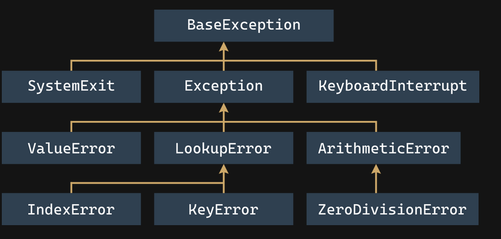

### Exceptions

- How do you handle exceptions? The word try is key to the solution.
    first, you have to try to do something;
    next, you have to check whether everything went well.

- the try keyword begins a block of the code which may or may not be performing correctly;
- Next, Python tries to perform the risky action; if it fails, an exception is raised and Python starts to look for a solution;
- The except keyword starts a piece of code which will be executed if anything inside the try block goes wrong - if an exception is raised inside a previous try block, it will fail here, so the code located after the except keyword should provide an adequate reaction to the raised exception;
- Returning to the previous nesting level ends the try-except section.
##### Code Syntax
```
try:
    :
    :
except:
    :
    :
```
- You can caught more than one exception in code by defining multiple except blocks with exception types
- The except branches are searched in the same order in which they appear in the code;
- You must not use more than one except branch with a certain exception name;
- The number of different except branches is arbitrary - the only condition is that if you use try, you must put at least one except (named or not) after it;
- The except keyword must not be used without a preceding try;
- If any of the except branches is executed, no other branches will be visited;
- If none of the specified except branches matches the raised exception, the exception remains unhandled.
- If an unnamed except branch exists (one without an exception name), it has to be specified as the last.
##### Multi except blocks
```
try:
    x = int(input("Enter a number: "))
    y = 1 / x
    print(y)
except ZeroDivisionError:
    print("You cannot divide by zero, sorry.")
except ValueError:
    print("You must enter an integer value.")
except:
    print("Oh dear, something went wrong...")
```

- Python 3 defines 63 built-in exceptions, and all of them form a tree-shaped hierarchy, although the tree is a bit weird as its root is located on top.

Note:

    - ZeroDivisionError is a special case of more a general exception class named ArithmeticError;
    - ArithmeticError is a special case of a more general exception class named just Exception;
    - Exception is a special case of a more general class named BaseException;

- Replacing the exception's name with either Exception or BaseException won't change the program's behavior.
- Placing more general exception a head of specific exception will alway result in executing more general exception code block
###### Example :
```
try:
    y = 1 / 0
except ArithmeticError:
    print("Arithmetic problem!")
except ZeroDivisionError:
    print("Zero Division!")

print("THE END.")
```
###### Ressult is  : Arithmetic problem!
- The order of the branches matters. Don't put more general exceptions before more concrete ones. This will make the latter one unreachable and useless. Moreover, it will make your code messy and inconsistent. Python won't generate any error messages regarding this issue.
- If you want to handle two or more exceptions in the same way, you can use the following syntax:
```
try:
    :
except (exc1, exc2):
    :
```
- The exception raised can cross function and module boundaries, and travel through the invocation chain looking for a matching except clause able to handle it.
- The raise instruction raises the specified exception named exc as if it was raised in a normal (natural) way. ```raise``` is a keyword.
- Simulate raising actual exceptions (e.g., to test your handling strategy)
- Partially handle an exception and make another part of the code responsible for completing the handling (separation of concerns).
- Another Python keyword ```assert```. ex: assert expression
- It evaluates the expression. If the expression evaluates to True, or a non-zero numerical value, or a non-empty string, or any other value different than None, it won't do anything else otherwise, it automatically and immediately raises an exception named AssertionError (in this case, we say that the assertion has failed)
###### Example:
```
import math

x = float(input("Enter a number: "))
assert x >= 0.0

x = math.sqrt(x)

print(x)
```
#### Excations list
|  | Description |  |
| Exception Name | Description | Location | ||
| ------------------------------------------------------------------------------- | -------------------------------------------- | ------------------------------------------------ | -------------------------------------------------------- | ------------------------------------------------------------------------------ |
| ArithmeticError | an abstract exception including all exceptions caused by arithmetic operations like zero division or an argument's invalid domain                                                                       |BaseException ← Exception ← ArithmeticError|
|AssertionError | a concrete exception raised by the assert instruction when its argument evaluates to False, None, 0, or an empty string | BaseException ← Exception ← AssertionError|
|BaseException| the most general (abstract) of all Python exceptions - all other exceptions are included in this one; it can be said that the following two except branches are equivalent: except: and except BaseException:.||
|IndexError|a concrete exception raised when you try to access a non-existent sequence's element (e.g., a list's element)| BaseException ← Exception ← LookupError ← IndexError |
| KeyboardInterrupt | a concrete exception raised when the user uses a keyboard shortcut designed to terminate a program's execution (Ctrl-C in most OSs); if handling this exception doesn't lead to program termination, the program continues its execution. Note: this exception is not derived from the Exception class. Run the program in IDLE. | BaseException ← KeyboardInterrupt |
|LookupError| an abstract exception including all exceptions caused by errors resulting from invalid references to different collections (lists, dictionaries, tuples, etc.) | BaseException ← Exception ← LookupError|
|MemoryError| a concrete exception raised when an operation cannot be completed due to a lack of free memory | BaseException ← Exception ← MemoryError|
| OverflowError | a concrete exception raised when an operation produces a number too big to be successfully stored | BaseException ← Exception ← ArithmeticError ← OverflowError |
| ImportError| a concrete exception raised when an import operation fails | BaseException ← Exception ← StandardError ← ImportError|
|KeyError| a concrete exception raised when you try to access a collection's non-existent element (e.g., a dictionary's element) |BaseException ← Exception ← LookupError ← KeyError|
|

[Python Exception](https://docs.python.org/3.10/library/exceptions.html)


Excpetion try and except can have an additional, possible branch that can be placed inside (or rather, directly behind) the try-except block - it's the part of the code starting with else
```python
def reciprocal(n):
    try:
        n = 1 / n
    except ZeroDivisionError:
        print("Division failed")
        return None
    else:
        print("Everything went fine")
        return n

print(reciprocal(2))
print(reciprocal(0))

Output:
Everything went fine
0.5
Division failed
None
```
The try-except block can be extended in one more way - by adding a part headed by the finally keyword (it must be the last branch of the code designed to handle exceptions).

`Note: these two variants (else and finally) aren't dependent in any way, and they can coexist or occur independently.`
- The finally block is always executed (it finalizes the try-except block execution, hence its name), no matter what happened earlier, even when raising an exception, no matter whether this has been handled or not.
```python
def reciprocal(n):
    try:
        n = 1 / n
    except ZeroDivisionError:
        print("Division failed")
        n = None
    else:
        print("Everything went fine")
    finally:
        print("It's time to say goodbye")
        return n

print(reciprocal(2))
print(reciprocal(0))

Oputput :
Everything went fine
It's time to say good bye
0.5
Division failed
It's time to say good bye
None
```
