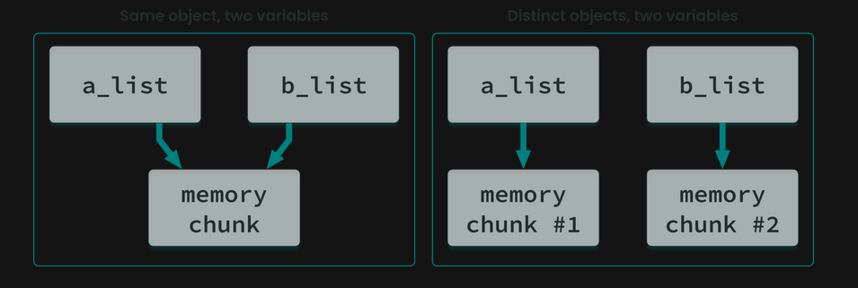
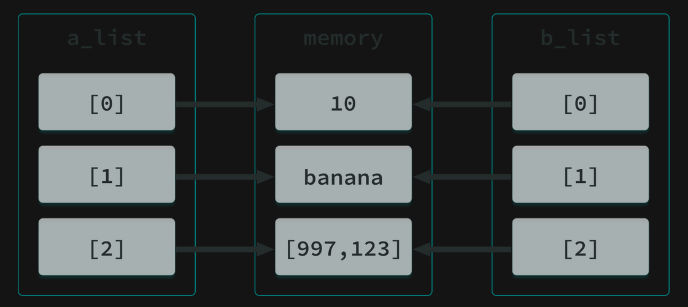
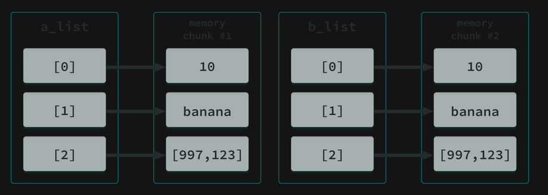

# How a Object is created 

| a_list   |   =         | [ 1, 'New York', 100]        |
|----------|-------------|------------------------------|
|variable  | assigned to |        Object                |
(label)    |(reference to)|(can consist of other objects)|

- At first, an object (a list in this example) is created in the computer's memory. Now the object has its identity;
- then the object is populated with other objects. Now our object has a value;
- finally a variable, which you should treat as a label or name binding, is created, and this label refers to a distinct place in the computer memory.

What is that object 'identity'? Why are the object value and label not enough?

- The built-in id() function returns the 'identity' of an object. This is an integer which is guaranteed to be unique and constant for this object during its lifetime. Two objects with non-overlapping lifetimes may have the same id() value.
- CPython implementation detail: This is the address of the object in the memory. Don’t treat it as an absolute memory address.
- This function is rarely used in applications. More often you’ll use it to debug the code or to experiment while copying objects. The side effect of this infrequent use is that some developers forget about its existence and create their own variables titled id to store some kind of identity or identifier.
- As a result, a variable called id shadows the genuine function and makes it unreachable in the scope in which the variable has been defined. You should remember to avoid such situations!

```python
a_string = '10 days to departure'
b_string = '20 days to departure'

print('a_string identity:', id(a_string))
print('b_string identity:', id(b_string))

#output
#a_string identity: 139953479976880
#b_string identity: 139953479976960
```
- When you have two variables referring to the same object, the return values of the id() function must be the same. 
```python
a_string = '10 days to departure'
b_string = a_string

print('a_string identity:', id(a_string))
print('b_string identity:', id(b_string))

#output
#a_string identity: 139724883990448
#b_string identity: 139724883990448
```

## What is the difference between the '==' and 'is' operators?
What should you do to compare two objects?

- In order to compare two objects, you should start with the '==' operator as usual. This operator compares the values of both operands and checks for value equality. So here we witness a values comparison
- In fact, two distinct objects holding the same values could be compared, and the result would be 'True'. Moreover, when you compare two variables referencing the same object, the result would be also 'True'.
- To check whether both operands refer to the same object or not, you should use the 'is' operator. In other words, it responds to the question: “Are both variables referring to the same identity?”

```python
a_string = ['10', 'days', 'to', 'departure']
b_string = a_string

print('a_string identity:', id(a_string))
print('b_string identity:', id(b_string))
print('The result of the value comparison:', a_string == b_string)
print('The result of the identity comparison:', a_string is b_string)

print()

a_string = ['10', 'days', 'to', 'departure']
b_string = ['10', 'days', 'to', 'departure']

print('a_string identity:', id(a_string))
print('b_string identity:', id(b_string))
print('The result of the value comparison:', a_string == b_string)
print('The result of the identity comparison:', a_string is b_string)

# output:
# a_string identity: 139663267811888
# b_string identity: 139663267811888
# The result of the value comparison: True
# The result of the identity comparison: True

# a_string identity: 139663267814448
# b_string identity: 139663266573040
# The result of the value comparison: True
# The result of the identity comparison: False
```


- When you process the data, you’ll come to the point where you may want to have distinct copies of objects that you can modify without automatically modifying the original at the same time. 
- make a real, independent copy of a_list, (not just a copy reference). Using [:], which is an array slice syntax, we get a fresh copy of the a_list object;
- modify the original object;

```python
print("Part 1")
print("Let's make a copy")
a_list = [10, "banana", [997, 123]]
b_list = a_list[:]
print("a_list contents:", a_list)
print("b_list contents:", b_list)
print("Is it the same object?", a_list is b_list)

print()
print("Part 2")
print("Let's modify b_list[2]")
b_list[2][0] = 112
print("a_list contents:", a_list)
print("b_list contents:", b_list)
print("Is it the same object?", a_list is b_list)

#output
# Part 1
# Let's make a copy
# a_list contents: [10, 'banana', [997, 123]]
# b_list contents: [10, 'banana', [997, 123]]
# Is it the same object? False

# Part 2
# Let's modify b_list[2]
# a_list contents: [10, 'banana', [112, 123]]
# b_list contents: [10, 'banana', [112, 123]]
# Is it the same object? False
```
- So, despite the fact that b_list is a copy of a_list, modifying b_list results in a modification of the a_list object. 
- The 'a_list' object is a compound object;
- We’ve run a shallow copy that constructs a new compound object, b_list in our example, and then populated it with references to the objects found in the original;
- As you can see, a shallow copy is only one level deep. The copying process does not recurse and therefore does not create copies of the child objects, but instead populates b_list with references to the already existing objects.



If you want to make an independent copy of a compound object (list, dictionary, custom class instance) you should make use of deep copy, which:

- constructs a new compound object and then, recursively, inserts copies into it of the objects found in the original;
- takes more time to complete, as there are many more operations to be performed;
- is implemented by the deepcopy() function, delivered by the python 'copy' module


```python
import copy

print("Let's make a deep copy")
a_list = [10, "banana", [997, 123]]
b_list = copy.deepcopy(a_list)
print("a_list contents:", a_list)
print("b_list contents:", b_list)
print("Is it the same object?", a_list is b_list)

print()
print("Let's modify b_list[2]")
b_list[2][0] = 112
print("a_list contents:", a_list)
print("b_list contents:", b_list)
print("Is it the same object?", a_list is b_list)

# output:
# Let's make a deep copy
# a_list contents: [10, 'banana', [997, 123]]
# b_list contents: [10, 'banana', [997, 123]]
# Is it the same object? False

# Let's modify b_list[2]
# a_list contents: [10, 'banana', [997, 123]]
# b_list contents: [10, 'banana', [112, 123]]
# Is it the same object? False
```


- The 'copy' module contains a function for shallow copying: copy(). Of course, you could say that for copying lists there is already the [:] notation, or a_list=list(b_list), and for dictionaries you could use a_dict = dict(b_dict).
- But think about making use of polymorphism when you need a universal function to copy any type object, so that in that case using a copy() function is the smart way to accomplish the task. 

# Python Object Shallow and Deep Copy

In Python, copying an object can be done in two ways: shallow copy and deep copy. Understanding the difference between these two methods is crucial for managing mutable objects.

## Shallow Copy

A shallow copy creates a new object, but inserts references into it to the objects found in the original. This means that the new object is a copy of the original, but the elements within the object are still references to the same objects.

### Example of Shallow Copy

```python
import copy

original_list = [1, 2, [3, 4]]
shallow_copied_list = copy.copy(original_list)

print("Original List:", original_list)
print("Shallow Copied List:", shallow_copied_list)

# Modifying the nested list in the shallow copy
shallow_copied_list[2][0] = 'a'

print("Modified Original List:", original_list)
print("Modified Shallow Copied List:", shallow_copied_list)
```

## Deep Copy

A deep copy creates a new object and recursively adds copies of nested objects found in the original. This means that the new object is a completely independent copy of the original, with no shared references.

### Example of Deep Copy

```python
import copy

original_list = [1, 2, [3, 4]]
deep_copied_list = copy.deepcopy(original_list)

print("Original List:", original_list)
print("Deep Copied List:", deep_copied_list)

# Modifying the nested list in the deep copy
deep_copied_list[2][0] = 'a'

print("Modified Original List:", original_list)
print("Modified Deep Copied List:", deep_copied_list)
```

## Summary

- **Shallow Copy**: Copies the object's structure but not the elements within it.
- **Deep Copy**: Copies both the object's structure and the elements within it.
- the `deepcopy()` method creates and persists new instances of source objects, whereas any shallow `copy()` operation only stores references to the original memory address;
- a deep copy operation takes significantly more time than any shallow copy operation;
- the `deepcopy()` method copies the whole object, including all nested objects; it’s an example of practical recursion taking place;
- deep copy might cause problems when there are cyclic references in the structure to be copied.


Understanding these concepts helps in managing mutable objects and avoiding unintended side effects in your programs.