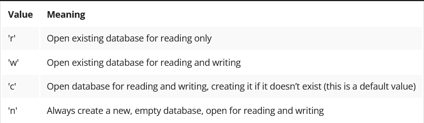

# Python Object Serialization

In Python, object serialization is the process of converting an object structure into a stream of bytes to store the object in a file or database, or to transmit it via a network. This byte stream contains all the information necessary to reconstruct the object in another Python script. 

- This reverse process is called deserialization.

The following types can be pickled:
  - None, booleans;
  - integers, floating-point numbers, complex numbers;
  - strings, bytes, bytearrays;
  - tuples, lists, sets, and dictionaries containing pickleable objects;
  - objects, including objects with references to other objects (remember to avoid cycles!)
  - references to functions and classes, but not their definitions.


Object serialization is the process of converting an object's state into a format that can be stored or transmitted and then reconstructed later. In Python, this is commonly done using the `pickle` module.

## Using `pickle` Module

### Importing `pickle`

```python
import pickle
```

### Serializing an Object

To serialize an object, use the `pickle.dump()` method:

```python
data = {'name': 'John', 'age': 30, 'city': 'New York'}
with open('data.pkl', 'wb') as file:
    pickle.dump(data, file)
```

```python
import pickle

a_dict = dict()
a_dict['EUR'] = {'code':'Euro', 'symbol': '€'}
a_dict['GBP'] = {'code':'Pounds sterling', 'symbol': '£'}
a_dict['USD'] = {'code':'US dollar', 'symbol': '$'}
a_dict['JPY'] = {'code':'Japanese yen', 'symbol': '¥'}

a_list = ['a', 123, [10, 100, 1000]]

with open('multidata.pckl', 'wb') as file_out:
    pickle.dump(a_dict, file_out)
    pickle.dump(a_list, file_out)
```
- Let's pickle our first set of data consisting of:
  - a nested dictionary carrying some information about currencies;
  - a list containing a string, an integer, and a list.
- The code starts with the import statement responsible for loading the pickle module:
- Later you can see that the file handle 'file_out' is associated with the file opened for writing in binary mode. It’s important to open the file in binary mode as we are dumping data as a stream of bytes.
- Now it’s time to persist the first object with the dump() function. This function expects an object to be persisted and a file handle.
- And the second object is persisted in the same way.
- In this result, we have created a file that retains the pickled objects. 

### Deserializing an Object

To deserialize an object, use the `pickle.load()` method:

```python
with open('data.pkl', 'rb') as file:
    data = pickle.load(file)
print(data)
```
```python
import pickle

with open('multidata.pckl', 'rb') as file_in:
    data1 = pickle.load(file_in)
    data2 = pickle.load(file_in)

print(type(data1))
print(data1)
print(type(data2))
print(data2)
```
- We’re importing a pickle module;
- The file is opened in binary mode and the file handle is associated with the file;
- We consecutively read some portions of data and deserialize it with the load() function;
- Finally, we examine the type and contents of the objects.

Pay attention to the fact that with the 'pickle' module, you have to remember the order in which the objects were persisted and the deserialization code should follow the same order.

## Important Considerations

- **Security**: Be cautious when loading pickled data from untrusted sources, as it can execute arbitrary code.
- **Compatibility**: Pickled data may not be compatible across different Python versions.
- Remember that attempts to pickle non-pickleable objects will raise the PicklingError exception.
- Trying to pickle a highly recursive data structure (mind the cycles) may exceed the maximum recursion depth, and a RecursionError exception will be raised in such cases
- Note that functions (both built-in and user-defined) are pickled by their name reference, not by any value. This means that only the function name is pickled; neither the function’s code, nor any of its function attributes, are pickled.
- Similarly, classes are pickled by named reference, so the same restrictions in the unpickling environment apply. Note that none of the class’s code or data are pickled. This is done on purpose, so you can fix bugs in a class or add methods to the class, and still load objects that were created with an earlier version of the class.
- Hence, your role is to ensure that the environment where the class or function is unpickled is able to import the class or function definition. In other words, the function or class must be available in the namespace of your code reading the pickle file.  Otherwise, an AtrributeError exception will be raised.


## Alternatives to `pickle`

- **JSON**: For serializing simple data structures.
- **`marshal`**: For serializing Python code objects.
- **`shelve`**: For persistent storage of Python objects.

### Example with JSON

```python
import json

data = {'name': 'John', 'age': 30, 'city': 'New York'}
with open('data.json', 'w') as file:
    json.dump(data, file)

with open('data.json', 'r') as file:
    data = json.load(file)
print(data)
```

By understanding and using object serialization, you can easily save and load complex data structures in Python.

### Serialization of Python objects using the shelve module

- As you remember, the pickle module is used for serializing objects as a single byte stream. Both serializing and deserializing parties must abide by the order of all the elements placed into a file or database, or sent via a network. 
- There is another handy module, called shelve, that is built on top of pickle, and implements a serialization dictionary where objects are pickled and associated with a key. The keys must be ordinary strings, because the underlying database (dbm) requires strings. 
- Therefore, you can open your shelved data file and access your pickled objects via the keys the way you do when you access Python dictionaries. This could be more convenient for you when you’re serializing many objects.

Using shelve is quite easy and intuitive. 

- First, let's import the appropriate module and create an object representing a file-based database:
```python
import shelve
my_shelve = shelve.open('first_shelve.shlv', flag='w')

```
- The meaning of the optional flag parameter:


Now our shelve object is ready for action, so let's insert a few items and close the shelve object.
```python
my_shelve['USD'] = {'code':'US dollar', 'symbol': '$'}
my_shelve['JPY'] = {'code':'Japanese yen', 'symbol': '¥'}
my_shelve.close()
```
Now let's open the shelve file to demonstrate direct access to the elements (contrary to the sequential access to items when we use pickles).
```python
new_shelve = shelve.open(shelve_name)
print(new_shelve['USD'])
new_shelve.close()
```

- You should treat a shelve object as a Python dictionary, with a few additional notes:
- You should treat a shelve object as a Python dictionary, with a few additional notes:
- Python puts the changes in a buffer which is periodically flushed to the disk. To enforce an immediate flush, call the sync() method on your shelve object;
- when you call the close() method on an shelve object, it also flushes the buffers.

When you treat a shelve object like a Python dictionary, you can make use of the dictionary utilities:
- the len() function;
- the in operator;
- the keys() anditems() methods;
- the update operation, which works the same as when applied to a Python dictionary;
- the del instruction, used to delete a key-value pair.

After running the code, you'll notice additionally that some files are created to support the database. Don’t try to alter those files with external utilities, because your shelve may become inconsistent, resulting in read/write errors.

The use of shelve is really easy and effective. Moreover, you should know that you could simulate the shelve by pickling the whole dictionary, but the shelve module uses the memory more efficiently, so whenever you need access to pickled objects, employ a shelve.

And the final remark is:
  - because the shelve module is backed by pickle, it isn’t safe to load a shelve from an untrusted source. As with pickle, loading a shelve can execute arbitrary code.


### Summary
- It’s a Python implementation of the serialization process, so the pickled data cannot be exchanged with programs written in other languages like Java or C++. In such cases, you should think about the JSON or XML formats, which could be less convenient than pickling, but when assimilated are more powerful than pickling;
- The pickle module is constantly evolving, so the binary format may differ between different versions of Python. Pay attention that both serializing and deserializing parties are making use of the same pickle versions;
- The pickle module is not secured against erroneous or maliciously constructed data. Never unpickle data received from an untrusted or unauthenticated source.


