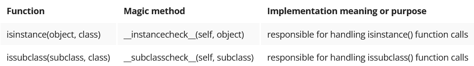
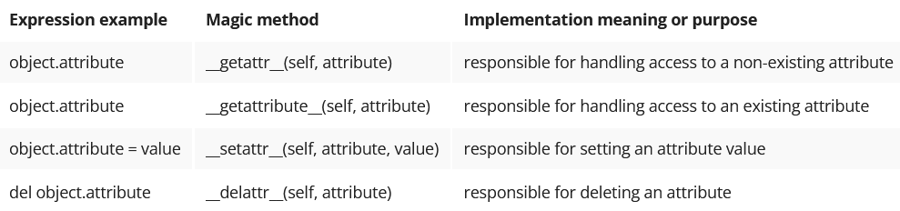

## Python core syntax
This is Python core syntax – an ability to perform specific operations on different data types, when operations are formulated using the same operators or instructions, or even functions.
- operators like '+', '-', '*', '/', '%' and many others;
- operators like '==', '<', '>', '<=', 'in' and many others;
- indexing, slicing, subscripting;
- built-in functions like str(), len()
- reflexion – isinstance(), issubclass()

When called, functions and operators that state the core syntax are translated into magic methods delivered by specific classes.

In Python, these magic methods are sometimes called special purpose methods, because these methods are designated by design to handle specific operations. 

The name of each magic method is surrounded by double underscores (Pythonistas would say “dunder” for double underscores). Dunders indicate that such methods are not called directly, but called in a process of expression evaluation, according to Python core syntax rules.

## Operators and core Functions on Pyhton Objects
-  '+' operator is in fact converted to the `__add__()`
-  len() function is converted to the `__len__()` method
-  the dir() and help() functions can give list of methods supported by object 

Example :
```
>>> dir(10)
['__abs__', '__add__', '__and__', '__bool__', '__ceil__', '__class__', '__delattr__', '__dir__', '__divmod__', '__doc__', '__eq__', '__float__', '__floor__', '__floordiv__', '__format__', '__ge__', '__getattribute__', '__getnewargs__', '__gt__', '__hash__', '__index__', '__init__', '__init_subclass__', '__int__', '__invert__', '__le__', '__lshift__', '__lt__', '__mod__', '__mul__', '__ne__', '__neg__', '__new__', '__or__', '__pos__', '__pow__', '__radd__', '__rand__', '__rdivmod__', '__reduce__', '__reduce_ex__', '__repr__', '__rfloordiv__', '__rlshift__', '__rmod__', '__rmul__', '__ror__', '__round__', '__rpow__', '__rrshift__', '__rshift__', '__rsub__', '__rtruediv__', '__rxor__', '__setattr__', '__sizeof__',
 '__str__', '__sub__', '__subclasshook__', '__truediv__', '__trunc__', '__xor__', 'bit_length', 'conjugate', 'denominator', 'from_bytes', 'imag', 'numerator', 'real', 'to_bytes']
```

```python
class Person:
    def __init__(self, weight, age, salary):
        self.weight = weight
        self.age = age
        self.salary = salary

    def __add__(self, other, ...):
        return self.weight + other.weight


p1 = Person(30, 40, 50)
p2 = Person(35, 45, 55)

print(p1 + p2)
```
comparison Operators


Numeric methods


Common, binary operators and functions


Augumented operators and functions


Type conversion methods

Python offers a set of methods responsible for the conversion of built-in data types.


Object introspection

Python offers a set of methods responsible for representing object details using ordinary strings.


Object retrospection

Following the topic of object introspection, there are methods responsible for object reflection.



Object attribute access

Access to object attributes can be controlled via the following magic methods



Methods allowing access to containers

Containers are any object that holds an arbitrary number of other objects; containers provide a way to access the contained objects and to iterate over them. Container 

examples: list, dictionary, tuple, and set.


The list of special methods built-in in Python contains more entities. For more information, refer to [Full list](https://docs.python.org/3/reference/datamodel.html#special-method-names.)