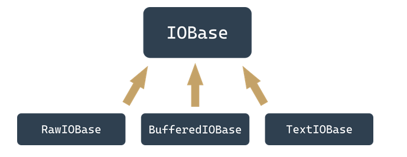

## Accessing files from Python code
    Python's way of accessing and processing files is implemented using a consistent set of objects.

- Different operating systems can treat the files in different ways. For example, Windows uses a different naming convention than the one adopted in Unix/Linux systems.
- If we use the notion of a canonical file name (a name which uniquely defines the location of the file regardless of its level in the directory tree)
  Windows : C:\directory\file
  Unix/Linux : /directory/files
- As you can see, systems derived from Unix/Linux don't use the disk drive letter (e.g., C:) and all the directories grow from one root directory called /, while Windows systems recognize the root directory as \
- In addition, Unix/Linux system file names are case-sensitive. Windows systems store the case of letters used in the file name, but don't distinguish between their cases at all.

- Any program written in Python (and not only in Python, because that convention applies to virtually all programming languages) does not communicate with the files directly, but through some abstract entities that are named differently in different languages or environments - the most-used terms are handles or streams.
- The operation of connecting the stream with a file is called opening the file, while disconnecting this link is named closing the file.
- Hence, the conclusion is that the very first operation performed on the stream is always open and the last one is close. The program, in effect, is free to manipulate the stream between these two events and to handle the associated file.

### File Streams
The opening of the stream is not only associated with the file, but should also declare the manner in which the stream will be processed. This declaration is called an open mode. The stream behaves almost like a tape recorder.

- When you read something from a stream, a virtual head moves over the stream according to the number of bytes transferred from the stream.
- When you write something to the stream, the same head moves along the stream recording the data from the memory.
- This holds `current file position`

- If the opening is successful, the program will be allowed to perform only the operations which are consistent with the declared open mode.
- There are two basic operations performed on the stream:
  - `read from the stream`: the portions of the data are retrieved from the file and placed in a memory area managed by the program (e.g., a variable);
  - `write to the stream`: the portions of the data from the memory (e.g., a variable) are transferred to the file.
- There are three basic modes used to open the stream:
  - `read mode`: a stream opened in this mode allows read operations only; trying to write to the stream will cause an exception (the exception is named UnsupportedOperation, which inherits OSError and ValueError, and comes from the io module);
  - `write mode`: a stream opened in this mode allows write operations only; attempting to read the stream will cause the exception mentioned above;
  - `update mode`: a stream opened in this mode allows both writes and reads.

### File handles
Python assumes that every file is hidden behind an object of an adequate class.

- An object of an adequate class is created when you open the file and annihilate it at the time of closing. Between these two events, you can use the object to specify what operations should be performed on a particular stream. The operations you're allowed to use are imposed by the way in which you've opened the file.

In general, the object comes from one of the classes shown here:



`Note: you never use constructors to bring these objects to life. The only way you obtain them is to invoke the function named open().`

- The function analyses the arguments you've provided, and automatically creates the required object.
- If you want to get rid of the object, you invoke the method named close().
- The invocation will sever the connection to the object, and the file and will remove the object. For our purposes, we'll concern ourselves only with streams represented by BufferIOBase and TextIOBase objects.
- Due to the type of the stream's contents, all the streams are divided into text and binary streams.
- The text streams ones are structured in lines; that is, they contain typographical characters (letters, digits, punctuation, etc.) arranged in rows (lines), as seen with the naked eye when you look at the contents of the file in the editor. This file is written (or read) mostly character by character, or line by line.
- The binary streams don't contain text but a sequence of bytes of any value. This sequence can be, for example, an executable program, an image, an audio or a video clip, a database file, etc.
- Because these files don't contain lines, the reads and writes relate to portions of data of any size. Hence the data is read/written byte by byte, or block by block, where the size of the block usually ranges from one to an arbitrarily chosen value.
- Then comes a subtle problem. In Unix/Linux systems, the line ends are marked by a single character named LF (ASCII code 10) designated in Python programs as \n.
- Other operating systems, especially these derived from the prehistoric CP/M system (which applies to Windows family systems, too) use a different convention: the end of line is marked by a pair of characters, CR and LF (ASCII codes 13 and 10) which can be encoded as \r\n.


Step of reading file using handles 
- when the stream is open and it's advised that the data in the associated file will be processed as text (or there is no such advisory at all), it is switched into text mode;
- during reading/writing of lines from/to the associated file, nothing special occurs in the Unix environment, but when the same operations are performed in the Windows environment, a process called a `translation of newline characters occurs: `when you read a line from the file, every pair of \r\n characters is replaced with a single \n character, and vice versa; during write operations, every \n character is replaced with a pair of \r\n characters;
- the mechanism is completely transparent to the program, which can be written as if it was intended for processing Unix/Linux text files only; the source code run in a Windows environment will work properly, too;
- when the stream is open and it's advised to do so, its contents are taken as-is, without any conversion - no bytes are added or omitted.

### Opening the streams
The opening of the stream is performed by a function which can be invoked in the following way:

`stream = open(file, mode = 'r', encoding = None)`

1) the name of the function (open) speaks for itself; if the opening is successful, the function returns a stream object; otherwise, an exception is raised (e.g., FileNotFoundError if the file you're going to read doesn't exist);
2) the first parameter of the function (file) specifies the name of the file to be associated with the stream;
3) the second parameter (mode) specifies the open mode used for the stream; it's a string filled with a sequence of characters, and each of them has its own special meaning;
4) the third parameter (encoding) specifies the encoding type (e.g., UTF-8 when working with text files)
5) the third parameter (encoding) specifies the encoding type (e.g., UTF-8 when working with text files)

`Note: the mode and encoding arguments may be omitted - their default values are assumed then. The default opening mode is reading in text mode, while the default encoding depends on the platform used.`

### File open `modes`:

- `r` open mode: read
  - The stream will be opened in read mode;
  - The file associated with the stream must exist and has to be readable, otherwise the open() function raises an exception.
- `w` open mode: write
  - The stream will be opened in write mode;
  - The file associated with the stream doesn't need to exist; if it doesn't exist it will be created; if it exists, it will be truncated to the length of zero (erased); if the creation isn't possible (e.g., due to system permissions) the open() function raises an exception.
- `a` open mode: append
  - the stream will be opened in append mode;
  - the file associated with the stream doesn't need to exist; if it doesn't exist, it will be created; if it exists the virtual recording head will be set at the end of the file (the previous content of the file remains untouched.)
- `r+` open mode: read and update
  - the stream will be opened in read and update mode;
  - the file associated with the stream must exist and has to be writeable, otherwise the open() function raises an exception;
  - both read and write operations are allowed for the stream.
- `w+` open mode: write and update
  - the stream will be opened in write and update mode;
  - the file associated with the stream doesn't need to exist; if it doesn't exist, it will be created; the previous content of the file remains untouched;
  - both read and write operations are allowed for the stream.

### Selecting text and binary modes
- If there is a letter b at the end of the mode string it means that the stream is to be opened in the binary mode.
- If the mode string ends with a letter t the stream is opened in the text mode.Text mode is the default behaviour assumed when no binary/text mode specifier is used.
- Finally, the successful opening of the file will set the current file position (the virtual reading/writing head) before the first byte of the file if the mode is not a and after the last byte of file if the mode is set to a.

    | Text mode|  Binary mode | Description  |
    | -------- | ------------ | ------------ |
    |   rt 	   |     rb 	  |   read
    |   wt 	   |     wb 	  |   write
    |   at 	   |     ab 	  |   append
    |   r+t    |     r+b 	  |   read and update
    |   w+t    |     w+b 	  |   write and update

`You can also open a file for its exclusive creation. You can do this using the x open mode. If the file already exists, the open() function will raise an exception.`


### Opening the stream for the first time

Imagine that we want to develop a program that reads content of the text file named: C:\Users\User\Desktop\file.txt.

```python
try:
    stream = open("C:\Users\User\Desktop\file.txt", "rt")
    # processing goes here
    stream.close()
except Exception as exc:
    print("Cannot open the file:", exc)
```
- we open the try-except block as we want to handle runtime errors softly;
- we use the open() function to try to open the specified file (note the way we've specified the file name)
- the open mode is defined as text to read (as text is the default setting, we can skip the t in mode string)
- in case of success we get an object from the open() function and we assign it to the stream variable;
- if open() fails, we handle the exception printing full error information (it's definitely good to know what exactly happene

Pre-opened streams :
- Any stream operation must be preceded by the open() function invocation. There are three well-defined exceptions to the rule.
- When our program starts, the three streams are already opened and don't require any extra preparations. What's more, your program can use these streams explicitly if you take care to import the sys module:
- The names of these streams are: sys.stdin, sys.stdout, and sys.stderr :
  - `sys.stdin`
    - stdin (as standard input)
    - The stdin stream is normally associated with the keyboard, pre-open for reading and regarded as the primary data source for the running programs;
    - The well-known input() function reads data from stdin by default.
  - `sys.stdout`
    - stdout (as standard output)
    - the stdout stream is normally associated with the screen, pre-open for writing, regarded as the primary target for outputting data by the running program;
    - the well-known print() function outputs the data to the stdout stream.
  - `sys.stderr`
    - stderr (as standard error output)
    - the stderr stream is normally associated with the screen, pre-open for writing, regarded as the primary place where the running program should send information on the errors encountered during its work;
    - we haven't presented any method to send the data to this stream.
    - the separation of stdout (useful results produced by the program) from the stderr (error messages, undeniably useful but does not provide results) gives the possibility of redirecting these two types of information to the different targets. The operation system handbook will provide more information on these issues.

### Closing streams
The last operation performed on a stream (this doesn't include the stdin, stdout, and stderr streams which don't require it) should be closing.

- That action is performed by a method invoked from within open stream object: `stream.close()`
- the name of the function is definitely self-commenting (`close()`)
- the function expects exactly no arguments; the stream doesn't need to be opened.
- the function returns nothing but raises IOError exception in case of error;
- most developers believe that the close() function always succeeds and thus there is no need to check if it's done its task properly. 
- This belief is only partly justified. If the stream was opened for writing and then a series of write operations were performed, it may happen that the data sent to the stream has not been transferred to the physical device yet (due to mechanism called caching or buffering). Since the closing of the stream forces the buffers to flush them, it may be that the flushes fail and therefore the close() fails too.
  
### Diagnosing stream problems
The IOError object is equipped with a property named errno (the name comes from the phrase error number) and you can access it as follows:
```python
try:
    # some stream operations
except IOError as exc:
    print(exc.errno)
```
- The value of the errno attribute can be compared with one of the predefined symbolic constants defined in the errno module.
- Constants useful for detecting stream errors:
  - `errno.EACCES` → Permission denied : The error occurs when you try, for example, to open a file with the read only attribute for writing.
  - `errno.EBADF` → Bad file number : The error occurs when you try, for example, to operate with an unopened stream.
  - `errno.EEXIST` → File exists : The error occurs when you try, for example, to rename a file with its previous name.
  - `errno.EFBIG` → File too large : The error occurs when you try to create a file that is larger than the maximum allowed by the operating system.
  - `errno.EISDIR` → Is a directory : The error occurs when you try to treat a directory name as the name of an ordinary file.
  - `errno.EMFILE` → Too many open files : The error occurs when you try to simultaneously open more streams than acceptable for your operating system.
  - `errno.ENOENT` → No such file or directory : The error occurs when you try to access a non-existent file/directory.
  - `errno.ENOSPC` → No space left on device : The error occurs when there is no free space on the media.

```python
# If we plan to give meaning full error description
import errno
try:
    s = open("c:/users/user/Desktop/file.txt", "rt")
    # actual processing goes here
    s.close()
except Exception as exc:
    if exc.errno == errno.ENOENT:
        print("The file doesn't exist.")
    elif exc.errno == errno.EMFILE:
        print("You've opened too many files.")
    else:
        printf("The error number is:", exc.errno)
```
- There is a function that can dramatically simplify the error handling code. Its name is `strerror()`, and it comes from the os module and expects just one argument - an error number.
`Note: if you pass a non-existent error code (a number which is not bound to any actual error), the function will raise ValueError exception.`

```python
from os import strerror
try:
    s = open("c:/users/user/Desktop/file.txt", "rt")
    # actual processing goes here
    s.close()
except Exception as exc:
    print("The file could not be opened:", strerror(exc.errno));
```