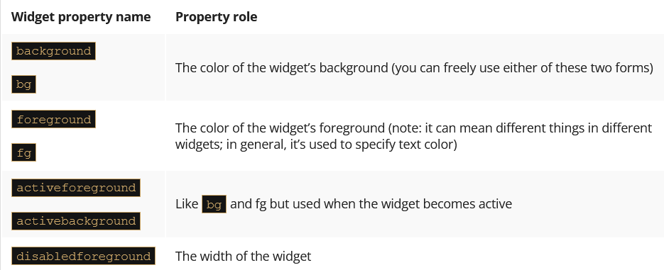

# Introduction to GUI Programming in Python

Graphical User Interface (GUI) programming allows developers to create visually appealing and interactive applications. Python provides several libraries to build GUIs efficiently.

## Events
There are lots of events which an event manager is committed to recognizing, discovering, and serving. Here are some of them:

- pressing the mouse button;
- releasing the mouse button (actually, an ordinary mouse click consists of these two subsequent events)
- moving the mouse cursor;
- dragging something under the mouse cursor;
- pressing and releasing a key;
- tapping a screen;
- tracking the passage of time;
- monitoring a widget’s state change;
and many, many more...


## Popular Python GUI Libraries

1. **Tkinter**(tee-kay-in-ter): 
   Unfortunately, each operating system delivers its own set of services designed to operate with its native GUI. Moreover, some of them (e.g., Linux) may define more than one standard for visual programming (two of the most widespread in the U*x world are named GTK and Qt).

   - This means that if we want to build portable GUI applications (i.e., apps able to work under different operating environments that always look the same) we need something more – we need an adapter. A set of uniform facilities enables us, the programmers, to write one code and not worry about portability.
   - Such an adapter is called a widget toolkit, a GUI toolkit, or a UX library.

Here are some of its features:
   - it’s free and open (we don’t need to pay for anything)
   - it has been developed since 1991 (which means it’s stable and mature)
   - it defines and serves more than thirty different universal widgets (which is enough even for quite complex applications)
   - its implementation is available for many programming languages (of course, for Python too)
   - Built-in library for creating basic GUIs.
   - Easy to use and widely supported.

The GUI application itself consists of four essential elements:
   - importing the needed tkinter components;
   - creating an application’s main window;
   - adding a set of necessary widgets to the window;
   - launching the event controller.


1. **PyQt/PySide**:
    - Feature-rich libraries for advanced GUI applications.
    - Based on the Qt framework.

2. **Kivy**:
    - Designed for multi-touch applications.
    - Suitable for mobile and desktop platforms.

3. **wxPython**:
    - Cross-platform GUI toolkit.
    - Native look and feel on different operating systems.

## Why Use Python for GUI Development?

- Simple syntax and readability.
- Extensive library support.
- Cross-platform compatibility.
- Active community and resources.

## Getting Started with Tkinter

```python
import tkinter as tk

# Create the main window
root = tk.Tk()
root.title("Hello, GUI!")

# Add a label widget
label = tk.Label(root, text="Welcome to GUI Programming!")
label.pack()

# Run the application
root.mainloop()
```

This example demonstrates a basic Tkinter application with a single label.

## Next Steps

- Explore widgets like buttons, text boxes, and menus.
- Learn event handling for user interactions.
- Experiment with layout managers for better UI design.

### place()
The place geometry manager demands the usage of the place() method. Note: the method is invoked from within the widget's object, not the window, as the widget is always aware of the window it belongs to (it gets the information from the constructor's very first argument).

The most usable place() method parameters are as follows (all of them are passed as keyword arguments):

    height=h – the widget's desired height measured in pixels; if the parameter is omitted, the widget's height will be determined automatically;
    width=w – the widget's desired width measured in pixels; if the parameter is omitted, the widget's width will be determined automatically;
    x=x – the widget's top-left pixel's horizontal coordinate measured relative to the home window's top-left corner;
    y=y – the widget's top-left pixel's vertical coordinate measured relative to the home window's top-left corner.

example :
```python
import tkinter as tk

window = tk.Tk()
button_1 = tk.Button(window, text="Button #1")
button_2 = tk.Button(window, text="Button #2")
button_3 = tk.Button(window, text="Button #3")
button_1.place(x=10, y=10)
button_2.place(x=20, y=40)
button_3.place(x=30, y=70)
window.mainloop()

```

### grid()
The most commonly used grid() method parameters are gathered below (as, previously, all of them are passed as keyword arguments):

    column=c – deploys the widget in the column number c; note: the columns' numbers start from zero, and if you omit this argument, the manager will assume 0 (the left-most column)
    row=r – deploys the widget in the row number r; if you omit this argument, the manager will assume the first free row starting from the top;
    columnspan=cs – determines how many neighboring columns the widget occupies; the parameter defaults to 1 (the widget won't cross a single grid's cell)
    rowspan=rs – works as columnspan but refers to rows.

example :
```python
import tkinter as tk

window = tk.Tk()
button_1 = tk.Button(window, text="Button #1")
button_2 = tk.Button(window, text="Button #2")
button_3 = tk.Button(window, text="Button #3")
button_1.grid(row=0, column=0)
button_2.grid(row=1, column=1)
button_3.grid(row=2, column=2)
window.mainloop()
```

### Pack()
The default pack's operation tends to deploy all subsequent widgets in one column, one below the other. You can change this behavior to a limited extent by using the following parameters:

    side=s – forces the manager to pack the widgets in a specified direction, where s can be specified as:
        TOP – the widget is packed toward the window's top (it's manager's default behavior)
        BOTTOM – the widget is packed toward the window's bottom;
        LEFT – toward the window's left boundary;
        RIGHT – toward the window's right boundary;
    fill=f – suggests to the manager how to expand the widget if you want it to occupy more space than the default, while f should be specified as:
        NONE – do not expand the widget (default behavior)
        X – expand it in the horizontal direction;
        Y – expand it in the vertical direction;
        BOTH – expand it in both directions;

### Color and Fonts
[Tkinter_recognized_colors](https://www.tcl-lang.org/man/tcl8.4/TkCmd/colors.htm)

#### label :

    Label – a non-clickable widget able to present short textual information, passed to the widget's constructor using a text argument. The text can later be changed at any moment of the widget's life.

    syntax:
    ```python
       import tkinter as tk
        
       label = tk.Label(win, text="Little label:")
       label.pack()
    ```

#### Frame : 

    A Frame is another non-clickable component used to group widgets and to separate them (visually) from other window components. Our Frame plays a less important role – it just occupies a rectangle and fills it with its own color.

    syntax:
    ```python
       import tkinter as tk
        
       frame = tk.Frame(win, height=30, width=100, bg="#000099")
       frame.pack()
    ```

#### Button :

    A clickable component generates events.

    If your widget is a clickable one, you can connect a callback to it using its command property, while the property can be initially set by the constructor invocation. 


    syntax:
    ```python
       import tkinter as tk

       Window = tk.Tk()  # main window
       button = tk.Button(Window, text='Show info', command=clicked)
       button.pack(fill=tk.X)
    ```


```python
import tkinter as tk


def switch():
    if button_1.cget('state') == tk.DISABLED:
        button_1.config(state=tk.NORMAL)
        button_1.flash()
    else:
        button_1.flash()
        button_1.config(state=tk.DISABLED)


def mouseover(ev):
    button_1['bg'] = 'green'


def mouseout(ev):
    button_1['bg'] = 'red'


window = tk.Tk()
button_1 = tk.Button(window, text="Enabled", bg="red")
button_1.bind("<Enter>", mouseover)
button_1.bind("<Leave>", mouseout)
button_1.pack()
button_2 = tk.Button(window, text="Enable/Disable", command=switch)
button_2.pack()
window.mainloop()
```

#### IntVar :

    It's the switch variable. Can't you see it? It's set to hold an object of the IntVar class. This object is designed to store integer values. "Okay," you may say, "can't we use a regular variable instead?"

    No, we can't. Objects of the IntVar class are used by tkinter to organize internal communication between different widgets. A regular variable can't play such a role.

    If you want such an object to store an integer value, you can't use the assignment operator. The class offers a dedicated method for that purpose, and the method is named set().

    Note: we've used the method to store a value of 1 inside the object.

    syntax:
    ```python
        import tkinter as tk

        switch = tk.IntVar()
        switch.set(1)
    ```

#### Checkbutton :

    The Checkbutton is primarily used to represent two-state selections. In other words, it can be in one of two possible states:

    the ON state when the Checkbutton is checked/ticked (which can be equated with an affirmative answer to some question)
    the OFF state when the Checkbutton is cleared (you can think of it as a kind of negative answer)

    Yes, it’s a variable argument. Note – it’s set to the previously created switch object. The assignment creates a bidirectional link between the object and the widget. How does it work?

    If you check or uncheck the Checkbutton, the switch object will immediately change its state – it will keep 0 if the widget is unchecked, and 1 otherwise.
    If you change the state of the switch object, the Checkbutton will immediately reflect the change – it means that you don’t need to access the Checkbutton itself to check/uncheck it, as you can modify the switch value instead.

    Syntax: 
    ```python
    checkbutton = tk.Checkbutton(win, text="Check Button", variable=switch)
    ```
    The Checkbutton is a two-state switch that can be ticked (checked) or not; thus, it is a handy tool to represent yes/no user choices.


```python
import tkinter as tk
from tkinter import messagebox


def count():
    global counter
    counter += 1

def show():
    messagebox.showinfo("","counter=" + str(counter) + ",state=" + str(switch.get()))


window = tk.Tk()
switch = tk.IntVar()
counter = 0
button = tk.Button(window, text="Show", command=show)
button.pack()
checkbutton = tk.Checkbutton(window, text="Tick", variable=switch, command=count)
checkbutton.pack()
window.mainloop()
```
- counts all the checkbutton’s state changes and stores the result in cnt variable;
- presents the current cnt value and the checkbutton’s state after clicking the Show button.


#### Entry:

    Entry is designed to let the user enter simple, one-line data, like single numbers, names, addresses, etc.

    We’ve added one to our window. It creates an input field 30 characters wide. You can play with it if you want, but it’s completely inoperative as far. We only want to show you what it looks like.

#### Radiobuttons :

    These are the Radiobuttons, small circles filled with a dot, or not. The most important difference between Check- and Radiobuttons lies in the fact that Checkbuttons are solitary (they work individually) while Radiobuttons always work in groups and – note it! – only one of the widgets inside the group can be checked. Clicking an unchecked member of the group will cause the currently checked Radiobutton to change its state.

    Our two Radiobutton constructors use two additional arguments. What roles do they play?

    The variable argument binds a switch object to both of the widgets, and this is the clue – the fact that both Radiobuttons are bound to the same object creates the group. Don’t forget that!
    The value argument distinguishes the Radiobuttons inside the group, and thus each of the Radiobuttons has to use a different value (we’ve used 0 and 1)

    The communication through the switch object should work as follows:

        selecting one of the Radiobuttons affects the switch object, which changes its value to one of the possible values specified in the Radiobuttons’ constructor; note: the mechanism works in the same way if there are more Radiobuttons in the group;
        simultaneously, changing the switch object’s state affects the Radiobutton group.

    As the switch is initially set to 1, we expect the second Radiobutton (named Salad) to be selected when the application starts.

    The Radiobutton is usable when you group (couple) a number (>1) of these widgets – as only one of them can be mutually selected (checked), it’s a good tool to represent one of many user choices. Assigning the same observable variable to more than one Radiobutton creates a group.

    This also means that when two Radiobuttons use different observable variables, they belong to different groups by definition.


```python
import tkinter as tk
from tkinter import messagebox


def show():
    messagebox.showinfo("", "radio_1=" + str(radio_1_var.get()) +
                        ",radio_2=" + str(radio_2_var.get()))


def command_1():
    radio_2_var.set(radio_1_var.get())


def command_2():
    radio_1_var.set(radio_2_var.get())


window = tk.Tk()
button = tk.Button(window, text="Show", command=show)
button.pack()
radio_1_var = tk.IntVar()
radio_1_1 = tk.Radiobutton(window, text="pizza", variable=radio_1_var, value=1, command=command_1)
radio_1_1.select()
radio_1_1.pack()
radio_1_2 = tk.Radiobutton(window, text="clams", variable=radio_1_var, value=2, command=command_1)
radio_1_2.pack()
radio_2_var = tk.IntVar()
radio_2_1 = tk.Radiobutton(window, text="FR", variable=radio_2_var, value=2, command=command_2)
radio_2_1.pack()
radio_2_2 = tk.Radiobutton(window, text="IT", variable=radio_2_var, value=1, command=command_2)
radio_2_2.select()
radio_2_2.pack()
window.mainloop()
```

#### Event handling :

    As you already know, events are the fuel which propel the application’s movements. All events come to the event manager, which is responsible for dispatching them to all the application components. This also means that some of the events may launch some of your callbacks, which makes you responsible for preparing the proper reactions to the user’s actions.   

##### showinfo() :

    showinfo(), it comes from the messagebox module, and it needs two arguments which are strings:
    
    messagebox.showinfo(title, info)

  - The first string will be used by the function to title the message box which will appear on the screen; you can use an empty string, and the box will be untitled then;
  - The second string is a message to display inside the box; the string can be of any length (but remember, the screen isn’t elastic and won’t stretch if you’re going to display a whole encyclopedia volume); note: you can use the \n digraph to visually break the info into separate lines.


#### Bind() :

    Some of the widgets (especially those that are not clickable by nature) have neither a command property nor a constructor parameter of that name.

    you’re still able to bind a callback to any of the events it may receive (including clicks, of course) and this is done with a method named – it couldn’t be anything else – bind()

    widget.bind(event, callback)

    The bind() method needs two arguments:

      - the event you want to launch your callback with;
      - the callback itself.

    Of course, there are two questions that should be answered immediately:

    Q: What is an event from the event controller’s point of view?
    A: It’s an object carrying some useful info about what actually happens when the event has been induced (by the user or by another factor).
    Q: How are the events identified?
    A: By unique names – each event has its own name and the name is just a unified string.

- Event names :


#### Widget properties :

    1) The first method is based on using a dictionary which exists inside every widget. Assuming that a widget named `Widget` has a property named `prop` and you want to read its value and then set it with a new value, you can do this in the following way:
    ```python
        old_val = Widget["prop"]
        Widget["prop"] = new_val
    ```
    Note: we use the text property to:

    diagnose the current button’s state;
    change the button’s state to the contrary one;
    update the button’s title.

    2) The second method relies on two specialized widget methods, the first named cget() designed to read the property’s value, and the second named config(), which allows you to set a new value to the property.
    ```python
        old_val = Widget.cget("prop")
        Widget.config(prop=new_val)
    ```

    3) 'font' Every widget presenting a piece of text (e.g., Button and Label but not Frame) can be made to use a font different from the default.Tkinter represents fonts as tuples.
    Any font can be described as two- or three-element tuples:
    ```
        ("font_family_name", "font_size")
        ("font_family_name", "font_size", "font_style")
    ```
    - the two-element tuple contains two strings: the first containing the font’s family name, and the second carrying the font’s size measured in points; note: the second element has to be a string, although it specifies strictly numerical information;
    - the three-element tuple uses the third string to specify the font’s style, which can be expressed using the following strings:

        - "bold"
        - "italic"
        - "underline"
        - "overstrike"

    4) Every widget occupies a part of the window’s area, thus it’s obvious the widgets must have sizes. Interestingly, widgets have properties describing many more sizes than just width (usually specified in pixels) and height (which can be specified in rows of text if the widget is able to present textual information).
    

    5) You already know the three alternative methods used to describe the colors. Now we’ll show you which parts of the widget can be colorized. There are more options than you may suspect:
    

    6) The anchor is an imaginary (invisible) point inside the widget to which the text (if any) is anchored. As you’ve probably noticed, widgets tend to put their text in the middle of themselves (both in horizontal and vertical directions). The location of the anchor can easily be changed, as there is a property of the same name.
    

    7) Mouse cursor : 
    [available_cursor_types](https://www.tcl-lang.org/man/tcl8.4/TkCmd/cursors.htm)
    
#### Widget methods :

    Widgets have methods – start with two which seem to be very specific. We can even say that the sense of their existence is very closely bound to the unique features of event programming.

    The methods are named (assuming that Widget is an existing widget):
    ```
    Widget.after(time_ms, function)
    Widget.after_cancel(id)
    ```
    - after() – this method expects two arguments: the first is a time interval specification (expressed in milliseconds: 1 s = 1000 ms) and the second points to an existing function; successful invocation of the method causes the event manager to change its plans; when the number of milliseconds elapses, the manager will invoke the function (only once); note: this the only possible way of controlling the passage of time when using an event-driven environment.

    Why? Because you can’t just invoke the built-in sleep() function within any of your callbacks – it would freeze your application for the whole nap time; the after() method returns a value which is as specific as the method itself – it’s a unique id of the planned invocation; is it usable? Yes, it is, e.g., when you are going to delete the previously planned invocation from the manager’s calendar, which is done with a method named…

    - after_cancel(id) – the method cancels the planned invocation identified by the id argument.
    - destroy() - The destroy() method is very destructive. It removes the widget completely, not only from your sight, but also from the event manager’s memory, as the widget’s object is deleted and becomes inaccessible.
    - focus - focus_get() and focus_set()
      - The focus_get() method returns a reference to the currently focused widget, or None when no widget owns the focus (note: you can invoke the method from any widget, including the main window)
      - The focus_set() method focuses the widget from the method which was invoked, so you have to choose it carefully.
    ```python
    import tkinter as tk
    def flip_focus():
        if window.focus_get() is button_1:
            button_2.focus_set()
        else:
            button_1.focus_set()
        window.after(1000, flip_focus)

    window = tk.Tk()
    button_1 = tk.Button(window, text="First")
    button_1.pack()
    button_2 = tk.Button(window, text="Second")
    button_2.pack()
    window.after(1000, flip_focus)
    window.mainloop()
    ```

### Variables :

    To implement some of its functions, Tkinter uses a very special kind of variable called an observable variable. This variable works like a regular variable (i.e., it’s able to store values which are accessible to the outside world) but there is something more – any change of the variable’s state can be observed by a number of external agents. For example, the Entry widget can use its own observable variable to inform other objects that the contents of the input field have been changed.

    From a technical point of view, such a variable is an object of the container class. This means that a variable of that kind has to be explicitly created and initialized.

    There is another important difference – these variables are typed. You have to be aware of what type of value you want to store in them, and don’t change your mind during the variable’s life.

    Note: you can only create an observable variable after the main window initialization. Don’t forget this – you’ve been warned!

    There are four kinds (types) of observable variable used by tkinter:
      - BooleanVar
      - DoubleVar
      - IntVar
      - StringVar

    The names you see are also the constructors’ names, so if you want to use any of the variables, you must invoke the proper constructor and save the returned object.

    Note: the newly created variables are set to:
      - integer o for IntVar;
      - float 0.0 for DoubleVar;
      - Boolean False for BooleanVar;
      - string "" for StringVar.

    For example, if a widget is able to serve an observable variable of the string type, you’ll create it in the following way:
    s = StringVar()
    
    If you want to assign a value to an observable variable, you have to invoke its method, named set(), and pass an argument to it. The argument should be of a type compatible with the variable’s kind.
    
    The example shows how to assign a string to a variable of the StringVar kind:
    strng.set("To be or not to be")
    
    If you need to use the value stored in a variable, you have to use the variable method named get():
    sn = strng.get()

    The method returns the value of the type compatible with the variable’s kind.

    Each observable variable can be enriched with a number of `observers`. An observer is a function (a kind of callback) which will be invoked automatically each time a specified event occurs in the variable’s life.

    The number of observers is not limited.Adding an observer to a variable is done by a method named trace():
    obsid = variable.trace(trace_mode, observer)

    The method takes two arguments:

    a string describing which events should trigger an observer – the possible values are:
        "r" – if you want to be aware of the variable reads (accessing its value through get())
        "w" – if you want to be aware of the variable writes (changing its value through set())
        "u" – if you want to be aware of the variable’s annihilation (removing the object through del)
    a reference to a function which will be invoked when the specified event occurs.

    The function returns a string which is a unique observer identifier. Don’t try to interpret its contents. You don’t want to know its meaning.

    The observer should be declared as a three-parameter function:
    def observer(id, ix, act):
    :
    :
    - `id` – an internal observable variable identifier (unusable for us);
    - `ix` – an empty string (always – don’t ask us why, it’s tkinter’s business)
    - `act` – a string informing us what happened to the variable or, in other words, what reason triggered the observer ('r', 'w' or 'u')
    If you don’t need any of the arguments, you can declare the observer as: def obs(*):
    Removing the observer is done with a method named trace_vdelete():

    variable.trace_vdelete(trace_mode,obsid)

    Its arguments’ meanings are as follows:

    - trace_mode – the mode in which the observer has been created;
    - obsid – the observer’s identifier obtained from the previous trace() invocation.

    example:
    ```python
    import tkinter as tk

    def r_observer(*args):
        print("Reading")

    def w_observer(*args):
        print("Writing")

    dummy = tk.Tk()    # we need this although we won't display any windows
    variable = tk.StringVar()
    variable.set("abc")
    r_obsid = variable.trace("r", r_observer)
    w_obsid = variable.trace("w", w_observer)
    variable.set(variable.get() + 'd')  # read followed by write
    variable.trace_vdelete("r", r_obsid)
    variable.set(variable.get() + 'e')
    variable.trace_vdelete("w", w_obsid)
    variable.set(variable.get() + 'f')
    print(variable.get())

    ```

